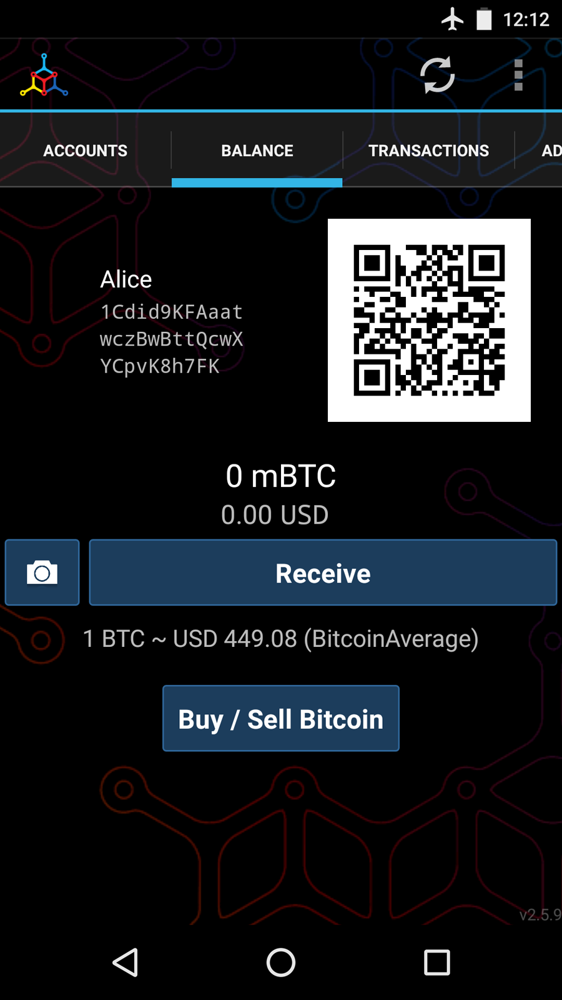
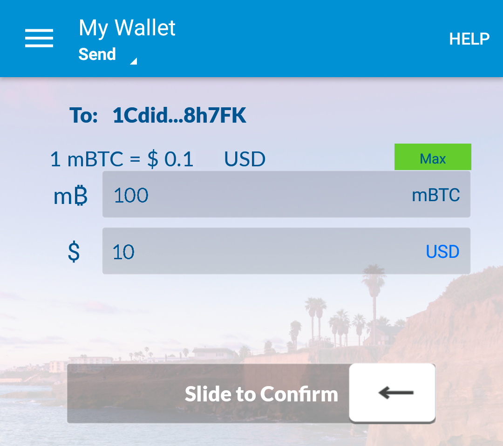

## 概述

### 什么是比特币

比特币是组成数字货币生态的一系列概念和技术的集合。 比特币也用作在比特币网络的参与者之间存储和传递价值的货币单位。 比特币用户主要通过互联网使用比特币协议进行通信，当然，也可以使用其他传输网络。 比特币协议栈是开源的，易于使用，可运行在各种计算设备上，包括笔记本电脑和智能手机。

用户可以通过比特币完成传统货币可以完成的任何事情，包括购买和出售商品，向人们或组织汇款，或延长信贷。 用户可以在专门的交易所购买、出售比特币，与其他货币进行兑换。 某种意义上，比特币是互联网金钱的完美形式，因为它是快速，安全和无边界的。

与传统货币不同，比特币是完全虚拟的。它没有实体硬币甚至数字硬币。 比特币是隐含在发起者向接收者传递价值的交易中的。 通过拥有密钥，用户可以证明比特币的所有权，可以签署交易来解锁价值，并将其转移给新的所有者。 密钥通常存储在每个用户电脑或手机中的数字钱包里。 拥有密钥是消费比特币的唯一先决条件，比特币的控制权完全掌握在每个用户的手中。

比特币是一个点对点的分布式系统，系统中不存在中央服务器或控制点。 比特币是通过一个叫做挖矿的过程创造的，矿工在处理比特币交易时通过大量计算竞猜一个数学题的答案。 比特币网络的任何参与者（使用一个设备运营比特币完整协议栈的用户）都可以成为矿工，利用他们电脑的处理能力来验证和记录交易。 平均每隔10分钟，会有一个矿工计算出数学题的答案，可以验证过去10分钟的交易，并且获得新发行的比特币奖励。 实质上，比特币将中央银行的货币发行和清算功能进行了去中心化，不再需要任何中央银行了。

比特币协议包含了内置的用于调节网络中挖矿方法的算法。 挖矿过程的难度是动态调整的，所以，无论网络中有多少矿工，平均每10分钟都会有一个人成功。 比特币的总量限制在2100万个，每隔4年，比特币的发行速率都会减半，到2140年，所有比特币发行完毕。 由于比特币的发行速度递减，长期来看，比特币是货币通缩的。

比特币是协议的名称，是一个点对点网络，也是分布式计算的创新。 比特币货币本身只是这项创新的第一个应用。 比特币代表了数十年密码学和分布式系统研究的一个高峰，以独特而强大的方式将四项关键创新融合在一起：

- 去中心化的点对点网络（比特币协议）
- 公开的账本（区块链）
- 一套独立交易验证和货币发行的规则（共识协议）
- 在有效的区块链上达成全球分散共识的机制（PoW工作证明机制）

作为一名开发人员，我认为比特币就像货币互联网一样，是一个通过分布式计算传播价值和保护数字资产所有权的网络。比特币包含的内容比第一眼见到的还要多。

本章，我们将从解释一些主要概念和名词开始，安装必要的软件，并使用比特币进行简单的交易。 在后面的章节，我们将展开底层技术，研究比特币网络和协议的内部机制。

比特币之前的数字货币

可行数字货币的出现与加密技术的发展密切相关。 使用数据位代表交换物品和服务的价值的想法并不奇怪，但想让人接受数字货币，要面对3个基本问题：

1. 可以相信这笔钱是真实的，而不是伪造的吗？
2. 可以确定数字货币只能使用一次吗？（俗称“双重支付”，“双花”问题）
3. 可以确保除了我以外，没有人可以声称我的一笔钱属于他们吗？

纸币发行者使用日益复杂的纸张和印刷技术来对抗伪造问题。物理货币可以轻易解决双重支付问题，因为同一张纸币不可能在两个地方出现。当然，传统货币也经常以数字方式存储和传输。 在这种情况下，伪造和双重支付问题的方法是通过中央当局来清算所有电子交易，他们对流通中的货币具有全局视野。 对于不能利用深奥的墨水或全息条带技术的数字货币，密码学为其提供了可信的所有权的基础。具体而言，加密数字签名使用户能够签署证明该资产所有权的数字资产或交易。 采用适当的架构，数字签名也可以解决双重支付问题。

随着密码学在20世纪80年代后期开始广泛应用，许多研究人员开始尝试使用密码学构建数字货币。这些早期发行的数字货币，通常由国家法币或稀有金属（黄金）做背书。

尽管这些早期数字货币可以运行，但它们是中心化的，结果是，很容易受到政府或黑客的攻击。它们使用中央票据交换所来定期处理所有交易，就像传统的银行系统一样。 不幸的是，多数情况下，这些早期数字货币成为了过度担心的政府的目标，不复存在。为了防止被干预（无论政府还是犯罪分子），需要可以避免单点攻击的去中心化数字货币。 比特币就是这样一个系统，去中心化设计，不需要可能崩溃或者被攻击的任何中心机构。

### 比特币的历史

比特币是在2008年随着一篇署名中本聪的论文 "Bitcoin: A Peer-to-Peer Electronic Cash System,"[[1](https://github.com/wjw465150/bitcoin_book_2nd/blob/master/第一章.asciidoc#_footnotedef_1)] 的发表诞生的 (see [[satoshi_whitepaper\]](https://github.com/wjw465150/bitcoin_book_2nd/blob/master/第一章.asciidoc#satoshi_whitepaper)). 中本聪结合了b-money和HashCash等之前几个发明，创造了一个完全去中心化的的电子现金系统，它不依赖于中央机构进行货币发行、交易结算和确认。 关键性的创新是使用分布式计算系统（ Proof-of-Work（工作证明）算法）每10分钟进行一次全局“选举”，从而使去中心化网络就交易状态达成共识。 这个方法优雅地解决了双重支付（一笔现金可以支付两次）问题。在之前，双重支付问题是数字货币的弱点，通常通过中央机构清算所有交易解决。

比特币网络于2009年上线，基于中本聪发布的一个参考实现并由许多其他程序员修订。 为比特币提供安全性和可靠性的Proof-of-Work算法（挖矿算法）的算力呈指数型增长，现在已经超过了世界上顶尖的超级计算机的算力。 比特币的市值曾超过1350亿美元。目前最大的一笔交易是4亿美元，即时到账，手续费1美元。

中本聪于2011年4月淡出了公众视野，将维护比特币代码和网络的任务交给了一组志愿者。这个比特币背后的人或组织的身份仍然是未知的。 然而，中本聪和其他人都没有对比特币系统进行控制，该系统基于完全透明的数学原理，开源代码以及参与者之间的共识。 这项发明本身就具有开创性，已经在分布式计算，经济学和计量经济学领域产生了新的科学。

分布式计算问题的解决方案

中本聪的发明也是一个分布式计算问题的实践和创新：“拜占庭将军问题”。简单来说，这个问题涉及试图在不可靠且可能受损的网络上交换信息来达成行动方案或系统状态的统一。 中本聪的Proof-of-Work的方案，不需要中心化的可信机构，即可达成共识，代表了分布式计算领域的突破，有着超越数字货币的广泛适用性。 它可以用于在去中心化网络中达成共识，证明选举，抽奖，资产登记，数字公证等的公平性。

### 比特币的用法，用户和故事

比特币是古老的金钱技术的创新。金钱的核心是简单地促进人们之间交换价值。 所以，为了全面理解比特币和它的用法，我们将从人们使用它的视角进行研究。 下面列出的每个故事，都涉及了一种或多种用法：

- **北美的低价零售**

  Alice住在北美加利福尼亚湾区。她从技术人员朋友那里听说了比特币之后想尝试一下。我们将跟随她的故事，了解比特币，获取比特币，花费一些买一杯咖啡。 这个故事将从零售消费者的角度介绍软件，交易所，和基本交易。

- **北美高价零售**

  Carol是旧金山的艺术画廊老板。她使用比特币出售昂贵的作品。这个故事将向高价值商品的零售商介绍“51％”共识攻击的风险。

- **离岸合同服务**

  帕洛阿尔托的咖啡馆老板Bob正在建设一个新网站。他与居住在印度班加罗尔的一位网络开发人员Gopesh签约。 Gopesh已同意接受比特币支付。这个故事将研究比特币在外包，合同服务和国际电汇方面的用途。

- **网络商店**

  Gabriel是里约热内卢的一名进取的年轻少年，他经营一家小型网上商店，销售比特币品牌的T恤，咖啡杯和贴纸。加百列太年轻了，没有银行账户，但他的父母鼓励他的企业家精神。

- **慈善捐款**

  Eugenia是菲律宾儿童慈善组织的负责人。最近，她发现了比特币，并希望利用它来接触一群全新的外国和国内捐助者，为她的慈善事业筹款。 她还在研究如何使用比特币将资金快速分配到需要的地方。这个故事将展示比特币在跨越货币和边界的全球筹款活动中的应用，以及透明的公开账本在慈善组织中的使用。

- **进出口**

  穆罕默德是迪拜的一家电子产品进口商。他试图用比特币从美国和中国购买电子产品进口到阿联酋，以加快进口支付流程。 这个故事将展示如何将比特币用于与实体商品相关的大型企业对企业国际支付。

- **比特币挖矿**

  Jing是上海的计算机工程专业的学生。他已经建立了一个矿机，利用他的工程技能来挖掘比特币，以获取额外收入。 这个故事将研究比特币的“工业”基础：用于保护比特币网络和发行新货币的专用设备。

每一个故事都基于真实的人和真正的行业，目前正在使用比特币来创建新的市场，新的行业以及针对全球经济问题的创新解决方案。

### 开始

比特币是一种协议，可以通过使用遵守协议的客户端访问。“比特币钱包”是比特币系统最常用的用户界面，就像网络浏览器是HTTP协议最常用的用户界面一样。 比特币钱包有很多实现和品牌，就像许多品牌的网络浏览器（例如，Chrome，Safari，Firefox和Internet Explorer）一样。 就像我们都有我们最喜欢的浏览器（Mozilla Firefox）和最讨厌的浏览器（Internet Explorer）一样，比特币钱包在质量，性能，安全性，隐私和可靠性方面各不相同。 比特币协议还有一个源自中本聪编写的包含钱包的参考实现，名为“Satoshi Client”或“Bitcoin Core”。

#### 选择比特币钱包

比特币钱包是比特币生态系统中最积极开发的应用之一。竞争很激烈，可能现在有人正在开发一个新的钱包，但去年的一些钱包已不再被维护。 许多钱包专注于特定平台或特定用途，有些更适合初学者，而其他则提供更多高级功能。 如何选择钱包依赖于用途和用户体验，所以无法推荐一个特定的品牌或钱包。 但是，我们可以根据它们的平台和功能进行分类，并对这些不同的钱包进行介绍。 有一点好处是，在比特币钱包之间移动钥匙或种子相对容易，所以可以多尝试几个钱包直到找到符合你需求的。

比特币钱包根据平台分类如下：

- **桌面钱包**

  桌面钱包是作为参考实现创建的第一种比特币钱包，许多用户因为它们提供的功能、自治和控制而使用桌面钱包。运行在Windows或MacOS操作系统上有安全缺陷，因为这些系统通常是不安全和配置不善的。

- **移动钱包**

  移动钱包是最常用的。这类钱包运行在iOS或Android操作系统上，是新用户的不错选择。多数设计简单易用，但也有提供给高级用户使用的功能全面的移动钱包。

- **网络钱包**

  网络钱包是通过浏览器访问的，并且将用户的钱包存储在第三方的服务器上。一些这样的服务通过在用户的浏览器中使用客户端代码进行操作，该代码将比特币密钥控制在用户手中。然而，多数情况下，第三方会控制用户的比特币密钥以便用户方便使用。将大量比特币存储在第三方系统上市不可取的。

- **硬件钱包**

  硬件钱包是在专用硬件上运行安全的自包含比特币钱包的设备。它们通过USB链接桌面Web浏览器，或通过移动设备上的近场通信（NFC）功能进行操作。在专用硬件上处理所有与比特币相关的操作被认为非常安全，适合存储大量的比特币。

- **纸钱包**

  控制比特币的密钥也可以打印到纸上，也可以使用其他材料（木材，金属等），这些被称为纸钱包。纸钱包提供了一种低技术含量但高度安全的长期存储比特币的手段。脱机存储通常也被称为冷存储。

另一种给比特币钱包分类的方法是根据他们的自治程度以及与如何比特币网络交互：

- **完整节点客户端 (Full-node client)**

  一个完整的客户端或“完整节点”存储比特币交易历史（每个用户的每次交易），管理用户的钱包，并且可以直接在比特币网络上启动交易。完整节点处理协议的所有方面，并可独立验证整个区块链和任何事务。完整节点需要消耗大量计算机资源（例如，超过125 GB的磁盘，2GB的RAM），但可提供完整的自主权和独立的事务验证。

- **轻量级客户端**

  轻量级客户端也称为简单支付验证（SPV，Simple-payment-verification）客户端，连接到比特币完整节点以访问比特币交易信息，但将用户钱包本地存储并独立创建，验证和传输交易。轻量级客户端与比特币网络直接交互，无需中间人。

- **第三方API客户端**

  第三方API客户端是通过第三方系统的API与比特币交互的客户端，而不是直接连接到比特币网络。钱包可以由用户或第三方服务器存储，但所有交易都通过第三方。

结合这些分类，许多比特币钱包会被分入多个组内，其中最常见的三种是桌面完整客户端，移动轻量级钱包和第三方网络钱包。不同类别之间的界限通常很模糊，因为许多钱包在多个平台上运行，并且可能以不同的方式与网络进行交互。

为了本书的目的，我们将演示使用各种可下载的比特币客户端，从参考实现（比特币核心）到移动钱包和网络钱包。一些例子将需要使用比特币核心，除了作为一个完整的客户端之外，它还将API暴露给钱包，网络和交易服务。如果你计划探索比特币系统的编程接口，则需要运行比特币核心或其他客户端之一。

#### 快速开始

我们之前介绍的Alice不是技术人员，而且最近才从朋友Joe那听说比特币。 在一次派对上，Joe又一次热情地向周围的人讲解和演示比特币。出于好奇，Alice想知道她如何开始使用比特币。Joe说移动钱包最适合新用户，并推荐了一些他最喜爱的钱包。Alice便将“Mycelium”安装到了她的Android手机上。

当爱丽丝第一次运行Mycelium时，程序会自动为她创建一个新钱包。Alice看到的钱包界面，如[The Mycelium Mobile Wallet](https://github.com/wjw465150/bitcoin_book_2nd/blob/master/第一章.asciidoc#mycelium-welcome)所示（注意：不要将比特币发送到此示例地址，它将永远丢失）。

Figure 1. The Mycelium Mobile Wallet

界面上最重要的部分是Alice的_比特币地址（bitcoin adreess）_，是数字和字母的组合: 1Cdid9KFAaatwczBwBttQcwXYCpvK8h7FK. 比特币地址旁边是存有相同信息的二维码，条形码，可以通过手机扫描。Alice可以通过点击二维码或Receive按钮保存比特币地址，或将二维码保存到手机中。在大多数钱包中，二维码可以点击放大，更方便扫描。

------
>  **Tip:**  比特币地址以"1"或者"3"开头。就像email地址一样，它们可以分享给其他比特币用户以允许它们向你的钱包发送比特币。从安全角度来说，比特币地址不存在任何敏感信息，他可以被发送到任何地方。与email地址不同，你可以经常创建新的比特币地址，所有的地址都关联到你的钱包。许多现代钱包会自动为每笔交易创建一个新地址，以最大限度地保护隐私。钱包只是地址和解锁资金的密钥集合。
------

Alice现在已经准备好接收资金了。她的钱包应用会随机生成一个私钥（在[[private_keys\]](https://github.com/wjw465150/bitcoin_book_2nd/blob/master/第一章.asciidoc#private_keys)中更详细地描述）以及相应的比特币地址。这时，她的比特币地址不为比特币网络所知，或者在比特币系统的任何部分“注册”。她的比特币地址只是一个数字，对应于一个可以用来控制资金访问权限的密钥。它是由她的钱包独立生成的，没有参考或注册任何服务。事实上，在大多数钱包中，比特币地址与包括用户身份在内的任何外部可识别信息之间不存在关联。在比特币地址被比特币账本上发布的交易引用，作为接收地址之前，它仅仅是比特币中有效的大量可能的地址的一部分。只有与交易关联后，它才会成为网络中已知地址的一部分。

Alice现在准备开始使用她的新比特币钱包了。

#### 获得你的第一个比特币

新用户的第一个也是最困难的任务是购买一些比特币。与其他外币不同，你还不能在银行或外汇交易市场购买比特币。

比特币交易是不可逆转的。大多数电子支付网络如信用卡，借记卡，PayPal和银行账户转账都是可逆的。对于销售比特币的人来说，这种差异带来了非常高的风险，即买家在收到比特币后会逆转电子支付，实际上欺骗了卖家。为了缓解这种风险，接受传统电子支付以换取比特币的公司通常要求买家进行身份验证和信用评估检查，这可能需要几天或几周的时间。作为新用户，这意味着你无法使用信用卡立即购买比特币。然而，用一点耐心和创造性思维，你就不需要这样。

以下是新用户获取比特币的一些方法:

- 找一个有比特币的朋友，直接向他买一些。许多比特币用户以这种方式开始。这种方法最简单。与拥有比特币的人见面的一种方式是参加在 [Meetup.com](https://bitcoin.meetup.com/)列出的本地比特币聚会。
- 使用分类服务，例如 [localbitcoins.com](https://localbitcoins.com/) 找到你所在地区的卖家以现金购买比特币。
- 通过销售产品或服务赚取比特币。如果你是程序员，就卖你的编程技能。如果你是理发师，就剪头发收比特币。
- 使用比特币ATM。比特币ATM是一种接受现金并将比特币发送到智能手机比特币钱包的机器。使用 [Coin ATM Radar](http://coinatmradar.com/) 的在线地图查找附近的比特币ATM。
- 使用比特币交易所。许多国家现在有交易所，为买卖双方提供以当地货币交换比特币的市场。 Exchange-rate服务（例如 [BitcoinAverage](https://bitcoinaverage.com/)）可以显示每种货币的比特币交易所列表。

------
>  **Tip:**  比特币优于其他支付系统的一个优点是，如果使用得当，它可以为用户提供更多的隐私。获取，持有和支出比特币并不要求你向第三方泄露敏感和个人身份信息。但是，比特币涉及诸如货币兑换等传统系统时，国家和国际法规通常适用。为了以你的国家货币兑换比特币，你通常需要提供身份证明和银行信息。用户应该知道，一旦比特币地址附加到身份，所有相关的比特币交易也很容易识别和跟踪。这是许多用户选择维护与他们的钱包不相关的专用交换账户的原因之一。 
------

Alice是被通过朋友介绍知道比特币的，因此她可以轻松获得她的第一个比特币。接下来，我们将看看她如何从她的朋友Joe那购买比特币，以及Joe如何将比特币发送到她的钱包。

#### 查看比特币的当前价格

在Alice可以从Joe那购买比特币之前，他们必须同意比特币和美元之间的汇率。这给那些比特币新手带来了一个共同的问题：“谁设定的比特币价格？” 简而言之，价格是由市场决定的。

像大多数其他货币一样，比特币具有浮动汇率，这意味着比特币相对于任何其他货币的价值根据其交易市场的供求情况而变化。例如，比特币的美元价格是根据最近比特币和美元的交易计算出来的。因此，价格每秒钟会出现几次波动。定价服务将汇总来自多个市场的价格并计算代表货币对的广泛市场汇率（例如BTC / USD）的成交量加权平均值。

有数百个应用程序和网站可以提供当前的市场价格。这里是一些最流行的:

- [Bitcoin Average](http://bitcoinaverage.com/)

  一个提供每种货币的成交量加权平均值简单视图的网站。

- [CoinCap](http://coincap.io/)

  这项服务列出了数百种加密货币（包括比特币）的市值和汇率

- [Chicago Mercantile Exchange Bitcoin Reference Rate](http://bit.ly/cmebrr)

  可用于机构和合同参考的参考利率，作为CME的一部分投资数据源。

除了这些网站和应用程序之外，大多数比特币钱包会自动将比特币和其他货币进行转换。在将比特币发送给Alice之前，Joe会使用他的钱包自动转换价格。

#### 发送和接收比特币

爱丽丝决定兑换10美元的比特币，以免在这项新技术上冒太多风险。她给了Joe 10美元现金，打开她的Mycelium钱包应用程序，并选择Receive。这显示了Alice的第一个比特币地址的QR码。

Joe在他的智能手机钱包上选择“Send”，然后看到包含两个输入的界面：

- 目标比特币地址
- 要发送的数量，以BTC或者他的本地货币（USD）为单位。

在比特币地址的输入字段中，有一个看起来像二维码的小图标。这使得Joe可以用他的手机摄像头扫描条码，这样他就不必输入Alice的比特币地址，这个地址很长很难敲。Joe点击二维码图标激活智能手机摄像头，扫描Alice手机上显示的二维码。

Joe现在已经将Alice的比特币地址设置为收件人了。Joe输入金额为10美元，他的钱包通过访问在线服务的最新汇率来转换它。当时的汇率是每比特币100美元，所以10美元价值0.10比特币（BTC）或100毫比特币（mBTC），如Joe的钱包截图所示 (see [Airbitz mobile bitcoin wallet send screen](https://github.com/wjw465150/bitcoin_book_2nd/blob/master/第一章.asciidoc#airbitz-mobile-send)).

Figure 2. Airbitz mobile bitcoin wallet send screen

然后Joe仔细检查以确保他输入了正确的金额，因为他即将转账，错误不可逆转。在仔细检查地址和金额后，他按下Send来传输交易。Joe的比特币钱包构建了一笔交易，将0.10BTC发送到Alice的地址，从Joe的钱包中获取资金并使用Joe的私钥签署交易。这告诉比特币网络，乔已经授权将价值转移给Alice的新地址。由于交易是通过点对点协议传输的，因此它可以快速传播到比特币网络。在不到一秒的时间内，网络中大多数连接良好的节点都会收到交易并首次查看Alice的地址。

与此同时，Alice的钱包不断“监听”比特币网络上的已发布交易，寻找与她的钱包中的地址相匹配的任何交易。在Joe的钱包传输交易后几秒钟，Alice的钱包就会显示它正在接收0.10BTC。

确认

起初，Alice的地址将显示Joe的交易为“未确认”。这意味着交易已经传播到网络，但尚未记录在比特币交易账本（即区块链）中。要确认，交易必须包含在一个区块中，并添加到区块链中，平均每10分钟发生一次。在传统的财务术语中，这被称为_清算_。有关比特币交易的传播，验证和清算（确认）的更多详细信息，请参阅“采矿”。

Alice现在是那0.10BTC的所有者了。在下一章中，我们将看到她第一次使用比特币购买东西，并更详细地研究背后的交易和传播技术。