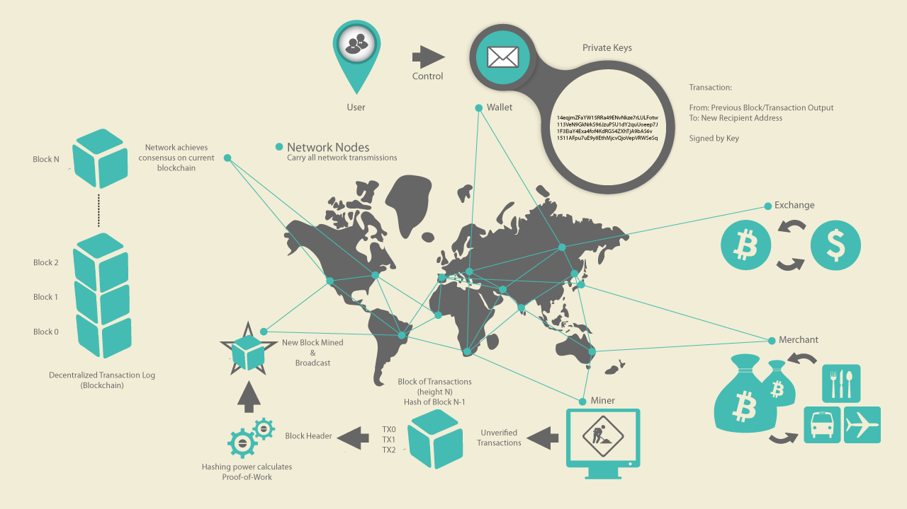
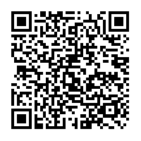
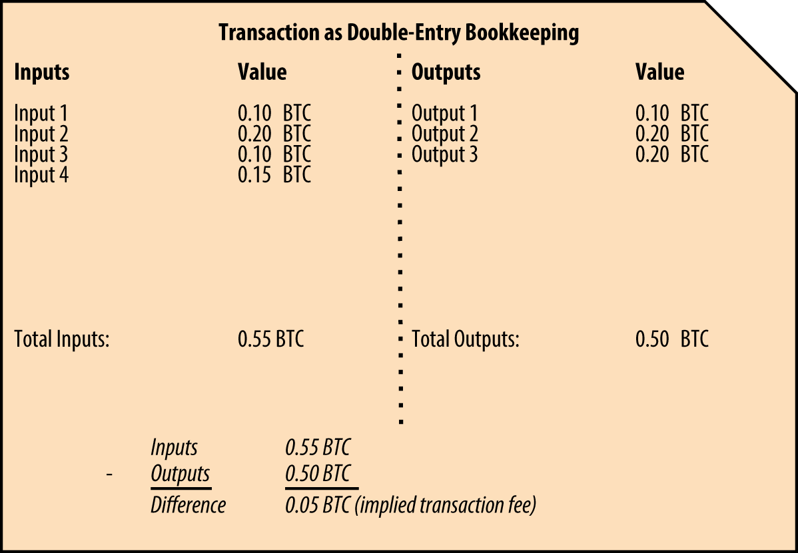
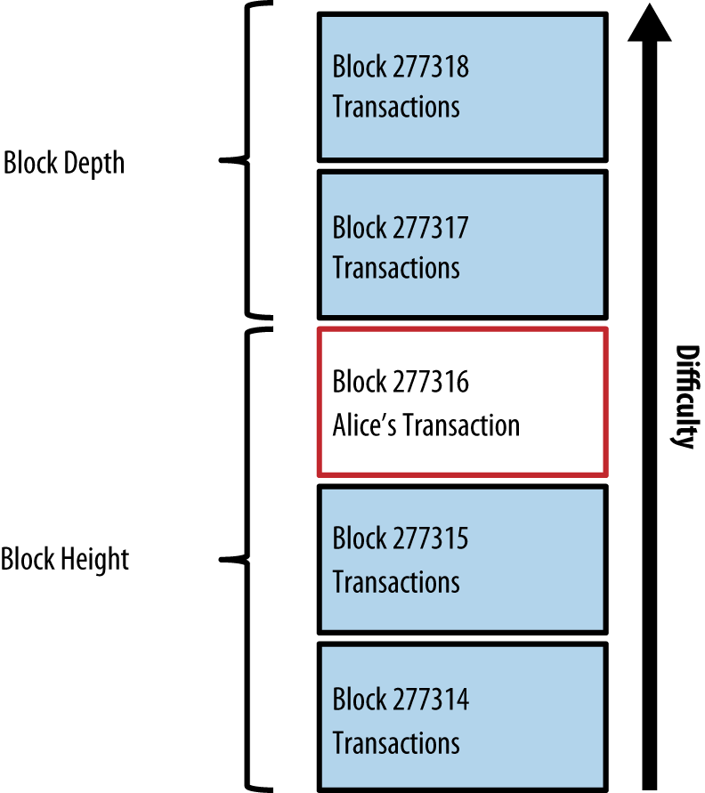
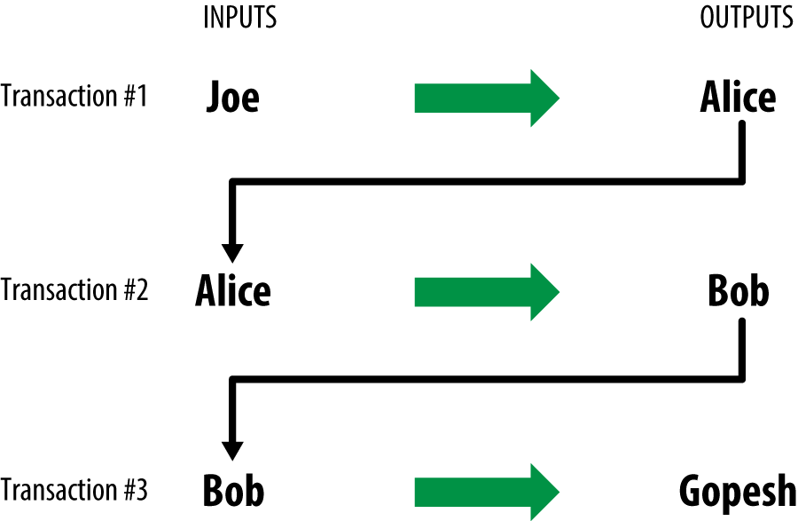

## 比特币如何运转

### 交易，区块，挖矿和区块链

与传统的银行和支付系统不同，比特币系统基于去中心化的信任。在比特币中，信任是比特币系统中不同参与者的交互的涌现特性达成的。 在本章中，我们将站在比较高的视角研究比特币，通过在比特币系统中跟踪一笔交易，看到它被比特币分布式共识机制所信任和接受，并最终记录在区块链中（所有交易的分布式账本）。后续章节将深入探讨交易，网络和挖矿背后的技术。

#### 比特币概览

在[Bitcoin overview](https://github.com/wjw465150/bitcoin_book_2nd/blob/master/第二章.asciidoc#bitcoin-overview)的概览图中, 我们看到比特币系统由包含密钥的钱包，通过网络传播的交易，以及产生（通过竞争性计算）共识区块链的矿工组成，区块链是所有交易的权威帐本。

本章中的每个示例均基于在比特币网络上进行的实际交易，通过从一个钱包向另一个钱包发送资金来模拟用户（Joe，Alice，Bob和Gopesh）之间的交互。在通过比特币网络跟踪交易到区块链的同时，我们将使用_blockchain explorer_网站可视化每个步骤。区块链浏览器（blockchain explorer）是一个作为比特币搜索引擎运行的Web应用，它允许你搜索地址，交易和区块，并查看它们之间的关系和流程。



Figure 1. Bitcoin overview

流行的区块链浏览器包括：

- [BlockCypher Explorer](https://live.blockcypher.com/)
- [blockchain.info](https://blockchain.info/)
- [BitPay Insight](https://insight.bitpay.com/)

其中每一个都有搜索功能，可以采用比特币地址，交易哈希值，区块号或区块哈希值，从比特币网络中检索相应的信息。对于每个交易或区块示例，我们将提供一个URL，以便你可以自己查看并详细研究它。

#### 购买一杯咖啡

上一章介绍的Alice是刚刚获得了第一个比特币的新用户。在[[getting_first_bitcoin\]](https://github.com/wjw465150/bitcoin_book_2nd/blob/master/第二章.asciidoc#getting_first_bitcoin)中，Alice会见了她的朋友Joe，用现金交换了一些比特币。Joe创造的交易把0.10BTC发送到了Alice的钱包。现在，Alice将进行她的第一笔零售交易，在加利福尼亚州帕洛阿尔托的Bob咖啡店购买一杯咖啡。

Bob咖啡最近开始接受比特币支付，在其销售系统中增加了一个比特币选项。Bob咖啡的价格以当地货币（美元）列出，但在支付时，顾客可以选择美元或比特币。Alice下了一杯咖啡的订单，Bob将它输入到系统中，就像处理所有交易一样。销售系统自动将总价从美元转换为比特币，并以当前市场汇率以两种货币进行显示：

```
Total:
$1.50 USD
0.015 BTC
```

Bob说，"1.5美元, 或者15毫比特币"

Bob的销售系统也会自动创建一个包含_支付请求（payment request)_的特殊二维码（参见[Payment request QR code](https://github.com/wjw465150/bitcoin_book_2nd/blob/master/第二章.asciidoc#payment-request-QR)）。

与仅包含目标比特币地址的二维码不同，支付请求是URL的二维码，其包含目标地址，付款金额以及诸如“Bob’s Cafe”的描述。这允许比特币钱包应用预先填充用于发送付款的信息，同时向用户显示可读的信息。你可以使用比特币钱包应用扫描二维码，以查看Alice会看到的内容。



Figure 2. Payment request QR code

------
>   尝试用钱包扫描以查看地址和金额，但不要发送金钱。 
------

支付请求对BIP-21中定义的如下的URL进行编码:

```
bitcoin:1GdK9UzpHBzqzX2A9JFP3Di4weBwqgmoQA?
amount=0.015&
label=Bob%27s%20Cafe&
message=Purchase%20at%20Bob%27s%20Cafe

URL的组成部分

接收比特币的地址: "1GdK9UzpHBzqzX2A9JFP3Di4weBwqgmoQA"
支付金额: "0.015"
收件人地址的标签: "Bob's Cafe"
支付详情: "Purchase at Bob's Cafe"
```

Alice用她的手机扫描屏幕上的二维码。她的手机显示支付 0.0150 BTC 至 Bob's Cafe，她选择“发送”以授权付款。在几秒钟内（大约与信用卡授权相同的时间），Bob在他的系统中看到交易，交易就完成了。

------
>   比特币网络可以以小数值进行交易，例如从millibitcoin（比特币的1/1000）到聪（比特币的1 / 100,000,000）。在本书中，我们将使用术语“比特币”来表示从最小单位（1 satoshi）到将要开采的所有比特币总数（21,000,000）的任何数量的比特币。 
------

你可以使用区块链浏览器网站（[查看Alice的交易 ](https://github.com/wjw465150/bitcoin_book_2nd/blob/master/第二章.asciidoc#view_alice_transaction)[blockchain.info](https://blockchain.info/tx/0627052b6f28912f2703066a912ea577f2ce4da4caa5a5fbd8a57286c345c2f2)）在区块链中检查Alice对Bob’s Cafe的交易：

**Example 1.** 查看Alice的交易 [blockchain.info](https://blockchain.info/tx/0627052b6f28912f2703066a912ea577f2ce4da4caa5a5fbd8a57286c345c2f2)

```
https://blockchain.info/tx/0627052b6f28912f2703066a912ea577f2ce4da4caa5a5fbd8a57286c345c2f2
```

### 比特币交易

简而言之，一笔交易告诉网络，一些比特币价值的所有者已经授权将该价值转移给另一个所有者。新的所有者现在可以通过创建另一个授权转让给另一个所有者的交易来支付比特币，等等。

#### 交易的输入和输出

交易就像复式簿记账中的行一样。每笔交易包含一个或多个“输入”，就像比特币账户的"借方"，在交易的另一端，有一个或多个“输出”，就像比特币账户中的"贷方"一样。 输入和输出（借方和贷方）加起来不一定数额相同。相反，输出加起来略少于输入，差额代表隐含的_交易费用_，这是由矿工收取的一笔小额付款，该矿工将交易加入到账本中。比特币交易在[Transaction as double-entry bookkeeping](https://github.com/wjw465150/bitcoin_book_2nd/blob/master/第二章.asciidoc#transaction-double-entry)中显示为账本中的记录条目。

该交易还包含每个正在被花费的比特币（输入）的所有权证明，以所有者的数字签名的形式出现，任何人都可以独立验证。用比特币的术语来说，“花费”正在签署一项交易，它将来自前一笔交易的价值转移给由比特币地址标识的新的所有者。



Figure 3. Transaction as double-entry bookkeeping

#### 交易链

Alice向Bob’s Cafe的付款使用先前交易的输出作为其输入。在上一章中，Alice从她的朋友Joe那里用现金换取了比特币。该交易创建了一个由Alice的密钥锁定的比特币值。她向Bob’s Cafe的新交易引用之前的交易作为输入，并创造新的输出来支付咖啡钱并接收找零。交易形成一个链，最近一次交易的输入与之前交易的输出相对应。Alice的密钥提供了解锁先前那些交易输出的签名，从而向比特币网络证明她拥有资金。她将咖啡的钱支付给Bob的地址，从而“留置”输出，要求Bob必须签名才能花费这笔金额。这代表了Alice和Bob之间的价值转移。这个从Joe到Alice到Bob的交易链在[A chain of transactions, where the output of one transaction is the input of the next transaction](https://github.com/wjw465150/bitcoin_book_2nd/blob/master/第二章.asciidoc#blockchain-mnemonic)中进行了说明。


Figure 4. A chain of transactions, where the output of one transaction is the input of the next transaction

#### 找零

许多比特币交易的输出既引用新所有者的地址，又引用当前所有者的地址（这称为_找零_地址）。这是因为交易输入（像钞票一样）不能分开。如果你在商店购买价值5美元的物品，但使用20美元的美元账单来支付该物品，你将获得15美元的找零。相同的概念适用于比特币交易的输入。如果你购买的产品需要5比特币，但只有20比特币的输入能使用，你可以将一个5比特币的输出发送给店主，并将一个15比特币输出作为找零（减去涉及的交易费用）。重要的是，找零地址不必与输入地址相同，并且出于隐私方面考虑，通常是来自所有者钱包的新地址。

在汇集输入以执行用户的支付请求时，不同的钱包可以使用不同的策略。他们可能会汇集很多小的输入，或者使用等于或大于期望付款的输入。除非钱包能够按照付款和交易费用的总额精确汇集输入，否则钱包将需要产生一些零钱。这与人们处理现金非常相似。如果你总是使用口袋里最大的钞票，那么最终你会得到一个充满零钱的口袋。如果你只使用零钱，你将永远只有大额账单。人们潜意识地在这两个极端之间寻找平衡点，比特币钱包开发者努力编程实现这种平衡。

总之，*交易_将_交易的输入_的值移至_交易的输出*。输入是对前一个事务输出的引用，表示值来自哪里。交易输出将特定值指向新所有者的比特币地址，并且可以将零钱输出给原始所有者。来自一个交易的输出可以用作新交易的输入，因此当价值从一个所有者转移到另一个所有者时会产生一个所有权链（参见 [A chain of transactions, where the output of one transaction is the input of the next transaction](https://github.com/wjw465150/bitcoin_book_2nd/blob/master/第二章.asciidoc#blockchain-mnemonic)）。

#### 常见交易形式

最常见的交易形式是从一个地址到另一个地址的简单支付，通常包括一些“零钱”返回到原始所有者。这类交易有一个输入和两个输出，参见[Most common transaction](https://github.com/wjw465150/bitcoin_book_2nd/blob/master/第二章.asciidoc#transaction-common)：


Figure 5. Most common transaction

另一种常见形式是汇集多个输入到一个输出的交易 (参见 [Transaction aggregating funds](https://github.com/wjw465150/bitcoin_book_2nd/blob/master/第二章.asciidoc#transaction-aggregating)). 这类似于现实世界中将一堆硬币和纸币换成单一较大面值的纸币的情况。此类交易有时由钱包应用生成，以清理收到的大量小额零钱。


Figure 6. Transaction aggregating funds

最后，比特币账本中经常出现的另一种交易形式是将一个输入分配给代表多个收款人的多个输出的交易（参见 [Transaction distributing funds](https://github.com/wjw465150/bitcoin_book_2nd/blob/master/第二章.asciidoc#transaction-distributing)）。这类交易有时被企业用来分配资金，例如在向多个雇员支付工资时。


Figure 7. Transaction distributing funds

### 创建一笔交易

Alice的钱包应用包含了选择合适的输入和输出的所有逻辑，根据Alice的具体设定创建交易。Alice只需要指定目的地和金额，剩下的事情交给钱包应用，Alice不用关心细节。重要的是，即使钱包应用完全脱机，钱包应用也可以创建交易。就像在家里写一张支票，然后通过信封发送给银行一样，交易不要求在连接到比特币网络时进行创建和签署。

#### 获得正确的输入

Alice的钱包应用首先必须找到可以支付她想要发送给Bob的金额的输入。大多数钱包跟踪属于钱包中地址的所有可用输出。因此，Alice的钱包将包含Joe的交易输出的副本，该交易是由现金交换创建的（参见[[getting_first_bitcoin\]](https://github.com/wjw465150/bitcoin_book_2nd/blob/master/第二章.asciidoc#getting_first_bitcoin)）。作为完整节点客户端运行的比特币钱包应用实际上包含区块链中每笔交易的未使用输出的副本。这允许钱包创建交易输入，以及快速验证传入的交易具有正确的输入。但是，由于全节点客户端占用大量磁盘空间，所以大多数用户钱包运行“轻量级”客户端，仅跟踪用户自己未使用的输出。

如果钱包应用未保存未花费的交易的输出的副本，它可以使用不同提供商提供的各种API，查询比特币网络，询问完整节点来检索该信息。 [Look up all the unspent outputs for Alice’s bitcoin address](https://github.com/wjw465150/bitcoin_book_2nd/blob/master/第二章.asciidoc#example_2-2)展示了一个API请求，向特定的URL发起HTTP GET请求。该URL将返回这个地址上所有未使用的交易的输出，为应用提供构建交易输入的信息。我们使用简单的命令行HTTP客户端_cURL_来请求。

Example 2. Look up all the unspent outputs for Alice’s bitcoin address

```
$ curl https://blockchain.info/unspent?active=1Cdid9KFAaatwczBwBttQcwXYCpvK8h7FK
{

	"unspent_outputs":[

		{
			"tx_hash":"186f9f998a5...2836dd734d2804fe65fa35779",
			"tx_index":104810202,
			"tx_output_n": 0,
			"script":"76a9147f9b1a7fb68d60c536c2fd8aeaa53a8f3cc025a888ac",
			"value": 10000000,
			"value_hex": "00989680",
			"confirmations":0
		}

	]
}
```

[Look up all the unspent outputs for Alice’s bitcoin address](https://github.com/wjw465150/bitcoin_book_2nd/blob/master/第二章.asciidoc#example_2-2)中的响应展示了在Alice的地址 1Cdid9KFAaatwczBwBttQcwXYCpvK8h7FK 下有一笔未花费的输出。响应内容包括包含这笔输出的交易的引用，以及它的价值，1000万（单位是聪），相当于0.10比特币，利用这些信息，Alice的钱包应用可以构建一个交易，将该值转移到新的所有者地址。

------
>   查看 [transaction from Joe to Alice](http://bit.ly/1tAeeGr). 
------

如你所见，爱丽丝的钱包包含支付一杯咖啡的足够的比特币。否则，Alice的钱包应用可能需要"翻遍"一堆较小的未使用的输出，就像从钱包中找硬币一样，直到它能够找到足够的钱来支付咖啡。在这两种情况下，可能都需要进行一些找零，我们将在下一部分中看到，钱包应用创建交易输出（付款）。

#### 创建输出

交易的输出是以脚本形式创建的，该脚本在比特币价值上创建了一个“留置”，只能通过提供脚本解决方案来进行提取。简而言之，Alice的交易输出将包含一个脚本，其内容如下：“这笔支出属于能使用Bob的公共地址对应的私钥进行签名的人。” 因为只有Bob拥有与该地址对应的私钥，所以只有Bob的钱包可以提供这样的签名来提取该输出。因此，Alice可以通过要求Bob的签名，来“限制”这笔输出的使用。

这笔交易还包括第二笔输出，因为爱丽丝的资金为0.10BTC，对于0.015BTC的咖啡来说太多了，需要找零0.085BTC。Alice的找零付款由Alice的钱包创建，作为Bob的付款的同一笔交易中的输出。爱丽丝的钱包将其资金分成两笔付款：一笔给Bob，一份给自己。然后，她可以在后续交易中使用（花费）这次找零的输出。

最后，为了让网络及时处理这笔交易，Alice的钱包应用将增加一笔小额费用。这在交易中并不明确；这是由输入和输出的差值隐形包含的。如果Alice不创建0.085的找零，而是0.0845，就会剩下0.0005BTC（半毫比特币）。输入的0.10BTC没有完全用于两个输出，因为它们的总和小于0.10。由此产生的差值就是矿工收取的_交易费用_，用于验证交易并将交易包括到区块链中。

生成的交易可以使用区块链浏览器查看，如[Alice’s transaction to Bob’s Cafe](https://github.com/wjw465150/bitcoin_book_2nd/blob/master/第二章.asciidoc#transaction-alice)所示.


Figure 8. Alice’s transaction to Bob’s Cafe

------
>   查看 [transaction from Alice to Bob’s Cafe](http://bit.ly/1u0FIGs).
------

#### 将交易加入账本

Alice的钱包应用创建的交易长度为258个字节，包含确认资金所有权和分配新的所有者所需的所有内容。现在，交易必须传输到比特币网络，并成为区块链的一部分。在下一节中，我们将看到交易如何成为新区块的一部分，以及区块如何被“挖掘”。最后，我们将看到当区块加入区块链后，会随着区块的增加越来越被网络信任。

##### 传输交易

交易包含了处理所需的所有信息，因此传送到比特币网络的方式或位置无关紧要。比特币网络是一个点对点网络，每个比特币客户端通过连接到其他几个比特币客户端来参与。比特币网络的目的是向所有参与者传播交易和区块。

##### 如何传播

任何遵守比特币协议，加入到比特币网络的系统，如服务器，桌面应用程序或钱包，都称为_比特币节点（bitcoin node）_。 Alice的钱包应用可以通过任何类型的连接（有线，WiFi，移动等）将相关交易发送到任何比特币节点。她的比特币钱包不必直接连接到Bob的比特币钱包，她不必使用咖啡馆提供的互联网连接，但这两种选择都是可能的。任何比特币节点接收到一个它没见过的有效交易之后，会立即转发到它连接到的所有其他节点，这被称为_泛洪（flooding）_传播技术。因此，事务在点对点网络中迅速传播，可在几秒钟内达到大部分节点。

##### Bob的视角

如果Bob的比特币钱包应用直接连接到Alice的钱包应用，则Bob的钱包应用可能是第一个接收到该交易的节点。即使Alice的钱包通过其他节点发送交易，它也会在几秒钟内到达Bob的钱包。Bob的钱包会立即将Alice的交易识别为收款，因为它包含可由Bob的私钥提取的输出。Bob的钱包应用还可以独立验证交易数据是格式正确的，使用的是之前未花费的输入，并且包含足够的交易费用以包含在下一个区块中。此时，鲍勃可以认为风险很小，即交易将很快包含在一个区块中并得到确认。

------
>   关于比特币交易的一个常见误解是，它们必须等待10分钟新区块的产生才能被“确认”，或者最多60分钟才能完成6个确认。虽然确认确保交易已被整个网络所接受，但对于诸如一杯咖啡等小值物品，这种延迟是不必要的。商家可以接受没有确认的有效小额交易。没有比没有身份或签名的信用卡支付风险更大的了，商家现在也经常接受。 
------

### 比特币挖矿

Alice的交易现在已经传播到比特币网络上了。但在它被验证并经历一个名为_挖矿（mining）_的过程包含在区块中之前，不会成为_区块链_的一部分。有关详细说明，请参阅[[mining\]](https://github.com/wjw465150/bitcoin_book_2nd/blob/master/第二章.asciidoc#mining)。

比特币的信任系统基于计算。交易被捆绑到_区块_中，这需要大量的计算来提供工作证明，但只需少量的计算进行验证。挖矿过程在比特币中有两个作用：

- 挖矿节点通过遵从比特币的_共识规则_来验证所有交易。因此，挖矿通过拒绝无效或格式错误的交易来为比特币交易提供安全保障。
- 每个区块被挖出时会创造新的比特币，就像中央银行印钱一样。按照固定的发行时间表，每个区块创建的比特币数量是有限的，随着时间的推移会逐渐减少。

挖矿在成本和回报之间达到了良好的平衡。挖矿用电解决数学问题。一位成功的矿工将通过新的比特币和交易费的形式获得一份_奖励_。只有矿工正确地验证了所有交易，并且符合_共识_的规则，才会获得奖励。这种微妙的平衡为没有中央管理机构的比特币提供了安全性。

描述挖矿的一种好的类比是数独游戏，这种大量竞争的游戏，每次有人找到解决方案时都会重置，其难度会自动调整，因此需要大约10分钟才能找到解决方案。想象一下，数以千计的行和列的巨大数独谜题。如果我告诉你一个完整的谜题，你可以很快验证它。但是，如果拼图有几个方格填充，其余的都是空的，则需要花费大量工作来解决！数独的难度可以通过改变它的大小（更多或更少的行和列）来调整，但即使它非常大，它仍然可以很容易地被验证。比特币中使用的“谜题”基于密码散列，具有相似的特征：它不对称，难以解决，但易于验证，并且可以调整难度。

在 [[user-stories\]](https://github.com/wjw465150/bitcoin_book_2nd/blob/master/第二章.asciidoc#user-stories)中, 我们介绍了Jing，一个上海的企业家. Jing经营着一个矿池，包含数千台专业采矿计算机，争夺奖励。每10分钟左右，Jing的采矿计算机就会在全球竞赛中与成千上万的类似的系统竞争，寻找解决方案。 为了找到解决方案，所谓的_工作量证明（Proof-of-Work，PoW），比特币网络需要每秒进行数千万亿（quadrillions) 次哈希运算。工作量证明的算法涉及使用SHA256密码算法重复地对区块的头部数据和随机数进行散列，直到出现与预定模式匹配的结果为止。找到这种解决方案的第一位矿工赢得一轮竞争，并将该区块发布到区块链中。

Jing于2010年开始使用一台速度非常快的台式电脑进行挖矿，以找到适用于新块的工作量证明Proof-of Work。随着越来越多的矿工加入比特币网络，解题的难度迅速增加。很快，Jing和其他矿工升级到更专用的硬件，如高端显卡（GPU）。在撰写本书时，难度已经大到需要采用专用集成电路（ASIC），将数百种挖矿算法印刷到硬件上，在单个硅片上并行运行。Jing的公司也参与了一个矿池，这就像一个彩票池，允许参与者共享他们的算力和奖励。 Jing的公司现在运营着一个仓库，其中包含数千名ASIC矿工，每天24小时进行比特币挖矿。该公司通过出售开采出来的比特币来支付其电力成本，从利润中获取收入。

### 挖掘区块中的交易

新的交易不断从用户钱包和其他应用流入网络。当被比特币网络节点看到时，会被添加到由每个节点维护的未经验证的临时交易池中。随着矿工构建一个新的区块，他们将未验证的交易从该池中取出添加到新的区块，然后尝试用挖矿算法（Pow）来证明新区块的有效性。挖矿的详细过程请参见[[mining\]](https://github.com/wjw465150/bitcoin_book_2nd/blob/master/第二章.asciidoc#mining)。

交易添加到新的区块后，根据交易费高低和其他一些条件按优先级排列。每个矿工通过网络收到前一个区块时，便知道它已经输掉了上一轮竞争，会开始挖掘新的区块。他立即创建一个新块，填入交易数据和前一个区块的指纹，并开始计算新区块的PoW。每个矿工在他的区块中都包含一笔特殊交易，一笔支付给它自己的比特币地址的奖励（目前为12.5个新比特币）加上该区块中包含的所有交易的交易费用总和。如果他发现一个可以使这个区块有效的解决方案，就会“获得”这些奖励，因为他成功挖掘的区块被添加到全局区块链中。他创建的这笔奖励交易也变得可花费。 加入采矿池的Jing建立了自己的软件来创建新的区块，将奖励分配到矿池的地址，一部分奖励将按照上一轮贡献的工作量比例分配给Jing和其他矿工。

Alice的交易首先被网络接收，并被包括在未经验证的交易中。一旦被挖矿软件验证，它就被包含在一个叫做_候选区块_的新块中（由Jing的矿池生成的）。参与该采矿池的所有矿工立即开始计算候选区块的PoW。在Alice的钱包传输交易后约五分钟，Jing的一位ASIC矿工找到了候选区块的解决方案并将其发布给网络。一旦其他矿工验证了这个获胜的区块，他们将开始竞争挖掘下一个块。

Jing挖到的区块作为#277316区块成为了区块链的一部分，包含419笔交易，其中包括Alice的交易。Alice的交易被包含到一个区块中，视为该交易的一个“确认”。

------
>  查看包含 [Alice’s transaction](https://blockchain.info/block-height/277316) 的区块。 
------

大约19分钟后，另一个矿工开采出#277317区块。由于这个新块建立在包含Alice交易的#277316区块的顶部，因此它为区块链增加了更多计算量，从而加强了对这些交易的信任。在包含交易的块的顶部开采的每个块都为Alice交易增加确认数。随着区块堆叠在一起，修改历史交易变得极其困难，从而使其越来越受到网络的信任。

在图 [Alice’s transaction included in block #277316](https://github.com/wjw465150/bitcoin_book_2nd/blob/master/第二章.asciidoc#block-alice1) 中, 我们可以看到包含Alice的交易的#277316区块。在它下面有277,316个区块（包括区块#0），在区块链（blockchain）中彼此链接，一直到区块#0，称为_创世区块（genesis block）_。随着时间的推移，随着块的“高度”增加，每个块和整个链的计算难度也会增加。在包含Alice的交易的块之后开采的块作为进一步的保证，因为它们在更长的链中堆积更多的计算。按照惯例，任何具有多于六个确认的块都被认为是不可撤销的，因为需要巨大的计算量来重新计算六个块。我们将在 [[minig\]](https://github.com/wjw465150/bitcoin_book_2nd/blob/master/第二章.asciidoc#minig) 中更详细地探讨采矿过程及其建立信任的方式。



Figure 9. Alice’s transaction included in block #277316

### 花费比特币

既然爱丽丝的交易作为一个区块的一部分嵌入在区块链中，它就是比特币分布式账本的一部分，并且对于所有的比特币应用程序都是可见的。每个比特币客户端都可以独立验证该交易的有效性和可用性。完整节点客户可以从比特币首次在一个块中生成的那一刻开始追踪资金来源，从一笔交易到另一笔交易，直到到达Bob的地址。轻量级客户可以通过确认交易在区块链中，计算其后又开采了多少个区块，来做所谓的简单支付验证（参见[[spv_nodes\]](https://github.com/wjw465150/bitcoin_book_2nd/blob/master/第二章.asciidoc#spv_nodes)），从而保证矿工接受它为有效的。

Bob现在可以花费这笔交易和其他交易的输出了。例如，Bob可以通过将价值从Alice的咖啡支付转移给新的所有者，支付费用给承包商或供应商。最有可能的是，Bob的比特币软件将许多小额付款合并为一笔更大的款项，例如将全天的比特币汇集到一笔交易中。有关汇集交易，请参阅[Transaction aggregating funds](https://github.com/wjw465150/bitcoin_book_2nd/blob/master/第二章.asciidoc#transaction-aggregating)。

当Bob花费从Alice和其他客户收到的款项时，他扩展了交易链。假设Bob向在班加罗尔的网页设计师Gopesh支付了一个新页面的设计费用。现在，交易链看起来像[Alice’s transaction as part of a transaction chain from Joe to Gopesh](https://github.com/wjw465150/bitcoin_book_2nd/blob/master/第二章.asciidoc#block-alice2)。



Figure 10. Alice’s transaction as part of a transaction chain from Joe to Gopesh

在本章中，我们看到交易如何建立一个链条，将价值从一个所有者转移到另一个所有者。我们还追踪了Alice的交易，在她的钱包中创建，传输到比特币网络，矿工将其记录在区块链上。在本书的其余部分，我们将研究钱包，地址，签名，交易，网络以及挖矿背后的具体技术。