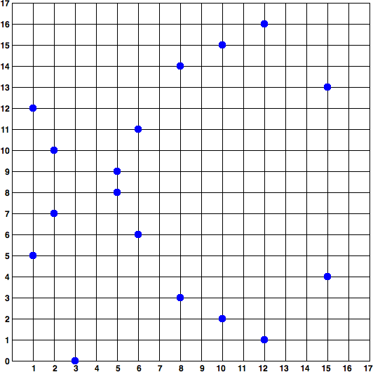
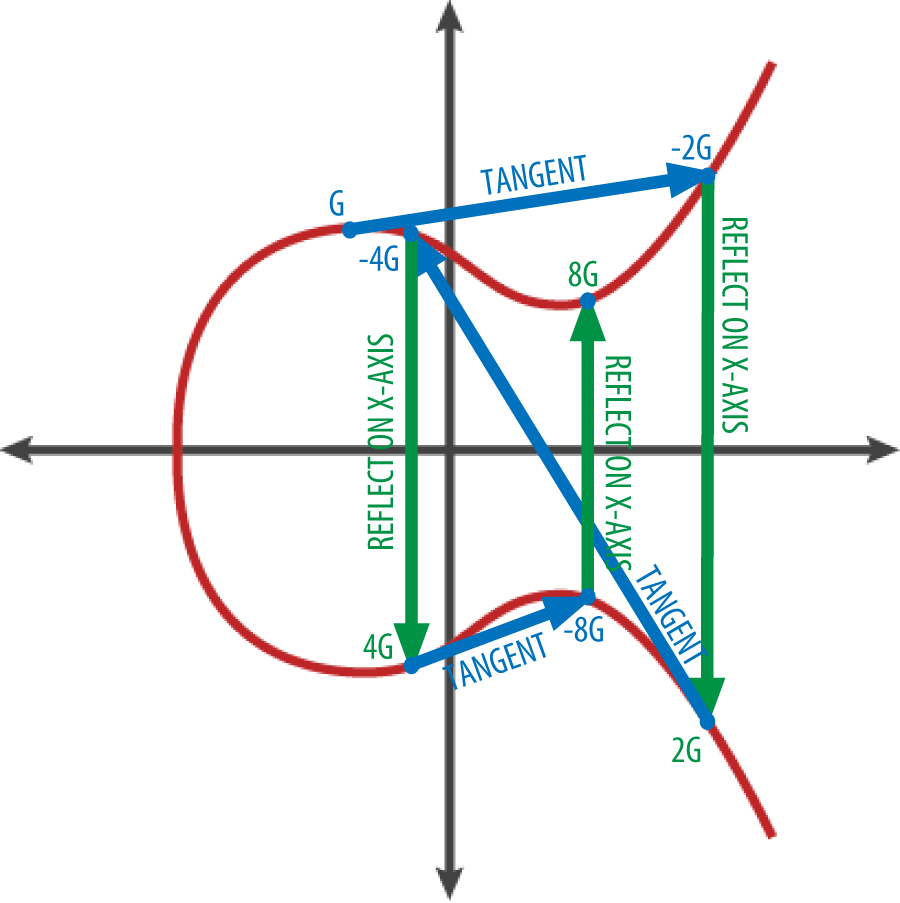
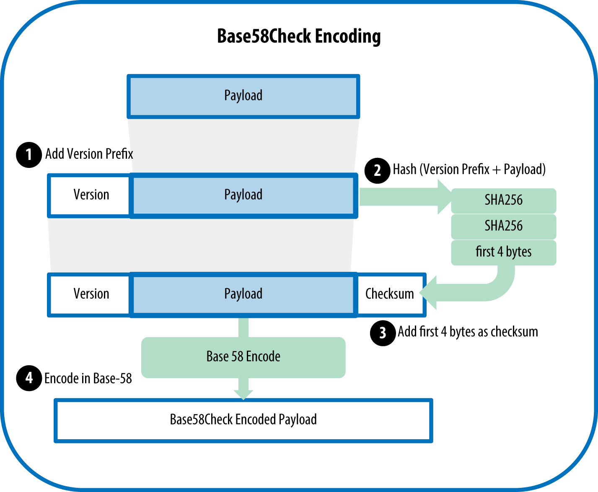
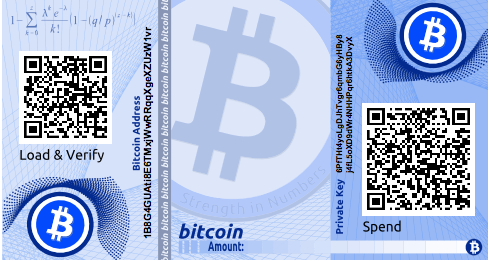
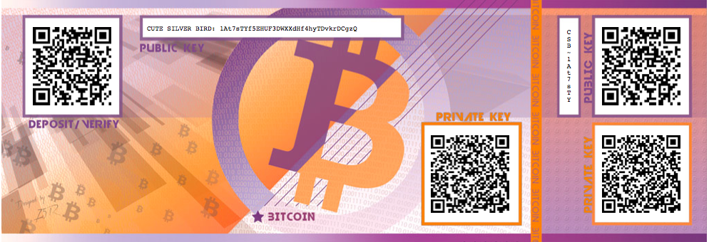

## 密钥和地址

你可能听说过比特币是基于 *密码学* 的，它是计算机安全领域广泛使用的数学分支。密码学在希腊文中的意思是“秘密写作”，但密码学的科学不仅仅包含秘密写作，它被称为加密。密码学也可以用来在不泄露保密内容的情况下，证明一个人知道保密内容（数字签名），或证明数据的真实性（数字指纹）。这些密码学基础是比特币的关键数学工具，并广泛用于比特币应用。讽刺的是，加密并不是比特币的重要组成部分，因为它的通信和交易数据没有加密，也不需要通过加密保护资金。在本章中，我们将介绍比特币中使用的密码学，以密钥，地址和钱包的形式控制资金的所有权。

### 简介

比特币的所有权通过 *数字密钥（digital keys）* ， *比特币地址（bitcoin addresses）* 和 *数字指纹（digital signatures）* 建立。数字密钥实际上并不存储在网络中，而是由用户创建并存储在文件或称为 *钱包（wallet）* 的简单数据库中。用户钱包中的数字密钥完全独立于比特币协议，可以由用户的钱包软件生成和管理，无需参考区块链或访问互联网。密钥支撑了比特币的许多有趣特性，包括去中心化的信任和控制，所有权证明以及有密码学保障的安全模型。

为了包含在区块链中，大多数比特币交易需要有效的数字签名，这些交易只能使用密钥生成；因此，任何拥有该密钥副本的人都可以控制这些比特币。 用于花费资金的数字签名也被称为 *证据（witness)* ，是密码学中的术语。比特币交易中的证据证明了所花费资金的真实所有权。

密钥由一对公钥和私钥组成。将公钥视为类似于银行帐号，将私钥视为PIN或支票上的签名，用于控制帐户。比特币用户很少看到这些数字密钥。大多数情况下，它们存储在钱包文件中并由比特币钱包软件管理。

在比特币交易的付款部分，收款人的公钥通过其数字指纹表示，称为 *比特币地址（bitcoin address）* ，与支票上的收款人姓名一样使用（即“付款到谁的账户”）。大多数情况下，比特币地址是从公钥生成的并且对应于公钥。但是，并非所有的比特币地址都代表公钥；他们也可以代表其他受益者，如脚本，我们将在本章后面看到。通过这种方式，比特币地址可以抽象为资金接收者，这使交易目的地变得灵活，类似于纸质支票：可用于支付个人账户，支付公司账户，支付账单或兑换现金。比特币地址是密钥的唯一展现形式，用户常会看到，因为他们需要向世界公开。

首先，我们将介绍密码学并解释比特币中使用的数学。接下来，我们将看看密钥是如何生成，存储和管理的。我们将看一下用于表示私钥公钥，地址和脚本地址的各种编码格式。最后，我们将看看密钥和地址的高级用法：虚荣（Vanity)，多重签名，脚本地址和纸钱包。

#### 公钥加密和加密货币

公钥密码技术发明于20世纪70年代，是计算机和信息安全的数学基础。

公钥密码技术发明后，发现了一些合适的数学函数，例如素数指数运算和椭圆曲线乘法。这些数学函数实际上是不可逆的，这意味着它们很容易在一个方向上计算，但在相反方向上计算是不可行的。基于这些数学函数，密码学可以创建数字密钥和不可伪造的数字签名。比特币使用椭圆曲线乘法作为其密码学的基础。

在比特币中，我们使用公钥密码技术来创建一个控制比特币访问的密钥对。密钥对由一个私钥和从它派生的一个唯一的公钥组成。公钥用于接收资金，私钥用于签署交易以支付资金。

公钥和私钥之间存在数学关系，可以用私钥生成一个消息的签名，然后使用公钥在不公开私钥的情况下验证签名。

在花费比特币时，当前比特币的所有者需要在交易中提供他的公钥和签名（每次都不同，但由相同的私钥创建）。通过公钥和签名，比特币网络中的每个人都可以验证该交易的有效性并接受，从而确认转让这笔比特币的人拥有它们。

------
>   在大多数钱包实现中，为了方便起见，私钥和公钥一起存储为 *密钥对儿（key pair）* 。由于可以从私钥计算公钥，因此只存储私钥也是可能的。 
------

#### 私钥和公钥

比特币钱包包含密钥对儿的集合，每个密钥对儿包含一个私钥和一个公钥。私钥（k）是一个数字，通常随机选取。我们使用椭圆曲线乘法（单向加密函数）通过私钥生成公钥（K）。从公钥（K）中，我们使用单向加密哈希函数来生成比特币地址（A）。在本节中，我们将开始生成私钥，查看用于将其转换为公钥的椭圆曲线数学运算，最后从公钥生成一个比特币地址。私钥，公钥和比特币地址之间的关系如[Private key, public key, and bitcoin address](https://github.com/wjw465150/bitcoin_book_2nd/blob/master/第四章.asciidoc#k_to_K_to_A)所示。


Figure 1. Private key, public key, and bitcoin address

为什么使用非对称加密 (公钥私钥)?

为什么在比特币中使用非对称加密技术？因为它不是用来“加密”（保密）交易的。相反，非对称加密的有用特性是产生数字签名。私钥可用于为交易生成指纹（数字签名）。这个签名只能由知道私钥的人制作。但是，任何有权访问公钥和交易指纹的人都可以使用它们来验证签名确实是私钥的拥有者生成的。非对称加密的这一有用特性使任何人都可以验证每笔交易的每个签名，同时确保只有私钥所有者才能生成有效的签名。

#### 私钥

私钥只是一个随机选取的数字。对私钥的所有权和控制权是用户控制相应比特币地址所关联的所有资金的根本。私钥用于通过证明交易中使用的资金的所有权来创建花费比特币所需的签名。私钥在任何时候都必须保密，因为向第三方透露它相当于让它们控制由该密钥保护的比特币。私钥还必须备份和防止意外丢失，因为如果丢失了私钥，它就无法恢复，并且它所保护的资金也会永远丢失。

------
>   比特币私钥只是一个数字。你可以使用硬币，铅笔和纸随机挑选你的私钥：投掷硬币256次，就可以获得随机的一串二进制（0和1）数字，在钱包中使用。然后可以从私钥生成公钥。 
------

##### 通过随机数生成私钥

生成密钥的第一步也是最重要的一步是找到一个安全的熵源或随机数。创建比特币私钥本质上与“选择一个1到2256之间的数字”相同。只要保证不可预测性和不可重复性，用于选择该数字的确切方法并不重要。比特币软件使用底层操作系统的随机数生成器生成256位的私钥（随机数）。通常，操作系统随机数生成器是由一个人为的随机源进行初始化的，这就是为什么你可能会被要求将鼠标摆动几秒钟。

更具体地来说，私钥可以是 0 到 n-1 的任何数字，这里n是一个常数 (n = 1.1578 * 1077, 略小于 2256) 定义为比特币中使用的椭圆曲线的阶数 (see [椭圆曲线密码学解释](https://github.com/wjw465150/bitcoin_book_2nd/blob/master/第四章.asciidoc#elliptic_curve))。为了创建这样的密钥，我们随机选择一个256位的数字并检查它是否小于+n+。从编程的角度说，通常是通过从密码学安全的随机源收集的大量随机数输入SHA256散列算法中，该算法将产生256位的数字。如果结果小于+n+，我们就找到了一个合适的私钥。否则，我们只需使用另一个随机数再次尝试。

------
> **Warning:**  不要自己编写代码或使用你的编程语言提供的“简单”随机数生成器来创建一个随机数。使用密码学安全的伪随机数生成器（CSPRNG）和来自足够熵源的种子。研究你选择的随机数生成器库的文档，以确保其是密码学安全的。正确实施CSPRNG对于密钥的安全至关重要。 
------

以下是以十六进制格式显示的随机生成的私钥（k）（256位，显示为64个十六进制数字，每个4位）：

```
1E99423A4ED27608A15A2616A2B0E9E52CED330AC530EDCC32C8FFC6A526AEDD
```

------
>   比特币私钥的数值空间的大小（2256）是非常大的数目。十进制大约是1077。可见的宇宙估计含有1080原子。 
------

要使用 Bitcoin Core 客户端生成新的密钥 (see [[ch03_bitcoin_client\]](https://github.com/wjw465150/bitcoin_book_2nd/blob/master/第四章.asciidoc#ch03_bitcoin_client)), 可以用 getnewaddress 命令. 出于安全考虑，它只显示公钥，而不显示私钥。可以使用 dumpprivkey 命令要求 bitcoind 公开私钥。dumpprivkey 命令以Base58 checksum编码显示私钥，称为 *钱包导入格式*（WIF），我们将在[私钥格式](https://github.com/wjw465150/bitcoin_book_2nd/blob/master/第四章.asciidoc#priv_formats)中更详细地介绍。以下是使用这两个命令生成和显示私钥的示例：

```bash
$ bitcoin-cli getnewaddress
1J7mdg5rbQyUHENYdx39WVWK7fsLpEoXZy
$ bitcoin-cli dumpprivkey 1J7mdg5rbQyUHENYdx39WVWK7fsLpEoXZy
KxFC1jmwwCoACiCAWZ3eXa96mBM6tb3TYzGmf6YwgdGWZgawvrtJ
```

dumpprivkey 命令打开钱包并提取由 getnewaddress 命令生成的私钥。除非它们都存储在钱包中，否则+bitcoind+不可能通过公钥知道私钥。

------
>   dumpprivkey+命令不会通过公钥生成私钥，因为这是不可能的。该命令只是显示钱包已知的由 getnewaddress+命令生成的私钥。 
------


你还可以使用比特币资源管理器命令行工具（参见[[appdx_bx\]](https://github.com/wjw465150/bitcoin_book_2nd/blob/master/第四章.asciidoc#appdx_bx)）使用命令 seed，ec-new 和 ec-to-wif 来生成和显示私钥：

```bash
$ bx seed | bx ec-new | bx ec-to-wif
5J3mBbAH58CpQ3Y5RNJpUKPE62SQ5tfcvU2JpbnkeyhfsYB1Jcn
```

#### 公钥

公钥使用私钥通过椭圆曲线乘法计算，这是不可逆的：*K* = *k* * *G*，其中 *k* 是私钥，*G* 是一个称为 *生成点（generator point）* 的固定的点，*K* 是公钥。如果你知道 *K* ，那么称为“寻找离散对数”的逆运算与尝试所有可能的 *k* 值（即蛮力搜索）一样困难。在我们演示如何从私钥生成公钥之前，我们先来看一下椭圆曲线加密。

------
>   椭圆曲线乘法是密码学家称为“陷阱门”的一种函数：在一个方向（乘法）很容易做到，而在相反方向（除法）不可能做到。私钥的所有者可以很容易地创建公钥，然后与世界共享，因为知道没有人能够反转该函数并从公钥计算私钥。这种数学技巧成为证明比特币资金所有权的不可伪造且安全的数字签名的基础。 
------

#### 椭圆曲线密码学解释

椭圆曲线密码术是一种基于离散对数问题的非对称或公钥密码技术，用椭圆曲线上的加法和乘法表示。

[An elliptic curve](https://github.com/wjw465150/bitcoin_book_2nd/blob/master/第四章.asciidoc#ecc-curve) 是一个椭圆曲线的示例，与比特币使用的类似。


Figure 2. An elliptic curve

比特币使用由美国国家标准与技术研究院（NIST）建立的称为 secp256k1 的标准中定义的特定椭圆曲线和一组数学常数。secp256k1 曲线由以下函数定义，产生一个椭圆曲线：

\[\begin{equation} {y^2 = (x^3 + 7)}~\text{over}~(\mathbb{F}_p) \end{equation}\]

or

\[\begin{equation} {y^2 \mod p = (x^3 + 7) \mod p} \end{equation}\]

*mod p* (模素数p) 表明该曲线位于素数阶的有限域上。*p*, 也写作 \(\( \mathbb{F}_p \)\), p = 2256 – 232 – 29 – 28 – 27 – 26 – 24 – 1, 是一个非常大的素数.

因为这条曲线是在有限的素数阶上而不是在实数上定义的，所以它看起来像是一个散布在二维中的点的模式，难以可视化。然而，运算与实数上的椭圆曲线的是相同的。作为示例，[Elliptic curve cryptography: visualizing an elliptic curve over F(p), with p=17](https://github.com/wjw465150/bitcoin_book_2nd/blob/master/第四章.asciidoc#ecc-over-F17-math)在一个更小的素数阶17的有限域上显示了相同的椭圆曲线，显示了一个网格上的点的图案。 可以认为+secp256k1+比特币椭圆曲线是一个不可思议的大网格上的非常复杂的点阵。



Figure 3. Elliptic curve cryptography: visualizing an elliptic curve over F(p), with p=17

例如，以下是坐标为（x，y）的点P，它是 secp256k1 曲线上的一个点：

```
P = (55066263022277343669578718895168534326250603453777594175500187360389116729240, 32670510020758816978083085130507043184471273380659243275938904335757337482424)
```

[Using Python to confirm that this point is on the elliptic curve](https://github.com/wjw465150/bitcoin_book_2nd/blob/master/第四章.asciidoc#example_4_1) 展示了如何使用Python检验:

Example 1. Using Python to confirm that this point is on the elliptic curve

```
Python 3.4.0 (default, Mar 30 2014, 19:23:13)
[GCC 4.2.1 Compatible Apple LLVM 5.1 (clang-503.0.38)] on darwin
Type "help", "copyright", "credits" or "license" for more information.
>>> p = 115792089237316195423570985008687907853269984665640564039457584007908834671663
>>> x = 55066263022277343669578718895168534326250603453777594175500187360389116729240
>>> y = 32670510020758816978083085130507043184471273380659243275938904335757337482424
>>> (x ** 3 + 7 - y**2) % p
0
```

在椭圆曲线中，有一个叫做“无限点”的点，它大致相当于零点的作用。在计算机上，它有时用x = y = 0表示（它不满足椭圆曲线方程，但它是一个容易区分的情况）。

还有一个 + 运算符, 称为 "加法"，与传统的实数加法有类似的属性。给定椭圆曲线上的点 P1 和 P2，则 P3 = P1 + P2, 也在椭圆曲线上.

几何上来说，P3是通过在P1和P2之间画一条直线来计算的。这条线将在另外一点与椭圆曲线相交，称此点为 P3' = (x, y)。然后在x轴上反射得到 P3 =（x，-y）。 有几个特殊情况解释了“无限点”的需要。

如果 P1 和 P2 是同一点，则 P1 和 P1 之间的直线应该延伸到曲线上 P1 的切线。该切线恰好与曲线相交于一个新的点。你可以使用微积分技术来确定切线的斜率。尽管我们局限在具有两个整数坐标的曲线上，但这些机制仍然可以神奇的运转。

在某些情况下（如 P1 和 P2 具有相同的x值但不同的y值），切线将是垂直的，在这种情况下 P3=“无限点”。

如果 P1 是“无穷远点”，则 P1 + P2 = P2。同样，如果 P2 是无穷远点，则 P1 + P2 = P1。这展示了无穷远点如何扮演零的角色。

\+ 是可结合的，这意味着（A + B）+ C = A +（B + C）。这意味着我们可以书写 A + B + C，没有括号也没有歧义。

现在我们已经定义了加法，我们可以用扩展加法的标准方式来定义乘法。对于椭圆曲线上的点P，如果k是整数, 则 kP = P + P + P + … + P (k 次). 在这种情况下，k有时会被混淆地称为“指数”。

#### 生成公钥

从一个随机生成的私钥 *k* 开始，我们将它乘以曲线上的一个预定点，称为 *生成点（generator point）* *G*，以在曲线上的其他位置生成另一个点，这是相应的公钥 *K* 。生成点被指定为 secp256k1 标准的一部分，并且对于比特币中的所有密钥都是相同的：

\[\begin{equation} {K = k * G} \end{equation}\]

其中 *k* 是私钥， *G* 是生成点， *K* 是生成的公钥，即曲线上的一个点。由于所有比特币用户的生成点始终相同，因此_G_乘以_G_的私钥始终会生成相同的公钥_K_。 *k* 和 *K* 之间的关系是固定的，但只能从 *k* 到 *K* 的一个方向进行计算。这就是为什么比特币地址（从 *K* 派生）可以与任何人共享，并且不会泄露用户的私钥（ *k* ）。

------
>   私钥可以转换为公钥，但公钥不能转换回私钥，因为计算是单向的。 
------

实现椭圆曲线乘法，我们将先前生成的私钥 *k* 与乘法生成点G相乘得到公钥 *K* ：

```
K = 1E99423A4ED27608A15A2616A2B0E9E52CED330AC530EDCC32C8FFC6A526AEDD * G
```

公钥_K_被定义为一个点 K = (x,y)

```
K = (x, y)

其中,

x = F028892BAD7ED57D2FB57BF33081D5CFCF6F9ED3D3D7F159C2E2FFF579DC341A
y = 07CF33DA18BD734C600B96A72BBC4749D5141C90EC8AC328AE52DDFE2E505BDB
```

为了可视化一个点与整数的乘积，我们将使用简单的椭圆曲线来代替实数 — 记住，算法是相同的。我们的目标是找到生成点 *G* 的多个 *kG* ，这与将 *G* 自身相加 *k* 次相同。在椭圆曲线中，一个点自身相加相当于在该点上绘制切线并找到它再次与曲线相交的位置，然后在x轴上反射该点。

[Elliptic curve cryptography: visualizing the multiplication of a point G by an integer k on an elliptic curve](https://github.com/wjw465150/bitcoin_book_2nd/blob/master/第四章.asciidoc#ecc_illustrated) 展示了 *G* , *2G* , *4G* 在曲线上的几何操作。

------
>   大多数比特币实现使用 [OpenSSL cryptographic library](http://bit.ly/1ql7bn8) 进行椭圆曲线运算。例如，可以使用 EC_POINT_mul() 函数生成公钥。 
------



Figure 4. Elliptic curve cryptography: visualizing the multiplication of a point G by an integer k on an elliptic curve

### 比特币地址

比特币地址是一串数字和字符，可以与任何想要向你汇款的人分享。从公钥生成的地址由一串数字和字母组成，从数字“1”开始。以下是一个比特币地址的例子：

```
1J7mdg5rbQyUHENYdx39WVWK7fsLpEoXZy
```

比特币地址是交易中最常见的资金“接收者”地址。如果我们将比特币交易与纸质支票进行比较，那么比特币地址就是受益人，这是“支付给谁”后面要填写的。对纸质支票来说，受益人有时可以是银行账户的持有人，但也可以包括公司，机构甚至现金。由于纸质支票不需要指定账户，而是使用抽象名称作为资金的接收者，所以它们是非常灵活的支付工具。比特币的交易使用类似的抽象：比特币地址，从而使它们非常灵活。比特币地址可以表示私钥/公钥对儿的所有者，也可以表示其他内容，比如付款脚本，我们将在[[p2sh\]](https://github.com/wjw465150/bitcoin_book_2nd/blob/master/第四章.asciidoc#p2sh)中看到。现在，让我们来看一个简单的例子，一个代表公钥的比特币地址。

比特币地址是由公钥单向加密散列而来的。“散列算法”是一种单向函数，可以为任意大小的输入产生指纹或“散列”。加密散列函数广泛用于比特币：比特币地址，脚本地址和挖矿PoW验证算法。用于从公钥生成比特币地址的算法是“安全散列算法”（SHA）和“RACE完整性基元评估消息摘要算法”（RIPEMD），具体来说是SHA256和RIPEMD160。

从公钥 *K* 开始，我们计算它的SHA256哈希值，然后再计算结果的RIPEMD160哈希值，产生一个160位（20字节）的数字：

\[\begin{equation} {A = RIPEMD160(SHA256(K))} \end{equation}\]

其中 *K* 是公钥，*A* 是生成的比特币地址。

------
>   比特币地址与公钥不一样。比特币地址是使用单向函数从公钥导出的。 
------

比特币地址几乎总是被编码为“Base58Check”（参见[Base58 和 Base58Check 编码](https://github.com/wjw465150/bitcoin_book_2nd/blob/master/第四章.asciidoc#base58)），该地址使用58个字符（Base58数字系统）和校验和来提供可读性，避免模糊不清，防止地址转录和输入中的错误。Base58Check也可用在其他需要用户阅读并正确转录数字（比如比特币地址，私钥，加密密钥或脚本哈希）的地方。在下一节中，我们将研究Base58Check编码和解码的机制以及由此产生的表示。[Public key to bitcoin address: conversion of a public key into a bitcoin address](https://github.com/wjw465150/bitcoin_book_2nd/blob/master/第四章.asciidoc#pubkey_to_address) 说明了公钥转换为比特币地址的过程。


Figure 5. Public key to bitcoin address: conversion of a public key into a bitcoin address

#### Base58 和 Base58Check 编码

为了使用少量的符号，以紧凑的形式展示很长的数字，许多计算机系统使用基数（进制）高于10的混合字母数字表示。例如，传统的十进制系统使用0到9的10个数字，十六进制使用16个（字母A到F作为六个附加符号）。以十六进制格式表示的数字比等效的十进制表示更短。更加紧凑的Base64表示使用26个小写字母，26个大写字母，10个数字和另外2个字符（如 “+” 和 “/” ）在基于文本的媒体（如电子邮件）上传输二进制数据。Base64最常用于向电子邮件添加二进制附件。Base58是一种基于文本的二进制编码格式，用于比特币和许多其他加密货币。它在紧凑表示，可读性和错误检测与预防之间提供了平衡。Base58是Base64的一个子集，使用大小写字母和数字，省略了一些经常被混淆的，或在使用某些字体显示时看起来相同的。 具体来说，相比Base64，Base58没有0（数字0），O（大写o），l（小写L），I（大写i）和符号“`+`”和“/”。 [Bitcoin’s Base58 alphabet](https://github.com/wjw465150/bitcoin_book_2nd/blob/master/第四章.asciidoc#base58alphabet) 是完整的Base58字母表。

Example 2. Bitcoin’s Base58 alphabet

```
123456789ABCDEFGHJKLMNPQRSTUVWXYZabcdefghijkmnopqrstuvwxyz
```

为了增加防范输入错误或转录错误的额外安全性，Base58Check是有内置错误校验代码的Base58编码格式，经常在比特币中使用。校验和是添加到编码数据末尾的四个字节。校验和来自编码数据的哈希散列值，可用于检测和防止转录和输入错误。当使用Base58Check代码时，解码软件将计算数据的校验和并将其与代码中包含的校验和进行比较。如果两者不匹配，则会引入错误并且Base58Check数据无效。这可以防止错误的比特币地址被钱包软件接收，导致资金损失。

要将数据（数字）转换为Base58Check格式，我们首先为数据添加一个名为“版本字节”的前缀，以便轻松识别编码数据的类型。例如，比特币地址的前缀为零（十六进制中的0x00），而编码私钥时使用的前缀为128（十六进制中的0x80）。常用的版本前缀参见 [Base58Check version prefix and encoded result examples](https://github.com/wjw465150/bitcoin_book_2nd/blob/master/第四章.asciidoc#base58check_versions) 。

接下来，我们计算“double-SHA”校验和，在前面的结果（前缀和数据）上应用两次SHA256哈希算法：

```
checksum = SHA256(SHA256(prefix+data))
```

在产生的32字节散列（hash-of-a-hash）中，我们只取前四个字节，作为错误检查代码或校验和。将校验和追加到最后。

结果由三项组成：前缀，数据和校验和。该结果使用前面描述的Base58字母表进行编码。 [Base58Check encoding: a Base58, versioned, and checksummed format for unambiguously encoding bitcoin data](https://github.com/wjw465150/bitcoin_book_2nd/blob/master/第四章.asciidoc#base58check_encoding) 展示了Base58Check编码过程。



Figure 6. Base58Check encoding: a Base58, versioned, and checksummed format for unambiguously encoding bitcoin data

在比特币中，大部分呈现给用户的数据都是Base58Check编码的，以使其紧凑，易于阅读并易于检测错误。 Base58Check编码中的版本前缀用于创建容易区分的格式。这些字符使人们很容易得知编码数据的类型以及如何使用它。例如，Base58Check编码的比特币地址以1开头，Base58Check编码的密钥钱包导入格式（WIF）以5开头。一些示例版本前缀和Base58字符显示在 [Base58Check version prefix and encoded result examples](https://github.com/wjw465150/bitcoin_book_2nd/blob/master/第四章.asciidoc#base58check_versions)中。

Table 1. Base58Check version prefix and encoded result examples

| Type                         | Version prefix (hex) | Base58 result prefix |
| ---------------------------- | -------------------- | -------------------- |
| Bitcoin Address              | 0x00                 | 1                    |
| Pay-to-Script-Hash Address   | 0x05                 | 3                    |
| Bitcoin Testnet Address      | 0x6F                 | m or n               |
| Private Key WIF              | 0x80                 | 5, K, or L           |
| BIP-38 Encrypted Private Key | 0x0142               | 6P                   |
| BIP-32 Extended Public Key   | 0x0488B21E           | xpub                 |

#### 密钥格式

私钥和公钥都可以用不同的格式表示。即使这些格式看起来不同，但它们的编码相同。这些格式主要用于使人们轻松阅读和转录密钥而不会引入错误。

##### 私钥格式

私钥可以用不同的格式表示，所有这些格式都对应于相同的256位数字。 [Private key representations (encoding formats)](https://github.com/wjw465150/bitcoin_book_2nd/blob/master/第四章.asciidoc#table_4-2) 显示了用于表示私钥的三种常用格式。不同的格式用在不同的情况。十六进制和原始二进制格式在软件内部使用，很少向用户显示。WIF用于在钱包之间导入/导出，并经常用于私钥的QR码（条形码）表示。

Table 2. Private key representations (encoding formats)

| Type           | Prefix | Description                                                  |
| -------------- | ------ | ------------------------------------------------------------ |
| Raw            | None   | 32 bytes                                                     |
| Hex            | None   | 64 hexadecimal digits                                        |
| WIF            | 5      | Base58Check encoding: Base58 with version prefix of 128- and 32-bit checksum |
| WIF-compressed | K or L | As above, with added suffix 0x01 before encoding             |

[Example: Same key, different formats](https://github.com/wjw465150/bitcoin_book_2nd/blob/master/第四章.asciidoc#table_4-3) 展示了三种编码形式的私钥.

Table 3. Example: Same key, different formats

| Format         | Private key                                                  |
| -------------- | ------------------------------------------------------------ |
| Hex            | 1e99423a4ed27608a15a2616a2b0e9e52ced330ac530edcc32c8ffc6a526aedd |
| WIF            | 5J3mBbAH58CpQ3Y5RNJpUKPE62SQ5tfcvU2JpbnkeyhfsYB1Jcn          |
| WIF-compressed | KxFC1jmwwCoACiCAWZ3eXa96mBM6tb3TYzGmf6YwgdGWZgawvrtJ         |

所有这些表示都是显示相同数字和相同私钥的不同方式。它们看起来不同，但任何一种格式都可以轻松转换为任何其他格式。请注意，“原始二进制”没有显示在[Example: Same key, different formats](https://github.com/wjw465150/bitcoin_book_2nd/blob/master/第四章.asciidoc#table_4-3)中。

我们使用 Bitcoin Explorer 的 wif-to-ec 命令（参见[[appdx_bx\]](https://github.com/wjw465150/bitcoin_book_2nd/blob/master/第四章.asciidoc#appdx_bx)）来演示两个WIF密钥代表相同的私钥：

```
$ bx wif-to-ec 5J3mBbAH58CpQ3Y5RNJpUKPE62SQ5tfcvU2JpbnkeyhfsYB1Jcn
1e99423a4ed27608a15a2616a2b0e9e52ced330ac530edcc32c8ffc6a526aedd

$ bx wif-to-ec KxFC1jmwwCoACiCAWZ3eXa96mBM6tb3TYzGmf6YwgdGWZgawvrtJ
1e99423a4ed27608a15a2616a2b0e9e52ced330ac530edcc32c8ffc6a526aedd
```

##### Base58Check解码

Bitcoin Explorer 命令（参见[[appdx_bx\]](https://github.com/wjw465150/bitcoin_book_2nd/blob/master/第四章.asciidoc#appdx_bx)）让我们很容易通过编写shell脚本和命令行“管道”，操作比特币密钥，地址和交易。你可以使用Bitcoin Explorer在命令行上解码Base58Check格式。

我们使用 base58check-decode 命令解码未压缩的密钥：

```
$ bx base58check-decode 5J3mBbAH58CpQ3Y5RNJpUKPE62SQ5tfcvU2JpbnkeyhfsYB1Jcn
wrapper
{
    checksum 4286807748
    payload 1e99423a4ed27608a15a2616a2b0e9e52ced330ac530edcc32c8ffc6a526aedd
    version 128
}
```

结果包含密钥的数据内容，WIF版本前缀128，以及校验和。

请注意，压缩密钥的“数据内容”附加了后缀+01+，表示派生的公钥将被压缩：

```
$ bx base58check-decode KxFC1jmwwCoACiCAWZ3eXa96mBM6tb3TYzGmf6YwgdGWZgawvrtJ
wrapper
{
    checksum 2339607926
    payload 1e99423a4ed27608a15a2616a2b0e9e52ced330ac530edcc32c8ffc6a526aedd01
    version 128
}
```

##### 将十六进制编码为Base58Check

要编码到Base58Check，与上一个命令相对，我们使用Bitcoin Explorer的 base58check-encode 命令（请参见 [[appdx_bx\]](https://github.com/wjw465150/bitcoin_book_2nd/blob/master/第四章.asciidoc#appdx_bx) ）并提供十六进制私钥，以及WIF版本的前缀128：

```
bx base58check-encode 1e99423a4ed27608a15a2616a2b0e9e52ced330ac530edcc32c8ffc6a526aedd --version 128
5J3mBbAH58CpQ3Y5RNJpUKPE62SQ5tfcvU2JpbnkeyhfsYB1Jcn
```

##### 从十六进制（压缩的密钥）编码为Base58Check

要将“压缩”的私钥（请参见[压缩的私钥](https://github.com/wjw465150/bitcoin_book_2nd/blob/master/第四章.asciidoc#comp_priv)）编码为Base58Check，要将后缀+01+附加到十六进制密钥后面，然后按照之前的方式进行编码：

```
$ bx base58check-encode 1e99423a4ed27608a15a2616a2b0e9e52ced330ac530edcc32c8ffc6a526aedd01 --version 128
KxFC1jmwwCoACiCAWZ3eXa96mBM6tb3TYzGmf6YwgdGWZgawvrtJ
```

生成的WIF-compressed格式以“K”开头，表示内部的私钥具有后缀“01”，将仅用于生成压缩的公钥（请参阅[压缩的公钥](https://github.com/wjw465150/bitcoin_book_2nd/blob/master/第四章.asciidoc#comp_pub)）。

##### 公钥格式

公钥也能以不同的方式呈现，通常是_compressed_或_uncompressed_公钥。

如之前所见，公钥是由一对坐标+（x，y）组成的椭圆曲线上的一个点。它通常带有前缀+04，后跟两个256位数字：一个是该点的_x_坐标，另一个是_y_坐标。前缀+04+表示未压缩的公钥，+02+或+03+开头表示压缩的公钥。

这是我们先前创建的私钥生成的公钥，显示为坐标 x 和 y ：

```
x = F028892BAD7ED57D2FB57BF33081D5CFCF6F9ED3D3D7F159C2E2FFF579DC341A
y = 07CF33DA18BD734C600B96A72BBC4749D5141C90EC8AC328AE52DDFE2E505BDB
```

这是以520位数字（130十六进制数字）表示的公钥，结构为 04 x y ：

```
K = 04F028892BAD7ED57D2FB57BF33081D5CFCF6F9ED3D3D7F159C2E2FFF579DC341A↵
07CF33DA18BD734C600B96A72BBC4749D5141C90EC8AC328AE52DDFE2E505BDB
```

##### 压缩的公钥

压缩公钥被引入到比特币中，以减少交易处理的大小并节省存储空间。大多数交易包括公钥，这是验证所有者凭证并花费比特币所需的。每个公钥需要520位（ 前缀 + x + y ），每个块有几百个交易，每天产生千上万的交易时，会将大量数据添加到区块链中。

正如我们在[公钥](https://github.com/wjw465150/bitcoin_book_2nd/blob/master/第四章.asciidoc#pubkey)看到的那样，公钥是椭圆曲线上的一个点（x，y）。因为曲线表达了一个数学函数，所以曲线上的一个点代表该方程的一个解，因此，如果我们知道_x_坐标，我们可以通过求解方程来计算_y_坐标 y2 mod p =（ x3 + 7 ）mod p。这允许我们只存储公钥的_x_坐标，省略_y_坐标并减少密钥的大小和所需的256位空间。在每次交易中，几乎减少了50％的尺寸，加起来可以节省大量的数据！

未压缩的公钥的前缀为+04+，压缩的公钥以+02+或+03+前缀开头。让我们看看为什么有两个可能的前缀：因为方程的左边是 *y*2，所以_y_的解是一个平方根，它可以具有正值或负值。从视觉上来说，这意味着生成的_y_坐标可以在x轴的上方或下方。从[An elliptic curve](https://github.com/wjw465150/bitcoin_book_2nd/blob/master/第四章.asciidoc#ecc-curve)中的椭圆曲线图可以看出，曲线是对称的，这意味着它在x轴上像镜子一样反射。因此，虽然我们可以省略_y_坐标，但我们必须存储_y_的_sign_（正数或负数）；换句话说，我们必须记住它高于或低于x轴，因为每个选项代表不同的点和不同的公钥。当在素数阶p的有限域上以二进制算法计算椭圆曲线时，_y_坐标是偶数或奇数，如前所述，它对应于正/负号。因此，为了区分_y_的两个可能值，我们存储一个压缩公钥，如果_y_是偶数，则前缀为+02+；如果是奇数，则存储前缀为+03+，从而允许软件从_x_坐标正确推导出_y_坐标，并将公钥解压为该点的完整坐标。[Public key compression](https://github.com/wjw465150/bitcoin_book_2nd/blob/master/第四章.asciidoc#pubkey_compression)中说明了公钥的压缩。


Figure 7. Public key compression

以下先前生成的公钥，显示为以264位（66位十六进制数字）存储的压缩公钥，前缀+03+表示_y_坐标为奇数：

```
K = 03F028892BAD7ED57D2FB57BF33081D5CFCF6F9ED3D3D7F159C2E2FFF579DC341A
```

这个压缩的公钥对应于相同的私钥，表示它是从相同的私钥生成的。但是，它看起来与未压缩的公钥不同。更重要的是，如果我们使用双散列函数（ RIPEMD160（SHA256（K） ）将此压缩公钥转换为比特币地址，它将生成一个_不同的_比特币地址。这可能会造成混淆，因为这意味着单个私钥可以产生以两种不同格式（压缩和未压缩）表示的公钥，这两种格式产生两个不同的比特币地址。但是，两个比特币地址的私钥是相同的。

压缩公钥正在逐渐成为比特币客户端的默认设置，这对减少交易和区块链的规模具有重大影响。但是，并非所有客户端都支持压缩的公钥。支持压缩公钥的较新客户端必须考虑来自不支持压缩公钥的较旧客户端的交易。当钱包应用从另一个比特币钱包应用导入私钥时，这一点尤其重要，因为新钱包需要扫描区块链以查找与这些导入的密钥相对应的交易。比特币钱包应该扫描哪些比特币地址？由未压缩的公钥生成的比特币地址，还是由压缩公钥生成的比特币地址？两者都是有效的比特币地址，并且可以用私钥签名，但它们是不同的地址！

要解决此问题，从钱包中导出私钥时，用WIF表示它们在新比特币钱包中以不同方式实现，表明这些私钥已用于生成_compressed_公钥和_compressed_比特币地址。这允许导入的钱包区分源自旧的或较新的钱包的私钥，并分别在区块链中搜索与未压缩的或压缩的公共密钥对应的比特币地址的交易。下一节我们来看看更详细的工作原理。

##### 压缩的私钥

讽刺的是，术语“压缩私钥”是一种用词不当，因为当私钥以"WIF-compressed"的形式导出时，它实际上比“未压缩”的私钥多一个字节。这是因为私钥增加了一个字节的后缀（在[Example: Same key, different formats](https://github.com/wjw465150/bitcoin_book_2nd/blob/master/第四章.asciidoc#table_4-4)中以十六进制显示为01），表示私钥来自较新的钱包并且应该仅用于产生压缩的公钥。私钥本身并不压缩，也不能被压缩。术语“压缩私钥”实际上是指“只能从私钥导出压缩的公钥”，而“未压缩的私钥”实际上是指“只能从私钥导出未压缩的公钥才”。你只应将导出格式称为“WIF-compressed”或“WIF”，不要将私钥本身称为“压缩”的以避免进一步混淆。

[Example: Same key, different formats](https://github.com/wjw465150/bitcoin_book_2nd/blob/master/第四章.asciidoc#table_4-4) 展示了相同的密钥以 WIF 和 WIF-compressed 格式编码。

Table 4. Example: Same key, different formats

| Format         | Private key                                                  |
| -------------- | ------------------------------------------------------------ |
| Hex            | 1E99423A4ED27608A15A2616A2B0E9E52CED330AC530EDCC32C8FFC6A526AEDD |
| WIF            | 5J3mBbAH58CpQ3Y5RNJpUKPE62SQ5tfcvU2JpbnkeyhfsYB1Jcn          |
| Hex-compressed | 1E99423A4ED27608A15A2616A2B0E9E52CED330AC530EDCC32C8FFC6A526AEDD01 |
| WIF-compressed | KxFC1jmwwCoACiCAWZ3eXa96mBM6tb3TYzGmf6YwgdGWZgawvrtJ         |

十六进制压缩的私钥格式在结尾处有一个额外的字节（十六进制中的01）。虽然Base58编码的版本前缀对于WIF和WIF-compressed格式都是相同的（0x80），但在数字末尾添加一个字节会导致Base58编码的第一个字符从5更改为 *K* 或 *L* 。可以把它看作Base58相当于数字100和数字99之间的十进制编码差异。虽然100是比99更长的一位数字，但它前缀是1而不是9。长度的变化会影响前缀。在Base58中，随着数字长度增加一个字节，前缀5变为 *K* 或 *L* 。

请记住，这些格式不可互换使用。在实现压缩公钥的新钱包中，私钥只能以WIF-compressed方式导出（带有 *K* 或 *L* 前缀）。如果钱包是较旧的实现并且不使用压缩的公钥，则私钥只能以WIF形式导出（带有前缀5）。这里的目标是向导入这些私钥的钱包发出信号，告知它是否必须在区块链中搜索压缩或未压缩的公钥和地址。

如果一个比特币钱包能够实现压缩公钥，它将在所有交易中使用这些公钥。钱包中的私钥将用于派生曲线上的公钥，并压缩。压缩后的公钥将用于生成比特币地址用于交易。从实现压缩公钥的新钱包中导出私钥时，将修改WIF，并在私钥上添加一个字节的后缀+01+。由此产生的Base58Check编码的私钥称为“WIF-compressed”，并以字母 *K* 或 *L* 开头，而不是像来自旧钱包的WIF编码一样以“5”开头。

------
>   “压缩私钥”是一个误用！它们没有被压缩；相反，WIF-compressed意味着密钥只能用于派生压缩的公钥及其相应的比特币地址。讽刺的是，一个“WIF-compressed”编码私钥多了1个字节，因为它具有附加的+01+后缀，可以将其与“未压缩”的区别开来。 
------

### 用 C++ 实现密钥和地址

让我们看一下创建比特币地址的完整过程，从私钥到公钥（椭圆曲线上的一个点），再到双重哈希地址，最后是Base58Check编码。[Creating a Base58Check-encoded bitcoin address from a private key](https://github.com/wjw465150/bitcoin_book_2nd/blob/master/第四章.asciidoc#addr_example) 中的C++代码显示了完整的过程。代码示例使用了 [[alt_libraries\]](https://github.com/wjw465150/bitcoin_book_2nd/blob/master/第四章.asciidoc#alt_libraries) 中介绍的libbitcoin库来提供一些帮助函数。

Example 3. Creating a Base58Check-encoded bitcoin address from a private key

```bash
link:code/addr.cpp[]
```

该代码使用预定义的私钥在每次运行时产生相同的比特币地址，如 [Compiling and running the addr code](https://github.com/wjw465150/bitcoin_book_2nd/blob/master/第四章.asciidoc#addr_example_run) 所示。

Example 4. Compiling and running the addr code

```bash
# Compile the addr.cpp code
$ g++ -o addr addr.cpp -std=c++11 $(pkg-config --cflags --libs libbitcoin)
# Run the addr executable
$ ./addr
Public key: 0202a406624211f2abbdc68da3df929f938c3399dd79fac1b51b0e4ad1d26a47aa
Address: 1PRTTaJesdNovgne6Ehcdu1fpEdX7913CK
```

------
>   [Compiling and running the addr code](https://github.com/wjw465150/bitcoin_book_2nd/blob/master/第四章.asciidoc#addr_example_run) 中的代码从一个_压缩的_公钥（参见 [压缩的公钥](https://github.com/wjw465150/bitcoin_book_2nd/blob/master/第四章.asciidoc#comp_pub)）生成了一个比特币地址 (1PRTT...)。如果你使用未压缩的公钥，它会产生不同的比特币地址 (14K1y...). 
------

### 用 Python 实现密钥和地址

Python中最全面的比特币库 是Vitalik Buterin写的 [pybitcointools](https://github.com/vbuterin/pybitcointools)。在 [Key and address generation and formatting with the pybitcointools library](https://github.com/wjw465150/bitcoin_book_2nd/blob/master/第四章.asciidoc#key-to-address_script)中, 我们使用 pybitcointools 函数库 (imported as "bitcoin") 以各种格式生成和显示密钥与地址。

Example 5. Key and address generation and formatting with the pybitcointools library

```
link:code/key-to-address-ecc-example.py[]
```

[Running key-to-address-ecc-example.py](https://github.com/wjw465150/bitcoin_book_2nd/blob/master/第四章.asciidoc#key-to-address_script_run) 展示了运行结果。

Example 6. Running key-to-address-ecc-example.py

```
$ python key-to-address-ecc-example.py
Private Key (hex) is:
 3aba4162c7251c891207b747840551a71939b0de081f85c4e44cf7c13e41daa6
Private Key (decimal) is:
 26563230048437957592232553826663696440606756685920117476832299673293013768870
Private Key (WIF) is:
 5JG9hT3beGTJuUAmCQEmNaxAuMacCTfXuw1R3FCXig23RQHMr4K
Private Key Compressed (hex) is:
 3aba4162c7251c891207b747840551a71939b0de081f85c4e44cf7c13e41daa601
Private Key (WIF-Compressed) is:
 KyBsPXxTuVD82av65KZkrGrWi5qLMah5SdNq6uftawDbgKa2wv6S
Public Key (x,y) coordinates is:
 (41637322786646325214887832269588396900663353932545912953362782457239403430124L,
 16388935128781238405526710466724741593761085120864331449066658622400339362166L)
Public Key (hex) is:
 045c0de3b9c8ab18dd04e3511243ec2952002dbfadc864b9628910169d9b9b00ec↵
243bcefdd4347074d44bd7356d6a53c495737dd96295e2a9374bf5f02ebfc176
Compressed Public Key (hex) is:
 025c0de3b9c8ab18dd04e3511243ec2952002dbfadc864b9628910169d9b9b00ec
Bitcoin Address (b58check) is:
 1thMirt546nngXqyPEz532S8fLwbozud8
Compressed Bitcoin Address (b58check) is:
 14cxpo3MBCYYWCgF74SWTdcmxipnGUsPw3
```

[A script demonstrating elliptic curve math used for bitcoin keys](https://github.com/wjw465150/bitcoin_book_2nd/blob/master/第四章.asciidoc#ec_math) 是另外一个例子，使用椭圆曲线计算的 Python ECDSA 库。

Example 7. A script demonstrating elliptic curve math used for bitcoin keys

```
link:code/ec-math.py[]
```

[Installing the Python ECDSA library and running the ec_math.py script](https://github.com/wjw465150/bitcoin_book_2nd/blob/master/第四章.asciidoc#ec_math_run) shows the output produced by running this script.

------
> **Note:**  [A script demonstrating elliptic curve math used for bitcoin keys](https://github.com/wjw465150/bitcoin_book_2nd/blob/master/第四章.asciidoc#ec_math) 使用 os.urandom, 体现了底层操作系统提供的密码学安全的随机数生成器（CSRNG）。警告：根据操作系统的不同，os.urandom 可能无法以足够的安全性，并且可能不适合生成高质量的比特币密钥。 
------

Example 8. Installing the Python ECDSA library and running the ec_math.py script

```bash
$ # Install Python PIP package manager
$ sudo apt-get install python-pip
$ # Install the Python ECDSA library
$ sudo pip install ecdsa
$ # Run the script
$ python ec-math.py
Secret:  38090835015954358862481132628887443905906204995912378278060168703580660294000
EC point: (70048853531867179489857750497606966272382583471322935454624595540007269312627, 105262206478686743191060800263479589329920209527285803935736021686045542353380)
BTC public key: 029ade3effb0a67d5c8609850d797366af428f4a0d5194cb221d807770a1522873
```

### 高级的密钥和地址

在下面的章节中，我们将看看高级形式的密钥和地址，例如加密私钥，脚本和多重签名地址，虚荣地址和纸钱包。

#### 加密私钥 (BIP-38)

私钥必须保密，但对私钥的“保密性”的需求是在实践中很难实现，因为它与同样重要的 *可用性* 安全目标相冲突。当你需要备份私钥以避免丢失私钥时，保持私钥私密性更加困难。存储在通过密码加密的钱包中可能是安全的，但该钱包需要备份。有时，用户需要将密钥从一个钱包移动到另一个钱包 - 例如，升级或替换钱包软件。私钥的备份也可能存储在纸张上（请参见[纸钱包](https://github.com/wjw465150/bitcoin_book_2nd/blob/master/第四章.asciidoc#paper_wallets)）或外部存储介质（如USB闪存驱动器）中。但是如果备份本身被盗或丢失怎么办？这些相互冲突的安全目标促成了一种便携式和便捷的加密私钥的标准，这种加密方式可以被许多不同的钱包和比特币客户端理解，通过BIP-38标准化(参见 [[appdxbitcoinimpproposals\]](https://github.com/wjw465150/bitcoin_book_2nd/blob/master/第四章.asciidoc#appdxbitcoinimpproposals)).

BIP-38 提出了一个通用标准，用密码对私钥进行加密，并使用Base58Check对其进行编码，以便它们可以安全地存储在备份介质上，在钱包之间安全地传输，或保存在密钥可能暴露的任何其他情况下。加密标准使用高级加密标准（AES），这是NIST建立的标准，广泛用于商业和军事应用的数据加密实现。

BIP-38加密方案将通常使用WIF编码（前缀为“5”的Base58Check字符串）的比特币私钥作为输入。此外，BIP-38加密方案需要一个密码短语，通常由几个词或一串复杂的字母数字字符组成。BIP-38加密的结果是以前缀+6P+开始的Base58Check加密私钥。如果你看到一个以+6P+开头的密钥，则该密钥是加密的，需要密码才能将其转换（解密）为可用于任何钱包的WIF格式的私钥（前缀+5+）。许多钱包应用程序现在可识别BIP-38加密的私钥，并提示用户输入密码以解密并导入密钥。第三方应用程序，例如非常实用的基于浏览器的应用程序 [Bit Address](http://bitaddress.org/) (Wallet Details tab), 可以用来解密BIP-38密钥。

BIP-38加密密钥最常见的用例是可用于备份私钥的纸钱包。只要用户选择强密码，带有BIP-38加密私钥的纸钱包就非常安全，并且是创建离线比特币存储（也称为“冷存储”）的好方法。

使用bitaddress.org测试[Example of BIP-38 encrypted private key](https://github.com/wjw465150/bitcoin_book_2nd/blob/master/第四章.asciidoc#table_4-10)中的加密密钥，了解如何通过输入密码来获取解密的密钥。

Table 5. Example of BIP-38 encrypted private key

| **Private Key (WIF)**      | 5J3mBbAH58CpQ3Y5RNJpUKPE62SQ5tfcvU2JpbnkeyhfsYB1Jcn        |
| -------------------------- | ---------------------------------------------------------- |
| **Passphrase**             | MyTestPassphrase                                           |
| **Encrypted Key (BIP-38)** | 6PRTHL6mWa48xSopbU1cKrVjpKbBZxcLRRCdctLJ3z5yxE87MobKoXdTsJ |

#### 支付给脚本的哈希（Pay-to-Script Hash，P2SH）和多重签名地址

如我们所知，传统的以数字“1”开头的比特币地址，源自公钥，而公钥又是通过私钥生成的。尽管任何人都可以将比特币发送到“1”地址，但只能通过提供相应的私钥签名和公钥哈希来花费比特币。

以数字“3”开头的比特币地址是支付给脚本的哈希（P2SH）地址，有时被错误地称为多重签名或多重地址。它们将比特币交易的受益人指定为脚本的哈希，而不是公钥的所有者。该功能在2012年1月由BIP-16提出 (参见 [[appdxbitcoinimpproposals\]](https://github.com/wjw465150/bitcoin_book_2nd/blob/master/第四章.asciidoc#appdxbitcoinimpproposals)), 正在被广泛采用，因为它提供了向地址本身添加功能的机会。与将资金“发送”到传统的“1”比特币地址（也称为付费至公钥的哈希（P2PKH））的交易不同，发送至“3”地址的资金需要的不仅仅是一个公钥哈希和一个私钥签名作为所有权证明。这些要求是创建地址时在脚本中指定的，并且对该地址的所有输入也要按照相同的要求进行设置。

P2SH地址由交易脚本创建，该脚本定义谁可以使用交易的输出（有关更多详细信息，请参见[[p2sh\]](https://github.com/wjw465150/bitcoin_book_2nd/blob/master/第四章.asciidoc#p2sh)）。对P2SH地址进行编码使用与创建比特币地址时用到的相同的双重哈希函数，只是应用于脚本而不是公钥:

```
script hash = RIPEMD160(SHA256(script))
```

生成的“脚本哈希”使用前缀5进行Base58Check编码，导致编码地址以+3+开头。P2SH地址的示例： 3F6i6kwkevjR7AsAd4te2YB2zZyASEm1HM, 可以使用Bitcoin Explorer的 script-encode, sha256, ripemd160, 和 base58check-encode 命令（参见 [[appdx_bx\]](https://github.com/wjw465150/bitcoin_book_2nd/blob/master/第四章.asciidoc#appdx_bx)) 生成：

```
$ echo \
'DUP HASH160 [89abcdefabbaabbaabbaabbaabbaabbaabbaabba] EQUALVERIFY CHECKSIG' > script
$ bx script-encode < script | bx sha256 | bx ripemd160 \
| bx base58check-encode --version 5
3F6i6kwkevjR7AsAd4te2YB2zZyASEm1HM
```

------
>   P2SH不一定与多重签名交易相同。P2SH地址_常用来_表示多重签名脚本，但它也可能表示其他类型交易的脚本。 
------

##### 多重签名地址与P2SH

目前，P2SH功能最常见的实现是多重签名地址脚本。顾名思义，底层脚本需要多个签名才能证明所有权，才能花费资金。比特币多重签名特征被设计为需要来自总共N个密钥的M个签名（也称为“阈值”），称为M-N多重签名，其中M等于或小于N. 例如，[[ch01_intro_what_is_bitcoin\]](https://github.com/wjw465150/bitcoin_book_2nd/blob/master/第四章.asciidoc#ch01_intro_what_is_bitcoin) 中的咖啡店老板Bob可以使用一个多重签名地址，要求属于他的一把钥匙和属于他的妻子的一把钥匙中的一个签名，以确保他们中的任何一个签字可以签署锁定到这个地址的一笔交易输出。这与在传统银行中实施的“联名账户”类似，夫妻的任一方都可以花费一个签名。 再例如，网页设计师Gopesh，可能会为其业务提供2/3的多重签名地址，确保除非至少有两个业务合作伙伴签署交易，否则不会花费任何资金。

我们将在 [[transactions\]](https://github.com/wjw465150/bitcoin_book_2nd/blob/master/第四章.asciidoc#transactions) 中探讨如何创建花费 P2SH（和多重签名）地址的资金的交易。

#### 虚荣地址（Vanity Addresses）

虚荣地址是包含人类可读信息的有效比特币地址。例如，1LoveBPzzD72PUXLzCkYAtGFYmK5vYNR33 是一个有效的地址，其中包含形成单词“Love”的字母作为前四个Base-58字母。虚拟地址需要生成并测试数十亿个候选私钥，直到找到具有所需模式的比特币地址。虽然在虚荣生成算法中有一些优化，但这个过程主要包括随机选择一个私钥，导出公钥，导出比特币地址，并检查它是否符合所需的虚拟模式，重复数十亿次，直到匹配被发现。

一旦找到与所需模式相匹配的虚拟地址，所有者就可以使用从中得到的私钥来并以与其他地址完全相同的方式使用比特币。虚拟地址的安全性不低于其他地址。它们依赖于与其他地址相同的椭圆曲线加密（ECC）和SHA。

在 [[ch01_intro_what_is_bitcoin\]](https://github.com/wjw465150/bitcoin_book_2nd/blob/master/第四章.asciidoc#ch01_intro_what_is_bitcoin) 中, 我们介绍了在菲律宾开展业务的儿童慈善机构Eugenia。假设Eugenia正在组织比特币筹款活动，并希望使用虚拟比特币地址来宣传筹款活动。Eugenia将创建一个以“1Kids”开头的虚荣地址来宣传儿童慈善筹款活动。让我们看看这个虚荣的地址如何创建，以及它对于Eugenia慈善机构的安全意味着什么。

##### 生成虚荣地址

认识到比特币地址仅仅是Base58字母表中的符号代表的数字很重要。搜索诸如“1Kids”之类的模式可以被视为搜索范围从 1Kids11111111111111111111111111111 到 +1Kidszzzzzzzzzzzzzzzzzzzzzzzzzzzzzzzzz + 的地址。该范围内的地址约有 5829（约1.4 * 10 ^ 51 ^）个，全部以“1Kids”开头。 [[table_4-11 \]](https://github.com/wjw465150/bitcoin_book_2nd/blob/master/第四章.asciidoc#table_4-11) 显示了具有前缀1Kids的地址范围。

Table 6. The range of vanity addresses starting with "1Kids"

| **From** | 1Kids11111111111111111111111111111 |
| -------- | ---------------------------------- |
|          | 1Kids11111111111111111111111111112 |
|          | 1Kids11111111111111111111111111113 |
|          | ...                                |
| **To**   | 1Kidszzzzzzzzzzzzzzzzzzzzzzzzzzzzz |

让我们把“1Kids”模式当作数字，看看我们在比特币地址中可能发现这种模式的概率（参见[The frequency of a vanity pattern (1KidsCharity) and average search time on a desktop PC](https://github.com/wjw465150/bitcoin_book_2nd/blob/master/第四章.asciidoc#table_4-12)）。一台普通的台式电脑个人电脑，没有任何专门的硬件，可以每秒搜索约100000个密钥。

Table 7. The frequency of a vanity pattern (1KidsCharity) and average search time on a desktop PC

| Length | Pattern      | Frequency            | Average search time |
| ------ | ------------ | -------------------- | ------------------- |
| 1      | 1K           | 1 in 58 keys         | < 1 milliseconds    |
| 2      | 1Ki          | 1 in 3,364           | 50 milliseconds     |
| 3      | 1Kid         | 1 in 195,000         | < 2 seconds         |
| 4      | 1Kids        | 1 in 11 million      | 1 minute            |
| 5      | 1KidsC       | 1 in 656 million     | 1 hour              |
| 6      | 1KidsCh      | 1 in 38 billion      | 2 days              |
| 7      | 1KidsCha     | 1 in 2.2 trillion    | 3–4 months          |
| 8      | 1KidsChar    | 1 in 128 trillion    | 13–18 years         |
| 9      | 1KidsChari   | 1 in 7 quadrillion   | 800 years           |
| 10     | 1KidsCharit  | 1 in 400 quadrillion | 46,000 years        |
| 11     | 1KidsCharity | 1 in 23 quintillion  | 2.5 million years   |

如你所见，即使Eugenia能够访问几千台电脑，也不能很快创建“1KidsCharity”虚拟地址。每增加一个字符都会将难度增加58倍。超过7个字符的模式通常由专用硬件寻找，例如具有多个GPU的定制桌面电脑。这些往往是用于比特币挖矿的“钻井平台”，为比特币不再适合盈利，但可用于找到虚荣地址。GPU系统上的虚度搜索速度比通用CPU上的快很多个数量级。

找到虚荣地址的另一种方法是将工作外包给一个虚荣矿工池，例如 [Vanity Pool](http://vanitypool.appspot.com/)。这是一项服务，允许那些使用GPU硬件的人为其他人搜索比特币虚拟地址。仅需小额付款（本文写作时为0.01比特币或大约5美元），Eugenia可以将7个字符的模式虚拟地址搜索外包，并在几个小时内获得结果，而不必进行几个月的CPU搜索。

生成虚拟地址是一个暴力搜索：尝试一个随机密钥，检查结果地址以查看它是否与所需模式匹配，重复直到成功。 [Vanity address miner](https://github.com/wjw465150/bitcoin_book_2nd/blob/master/第四章.asciidoc#vanity_miner_code) 显示了一个“虚荣矿工”的例子，这是一个用C++编写的用于查找虚荣地址的程序。这个例子使用了我们在[[alt_libraries\]](https://github.com/wjw465150/bitcoin_book_2nd/blob/master/第四章.asciidoc#alt_libraries)中介绍的libbitcoin库。

Example 9. Vanity address miner

```
link:code/vanity-miner.cpp[]
```

------
> **Note:**  [Compiling and running the vanity-miner example](https://github.com/wjw465150/bitcoin_book_2nd/blob/master/第四章.asciidoc#vanity_miner_run) 使用 std::random_device. 根据具体实现不同，它可能反映了底层操作系统提供的CSRNG。在类Unix等操作系统的情况下，它从+/dev/urandom+中提取。这里使用的随机数生成器用于演示目的，它不适合生成生产环境质量要求的比特币密钥，因为它没有足够的安全性来实现。 
------

示例代码必须使用 C ++ 编译器编译并链接libbitcoin库（必须先安装在该系统上）。要运行该示例，请运行不带参数的 vanity-miner 可执行文件（参见[Compiling and running the vanity-miner example](https://github.com/wjw465150/bitcoin_book_2nd/blob/master/第四章.asciidoc#vanity_miner_run)），它将尝试查找以“1kid”开头的虚拟地址。

Example 10. Compiling and running the vanity-miner example

```
$ # Compile the code with g++
$ g++ -o vanity-miner vanity-miner.cpp $(pkg-config --cflags --libs libbitcoin)
$ # Run the example
$ ./vanity-miner
Found vanity address! 1KiDzkG4MxmovZryZRj8tK81oQRhbZ46YT
Secret: 57cc268a05f83a23ac9d930bc8565bac4e277055f4794cbd1a39e5e71c038f3f
$ # Run it again for a different result
$ ./vanity-miner
Found vanity address! 1Kidxr3wsmMzzouwXibKfwTYs5Pau8TUFn
Secret: 7f65bbbbe6d8caae74a0c6a0d2d7b5c6663d71b60337299a1a2cf34c04b2a623
# Use "time" to see how long it takes to find a result
$ time ./vanity-miner
Found vanity address! 1KidPWhKgGRQWD5PP5TAnGfDyfWp5yceXM
Secret: 2a802e7a53d8aa237cd059377b616d2bfcfa4b0140bc85fa008f2d3d4b225349

real	0m8.868s
user	0m8.828s
sys	0m0.035s
```

我们可以看到，我们使用Unix命令 time 来测量执行时间，示例代码需要几秒钟找到三字符模式“kid”的匹配项。更改源代码中的 search 模式并查看四或五个字符模式需要多长时间！

##### 虚荣地址的安全性

虚荣地址可以用来增强和破坏安全性，它们确实是一把双刃剑。作为提高安全性时，独特的地址使得攻击者难以用自己的地址替代你的地址，并欺骗客户付钱给他们，而不是你。不幸的是，虚荣地址也使得任何人都可以创建一个地址，以便将任何随机地址或甚至另一个虚荣地址重新排列，从而欺骗客户。

Eugenia 可以发布一个随机生成的地址（例如 1J7mdg5rbQyUHENYdx39WVWK7fsLpEoXZy ），人们可以向这个址发送给他们的捐款。或者，她可以生成一个以1Kids开头的虚荣地址，以使其更具特色。

在这两种情况下，使用单个固定地址（而不是为每个捐助者单独生成动态地址）的风险之一是小偷可能渗透你的网站并用自己的地址替换它，从而将捐赠转移给自己。如果你在多个不同的地方刊登了捐款地址，用户可能会在进行付款之前直观地检查地址，以确保它与你的网站，电子邮件和传单上看到的地址相同。像 1J7mdg5rbQyUHENYdx39WVWK7fsLpEoXZy 这样的随机地址，普通用户可能会检查前几个字符“1J7mdg”并确认地址匹配。使用虚名地址生成器，想窃取资金的人可以快速生成与前几个字符匹配的地址，如[Generating vanity addresses to match a random address](https://github.com/wjw465150/bitcoin_book_2nd/blob/master/第四章.asciidoc#table_4-13)所示。

Table 8. Generating vanity addresses to match a random address

| **Original Random Address**    | 1J7mdg5rbQyUHENYdx39WVWK7fsLpEoXZy |
| ------------------------------ | ---------------------------------- |
| **Vanity (4-character match)** | 1J7md1QqU4LpctBetHS2ZoyLV5d6dShhEy |
| **Vanity (5-character match)** | 1J7mdgYqyNd4ya3UEcq31Q7sqRMXw2XZ6n |
| **Vanity (6-character match)** | 1J7mdg5WxGENmwyJP9xuGhG5KRzu99BBCX |

那么虚荣的地址是否能增加安全性呢？如果Eugenia生成虚拟地址 1Kids33q44erFfpeXrmDSz7zEqG2FesZEN ，用户可能会查看虚空模式单词 *和后续的* 的几个字符，例如注意到地址的“1Kids33”部分。这会迫使攻击者产生一个至少匹配六个角色（两个以上）的虚荣地址，花费的努力比Eugenia花费4个字符虚荣心的努力高出3364倍（582）。从根本上说，Eugenia花费的努力（或支付虚荣矿工池）“推动”攻击者必须产生更长的模式虚荣。如果Eugenia支付一个虚荣矿工池产生一个8个字符的虚荣地址，攻击者将被推入10个角色的领域，这在个人计算机上是不可行的，即使使用定制的虚荣采矿装备或虚荣池也很昂贵。对于Eugenia而言，负担得起的东西对于攻击者来说是不可承受的，特别是如果潜在的欺诈收益不足以支付虚荣地址生成的代价。

#### 纸钱包

纸钱包是印在纸上的比特币私钥。通常为方便起见，纸钱包还包括相应的比特币地址，但这不是必须的，因为它可以用私钥生成。纸钱包是创建备份或离线比特币存储（也称为“冷存储”）的非常有效的方式。作为备份机制，纸钱包可以防止由于计算机故障（如硬盘驱动器故障，被盗或意外删除）而导致密钥丢失。作为一种“冷存储”机制，如果纸钱包密钥是离线生成的，永远不会存储在计算机系统中，可以很好的防范黑客，按键记录器和其他在线计算机威胁。

纸钱包可以有许多形状，大小和设计，最基本的只是纸上的密钥和地址。 [Simplest form of a paper wallet—a printout of the bitcoin address and private key](https://github.com/wjw465150/bitcoin_book_2nd/blob/master/第四章.asciidoc#table_4-14) 展示了纸钱包最简单的形式。

Table 9. Simplest form of a paper wallet—a printout of the bitcoin address and private key

| Public address                     | Private key (WIF)                                   |
| ---------------------------------- | --------------------------------------------------- |
| 1424C2F4bC9JidNjjTUZCbUxv6Sa1Mt62x | 5J3mBbAH58CpQ3Y5RNJpUKPE62SQ5tfcvU2JpbnkeyhfsYB1Jcn |

例如位于_bitaddress.org_的客户端JavaScript生成器的工具可以轻松生成纸钱包。此页面包含生成密钥和纸钱包所需的全部代码，即使与互联网完全断开。要使用它，请将HTML页面保存在本地硬盘或外部USB存储上，断开互联网并在浏览器中打开它。更好的是，使用干净的操作系统启动计算机，例如可以从CD-ROM启动的Linux操作系统。离线时使用此工具生成的任何密钥都可以通过USB（非无线）在本地打印机上打印，从而创建纸钱包，其密钥仅存在于纸张上，从未存储在任何在线系统上。将这些纸钱包放入防火保险柜中，并将比特币“发送”至其比特币地址，以实施简单而高效的“冷存储”解决方案。 [An example of a simple paper wallet from bitaddress.org](https://github.com/wjw465150/bitcoin_book_2nd/blob/master/第四章.asciidoc#paper_wallet_simple) 展示了从bitaddress.org网站生成的纸钱包.


Figure 8. An example of a simple paper wallet from bitaddress.org

简单纸钱包的缺点是印刷的钥匙容易被盗。能够访问纸张的小偷可以窃取它或拍摄钥匙，即可控制这些钥匙锁定的比特币。更复杂的纸钱包存储系统使用BIP-38加密的私人密钥。纸钱包上印有的钥匙受到由主人记在脑中的密码保护。没有密码，加密的密钥就没用了。纸钱包仍然优于密码保护的钱包，因为密钥从未在线并且必须从安全或其他有物理保护的存储装置中获取。 [An example of an encrypted paper wallet from bitaddress.org. The passphrase is "test."](https://github.com/wjw465150/bitcoin_book_2nd/blob/master/第四章.asciidoc#paper_wallet_encrypted) 显示在bitaddress.org网站上创建的带有加密私钥（BIP-38）的纸币。



Figure 9. An example of an encrypted paper wallet from bitaddress.org. The passphrase is "test."

------
> **Warning:**  尽管你可以多次将资金存入纸钱包，但你应该一次性收回所有资金，一次性花费。这是因为在解锁和花费资金的过程中，如果花费少于全部金额，某些钱包可能会生成零钱地址。此外，如果你用来签署交易的计算机受到威胁，可能会泄露私钥。一次性花费纸钱包的全部余额，可以降低密钥泄漏的风险。如果你只需要少量资金，请在一笔交易中将剩余资金发送到一个新的纸钱包中。 
------

纸钱包可以有许多不同的设计和尺寸，和不同的特征。一些用来当作礼物赠送，并具有季节性主题，如圣诞节和新年主题。其他设计用于存放在银行保险库或带有隐藏的密码保护的保险箱中，或者使用不透明的刮擦贴纸，或者使用防篡改粘贴箔折叠和密封。图 [#paper_wallet_bpw](https://github.com/wjw465150/bitcoin_book_2nd/blob/master/第四章.asciidoc#paper_wallet_bpw) 到 [#paper_wallet_spw](https://github.com/wjw465150/bitcoin_book_2nd/blob/master/第四章.asciidoc#paper_wallet_spw) 显示具有安全和备份功能的各种纸钱包示例。


Figure 10. An example of a paper wallet from bitcoinpaperwallet.com with the private key on a folding flap


Figure 11. The bitcoinpaperwallet.com paper wallet with the private key concealed

其他设计还提供了钥匙和地址的附加副本，形式为与票根类似的可拆卸存根，允许你存储多个副本以防止火灾，洪水或其他自然灾害。



Figure 12. An example of a paper wallet with additional copies of the keys on a backup "stub"

