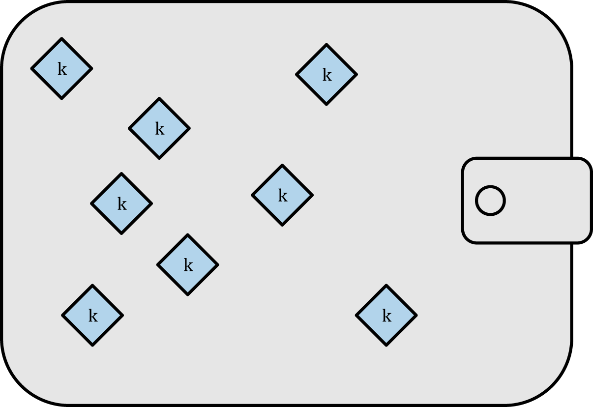
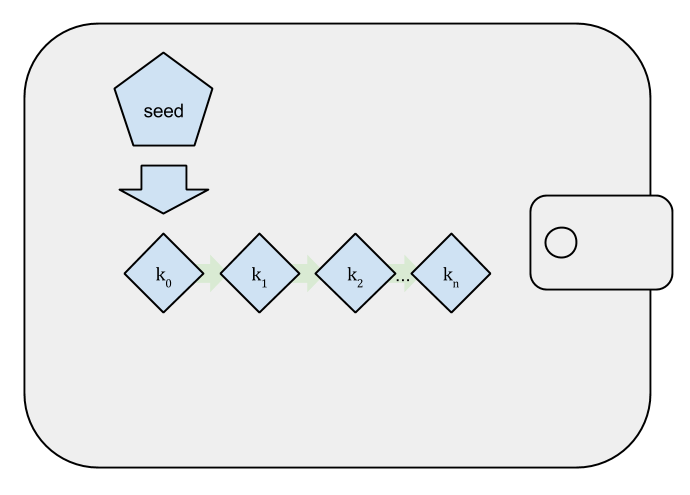
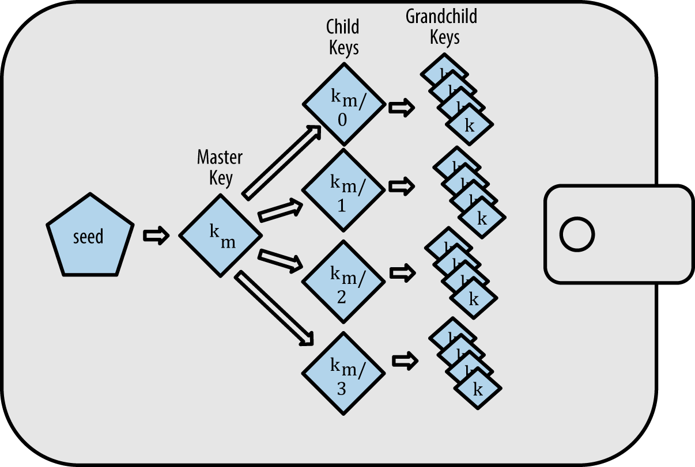
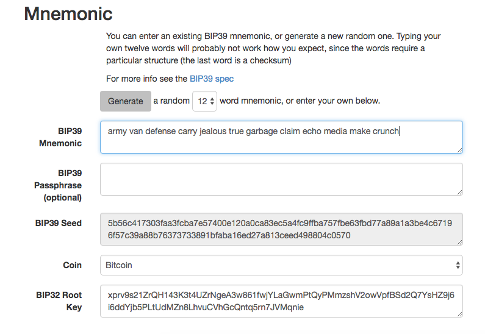
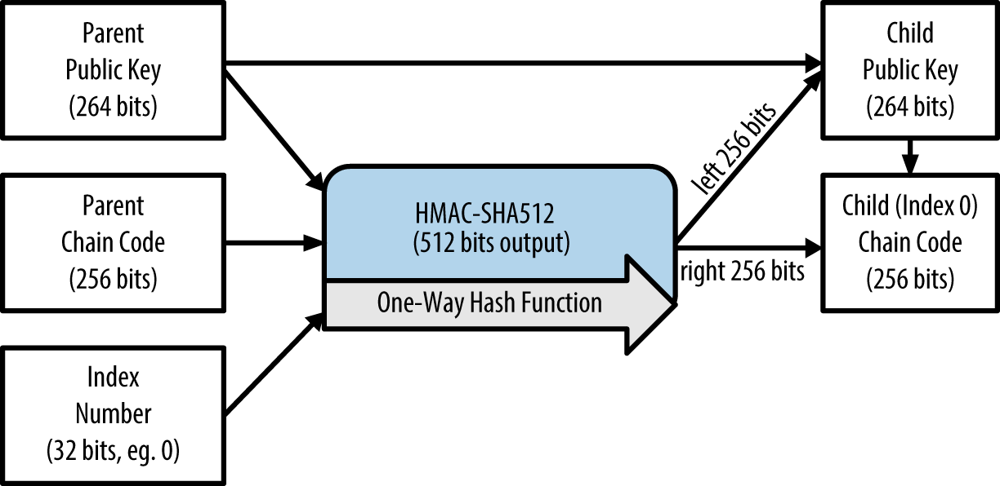
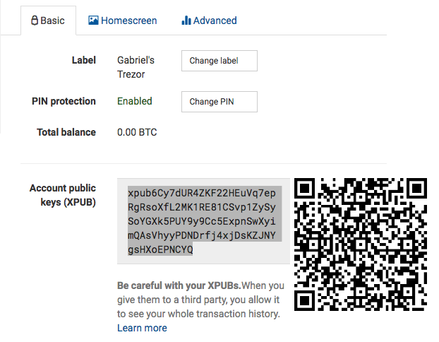
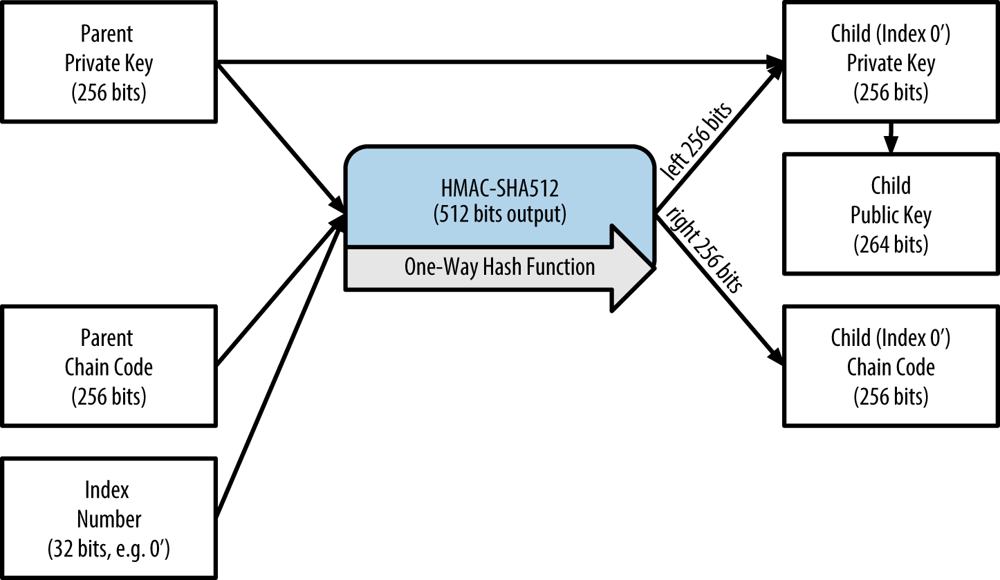

## 钱包

在比特币中，“钱包”一词用于描述几个不同的东西。

从较高的角度来说，钱包是用户使用的应用程序，控制对用户资金的访问，管理密钥和地址，追踪余额以及创建和签署交易。

更狭义地，从程序员的角度来看，“钱包”一词是指用于存储和管理用户密钥的数据结构。

在本章中，我们将看看第二个含义，即钱包是私钥的容器，通常以结构化文件或简单数据库的形式实现。

### 钱包技术概述

在本节中，我们总结了用于构建用户友好，安全和灵活的比特币钱包的各种技术。

关于比特币的一个常见误解是比特币钱包包含比特币。实际上，钱包只包含密钥。“比特币”被记录在比特币网络的区块链中。用户通过使用钱包中的密钥签署交易来控制网络上的硬币。从某种意义上说，比特币钱包是一个 *密钥串* *keychain* 。

------
>   比特币钱包包含钥匙，而不是硬币。每个用户都有一个包含密钥的钱包。钱包真的是包含私钥/公钥的钥匙串 (参见 [[private_public_keys\]](https://github.com/wjw465150/bitcoin_book_2nd/blob/master/第五章.asciidoc#private_public_keys)). 用户使用密钥签署交易，从而证明他们拥有交易的输出（他们的比特币）。比特币以交易输出的形式（通常记作vout或txout）存储在区块链中。 
------

根据包含的密钥是否彼此相关划分，主要有两种类型的钱包。

第一种是 *非确定性钱包* *nondeterministic wallet* ，其中每个密钥都是从随机数中独立生成的。密钥不相互关联。这种类型的钱包也被称JBOK钱包（Just a Bunch Of Keys）。

第二种是 *确定性钱包* *deterministic wallet*，其中所有密钥都来自单个主密钥，称为 *种子* *seed* 。这种钱包中的所有密钥都是相互关联的，如果有原始种子，可以再次生成。确定性钱包中使用了许多的 *密钥派生* *key derivation* 方法。 最常用的派生方法使用树状结构，并称为 *分层确定性* *hierarchical deterministic* 钱包或_HD_钱包。

确定性钱包是从种子初始化的。为了使这些更容易使用，种子被编码为英文单词，也被称为_助记词_ *mnemonic code words* 。

接下来的几节将从较高的角度介绍这些技术。

#### 非确定性（随机）钱包

在第一个比特币钱包（现在称为Bitcoin Core）中，钱包是随机生成的私钥集合。例如，Bitcoin Core客户端首次启动时生成100个随机私钥，并根据需要生成更多的密钥，每个密钥只使用一次。这些钱包正在被确定性的钱包取代，因为它们的管理，备份和导入很麻烦。随机密钥的缺点是，如果你生成了很多密钥，你必须保留所有密钥的副本，这意味着钱包必须经常备份。每个密钥都必须备份，否则，如果钱包变得不可用，则其控制的资金将不可撤销地丢失。这与避免地址重用的原则直接冲突，即每个比特币地址仅用于一次交易。地址重用将多个交易和地址相互关联来，会减少隐私。 0型非确定性钱包是穷人的选择，如果你想避免地址重用，就要管理许多密钥，频繁备份。尽管Bitcoin Core客户端包含0型钱包，但Bitcoin Core开发人员不鼓励使用此钱包。 [Type-0 nondeterministic (random) wallet: a collection of randomly generated keys](https://github.com/wjw465150/bitcoin_book_2nd/blob/master/第五章.asciidoc#Type0_wallet) 展示了一个非确定性钱包，它包含一个松散的随机密钥集合。

------
>   除了简单的测试以外，不推荐使用非确定性钱包，备份和使用起来太麻烦了。请使用基于行业标准的有 *助记词* *HD wallet* 进行备份。 
------



Figure 1. Type-0 nondeterministic (random) wallet: a collection of randomly generated keys

#### Deterministic (Seeded) Wallets

确定性的，或“基于种子的”钱包是包含私钥的钱包，这些私钥都是通过使用单向散列函数从公共种子派生的。种子是随机生成的数字，与其他数据（如索引编号或“chain code”（参见[分层确定性钱包（HD Wallets）(BIP-32/BIP-44)](https://github.com/wjw465150/bitcoin_book_2nd/blob/master/第五章.asciidoc#hd_wallets)））组合以导出私钥。在确定性钱包中，种子足以恢复所有的派生密钥，因此在创建时一次备份就足够了。种子对于钱包导出或导入也是足够的，允许在不同的钱包实施之间轻松迁移所有用户的密钥。[Type-1 deterministic (seeded) wallet: a deterministic sequence of keys derived from a seed](https://github.com/wjw465150/bitcoin_book_2nd/blob/master/第五章.asciidoc#Type1_wallet) 展示了确定性钱包的逻辑图。



Figure 2. Type-1 deterministic (seeded) wallet: a deterministic sequence of keys derived from a seed

#### 分层确定性钱包（HD Wallets）(BIP-32/BIP-44)

确定性钱包的开发使得从单个“种子”中获得许多密钥变得容易。确定性钱包的最高级形式是由BIP-32标准定义的HD钱包。HD钱包包含以树结构导出的密钥，父密钥可以导出一系列的子密钥，每个子密钥可以导出一系列孙子密钥等等，可达到无限深度。这个树结构在[Type-2 HD wallet: a tree of keys generated from a single seed](https://github.com/wjw465150/bitcoin_book_2nd/blob/master/第五章.asciidoc#Type2_wallet)中进行了说明。



Figure 3. Type-2 HD wallet: a tree of keys generated from a single seed

与随机（非确定性）密钥相比，HD钱包具有两大优势。首先，树结构可以用来表达额外的组织含义，例如，使用子密钥的特定分支来接收传入的支付，使用另一个分支来接收支付时的零钱。分支的密钥也可用于组织机构设置，将不同分支分配给部门，子公司，特定功能或会计类别。

HD钱包的第二个优点是用户可以创建一系列公钥而无需访问相应的私钥。这允许HD钱包用于不安全的服务器或仅作为接收用途，为每次交易发出不同的公钥。公钥不需要事先预加载或派生，服务器也没有可以花费资金的私钥。

#### 种子和助记词 (BIP-39)

HD钱包是管理许多密钥和地址的非常强大的机制。如果将它们与标准化方式相结合，从一系列易于转录，导出和跨钱包导入的英语单词创建种子，就更加有用。这被称为 *助记* ，BIP-39定义了这个标准。今天，大多数比特币钱包（以及用于其他加密货币的钱包）都使用此标准，并且可以使用可互操作的助记词导入和导出种子以进行备份和恢复。

我们实际来看一下。下列哪类种子更易于转录，在纸上记录，无误地读取，导出/导入另一个钱包？

A seed for an deterministic wallet, in hex

```
0C1E24E5917779D297E14D45F14E1A1A
```

A seed for an deterministic wallet, from a 12-word mnemonic

```
army van defense carry jealous true
garbage claim echo media make crunch
```

#### 钱包最佳实践

随着比特币钱包技术的成熟，出现了一些常见的行业标准，使比特币钱包具有广泛的互操作性，易用性，安全性和灵活性。这些通用标准是：

- 助记词（mnemonic code words）, 基于BIP-39
- 分层确定性钱包（HD wallets）, 基于BIP-32
- 多用途分层确定性结构（Multipurpose HD wallet structure）, 基于BIP-43
- 多币种和多帐户钱包（Multicurrency and multiaccount wallets），基于BIP-44

这些标准可能会改变或因未来的发展而过时，但现在它们形成了一系列连锁技术，这些技术已成为比特币事实上的钱包标准。

这些标准已被软件和硬件比特币钱包广泛采用，使所有这些钱包可以互操作。用户可以导出其中一个钱包上生成的助记词并将其导入另一个钱包，恢复所有交易，密钥和地址。

支持这些标准的软件钱包的一些例子包括（按字母顺序排列）Breadwallet，Copay，Multibit HD和Mycelium。支持这些标准的硬件钱包的例子包括（按字母顺序列出）Keepkey，Ledger和Trezor。

以下各节详细介绍这些技术。

------
>   如果你正在实施比特币钱包，则应按照BIP-32，BIP-39，BIP-43和BIP-44标准，将其构建为HD钱包，并将种子编码为助记词用于备份，就像以下章节介绍的那样。 
------

#### 使用比特币钱包

在 [[user-stories\]](https://github.com/wjw465150/bitcoin_book_2nd/blob/master/第五章.asciidoc#user-stories) 中我们介绍了Gabriel, 一位在里约热内卢的富有进取精神的年轻人，他正在经营一家简单的网上商店，销售比特币品牌的T恤，咖啡杯和贴纸。

Gabriel 使用 Trezor 比特币硬件钱包 ([A Trezor device: a bitcoin HD wallet in hardware](https://github.com/wjw465150/bitcoin_book_2nd/blob/master/第五章.asciidoc#a_trezor_device)) 安全地管理他的比特币。Trezor是一个有两个按钮的简单的USB设备，用于存储密钥（以HD钱包的形式） ，签署交易。Trezor钱包实现了本章介绍的所有工业标准，因此Gabriel并不依赖任何专有技术或单一供应商解决方案。


Figure 4. A Trezor device: a bitcoin HD wallet in hardware

当Gabriel首次使用Trezor时，该设备通过内置硬件随机数生成器生成助记符和种子。在这个初始化阶段，钱包在屏幕上逐一显示带有编号的单词序列（参见 [Trezor displaying one of the mnemonic words](https://github.com/wjw465150/bitcoin_book_2nd/blob/master/第五章.asciidoc#trezor_mnemonic_display)）。


Figure 5. Trezor displaying one of the mnemonic words

记录下助记词，Gabriel可以在他的Trezor设备丢失或损坏时使用备份的助记词进行恢复。这种助记符可以用于新的Trezor设备或任意一个兼容的软件或硬件钱包。请注意，助记词的顺序很重要。

Table 1. Gabriel’s paper backup of the mnemonic

| **1.** | *army*    | **7.**  | *garbage* |
| ------ | --------- | ------- | --------- |
| **2.** | *van*     | **8.**  | *claim*   |
| **3.** | *defense* | **9.**  | *echo*    |
| **4.** | *carry*   | **10.** | *media*   |
| **5.** | *jealous* | **11.** | *make*    |
| **6.** | *true*    | **12.** | *crunch*  |

------
>   为简单起见，在 [Gabriel’s paper backup of the mnemonic](https://github.com/wjw465150/bitcoin_book_2nd/blob/master/第五章.asciidoc#mnemonic_paper_backup) 中展示了12个助记词。实际上，大多数硬件钱包可以产生更安全的24个助记词。不管长度如何，助记词的使用方式完全相同。 
------

对于第一次网店实践，Gabriel使用Trezor设备上生成的单个比特币地址。所有客户都可以使用这个地址进行所有订单。正如我们将看到的，这种方法有一些缺点，可以通过HD钱包进行改进。

### 钱包技术细节

现在我们来仔细研究比特币钱包所使用的每个重要行业标准。

#### 助记词（Mnemonic Code Words）(BIP-39)

助记词是表示（编码）用作派生确定性钱包的种子的随机数的一个单词序列。单词序列足以重新创建种子，并重新创建钱包和所有派生的密钥。使用助记词实现确定性钱包的钱包应用会在首次创建钱包时向用户显示12至24个单词的序列。这个单词序列是钱包的备份，可用于在相同或任何兼容的钱包应用中恢复和重新创建所有密钥。与随机数字序列相比，助记词使得用户更容易备份钱包，因为它们易于阅读和正确转录。

------
>   助记词通常与“大脑钱包（brainwallets）”混淆。他们不一样。主要区别在于大脑钱包由用户选择的单词组成，而助记词由钱包随机创建并呈现给用户。这个重要的区别使助记词更加安全，因为人类是非常贫乏的随机性来源。 
------

助记词在BIP-39中定义（参见[[appdxbitcoinimpproposals\]](https://github.com/wjw465150/bitcoin_book_2nd/blob/master/第五章.asciidoc#appdxbitcoinimpproposals)）。注意，BIP-39是助记词标准的一个实现。还有一个不同的标准，使用一组不同的词，在BIP-39之前由Electrum钱包使用。 BIP-39由生产Trezor硬件钱包的公司提出，与Electrum不兼容。但是，BIP-39现在已经获得了广泛的行业支持，数十种产品可以互操作，被视为事实上的行业标准。

BIP-39定义了助记词和种子的创建方法，我们通过九个步骤来描述它。为了清楚起见，该过程分为两部分：步骤1至6在 [[generate_mnemonic_words\]](https://github.com/wjw465150/bitcoin_book_2nd/blob/master/第五章.asciidoc#generate_mnemonic_words) 中，步骤7至9在 [从助记符到种子](https://github.com/wjw465150/bitcoin_book_2nd/blob/master/第五章.asciidoc#mnemonic_to_seed) 中。

##### 生成助记词

助记词是由钱包使用BIP-39中定义的标准化过程自动生成的。钱包从一个熵源开始，添加校验和，将熵映射到单词列表：

1. 创建一个128到256位的随机序列（熵）。
2. 通过取其SHA256散列的第一个（熵长度/ 32）位创建随机序列的校验和。
3. 将校验和添加到随机序列的末尾。
4. 将结果拆分为11位长的多个段。
5. 将每个11位值映射到有2048个单词的预定义字典中的一个单词。
6. 助记词就是这些单词的序列。

[Generating entropy and encoding as mnemonic words](https://github.com/wjw465150/bitcoin_book_2nd/blob/master/第五章.asciidoc#generating_entropy_and_encoding) 展示了如何使用熵来生成助记词。


Figure 6. Generating entropy and encoding as mnemonic words

[Mnemonic codes: entropy and word length](https://github.com/wjw465150/bitcoin_book_2nd/blob/master/第五章.asciidoc#table_4-5) 显示了熵数据的大小与助记词的长度之间的关系。

Table 2. Mnemonic codes: entropy and word length

| Entropy (bits) | Checksum (bits) | Entropy **+** checksum (bits) | Mnemonic length (words) |
| -------------- | --------------- | ----------------------------- | ----------------------- |
| 128            | 4               | 132                           | 12                      |
| 160            | 5               | 165                           | 15                      |
| 192            | 6               | 198                           | 18                      |
| 224            | 7               | 231                           | 21                      |
| 256            | 8               | 264                           | 24                      |

##### 从助记符到种子

助记词表示长度为128到256位的熵。然后使用熵通过使用密钥扩展函数PBKDF2来导出更长的（512位）种子。之后使用生成的种子构建确定性钱包并导出其密钥。

密钥扩展函数需要两个参数：助记词和 *盐* *salt* 。在密钥扩展函数中使用盐的目的是使构建一个查找表并暴力破解难以实现。在BIP-39标准中，盐有另一个目的 - 它允许引入密码，作为保护种子的附加安全因素，我们将在 [BIP-39中可选的密码](https://github.com/wjw465150/bitcoin_book_2nd/blob/master/第五章.asciidoc#mnemonic_passphrase)中详细描述。

步骤7到9中描述的过程从 [[generated_mnemonic_words\]](https://github.com/wjw465150/bitcoin_book_2nd/blob/master/第五章.asciidoc#generated_mnemonic_words) 中的过程继续：

1. PPBKDF2密钥扩展函数的第一个参数是步骤6中产生的 *助记词*
2. PPBKDF2密钥扩展函数的第一个参数是 *盐（salt）* 。盐由字符串 "`mnemonic`" 加上可选的用户提供的密码组成。
3. PBKDF2使用HMAC-SHA512算法执行2048轮散列来扩展助记词和盐，产生一个512位值，就是种子。

[From mnemonic to seed](https://github.com/wjw465150/bitcoin_book_2nd/blob/master/第五章.asciidoc#fig_5_7) 展示了如何使用助记词来生成种子。


Figure 7. From mnemonic to seed

------
>   密钥扩展方法及其2048轮哈希是一种非常有效的防止对助记词或密码短语攻击的保护。它使得尝试超过几千个密码和助记符组合的成本非常高，而可能派生的种子数量很大（2512）。 
------

表格 [#mnemonic_128_no_pass](https://github.com/wjw465150/bitcoin_book_2nd/blob/master/第五章.asciidoc#mnemonic_128_no_pass), [#mnemonic_128_w_pass](https://github.com/wjw465150/bitcoin_book_2nd/blob/master/第五章.asciidoc#mnemonic_128_w_pass), and [#mnemonic_256_no_pass](https://github.com/wjw465150/bitcoin_book_2nd/blob/master/第五章.asciidoc#mnemonic_256_no_pass) 显示一些助记词和他们产生的种子（没有任何密码）的例子。

Table 3. 128-bit entropy mnemonic code, no passphrase, resulting seed

| **Entropy input (128 bits)** | 0c1e24e5917779d297e14d45f14e1a1a                             |
| ---------------------------- | ------------------------------------------------------------ |
| **Mnemonic (12 words)**      | army van defense carry jealous true garbage claim echo media make crunch |
| **Passphrase**               | (none)                                                       |
| **Seed (512 bits)**          | 5b56c417303faa3fcba7e57400e120a0ca83ec5a4fc9ffba757fbe63fbd77a89a1a3be4c67196f57c39 a88b76373733891bfaba16ed27a813ceed498804c0570 |

Table 4. 128-bit entropy mnemonic code, with passphrase, resulting seed

| **Entropy input (128 bits)** | 0c1e24e5917779d297e14d45f14e1a1a                             |
| ---------------------------- | ------------------------------------------------------------ |
| **Mnemonic (12 words)**      | army van defense carry jealous true garbage claim echo media make crunch |
| **Passphrase**               | SuperDuperSecret                                             |
| **Seed (512 bits)**          | 3b5df16df2157104cfdd22830162a5e170c0161653e3afe6c88defeefb0818c793dbb28ab3ab091897d0 715861dc8a18358f80b79d49acf64142ae57037d1d54 |

Table 5. 256-bit entropy mnemonic code, no passphrase, resulting seed

| **Entropy input (256 bits)** | 2041546864449caff939d32d574753fe684d3c947c3346713dd8423e74abcf8c |
| ---------------------------- | ------------------------------------------------------------ |
| **Mnemonic (24 words)**      | cake apple borrow silk endorse fitness top denial coil riot stay wolf luggage oxygen faint major edit measure invite love trap field dilemma oblige |
| **Passphrase**               | (none)                                                       |
| **Seed (512 bits)**          | 3269bce2674acbd188d4f120072b13b088a0ecf87c6e4cae41657a0bb78f5315b33b3a04356e53d062e5 5f1e0deaa082df8d487381379df848a6ad7e98798404 |

##### BIP-39中可选的密码

BIP-39标准允许在派生种子中使用可选的密码。如果没有使用密码，助记词将被一个常量字符串 mnemonic 的盐扩展，产生一个特定的512位种子。如果使用密码短语，则扩展函数会从同一助记符中生成一个 *不同的* 种子。对于一个助记词，每一个可能的密码都会导致不同的种子。本质上，没有 “错误的” 密码。所有密码都是有效的，会生成不同的种子，形成一大批未初始化的钱包。可能的钱包的集合非常大（2512），因此没有可能暴力破解或意外猜测出正在使用的钱包。

------
>   BIP-39中没有 “错误的” 口令。每个密码都会导致一些钱包，除非以前使用过，钱包将是空的。 
------

可选的密码引入了两个重要功能：

- 第二重保护，需要记忆的密码使得只获得助记词没有用，避免助记词被盗时的损失。
- 一种似是而非的拒绝形式或“胁迫钱包”，一个选定的密码会导致进入一个带有少量资金的钱包，用于将攻击者的注意力从有大部分资金的“真实”钱包引开。

但是，要注意使用密码也会导致丢失的风险：

- 如果钱包所有者无行为能力或死亡，而且没有其他人知道密码，则种子无用，钱包中存储的所有资金都将永久丢失。
- 相反，如果所有者在与种子相同的位置备份密码，它将失去第二重保护的意义。

虽然密码非常有用，但应该结合精心策划的备份和恢复过程，需要考虑主人是否存活，要允许其家人恢复加密货币资产。

##### 使用助记词

BIP-39有许多不同的编程语言库实现：

- [python-mnemonic](https://github.com/trezor/python-mnemonic)

  提出BIP-39标准的SatoshiLabs团队用Python写的参考实现

- [bitcoinjs/bip39](https://github.com/bitcoinjs/bip39)

  BIP-39的JavaScript实现，是流行的bitcoinJS框架的一部分。

- [libbitcoin/mnemonic](https://github.com/libbitcoin/libbitcoin/blob/master/src/wallet/mnemonic.cpp)

  BIP-39的C++实现，是流行的Libbitcoin框架的一部分。

还有一个在网页中实现的BIP-39生成器，这对于测试非常有用。 [A BIP-39 generator as a standalone web page](https://github.com/wjw465150/bitcoin_book_2nd/blob/master/第五章.asciidoc#a_bip39_generator_as_a_standalone_web_page) 展示了生成助记符，种子和扩展私钥的网页。



Figure 8. A BIP-39 generator as a standalone web page

这个页面 (https://iancoleman.github.io/bip39/) 可以离线或在线访问

#### 通过种子创建HD钱包

HD钱包是由一个 *根种子* *root seed* 创建的，是一个128位，256位或512位的随机数。通常，这个种子是从 *助记词* *mnemonic* 生成的，详见前一节。

HD钱包中的每个密钥都是从这个根种子确定性地派生出来的，这使得可以在任何兼容的HD钱包中从该种子重新创建整个HD钱包。这使得备份，恢复，导出和导入包含数千乃至数百万个密钥的HD钱包变得很容易，只需传输根种子的助记词即可。

创建 *主密钥* *master keys* 和主链码 *master chain code* 的过程如 [Creating master keys and chain code from a root seed](https://github.com/wjw465150/bitcoin_book_2nd/blob/master/第五章.asciidoc#HDWalletFromSeed) 所示。


Figure 9. Creating master keys and chain code from a root seed

将根种子作为 HMAC-SHA512 算法的输入，生成的哈希结果用来生成 *主私钥* *master private key* (m) 和 *主链码* *master chain code* (c)。

然后使用我们在 [[pubkey\]](https://github.com/wjw465150/bitcoin_book_2nd/blob/master/第五章.asciidoc#pubkey) 中看到的椭圆曲线乘法 m * G 利用主密钥（m）生成相应的主公钥（M）。

主链码（c）用于在从父键创建子键的函数中引入熵，我们将在下一节看到。

##### 子私钥的派生

HD钱包使用 *子密钥派生* *child key derivation* (CKD) 方法从父密钥派生子密钥。

子密钥派生方法基于单向散列函数，该函数结合：

- 一个父级私钥或公钥 (ECDSA未压缩密钥)
- 一个称作链码(chain code)的种子（256 bits）
- 一个索引数字（32 bits）

链码用于向过程中引入确定性随机数据，所以只知道索引和子密钥不足以派生其他子密钥。除非有链码，否则知道一个子钥匙不能找到它的兄弟姐妹。初始链码种子（树的根部）由种子制成，而后续子链码则从每个父链码中导出。

这三项（父密钥，链码和索引）被组合并哈希以生成子键，如下所示。

使用HMAC-SHA512算法将父公钥，链码和索引组合并散列，以产生512位散列。这个512位散列平分为两部分。右半部分256位作为后代的链码，左半部分256位被添加到父私钥以生成子私钥。在 [Extending a parent private key to create a child private key](https://github.com/wjw465150/bitcoin_book_2nd/blob/master/第五章.asciidoc#CKDpriv) 中，我们看到这个例子中的索引设置为0，以产生父项的“零”级（第一个索引）孩子。


Figure 10. Extending a parent private key to create a child private key

更改索引允许我们扩展父项并创建序列中的其他子项，例如Child 0，Child 1，Child 2等。每个父项可以有 2,147,483,647（2 31）个子项（232 范围的一半 231是可用的，另一半保留用于特殊类型的推导，我们将在本章后面讨论）。

在树的下一层重复这个过程，每个孩子都可以成为父项并在无限的世代中创造自己的孩子。

##### 使用派生的子密钥

子私钥与非确定性（随机）密钥没有区别。因为派生函数是单向函数，不能使用子项来寻找父项和寻找任何兄弟姐妹。不能通过第n个子项找到它的兄弟姐妹，如第 n-1 个子项或者第 n+1 个子项，或者任何这个序列上的子项。只能通过父密钥和链码派生所有的孩子。如果没有子链码，子密钥也不能派生任何孙项。你需要子私钥和子链码来启动一个新分支并派生孙项。

那么，子私钥能用来干什么呢？它可以用来制作公钥和比特币地址。然后，它可以用来签署交易，并花费任何支付给该地址的费用。

------
>   子私钥，相应的公钥和比特币地址都与随机创建的密钥和地址没有区别。在创建它们的HD钱包之外是不知道它们属于一个序列的。一旦创建，就像“普通”键一样工作。 
------

##### 扩展密钥

如我们所见，基于三个输入：密钥，链码和所需子项的索引，可以使用密钥派生函数在树的任何级别创建子项。这两个基本要素是密钥和链式代码，它们的组合称为 *扩展密钥* *extended key* 。也可以认为“扩展密钥”是“可扩展的密钥”，因为这样的密钥可以用来派生孩子。

扩展密钥简单地表示为由256位的密钥和256位的链码串联成的512位序列。有两种类型的扩展密钥：扩展私钥是私钥和链码的组合，可用于派生子私钥（从它们产生子公钥）；扩展公钥是公钥和链码，可用于创建子公钥（ *只有子公钥* ），如 [[public_key_derivation\]](https://github.com/wjw465150/bitcoin_book_2nd/blob/master/第五章.asciidoc#public_key_derivation) 中所述。

将扩展密钥视为HD钱包树形结构中分支的根。可以通过分支的根，派生出其他分支。扩展私钥可以创建一个完整的分支，而扩展公钥只能创建一个公钥分支。

------
>   扩展密钥由私钥或公钥和链码组成。扩展密钥可以创建子项，在树结构中生成自己的分支。共享一个扩展密钥可以访问整个分支。 
------

扩展密钥使用Base58Check编码，可以轻松导出导入BIP-32兼容的钱包。扩展密钥的Base58Check编码使用特殊的版本号，当使用Base58字符进行编码时，其前缀为“xprv”和“xpub”，以使其易于识别。因为扩展的密钥是512或513位，所以它比我们以前见过的其他Base58Check编码的字符串要长得多。

这是一个Base58Check编码的扩展私钥：

```
xprv9tyUQV64JT5qs3RSTJkXCWKMyUgoQp7F3hA1xzG6ZGu6u6Q9VMNjGr67Lctvy5P8oyaYAL9CAWrUE9i6GoNMKUga5biW6Hx4tws2six3b9c
```

这是对应的Base58Check编码的扩展公钥：

```
xpub67xpozcx8pe95XVuZLHXZeG6XWXHpGq6Qv5cmNfi7cS5mtjJ2tgypeQbBs2UAR6KECeeMVKZBPLrtJunSDMstweyLXhRgPxdp14sk9tJPW9
```

##### 子公钥派生

如前所述，HD钱包的一个非常有用的特性是能够从父公钥中获得子公钥，而没有私钥。这为我们提供了两种派生子公钥的方法：从子私钥或直接从父公钥获取子公钥。

因此，可以使用扩展公钥，导出HD钱包该分支中的所有 *公钥*（注意只有公钥）。

此快捷方式可用于创建非常安全的公钥 - 只有部署服务器或应用程序具有扩展公钥的副本，并且没有任何私钥。这种部署可以产生无限数量的公钥和比特币地址，但无法花费发送到这些地址的任何资金。与此同时，在另一个更安全的服务器上，扩展私钥可以导出所有相应的私钥来签署交易并花费金钱。

这个解决方案的一个常见应用是在提供电子商务应用程序的Web服务器上安装扩展公钥。网络服务器可以使用公钥导出函数来为每个交易（例如，为顾客购物车）创建新的比特币地址。 Web服务器上不会有任何易被盗的私钥。没有HD钱包，唯一的方法就是在单独的安全服务器上生成数千个比特币地址，然后将其预先加载到电子商务服务器上。这种方法很麻烦，需要不断的维护以确保电子商务服务器不会“用完”密钥。

另一个常见应用是用于冷存储或硬件钱包。在这种情况下，扩展私钥可以存储在纸钱包或硬件设备（如Trezor硬件钱包）上，而扩展公钥可以保持在线。用户可以随意创建“接收”地址，而私钥可以安全地在离线状态下存储。为了花费资金，用户可以在离线签名比特币客户端使用扩展私钥签名，或在硬件钱包设备上签名交易（例如Trezor）。 [Extending a parent public key to create a child public key](https://github.com/wjw465150/bitcoin_book_2nd/blob/master/第五章.asciidoc#CKDpub) 演示了用扩展父公钥派生子公钥的机制。



Figure 11. Extending a parent public key to create a child public key

#### 在网店中使用扩展公钥

让我们看看如何使用HD钱包继续Gabriel的网上商店故事。

Gabriel 首先出于爱好建立了他的网上商店，基于简单的Wordpress。他的商店非常简单，只有几个页面和有一个比特币地址的下单表单。

Gabriel 使用他的Trezor设备生成的第一个比特币地址作为他的商店的主要比特币地址。这样，所有收到的付款都将支付给他的Trezor硬件钱包所控制的地址。

客户将使用表单提交订单并将支付款项发送至Gabriel发布的比特币地址，触发一封电子邮件，其中包含Gabriel要处理的订单详情。每周只有几个订单，这个系统运行得很好。

然而，这家小型网上商店变得非常成功，吸引了当地的许多订单。不久，Gabriel 便不知所措了。由于所有订单都支付相同的地址，很难正确匹配订单和交易，尤其是当同一数量的多个订单紧密结合在一起时。

Gabriel 的 HD 钱包通过在不知道私钥的情况下派生子公钥的能力提供了更好的解决方案。Gabriel 可以在他的网站上加载一个扩展公钥（xpub），用来为每个客户订单派生一个唯一的地址。Gabriel 可以从他的Trezor花费资金，但在网站上加载的 xpub 只能生成地址并获得资金。HD钱包的这个特点是一个很好的安全功能。Gabriel 的网站不包含任何私钥，因此不需要高度的安全性。

Gabriel将Web软件与Trezor硬件钱包一起使用导出xpub。必须插入Trezor设备才能导出公钥。请注意，硬件钱包永远不会导出私钥 —— 这些密钥始终保留在设备上。 [Exporting an xpub from a Trezor hardware wallet](https://github.com/wjw465150/bitcoin_book_2nd/blob/master/第五章.asciidoc#export_xpub) 展示了Gabriel用于导出xpub的Web界面。



Figure 12. Exporting an xpub from a Trezor hardware wallet

Gabriel将 xpub 复制到他的网上商店的比特币商店软件中。并使用 *Mycelium Gear* ，这是一个开源的网上商店插件，用于各种网站托管和内容平台。 Mycelium Gear使用 xpub 为每次购买生成一个唯一的地址。

##### 强化的子密钥派生

从 xpub 派生公钥的分支是非常有用的，但有潜在的风险。访问 xpub 不会访问子私钥。但是，因为 xpub 包含链码，所以如果某个子私钥已知，或者以某种方式泄漏，则可以与链式代码一起使用，派生所有其他子私钥。一个泄露的子私钥和一个父链码可以生成所有其他的子私钥。更糟的是，可以使用子私钥和父链码来推导父私钥。

为了应对这种风险，HD钱包使用一种称为 *hardened derivation* 的替代派生函数，该函数“破坏”父公钥和子链码之间的关系。强化派生函数使用父私钥来派生子链码，而不是父公钥。这会在父/子序列中创建一个“防火墙”，链码不能危害父级或同级的私钥。父私钥替代父公钥作为散列函数的输入，强化后的派生函数看起来与正常的子私钥派生几乎相同，如 [Hardened derivation of a child key; omits the parent public key](https://github.com/wjw465150/bitcoin_book_2nd/blob/master/第五章.asciidoc#CKDprime) 中的图所示。



Figure 13. Hardened derivation of a child key; omits the parent public key

当使用强化的私有派生函数时，生成的子私钥和链码与正常派生函数所产生的完全不同。由此产生的“分支”密钥可用于生成不易受攻击的扩展公钥，因为它们所包含的链码不能用于揭示任何私钥。因此，强化派生用于在继承树上使用扩展公钥的级别之上创建“屏障”。

简而言之，如果你想使用 xpub 的便利性来派生分支公钥，而不想面临泄漏链码的风险，应该从强化的父项派生。作为最佳实践，主密钥的1级子密钥始终使用强化派生，以防止主密钥受到破坏。

##### 常规派生与强化派生的索引号

在派生函数中使用的索引号是一个32位整数。为了便于区分通过常规推导函数派生的密钥与通过强化派生派生的密钥，该索引号分为两个范围。 0到231 - 1（0x0到0x7FFFFFFF）之间的索引号仅用于常规推导。 231 和 232 - 1（0x80000000到0xFFFFFFFF）之间的索引号仅用于硬化派生。因此，如果索引号小于231，则子密钥是常规的，而如果索引号等于或大于 231，则子密钥是强化派生的。

为了使索引号码更容易阅读和显示，强化子密钥的索引号从零开始显示，但带有一个符号。第一个常规子密钥表示成0，第一个强化子秘钥（ 索引号是 0x80000000 ）表示成0'。以此类推，第二个强化子密钥（ 0x80000001 ) 表示成1'。当你看到HD钱包索引i’时，它表示231+i.

##### HD钱包密钥标识符 (path)

HD钱包中的密钥使用“路径(path)”命名约定来标识，树的每个级别都用斜杠（/）字符分隔（请参见 [HD wallet path examples](https://github.com/wjw465150/bitcoin_book_2nd/blob/master/第五章.asciidoc#table_4-8)）。从主密钥派生的私钥以“m”开头。从主公钥派生的公钥以“M”开始。因此，主私钥的第一个子私钥为 m/0。第一个子公钥是 M/0。第一个子私钥的第二个子私钥是 m/0/1，依此类推。

从右向左读取一个密钥的“祖先”，直到到达派生出它的主密钥。例如，标识符 m/x/y/z 描述了私钥 m/x/y 的第z个子私钥，m/x/y 是私钥 m/x 的第y个子私钥，m/x 是 m 的第x个子私钥。

Table 6. HD wallet path examples

| HD path     | Key described                                                |
| ----------- | ------------------------------------------------------------ |
| m/0         | The first (0) child private key from the master private key (m) |
| m/0/0       | The first grandchild private key from the first child (m/0)  |
| m/0'/0      | The first normal grandchild from the first *hardened* child (m/0') |
| m/1/0       | The first grandchild private key from the second child (m/1) |
| M/23/17/0/0 | The first great-great-grandchild public key from the first great-grandchild from the 18th grandchild from the 24th child |

##### HD钱包的树状结构导航

HD钱包的树状结构提供了巨大的灵活性。每个父级扩展密钥的可以有40亿个子密钥：20个常规子密钥和20亿强化子密钥。这些子密钥中的每一个又可以有另外40亿子密钥。这棵树像你想要的一样深，有无限的世代。然而，这些灵活性，导致在这个无限树中导航变得非常困难。在不同实现之间转移HD钱包尤其困难，因为内部分支和子分支的可能性是无穷无尽的。

有两个BIP为HD钱包的树状结构提出了一些建议的标准，为这种复杂性提供解决方案。BIP-43建议使用第一个强化子索引作为表示树状结构“用途”的特殊标识符。基于BIP-43，HD钱包应该只使用树的一个1级分支，索引号通过定义其用途来标识树的其余部分的结构和名称空间。例如，仅使用分支 m/i'/ 的HD钱包表示特定用途，用途由索引号“i”标识。

BIP-44在BIP-43下提出了一个多帐户结构作为“用途”号码 44' 。所有遵守BIP-44的HD钱包通过仅使用树的一个分支来体现：m/44'/。

BIP-44定义了包含五个预定义树级的结构：

```
m / purpose' / coin_type' / account' / change / address_index
```

第一级 “用途” 始终设置为 44'，第二级 “coin_type” 表示加密货币的类型，以支持多货币HD钱包，其中每种货币在第二级下具有其自己的子树。现在定义了三种货币：比特币是 m/44'/0'，比特币测试网是m/44'/1'，莱特币（Litecoin）是 m/44'/2'。

树的第三层是“帐户”，允许用户将他们的钱包细分为单独的逻辑子帐户，以用于会计或组织目的。例如，一个HD钱包可能包含两个比特币“账户”：m/44'/0'/0' 和 m/44'/0'/1'。每个帐户都是自己的子树的根。

在第四层，“零钱”，HD钱包有两个子树，一个用于创建接收地址，另一个用于创建零钱地址。请注意，虽然以前的层级使用强化派生，但此层级使用常规派生。这是为了允许树的这个级别导出扩展的公钥以供在不安全的环境中使用。“地址_索引”由HD钱包的第四级派生，也就是第五级。例如，主账户中比特币支付的第三个接收地址为 M/44'/0'/0'/0/2。 [BIP-44 HD wallet structure examples](https://github.com/wjw465150/bitcoin_book_2nd/blob/master/第五章.asciidoc#table_4-9) 显示了几个例子。

Table 7. BIP-44 HD wallet structure examples

| HD path          | Key described                              |
| ---------------- | ------------------------------------------ |
| M/44'/0'/0'/0/2  | 主要比特币账户的第三个接收地址公钥         |
| M/44'/0'/3'/1/14 | 第四个比特币帐户的第十五个零钱地址公钥     |
| m/44'/2'/0'/0/1  | Litecoin主账户中的第二个私钥，用于签署交易 |

