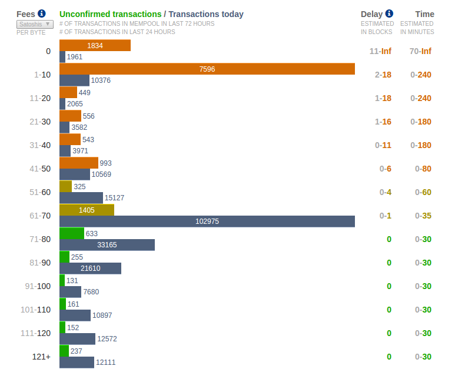
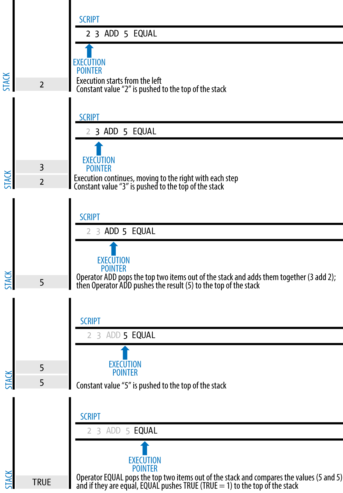

## 交易


### 简介

交易是比特币系统中最重要的部分。比特币中其他的一切都旨在确保交易可以创建，传播，验证并最终添加到交易（区块链）的全球总账中。交易是对比特币系统参与者之间的价值转移进行编码的数据结构。每笔交易都是比特币区块链中的公开条目，即全球复式簿记分类账。

在本章中，我们将检查各种形式的交易，它们包含的内容，如何创建它们，如何验证以及它们如何成为所有交易永久记录的一部分。当我们在本章中使用术语“钱包”时，我们指的是构建交易的软件，而不仅仅是密钥的数据库。

### 交易详情

在 [[ch02_bitcoin_overview\]](https://github.com/wjw465150/bitcoin_book_2nd/blob/master/第六章.asciidoc#ch02_bitcoin_overview) 中，我们使用区块浏览器查看了Alice在Bob的咖啡店购买咖啡的交易（ [Alice’s transaction to Bob’s Cafe](https://github.com/wjw465150/bitcoin_book_2nd/blob/master/第六章.asciidoc#alices_transactions_to_bobs_cafe) ）。

区块浏览器显示一个从Alice的“地址”到Bob的“地址”的交易。这是交易中包含的内容的简化视图。事实上，我们将在本章中看到，大部分信息都是由区块浏览器构建的，实际上并不在交易中。


Figure 1. Alice’s transaction to Bob’s Cafe

#### 交易背后

实际的交易看起来与典型的区块浏览器提供的非常不同。实际上，我们在各种比特币应用界面中看到的高层次结构 *并不实际存在于* 比特币系统中。

我们可以使用Bitcoin Core的命令行界面（ getrawtransaction 和 decoderawtransaction ）来检索Alice的“原始”交易，对其进行解码并查看它包含的内容。结果如下所示：

Alice’s transaction decoded

```
{
  "version": 1,
  "locktime": 0,
  "vin": [
    {
      "txid": "7957a35fe64f80d234d76d83a2a8f1a0d8149a41d81de548f0a65a8a999f6f18",
      "vout": 0,
      "scriptSig" : "3045022100884d142d86652a3f47ba4746ec719bbfbd040a570b1deccbb6498c75c4ae24cb02204b9f039ff08df09cbe9f6addac960298cad530a863ea8f53982c09db8f6e3813[ALL] 0484ecc0d46f1918b30928fa0e4ed99f16a0fb4fde0735e7ade8416ab9fe423cc5412336376789d172787ec3457eee41c04f4938de5cc17b4a10fa336a8d752adf",
      "sequence": 4294967295
    }
  ],
  "vout": [
    {
      "value": 0.01500000,
      "scriptPubKey": "OP_DUP OP_HASH160 ab68025513c3dbd2f7b92a94e0581f5d50f654e7 OP_EQUALVERIFY OP_CHECKSIG"
    },
    {
      "value": 0.08450000,
      "scriptPubKey": "OP_DUP OP_HASH160 7f9b1a7fb68d60c536c2fd8aeaa53a8f3cc025a8 OP_EQUALVERIFY OP_CHECKSIG",
    }
  ]
}
```

你可能只注意到有关此次交易的几个信息，大多数信息缺失了！Alice的地址在哪里？Bob的地址在哪里？ Alice发送的0.1输入在哪里？在比特币中，没有硬币，没有发送者，没有接收者，没有余额，没有帐户，也没有地址。所有这些东西都是在更高层次上构建的，以使事情更易于理解。

你可能会注意到很多奇怪的，难以辨认的字段和十六进制字符串。别担心，我们将在本章中详细解释每个字段。

### 交易的输出和输入

比特币交易的基本构建块是 *交易的输出* *transaction output* 。交易输出是不可分割的比特币货币，记录在区块链中，被整个网络识别为有效的。比特币完整节点跟踪所有可用和可花费的输出，称为 *未花费的交易输出* *unspent transaction outputs* 或 *UTXO* 。所有UTXO的集合被称为 *UTXO set* ，目前有数以百万的UTXO。UTXO集的大小随着新UTXO的增加而增长，并在UTXO被消耗时缩小。每个交易都表示UTXO集中的更改（状态转移）。

当我们说用户的钱包“收到”比特币时，意思是钱包检测到一个可以使用该钱包控制的密钥来花费的UTXO。因此，用户的比特币“余额”是用户钱包可以花费的所有UTXO的总和，可以分散在数百个交易和数百个块中。余额的概念是由钱包应用创建的。钱包扫描区块链并将钱包可以使用它的密钥花费的任何UTXO汇总计算用户的余额。大多数钱包维护数据库或使用数据库服务来存储它们可以花费的所有UTXO的快照。

一个交易输出可以有一个任意的（整数）等于satoshis倍数的值作为。正如美元可以分为小数点后两位数字一样，比特币可以被分为小数点后八位，作为satoshis。尽管输出可以具有任意值，但一旦创建就是不可分割的。这是需要强调的输出的一个重要特征：输出是 *不连续的* 和 *不可分割的* 的价值，以整数satoshis为单位。未使用的输出只能由交易全部花费。

如果UTXO大于交易的期望值，它仍然必须全部使用，并且必须在交易中生成零钱。换句话说，如果你有一个价值20比特币的UTXO，并且只需要支付1比特币，那么你的交易必须消费整个20比特币的UTXO，并产生两个输出：一个支付1比特币给你想要的收款人，另一个支付19比特币回到你的钱包。由于交易输出的不可分割性，大多数比特币交易将不得不产生零钱。

想象一下，一个购物者购买了1.50美元的饮料，并试图从她的钱包找到硬币和钞票的组合，以支付1.50美元。如果可能，购物者将找到正好的零钱，例如，一美元钞票和两个二十五分硬币（0.25美元），或小面值（六个二十五分硬币）的组合；或者，直接向店主支付5美元，她会得到3.50美元的找零，放回她的钱包并且可用于未来的交易。

同样，比特币交易必须从用户的UTXO创建，无论用户有什么样的面额。用户无法将UTXO削减一半，就像不能将美元分成两半使用一样。用户的钱包应用通常会从用户的可用UTXO中进行选择，使组合的金额大于或等于期望交易金额。

与现实一样，比特币应用可以使用多种策略来满足支付需求：合并几个较小的单位，找到正好的零钱，或者使用比交易价值更大的单元并进行找零。所有这些花费UTXO的复杂操作都由用户的钱包自动完成，对用户不可见。只有在编写程序构建来自UTXO的原始交易时才有意义。

交易消耗先前记录的未使用的交易输出，并创建可供未来交易使用的新交易输出。这样，大量的比特币价值通过创建UTXO的交易链在所有者之间转移。

输出和输入链的例外是称为 *币基* *coinbase* 交易的特殊类型的交易，它是每个块中的第一个交易。这笔交易由“获胜”的矿工设置，创建全新的比特币并支付给该矿工作为挖矿奖励。此特殊的coinbase交易不消费UTXO，相反，它有一种称为“coinbase”的特殊输入类型。这就是比特币在挖矿过程中创造的货币数量，正如我们将在 [[minig\]](https://github.com/wjw465150/bitcoin_book_2nd/blob/master/第六章.asciidoc#minig) 中看到的那样。

------
>   先有的什么？输入还是输出？鸡还是鸡蛋？严格地说，输出是第一位的，因为产生新比特币的币基交易没有输入，是凭空产生的输出。 
------

#### 交易输出

每笔比特币交易都产生输出，这些输出记录在比特币账本上。除了一个例外（参见 [[op_return\]](https://github.com/wjw465150/bitcoin_book_2nd/blob/master/第六章.asciidoc#op_return) ），几乎所有这些输出都创造了称为UTXO的可支付的比特币，由整个网络认可并可供所有者在未来的交易中花费。

每个完整节点比特币客户端都跟踪UTXO。新交易消耗（花费）UTXO集合的一个或多个输出。

交易输出由两部分组成:

- 一些比特币，最小单位为 *聪* *satoshis*
- 定义了花费这些输出所需条件的加密谜题

这个谜题也被称为 *锁定脚本* *locking script* ，*见证脚本* *witness script* ，或者 scriptPubKey。

在 [交易脚本和脚本语言](https://github.com/wjw465150/bitcoin_book_2nd/blob/master/第六章.asciidoc#tx_script) 中详细讨论了前面提到的锁定脚本中使用的交易脚本语言。

现在，我们来看看Alice的交易（ [交易背后](https://github.com/wjw465150/bitcoin_book_2nd/blob/master/第六章.asciidoc#transactions_behind_the_scenes) ），看看我们是否可以识别输出。在JSON编码中，输出位于名为 vout 的数组（列表）中：

```
"vout": [
  {
    "value": 0.01500000,
    "scriptPubKey": "OP_DUP OP_HASH160 ab68025513c3dbd2f7b92a94e0581f5d50f654e7 OP_EQUALVERIFY
    OP_CHECKSIG"
  },
  {
    "value": 0.08450000,
    "scriptPubKey": "OP_DUP OP_HASH160 7f9b1a7fb68d60c536c2fd8aeaa53a8f3cc025a8 OP_EQUALVERIFY OP_CHECKSIG",
  }
]
```

如你所见，该交易包含两个输出。每个输出由一个值和一个加密谜题定义。在Bitcoin Core显示的编码中，该值以比特币为单位，但在交易本身中，它被记录为以satoshis为单位的整数。每个输出的第二部分是设置消费条件的加密谜题。 Bitcoin Core将其显示为 scriptPubKey 并展示了该脚本的人类可读的表示。

锁定和解锁UTXO的主题将在稍后的 [创建脚本 ( 锁定 + 解锁 )](https://github.com/wjw465150/bitcoin_book_2nd/blob/master/第六章.asciidoc#tx_lock_unlock) 中讨论。在 [交易脚本和脚本语言](https://github.com/wjw465150/bitcoin_book_2nd/blob/master/第六章.asciidoc#tx_script) 中讨论了 scriptPubKey 中使用的脚本语言。但在深入研究这些话题之前，我们需要了解交易输入和输出的总体结构。

##### 交易序列化 —— 输出

当交易通过网络传输或在应用程序之间交换时，它们是 *序列化* 的。序列化是将数据结构的内部表示转换为可以一次传输一个字节的格式（也称为字节流）的过程。序列化最常用于对通过网络传输或存储在文件中的数据结构进行编码。交易输出的序列化格式展示在 [Transaction output serialization](https://github.com/wjw465150/bitcoin_book_2nd/blob/master/第六章.asciidoc#tx_out_structure) 中。

Table 1. Transaction output serialization

| Size               | Field                              | Description                                       |
| ------------------ | ---------------------------------- | ------------------------------------------------- |
| 8 字节 (小端序）   | 数量 Amount                        | 以聪（satoshis = 10-8 bitcoin) 为单位的比特币价值 |
| 1——9 字节 (VarInt) | 锁定脚本的大小 Locking-Script Size | 后面的锁定脚本的字节数                            |
| 变量               | 锁定脚本 Locking-Script            | 定义花费该输出的条件的脚本                        |

大多数比特币库和框架在内部不以字节流的形式存储交易，因为每次需要访问单个字段时都需要进行复杂的解析。为了方便和易读，比特币库在数据结构（通常是面向对象的结构）中存储交易。

从交易的字节流表示转换为库的内部表示数据结构的过程称为 *反序列化* *deserialization* 或 *交易解析* *transaction parsing* 。转换回字节流以通过网络进行传输，进行哈希或存储在磁盘上的过程称为 *序列化* *serialization*。大多数比特币库具有用于交易序列化和反序列化的内置函数。

看看你是否可以从序列化的十六进制形式手动解码Alice的交易，找到我们以前看到的一些字段。两个输出部分在 [Alice’s transaction, serialized and presented in hexadecimal notation](https://github.com/wjw465150/bitcoin_book_2nd/blob/master/第六章.asciidoc#example_6_1) 中突出显示：

Example 1. Alice’s transaction, serialized and presented in hexadecimal notation

0100000001186f9f998a5aa6f048e51dd8419a14d8a0f1a8a2836dd73 4d2804fe65fa35779000000008b483045022100884d142d86652a3f47 ba4746ec719bbfbd040a570b1deccbb6498c75c4ae24cb02204b9f039 ff08df09cbe9f6addac960298cad530a863ea8f53982c09db8f6e3813 01410484ecc0d46f1918b30928fa0e4ed99f16a0fb4fde0735e7ade84 16ab9fe423cc5412336376789d172787ec3457eee41c04f4938de5cc1 7b4a10fa336a8d752adfffffffff02**60e31600000000001976a914ab6** **8025513c3dbd2f7b92a94e0581f5d50f654e788acd0ef800000000000** **1976a9147f9b1a7fb68d60c536c2fd8aeaa53a8f3cc025a888ac** 00000000

这里有一些提示:

- 突出显示的部分有两个输出，每个输出按照 [Transaction output serialization](https://github.com/wjw465150/bitcoin_book_2nd/blob/master/第六章.asciidoc#tx_out_structure) 所示进行了序列化。
- 0.015比特币是1,500,000聪. 十六进制表示为 16 e3 60 .
- 在序列化的交易中，16 e3 60 以小端序（低位字节在前）编码，所以看起来是： 60 e3 16。
- scriptPubKey 的长度是 25 字节, 十六进制表示为 19 。

#### 交易输入

交易输入标识（通过引用）将使用哪个UTXO并通过解锁脚本提供所有权证明。

为了建立交易，钱包从其控制的UTXO中选择具有足够价值的UTXO进行所请求的付款。有时候一个UTXO就足够了，有时候需要多个UTXO。对于将用于进行此项付款的每个UTXO，钱包将创建一个指向UTXO的输入，并使用解锁脚本将其解锁。

让我们更详细地看看输入的组成部分。输入的第一部分是指向UTXO的指针，引用交易的哈希值和输出索引，该索引标识该交易中特定的UTXO。第二部分是一个解锁脚本，由钱包构建，为了满足UTXO中设置的花费条件。大多数情况下，解锁脚本是证明比特币所有权的数字签名和公钥。但是，并非所有解锁脚本都包含签名。第三部分是序列号，稍后将进行讨论。

考虑 [交易背后](https://github.com/wjw465150/bitcoin_book_2nd/blob/master/第六章.asciidoc#transactions_behind_the_scenes) 中的示例，交易的输出是 vin 数组:

The transaction inputs in Alice’s transaction

```
"vin": [
  {
    "txid": "7957a35fe64f80d234d76d83a2a8f1a0d8149a41d81de548f0a65a8a999f6f18",
    "vout": 0,
    "scriptSig" : "3045022100884d142d86652a3f47ba4746ec719bbfbd040a570b1deccbb6498c75c4ae24cb02204b9f039ff08df09cbe9f6addac960298cad530a863ea8f53982c09db8f6e3813[ALL] 0484ecc0d46f1918b30928fa0e4ed99f16a0fb4fde0735e7ade8416ab9fe423cc5412336376789d172787ec3457eee41c04f4938de5cc17b4a10fa336a8d752adf",
    "sequence": 4294967295
  }
]
```

如你所见，列表中只有一个输入（因为这个UTXO包含足够的值来完成此次付款）。输入包含四个元素：

- 交易ID，引用包含正在使用的UTXO的交易
- 输出索引（ vout ），标识使用来自该交易的哪个UTXO（第一个从0开始）
- scriptSig，满足UTXO上的条件的脚本，用于解锁并花费
- 一个序列号（后面讨论）

在Alice的交易中，输入指向交易ID：

```
7957a35fe64f80d234d76d83a2a8f1a0d8149a41d81de548f0a65a8a999f6f18
```

输出索引 0（即由该交易创建的第一个UTXO）。解锁脚本由Alice的钱包构建，首先检索引用的UTXO，检查其锁定脚本，然后使用它构建必要的解锁脚本以满足它。

只看输入内容，你可能已经注意到我们对这个UTXO一无所知，只有对包含它的交易的引用。我们不知道它的价值（satoshi的数量），也不知道设置花费条件的锁定脚本。要找到这些信息，我们必须通过检索底层交易来检索引用的UTXO。请注意，因为输入值没有明确说明，我们还必须使用引用的UTXO来计算将在此次交易中支付的费用（请参见 [交易费用](https://github.com/wjw465150/bitcoin_book_2nd/blob/master/第六章.asciidoc#tx_fees) ）。

不仅Alice的钱包需要检索输入中引用的UTXO。一旦这个交易被广播到网络中，每个验证节点也将需要检索在交易输入中引用的UTXO以验证交易。

这些交易本身似乎不完整，因为它们缺乏上下文。他们在其输入中引用UTXO，但不检索该UTXO，我们不知道输入值或锁定条件。在编写比特币软件时，只要你想要验证交易，计算费用或检查解锁脚本，你的代码首先必须从区块链中检索引用的UTXO，以便构建输入中引用的UTXO隐含但不包括的上下文。例如，要计算支付的费用金额，你必须知道输入和输出值的总和。如果不检索输入中引用的UTXO，则不知道它们的价值。因此，像单笔交易中计费的看似简单的操作实际上涉及多个交易的多个步骤和数据。

我们可以使用在检索Alice的交易时使用的相同的Bitcoin Core命令序列（ getrawtransaction 和 decoderawtransaction ）。得到前面输入中引用的UTXO：

Alice’s UTXO from the previous transaction, referenced in the input

```
"vout": [
   {
     "value": 0.10000000,
     "scriptPubKey": "OP_DUP OP_HASH160 7f9b1a7fb68d60c536c2fd8aeaa53a8f3cc025a8 OP_EQUALVERIFY OP_CHECKSIG"
   }
 ]
```

我们看到这个UTXO的值为 0.1 BTC，包含一个锁定脚本（ scriptPubKey ）： "OP_DUP OP_HASH160…".

------
>   为了完全理解Alice的交易，我们必须检索输入引用的交易。几乎每个比特币库和API中都有一个函数，用于检索以前的交易和未使用的交易输出。 
------

##### 交易序列化 —— 输入

当交易被序列化以便在网络上传输时，它们的输入被编码为字节流，如 [Transaction input serialization](https://github.com/wjw465150/bitcoin_book_2nd/blob/master/第六章.asciidoc#tx_in_structure) 所示。

Table 2. Transaction input serialization

| Size               | Field                                | Description                                 |
| ------------------ | ------------------------------------ | ------------------------------------------- |
| 32 字节            | 交易的哈希值 Transaction Hash        | 指向包含要花费的UTXO的交易的指针            |
| 4 字节             | 输出的索引 Output Index              | 要花费的UTXO的索引，从0开始                 |
| 1——9 字节 (VarInt) | 解锁脚本的大小 Unlocking-Script Size | 后面的解锁脚本的字节长度                    |
| 变量               | 解锁脚本 Unlocking-Script            | 满足UTXO锁定脚本条件的脚本                  |
| 4 字节             | 序列号 Sequence Number               | 用于锁定时间（locktime）或禁用 (0xFFFFFFFF) |

与输出一样，看看是否能够在序列化格式中查找来自Alice的交易的输入。首先，解码的输入如下：

```
"vin": [
  {
    "txid": "7957a35fe64f80d234d76d83a2a8f1a0d8149a41d81de548f0a65a8a999f6f18",
    "vout": 0,
    "scriptSig" : "3045022100884d142d86652a3f47ba4746ec719bbfbd040a570b1deccbb6498c75c4ae24cb02204b9f039ff08df09cbe9f6addac960298cad530a863ea8f53982c09db8f6e3813[ALL] 0484ecc0d46f1918b30928fa0e4ed99f16a0fb4fde0735e7ade8416ab9fe423cc5412336376789d172787ec3457eee41c04f4938de5cc17b4a10fa336a8d752adf",
    "sequence": 4294967295
  }
],
```

现在，看看我们是否可以在 [Alice’s transaction, serialized and presented in hexadecimal notation](https://github.com/wjw465150/bitcoin_book_2nd/blob/master/第六章.asciidoc#example_6_2) 中的序列化的十六进制编码中识别这些字段：

Example 2. Alice’s transaction, serialized and presented in hexadecimal notation

0100000001**186f9f998a5aa6f048e51dd8419a14d8a0f1a8a2836dd73** **4d2804fe65fa35779000000008b483045022100884d142d86652a3f47** **ba4746ec719bbfbd040a570b1deccbb6498c75c4ae24cb02204b9f039** **ff08df09cbe9f6addac960298cad530a863ea8f53982c09db8f6e3813** **01410484ecc0d46f1918b30928fa0e4ed99f16a0fb4fde0735e7ade84** **16ab9fe423cc5412336376789d172787ec3457eee41c04f4938de5cc1** **7b4a10fa336a8d752adfffffffff**0260e31600000000001976a914ab6 8025513c3dbd2f7b92a94e0581f5d50f654e788acd0ef800000000000 1976a9147f9b1a7fb68d60c536c2fd8aeaa53a8f3cc025a888ac00000 000

提示:

- 交易ID是以反向字节顺序序列化的，因此它以（十六进制）18 开头并以 79 结尾
- 输出索引是一个4字节的零，容易识别
- scriptSig 的长度为139个字节，十六进制的 8b
- 序列号设置为 FFFFFFFF，也易于识别

#### 交易费用

大多数交易包括交易费用，以奖励比特币矿工，保证网络安全。费用本身也可以作为一种安全机制，因为攻击者通过大量交易充斥网络在经济上是不可行的。 [[mining\]](https://github.com/wjw465150/bitcoin_book_2nd/blob/master/第六章.asciidoc#mining) 更详细地讨论了矿工以及矿工收取的费用和奖励。

本节探讨交易费用如何包含在典型的交易中。大多数钱包会自动计算并包含交易费用。但是，如果你以编程方式构建交易或使用命令行界面，则必须手动进行计算并包含这些费用。

交易费用是将交易纳入下一个区块的激励措施，也是对每次交易征收小额费用以抵制系统滥用的防范机制。交易费由矿工收集，该矿工将开采在区块链上记录交易的区块。

交易费用是以交易数据的大小（KB）计算的，而不是比特币交易的价值。总体而言，交易费用是根据比特币网络内的市场力量设定的。矿工根据许多不同的优先条件（包括费用）处理交易，也可能在某些情况下免费处理交易。交易费用会影响处理优先权，这意味着如果交易费用足够，交易就可能包含在下一个开采区块中，而费用不足或不收费的交易可能会延迟，在几个区块后以尽力而为的方式处理，或者根本不处理。交易费用不是强制性的，没有费用的交易最终可以被处理；但是，包括交易费用鼓励优先处理。

随着时间的推移，交易费用的计算方式以及它们对交易优先级的影响已经发生了变化。起初，交易费用在整个网络中是固定不变的。逐渐地，收费结构放松，并可能受到基于网络容量和交易量的市场力量的影响。至少从2016年初开始，比特币的容量限制已经造成了交易之间的竞争，导致了更高的费用，使免费的交易成为了历史。免费或低费用的交易很少能被开采，有时甚至不会通过网络传播。

在Bitcoin Core中，收费中继策略由 minrelaytxfee 选项设置。当前的默认值是每KB数据0.00001比特币或0.01毫比特币。因此，默认情况下，低于0.00001比特币的交易将被视为免费，并且只在内存池有空间时才会被中转；否则，它们将被丢弃。比特币节点可以通过调整 minrelaytxfee 的值来覆盖默认的收费中继策略。

任何创建交易的比特币服务，包括钱包，交易所，零售应用等，都 *必须* 实施动态费用。动态费用可以通过第三方费用估算服务或内置费用估算算法来实现。如果你不确定，请先从第三方服务开始，如果你希望移除第三方依赖关系，设计并实现自己的算法。

费用估算算法根据容量和“竞争”交易提供的费用计算适当的费用。这些算法的从简单（最后一个区块的平均费用或中值费用）到复杂（统计分析）。他们估计必要的费用（每字节多少satoshis），使交易被选中并包含在一定数量的区块内的可能性很高。大多数服务为用户提供选择高，中，低优先级费用的选项。高优先级意味着用户支付更高的费用，但交易很可能包含在下一个区块中。中等和低优先级意味着用户支付较低的交易费用，但交易可能需要更长时间才能确认。

许多钱包应用使用第三方服务计算费用。一种流行的服务是 [*http://bitcoinfees.21.co*](http://bitcoinfees.21.co/)，它提供了一个API和一个可视图表，显示了不同优先级的 satoshi/字节 费用。

------
>   比特币网络上的固定费用已不再可行。设置固定费用的钱包将产生糟糕的用户体验，因为交易通常会“卡住”，不被验证。不了解比特币交易和费用的用户会因为“停滞的”交易感到沮丧，他们会认为钱已经丢失了。 
------

[Fee estimation service bitcoinfees.21.co](https://github.com/wjw465150/bitcoin_book_2nd/blob/master/第六章.asciidoc#bitcoinfees21co) 中的图表以10 satoshi/字节的增量显示实时的费用估算值，以及每个费用范围内的预期确认时间（以分钟和块数表示）。对于每个费用范围（例如，61-70 satoshi/字节），两个横条显示了未确认交易的数量（1405）和过去24小时内的交易总数（102,975）。根据图表，此时建议的高优先级费用为 80 satoshi /字节，可能使交易在下一个区块中开采（0块延迟）。交易规模的中位数为226字节，所以此交易规模的建议费用为 18,080 satoshis（0.00018080 BTC）。

费用估算数据可以通过简单的HTTP REST API检索， https://bitcoinfees.21.co/api/v1/fees/recommended. 例如，在命令行中使用 curl 命令：

Using the fee estimation API

```
$ curl https://bitcoinfees.21.co/api/v1/fees/recommended

{"fastestFee":80,"halfHourFee":80,"hourFee":60}
```

API返回一个带有当前费用估计的JSON对象，包含最快速度确认（ fasterFee ），三个块内确认（ halfHourFee ）和六个块内确认（ hourFee ）的费用，单位是 satoshi/字节。



Figure 2. Fee estimation service bitcoinfees.21.co

#### 将费用添加到交易

交易的数据结构没有费用字段。相反，费用隐含表示为输入总和与输出总和的差额。从所有输入中扣除所有输出后剩余的金额都是矿工收取的费用：

Transaction fees are implied, as the excess of inputs minus outputs:

```
Fees = Sum(Inputs) – Sum(Outputs)
```

这是一个有点令人困惑的交易元素，也是需要理解的重要一点，因为如果你正在构建自己的交易，则必须确保你不会花费了很少的输入却无意中包含非常高的费用。这意味着你必须考虑所有输入，必要时创建找零，否则最终会给矿工一个非常高的小费！

例如，如果你使用20比特币UTXO进行1比特币支付，则必须将19比特币零钱输出回你的钱包。否则，19比特币将被算作交易费用，并将由矿工在一个区块中进行交易。虽然你会得到优先处理并让矿工很高兴，但这可能不是你想要的。

------
>   如果你忘记在手动构建的交易中添加找零输出，则你将支付零钱作为交易费用。 “不用找了！” 可能不是你想要的。 
------

我们再来看看Alice购买咖啡的情况，看看它在实践中是如何运作的。爱丽丝想花0.015比特币来买咖啡。为确保此交易得到及时处理，她希望包含交易费用，例如0.001。这意味着交易的总成本将是0.016。她的钱包因此必须提供一些UTXO，加起来0.016比特币或更多，如有必要，可以创建找零。假设她的钱包有一个0.2比特币的UTXO。因此，它需要消费这个UTXO，创建一个给Bob 0.015的输出，和一个0.184比特币的零钱输出，返回她自己的钱包，剩下0.001比特币未分配，作为隐含的交易费用。

现在让我们看看不同的场景。菲律宾的儿童慈善总监Eugenia已经完成了为儿童购买教科书的筹款活动。她收到了来自世界各地的数千人的小额捐款，共计50比特币，所以她的钱包充满了非常多的小额未使用输出（UTXO）。现在她想从本地出版商处购买数百本教科书，用比特币支付。

Eugenia的钱包应用试图构建一个较大的付款交易，因此它必须从可用的小金额UTXO集合中获取资金。这意味着由此产生的交易将有超过一百个小型UTXO输入，只有一个输出支付给书籍出版商。具有许多输入的交易将大于一千字节，也许几千字节大小。因此，它需要比中等规模交易高得多的费用。

Eugenia的钱包应用程序将通过衡量交易规模并将其乘以每千字节的费用来计算适当的费用。许多钱包会为较大的交易多付费用，以确保交易得到及时处理。较高的费用并不是因为Eugenia花费更多的钱，而是因为她的交易规模更大更复杂 - 收费与交易的比特币价值无关。

### 交易脚本和脚本语言

比特币交易脚本语言，称为 *Script* ，是一种类似Forth的逆波兰表示法的基于堆栈的执行语言。如果这听起来像是胡言乱语，那么你可能没有研究过60年代的编程语言，但没关系 - 我们将在本章中解释它。放置在UTXO上的锁定脚本和解锁脚本都是用这种脚本语言编写的。当一个交易被验证时，每个输入中的解锁脚本将与相应的锁定脚本一起执行，以查看它是否满足花费条件。

脚本是一种非常简单的语言，在有限的范围内设计，可在一系列硬件上执行，可能与嵌入式设备一样简单。它只需要很少的处理，并且不能完成许多现代编程语言能够做的事情。为了用于验证可编程的金钱，这是一个深思熟虑的安全特性。

今天，大多数通过比特币网络处理的交易具有“支付给Bob的比特币地址”的形式，并且基于称为 Pay-to-Public-Key-Hash（付费到公钥哈希） 的脚本。但是，比特币交易不限于“支付给Bob的比特币地址”类型的脚本。事实上，可以编写锁定脚本来表达各种复杂的条件。为了理解这些更复杂的脚本，我们必须首先了解交易脚本和脚本语言的基础知识。

在本节中，我们将演示比特币交易脚本语言的基本组件，并说明如何使用它来表达简单的花费条件以及解锁脚本如何满足这些条件。

------
>   比特币交易验证不是基于静态模式的，而是通过执行脚本语言来实现的。这种语言允许表示几乎无限的各种条件。这就是比特币如何获得“可编程金钱”力量的。 
------

#### 图灵不完备

比特币交易脚本语言包含许多操作符，但是故意在一个重要方面进行了限制 - 除了条件控制外，没有循环或复杂的流程控制功能。这确保语言不是 *图灵完备* *Turing Complete* 的，这意味着脚本具有有限的复杂性和可预测的执行时间。脚本不是通用语言。这些限制确保了该语言不能用于创建无限循环或其他形式的“逻辑炸弹”，这种“逻辑炸弹”可能嵌入交易中，导致对比特币网络的拒绝服务攻击。请记住，每笔交易都由比特币网络上的每个完整节点验证。有限制的语言会阻止交易验证机制被当作漏洞。

#### 无状态验证

比特币交易脚本语言是无状态的，在执行脚本之前没有状态，在执行脚本之后也不保存状态。因此，执行脚本所需的所有信息都包含在脚本中。脚本在任何系统上都能可预测地执行。如果你的系统验证了脚本，你可以确定比特币网络中的其他每个系统都会验证该脚本，这意味着有效的交易对每个人都有效，每个人都知道这一点。结果的可预测性是比特币系统的一个重要好处。

#### 创建脚本 ( 锁定 + 解锁 )

比特币的交易验证引擎依靠两种类型的脚本来验证交易：锁定脚本和解锁脚本。

锁定脚本是放置在输出上的花费条件：它指定将来要花费输出必须满足的条件。由于历史原因，锁定脚本被称为 *scriptPubKey* ，因为它通常包含公钥或比特币地址（公钥的哈希）。在本书中，我们将其称为“锁定脚本”，以表示此脚本技术更广泛的可能性。在大多数比特币应用中，我们所称的锁定脚本将作为 scriptPubKey 出现在源代码中。你还会看到被称为 *witness script* 的锁定脚本（参见 [[segwit\]](https://github.com/wjw465150/bitcoin_book_2nd/blob/master/第六章.asciidoc#segwit)）或更一般地称为 *cryptographic puzzle* 。这些术语在不同的抽象层次代表着相同的东西。

解锁脚本是可以“解决”或满足锁定脚本放置到输出上的条件，从而花费输出的脚本。解锁脚本是每个交易输入的一部分。大多数情况下，它们包含用户钱包利用私钥生成的数字签名。由于历史原因，解锁脚本被称为 *scriptSig* ，因为它通常包含数字签名。在大多数比特币应用中，源代码将解锁脚本称为 scriptSig 。你还将看到称为 *witness* 的解锁脚本（参见[[segwit\]](https://github.com/wjw465150/bitcoin_book_2nd/blob/master/第六章.asciidoc#segwit)）。在本书中，我们将其称为“解锁脚本”来表示更广泛的锁定脚本，因为并非所有解锁脚本都必须包含签名。

每个比特币验证节点通过一起执行锁定和解锁脚本来验证交易。每个输入都包含一个解锁脚本，并引用先前存在的UTXO。验证软件将复制解锁脚本，检索输入引用的UTXO，并从该UTXO复制锁定脚本。然后按顺序执行解锁和锁定脚本。如果解锁脚本满足锁定脚本条件，则输入有效（参见 [单独执行解锁和锁定脚本](https://github.com/wjw465150/bitcoin_book_2nd/blob/master/第六章.asciidoc#script_exec) ）。所有输入都是作为交易整体验证的一部分独立验证的。

请注意，UTXO永久记录在区块链中，因此不会改变，也不会因为在新交易中花费它的失败尝试而受到影响。只有正确满足输出条件的有效交易才会导致输出被视为“已花费”并从未使用的交易输出集和（UTXO集）中移除。

[Combining scriptSig and scriptPubKey to evaluate a transaction script](https://github.com/wjw465150/bitcoin_book_2nd/blob/master/第六章.asciidoc#scriptSig_and_scriptPubKey) 是最常见类型的比特币交易（支付到公钥的哈希）的解锁和锁定脚本示例，显示了在脚本验证之前将解锁脚本和锁定脚本连接在一起所产生的组合脚本。


Figure 3. Combining scriptSig and scriptPubKey to evaluate a transaction script

##### 脚本执行栈

比特币的脚本语言称为基于堆栈的语言，因为它使用称为 *栈* *stack* 的数据结构。堆栈是一个非常简单的数据结构，可以将其视为一叠卡片。一个堆栈允许两个操作：push和pop。Push会在堆栈顶部添加一个项目。 Pop从堆栈中删除顶部的项目。堆栈上的操作只能作用于堆栈中最顶端的项目。堆栈数据结构也称为后进先出或“LIFO”队列。

脚本语言通过从左向右处理每个项目来执行脚本。"数字"（数据常量）被push进入堆栈。"操作"从堆栈中pop一个或多个参数，执行操作，并可能将结果push到堆栈。例如，OP_ADD 会从堆栈中弹出两个项目，做加法，并将结果push到堆栈上。

条件运算符评估一个条件，产生TRUE或FALSE的布尔结果。例如，OP_EQUAL pop堆栈中的两个项目，如果它们相等，则push TRUE（TRUE由数字1表示），如果不相等，则push FALSE（由零表示）。比特币交易脚本通常包含一个条件操作符，以便它们可以生成表示有效交易的TRUE结果。

##### 一个简单的脚本

现在让我们将有关脚本和堆栈的知识应用于一些简单的示例。

在 [Bitcoin’s script validation doing simple math](https://github.com/wjw465150/bitcoin_book_2nd/blob/master/第六章.asciidoc#simplemath_script) 中，脚本 2 3 OP_ADD 5 OP_EQUAL 演示了算术加法运算符 OP_ADD，将两个数字相加并将结果放在堆栈上，后面跟着条件运算符 OP_EQUAL，它检查结果总和是否相等到 5 。为简洁起见，在示例中省略了 OP_ 前缀。有关可用脚本运算符和函数的更多详细信息，请参见 [[tx_script_ops\]](https://github.com/wjw465150/bitcoin_book_2nd/blob/master/第六章.asciidoc#tx_script_ops)。

虽然大多数锁定脚本都是指公钥哈希（本质上是比特币地址），因此需要所有权证明来支付资金，脚本并不一定非常复杂。生成TRUE值的锁定和解锁脚本的任何组合都是有效的。我们用作脚本语言示例的简单算术也是一个有效的锁定脚本，可用于锁定交易输出。

使用算术示例脚本的一部分作为锁定脚本:

```
3 OP_ADD 5 OP_EQUAL
```

可以被包含以下解锁脚本的交易满足：

```
2
```

验证软件将锁定和解锁脚本结合在一起：

```
2 3 OP_ADD 5 OP_EQUAL
```

正如我们在 [Bitcoin’s script validation doing simple math](https://github.com/wjw465150/bitcoin_book_2nd/blob/master/第六章.asciidoc#simplemath_script) 中的示例中看到的，执行此脚本时，结果为 OP_TRUE，交易有效。这不仅是一个有效的交易输出锁定脚本，而且由此产生的UTXO可以被具有任何知道数字2满足脚本的人花费。

| Tip  | 如果堆栈顶层结果为 TRUE（ 标记为 {0x01} ），任何其他非零值，或者脚本执行后堆栈为空，则交易有效。如果堆栈顶部的值为 FALSE（一个零长度的空值，标记为{}），或者脚本被运算符显式终止了，例如 OP_VERIFY，OP_RETURN 或一个条件终止符，如 OP_ENDIF，则交易无效。详细信息，请参见 [[tx_script_ops\]](https://github.com/wjw465150/bitcoin_book_2nd/blob/master/第六章.asciidoc#tx_script_ops)。 |
| ---- | ------------------------------------------------------------ |
|      |                                                              |



Figure 4. Bitcoin’s script validation doing simple math

以下是一个稍微复杂的脚本，计算 2 + 7 - 3 + 1 。请注意，当脚本在一行中包含多个运算符时，堆栈允许一个运算符的结果由下一个运算符执行：

```
2 7 OP_ADD 3 OP_SUB 1 OP_ADD 7 OP_EQUAL
```

尝试使用笔和纸验证前面的脚本。当脚本执行结束时，在堆栈中应该保留值 TRUE。

##### 单独执行解锁和锁定脚本

在原始的比特币客户端中，解锁和锁定脚本按顺序连接并执行。出于安全原因，2010年发生了变化，原因是存在一个漏洞，允许恶意解锁脚本将数据推送到堆栈并破坏锁定脚本。在当前的实现中，如下所述，脚本是在两次执行之间传输堆栈的情况下单独执行的。

首先，使用堆栈执行引擎执行解锁脚本。如果解锁脚本没有错误地执行（例如，它没有遗留的“悬挂（dangling）”操作符），则复制主堆栈并执行锁定脚本。如果使用从解锁脚本复制的堆栈数据执行锁定脚本的结果为“TRUE”，则解锁脚本已成功解决由锁定脚本施加的条件，证明该输入是用于花费UTXO的有效授权。如果在执行组合脚本后仍然存在除“TRUE”之外的结果，则输入无效，因为它未能满足放置在UTXO上的消费条件。

#### 支付到公钥哈希 Pay-to-Public-Key-Hash (P2PKH)

在比特币网络上处理的绝大多数交易花费由支付到公钥哈希（P2PKH）锁定的输出这些输出包含一个锁定脚本。这些输出包含将它们锁定到公钥哈希（比特币地址）的脚本。由P2PKH脚本锁定的输出可以通过出示公钥，和由相应私钥创建的数字签名来解锁（花费）（ 参见 [数字签名 (ECDSA)](https://github.com/wjw465150/bitcoin_book_2nd/blob/master/第六章.asciidoc#digital_sigs) ）。

例如，让我们再看看Alice对Bob’s Cafe的付款。Alice向咖啡厅的比特币地址支付了0.015比特币。该交易输出将具有以下形式的锁定脚本：

```
OP_DUP OP_HASH160 <Cafe Public Key Hash> OP_EQUALVERIFY OP_CHECKSIG
```

Cafe Public Key Hash 等同于咖啡馆的比特币地址，没有Base58Check编码。大多数应用程序会以十六进制编码显示 *public key hash* ，而不是以“1”开头的大家熟悉的比特币地址Base58Check格式。

上述锁定脚本可以由以下形式的解锁脚本满足：

```
<Cafe Signature> <Cafe Public Key>
```

这两个脚本组合在一起形成以下的验证脚本：

```
<Cafe Signature> <Cafe Public Key> OP_DUP OP_HASH160
<Cafe Public Key Hash> OP_EQUALVERIFY OP_CHECKSIG
```

执行时，只有在解锁脚本与锁定脚本设置的条件匹配时，此组合脚本才会输出TRUE。换句话说，如果解锁脚本具有来自咖啡馆的私钥的有效签名，该公钥对应于公钥哈希集合作为负担，则结果为TRUE。

图 [#P2PubKHash1](https://github.com/wjw465150/bitcoin_book_2nd/blob/master/第六章.asciidoc#P2PubKHash1) 和 [#P2PubKHash2](https://github.com/wjw465150/bitcoin_book_2nd/blob/master/第六章.asciidoc#P2PubKHash2) 显示（分两部分）了逐步执行的组合脚本，证明这是一个有效的交易。


Figure 5. Evaluating a script for a P2PKH transaction (part 1 of 2)


Figure 6. Evaluating a script for a P2PKH transaction (part 2 of 2)

### 数字签名 (ECDSA)

到目前为止，我们还没有深入探讨“数字签名”的细节。在本节中，我们将探讨数字签名如何工作，以及如何在不泄露私钥的情况下提供私钥的所有权证明。

比特币中使用的数字签名算法是 *Elliptic Curve Digital Signature Algorithm* 或 *ECDSA* 。 ECDSA是用于基于椭圆曲线私钥/公钥对的数字签名的算法，如 [[elliptic_curve\]](https://github.com/wjw465150/bitcoin_book_2nd/blob/master/第六章.asciidoc#elliptic_curve) 中所述。 ECDSA由脚本函数 OP_CHECKSIG，OP_CHECKSIGVERIFY，OP_CHECKMULTISIG 和 OP_CHECKMULTISIGVERIFY 使用。无论何时，你在锁定脚本中看到这些脚本的话，解锁脚本都必须包含ECDSA签名。

数字签名在比特币中有三个用途（参见下面的边栏）。首先，签名证明私钥的所有者，暗示资金的所有者，已经 *授权* 支出这些资金。其次，授权证明是 *不可否认的* *undeniable*（nonrepudiation）。第三，签名证明交易（或交易的特定部分）在签名后没有也不能被任何人修改。

请注意，交易的每个输入都是独立签署的。这是至关重要的，因为签名和输入都不必属于同一个“所有者”或被其使用。事实上，一个名为“CoinJoin”的特定交易方案利用这一事实来创建隐私的多方交易。

------
>   交易的每个输入及其可能包含的任何签名完全独立于任何其他输入或签名。多方可以协作构建交易并各自签署一个输入。 
------

**Wikipedia’s Definition of a "Digital Signature"**

A digital signature is a mathematical scheme for demonstrating the authenticity of a digital message or documents. A valid digital signature gives a recipient reason to believe that the message was created by a known sender (authentication), that the sender cannot deny having sent the message (nonrepudiation), and that the message was not altered in transit (integrity).

*Source: https://en.wikipedia.org/wiki/Digital_signature*

#### 数字签名如何工作

数字签名是由两部分组成的数学模式 *mathematical scheme*。第一部分是使用私钥（签名密钥）从消息（交易）创建签名的算法。第二部分是，允许任何人使用消息和公钥验证签名的算法

##### 创建数字签名

在比特币的ECDSA算法实现中，被签名的“消息”是交易，或者更准确地说是交易中特定数据子集的哈希（参见 [签名哈希的类型 (SIGHASH)](https://github.com/wjw465150/bitcoin_book_2nd/blob/master/第六章.asciidoc#sighash_types) ）。签名密钥是用户的私钥。结果是如下签名：

\(\(Sig = F_{sig}(F_{hash}(m), dA)\)\)

其中:

- *dA* 是签名私钥
- *m* 是交易（或交易的一部分）
- *F**hash* 是哈希函数
- *F**sig* 是签名算法
- *Sig* 是签名结果

更多关于ECDSA的细节可以在 [ECDSA 数学](https://github.com/wjw465150/bitcoin_book_2nd/blob/master/第六章.asciidoc#ecdsa_math) 中找到。

*F**sig* 方法生成签名 Sig ，由两部分组成： R 和 S:

```
Sig = (R, S)
```

现在已经计算了两个值+ R 和 S +，它们使用称为 *Distinguished Encoding Rules* 或 *DER* 的国际标准编码方案序列化为字节流。

##### 签名的序列化 (DER)

让我们再看一下Alice创建的交易。在交易输入中有一个解锁脚本，其中包含来自Alice钱包的DER编码签名：

```
3045022100884d142d86652a3f47ba4746ec719bbfbd040a570b1deccbb6498c75c4ae24cb02204b9f039ff08df09cbe9f6addac960298cad530a863ea8f53982c09db8f6e381301
```

该签名是Alice的钱包生成的 R 和 S 的序列化字节流，用于证明她拥有授权使用该输出的私钥。序列化格式由以下九个元素组成：

- **0x30** —— 标识 DER 序列的开始
- **0x45** —— 序列长度 (69 bytes)
- **0x02** —— 接下来是一个整数
- **0x21** —— 整数的长度 (33 bytes)
- **R** —— 00884d142d86652a3f47ba4746ec719bbfbd040a570b1deccbb6498c75c4ae24cb
- **0x02** —— 接下来是另一个整数
- **0x20** —— 另一个整数的长度 (32 bytes)
- **S** —— 4b9f039ff08df09cbe9f6addac960298cad530a863ea8f53982c09db8f6e3813
- **一个后缀 (0x01)** 标识使用的哈希类型 (SIGHASH_ALL)

看看你是否可以使用这个列表解码Alice的序列化（DER编码）签名。重要的数字是 R 和 S ；其余的数据是DER编码方案的一部分。

#### 验证签名

要验证签名，必须拿到签名（ R 和 S ），序列化交易和公钥（对应的用于创建签名的私钥）。实质上，对签名的验证意味着“只有生成此公钥的私钥的所有者才能在此交易上产生此签名”。

签名验证算法采用消息（交易或其部分数据的散列），签名者的公钥和签名（ R 和 S 值），如果签名对此消息和公钥有效，则返回TRUE。

#### 签名哈希的类型 (SIGHASH)

数字签名是应用于消息的，对比特币来说，消息就是交易。签名意味着签名者对具体交易数据的 *保证* *commitment* 。最简单的形式是，签名应用于整个交易，从而保证所有输入，输出和其他交易字段。但是，签名也可以只保证交易中的一部分数据，在许多场景下很有用，我们将在本节中看到。

比特币的签名可以使用 SIGHASH 指示交易数据的哪部分包含在由私钥签名的哈希中。SIGHASH 标志是附加到签名后面的单个字节。每个签名都有一个 SIGHASH 标志，并且该标志对于不同输入是不同的。具有三个签名输入的交易可以具有三个不同的带有 SIGHASH 标志的签名，每个签名签署（保证）交易的不同部分。

请记住，每个输入都能在其解锁脚本中包含一个签名。因此，包含多个输入的交易可能具有不同的带有 SIGHASH 标志的签名，这些标志会在每个输入中保证交易的不同部分。还要注意的是，比特币交易可能包含来自不同“所有者”的输入，他们可能在部分构建的（无效的）交易中仅签署一个输入，需要其他人合作收集所有必要的签名才能进行有效交易。许多 SIGHASH 标志类型只有在你认为多位参与者在比特币网络之外协作并各自更新部分签名的交易时才有意义。

有三种 SIGHASH 标志: ALL, NONE, 和 SINGLE, 如 [SIGHASH types and their meanings](https://github.com/wjw465150/bitcoin_book_2nd/blob/master/第六章.asciidoc#sighash_types_and_their) 所示。

Table 3. SIGHASH types and their meanings

| SIGHASH flag | Value | Description                                                  |
| ------------ | ----- | ------------------------------------------------------------ |
| ALL          | 0x01  | 签名应用于所有输入和输出。                                   |
| NONE         | 0x02  | 签名应用于所有输入，不包括任何输出                           |
| SINGLE       | 0x03  | 签名应用于所有输入，但仅应用于与签名输入具有相同索引编号的一个输出 |

另外，还有一个修饰符标志 SIGHASH_ANYONECANPAY，它可以与前面的每个标志结合使用。当设置了 ANYONECANPAY 时，只有一个输入被签名，剩下的（及其序列号）保持开放可以修改。 ANYONECANPAY 的值为 0x80，并按位OR应用，生成组合的标志，如 [SIGHASH types with modifiers and their meanings](https://github.com/wjw465150/bitcoin_book_2nd/blob/master/第六章.asciidoc#sighash_types_with_modifiers) 所示。

Table 4. SIGHASH types with modifiers and their meanings

| SIGHASH flag         | Value | Description                            |
| -------------------- | ----- | -------------------------------------- |
| ALL\|ANYONECANPAY    | 0x81  | 签名应用于一个输入和所有输出           |
| NONE\|ANYONECANPAY   | 0x82  | 签名应用于一个输入，不应用于输出       |
| SINGLE\|ANYONECANPAY | 0x83  | 签名应用于一个输入和有相同索引号的输出 |

在签名和验证过程中应用 SIGHASH 标志的方式是创建交易的副本，将内部的某些字段截断（设置长度为零并清空）。将产生的交易序列化。将 SIGHASH 标志添加到序列化交易的末尾，并对结果进行哈希散列。哈希本身就是被签名的“消息”。根据使用哪个 SIGHASH 标志，交易的不同部分被截断。结果散列取决于交易中数据的不同子集。在散列之前最后一步包含了 SIGHASH ，签名也保证了 SIGHASH 类型，不能被（矿工）改变。

------
>   所有 SIGHASH 类型都签署了交易的 nLocktime 字段（请参见 [[transaction_locktime_nlocktime\]](https://github.com/wjw465150/bitcoin_book_2nd/blob/master/第六章.asciidoc#transaction_locktime_nlocktime)）。另外，SIGHASH 类型本身在签名之前附加到交易中，在签名后不能修改。 
------

在Alice的交易示例中（请参见 [签名的序列化 (DER)](https://github.com/wjw465150/bitcoin_book_2nd/blob/master/第六章.asciidoc#seralization_of_signatures_der) 中的列表），我们看到DER编码签名的最后一部分是 01 ，它是 SIGHASH_ALL 标志。这会锁定交易数据，所以Alice的签名会保证所有输入和输出的状态。这是最常见的签名形式。

让我们看看其他类型的 SIGHASH 以及它们如何在实践中使用：

- ALL|ANYONECANPAY

  这种结构可以用来进行“众筹”式的交易。试图筹集资金的人可以创建一个单一输出的交易。单一输出向资金筹集人支付“目标”金额。这样的交易显然是无效的，因为它没有输入。现在，其他人可以通过添加自己的输入来进行修改这笔交易，作为捐赠。他们用 ALL|ANYONECANPAY 来签名自己的输入。除非收集到足够的投入，达到输出的价值，否则交易无效。每一笔捐款都是一种“承诺/抵押”，在筹集到目标金额之前，筹款不能收回。

- NONE

  这种结构可用于创建特定数量的“不记名支票”或“空白支票”。它交付输入，但允许更改输出锁定脚本。任何人都可以将自己的比特币地址写入输出锁定脚本并赎回资金。但是，输出值本身被签名锁定。

- NONE|ANYONECANPAY

  这种结构可以用来建立一个“集尘器”。钱包里有微型UTXO的用户，如果不支付超过灰尘价值的费用，就无法消费这些东西。有了这种签名，微型UTXO可以捐赠给任何人，聚集并在任何时候花费它们。

有一些关于修改或扩展 SIGHASH 系统的建议。其中一个是 Blockstream 的 Glenn Willen 提出的 *BitTek Sighash Modes* ，是 Elements 项目的一部分。它旨在创建一个灵活的 SIGHASH 类型替代方案，允许“输入和输出的任意的，矿工可重写的位掩码”，可以表达“更复杂的合同预先承诺方案，例如在分布式资产交换中签署带有更改的报价"。

------
>   你不会在用户的钱包应用程序中看到+ SIGHASH 标志选项。除了少数例外，钱包构建P2PKH脚本并使用 +SIGHASH_ALL 标志进行签名。要使用不同的 SIGHASH 标志，你必须编写软件来创建和签署交易。更重要的是，SIGHASH 标志可以被特殊用途的比特币应用程序使用，实现新用途。 
------

#### ECDSA 数学

如前所述，签名是由一个数学函数 *F**sig* 创建的，产生由两个值 *R* 和 *S* 组成的签名。在本节中，我们将更详细地讨论函数 *F**sig*。

签名算法首先生成 *ephemeral*（临时）私钥公钥对。在涉及签名私钥和交易哈希的转换之后，此临时密钥对用于计算_R_和_S_值。

临时密钥对基于随机数 *k* ，也就是临时私钥。从 *k* 开始，我们生成相应的临时公钥 *P*（按照_P = k * G_计算，与比特币公钥的生成方式相同；参见 [[pubkey\]](https://github.com/wjw465150/bitcoin_book_2nd/blob/master/第六章.asciidoc#pubkey) ）。数字签名的 *R* 值就是临时公钥 *P* 的 x 坐标。

算法计算签名的_S_值，如下：

*S* = *k*-1 (*Hash*(*m*) + *dA* * *R*) *mod p*

其中:

- *k* 是临时私钥
- *R* 是临时公钥的 x 坐标
- *dA* 是签名私钥
- *m* 是交易数据
- *p* 是椭圆曲线的主要阶数

“验证”是签名生成函数的反函数，使用 *R*，*S* 值和公钥来计算一个值 *P*，它是椭圆曲线上的一个点（签名创建中使用的临时公钥）：

*P* = *S*-1 * *Hash*(*m*) * *G* + *S*-1 * *R* * *Qa*

where:

- *R* 和 *S* 是签名的值
- *Qa* 是Alice的公钥
- *m* 是被签名的交易数据
- *G* 是椭圆曲线的生成点

如果计算点 *P* 的 x 坐标等于 *R* ，那么验证者可以推断签名是有效的。

请注意，在验证签名时，没有用到私钥，也不会被泄露。

------
>   ECDSA是一门相当复杂的数学；完整的解释超出了本书的范围。许多优秀的在线指南会一步一步地讲解它：搜索“ECDSA解释”或尝试这一个：http://bit.ly/2r0HhGB[]。 
------

#### 随机性在签名中的重要性

正如我们在 [ECDSA 数学](https://github.com/wjw465150/bitcoin_book_2nd/blob/master/第六章.asciidoc#ecdsa_math) 中看到的，签名生成算法使用随机密钥 *k* 作为临时私钥/公钥对的基础。 *k* 的值并不重要，只要它是随机的。如果使用相同的值 *k* 在不同的消息（交易）上生成两个签名，那么则任何人都可以计算签名私钥。在签名算法中重复使用 *k* 的相同值会导致私钥的暴露！

------
>   如果在两个不同交易的签名算法中使用相同的 *k* ，则可以计算私钥并将其公开给全世界！ 
------

这不仅仅是一种理论上的可能性。我们已经看到这个问题导致私钥暴露在比特币的几种不同的交易签名算法中。由于无意中重复使用 *k* 值，有人资金被盗。重用 *k* 值的最常见原因是没有初始化正确的随机数生成器。

为避免此漏洞，最佳做法是不生成带有熵的随机数生成器的 *k*，而是使用通过交易数据本身作为种子的确定性随机过程。这确保每笔交易产生不同的 *k*。 *k* 的确定性初始化的行业标准算法在 Internet Engineering Task Force 发布的 [RFC 6979](https://tools.ietf.org/html/rfc6979) 中定义。

如果你正在实施一种算法来签署比特币交易，你必须使用RFC 6979或类似的确定性随机算法来确保你为每笔交易生成不同的 *k*。

### 比特币地址，余额和其他抽象

我们发现交易在“幕后”看起来与它们在“钱包”，区块链浏览器，和其他面向用户的应用程序中的呈现方式非常不同。交易的结构中似乎没有来自前几章的许多简单和熟悉的概念，比如比特币地址和余额。我们看到交易本身不包含比特币地址，而是通过锁定和解锁比特币的离散值的脚本进行操作。余额不存在于此系统的任何位置，但每个钱包应用程序会突出显示用户钱包的余额。

现在我们已经研究了实际包含在比特币交易中的内容，我们可以研究更高层次的抽象是如何从交易的看似原始的组成部分中获得的。

让我们再看看Alice的交易是如何在区块链浏览器（ [Alice’s transaction to Bob’s Cafe](https://github.com/wjw465150/bitcoin_book_2nd/blob/master/第六章.asciidoc#alice_transaction_to_bobs_cafe) ）上展示的。


Figure 7. Alice’s transaction to Bob’s Cafe

在交易左侧，区块链浏览器显示Alice的比特币地址为“发件人”。事实上，这些信息并不在交易本身中。当区块链浏览器检索到该交易时，它还检索到输入中引用的前一个交易，并从这个之前的交易中提取第一个输出。该输出中是一个锁定脚本，将UTXO锁定到Alice的公钥散列（一个P2PKH脚本）。区块链浏览器提取公钥哈希并使用Base58Check编码对其进行编码，以生成并显示代表该公钥的比特币地址。

同样，在右侧，区块链浏览器显示了两个输出；第一个是Bob的比特币地址，第二个是Alice的比特币地址（找零）。再次，为了创建这些比特币地址，区块链浏览器从每个输出中提取锁定脚本，将其识别为P2PKH脚本，并从内部提取公钥哈希。最后，区块链浏览器使用Base58Check重新编码该公钥，以生成并显示比特币地址。

如果你点击了Bob的比特币地址，区块链浏览器会显示 [The balance of Bob’s bitcoin address](https://github.com/wjw465150/bitcoin_book_2nd/blob/master/第六章.asciidoc#the_balance_of_bobs_bitcoin_address) 中的视图。


Figure 8. The balance of Bob’s bitcoin address

区块链浏览器显示Bob的比特币地址的余额。但比特币系统中没有任何地方存在“余额”的概念。这里显示的值是由区块链浏览器构建的，如下所示。

为了构建“总共收到的”金额，区块链浏览器首先解码比特币地址的Base58Check编码，以检索编码在地址中的Bob的公钥的160位哈希。然后，区块链浏览器将搜索交易数据库，寻找包含Bob公钥散列P2PKH锁定脚本的输出。通过汇总所有输出的值，区块链浏览器可以产生收到的总价值。

构建当前余额（显示为“最终余额 Final Balance”）需要更多的工作。区块链浏览器维护了目前未使用的输出的单独的数据库，即UTXO集。为了维护此数据库，区块链浏览器必须实时监控比特币网络，添加新创建的UTXO，并实时删除已花费的UTXO，当它们出现在未经确认的交易中时。这是一个复杂的过程，它依赖于跟踪交易的传播过程，以及与比特币网络保持一致，以确保遵循正确的链条。有时，区块链浏览器不同步，并且其UTXO集的视角不完整或不正确。

从UTXO集合中，区块链浏览器汇总所有引用Bob的公钥哈希值的未使用输出的值，并产生显示给用户的“最终余额”数字。

为了制作这一张带两个“余额”图片，区块链浏览器必须对几十，几百甚至几十万的交易进行索引和搜索。

总之，钱包应用程序，区块链浏览器和其他比特币用户界面呈现给用户的信息通常由更高级别的抽象组成，这些抽象通过搜索许多不同的交易，检查其内容并操纵其中包含的数据而派生。为了呈现这种简单的比特币交易视图，类似于从一个发件人到一个收件人的银行支票，这些应用程序必须抽象许多底层细节。他们主要关注常见类型的交易：P2PKH 和 SIGHASH_ALL 在每个输入上签名。因此，虽然比特币应用程序可以以易于阅读的方式呈现超过80％的交易，但它们有时会被偏离规范的交易所难倒。包含更复杂的锁定脚本，或不同的 SIGHASH 标志，或许多输入和输出的交易，表明了这些抽象的简单性和缺陷。

每天，在区块链中确认数百个不包含P2PKH输出的交易。区块链浏览器通常会用红色警告信息显示他们无法解码地址。以下链接包含未完全解码的最新的“奇怪交易”：https：//blockchain.info/strange-transactions[] 。

我们将在下一章中看到的，这些并不一定是奇怪的交易。它们是包含比普通 P2PKH 更复杂的锁定脚本的交易。我们将学习如何解码和理解更复杂的脚本及其支持的应用程序。