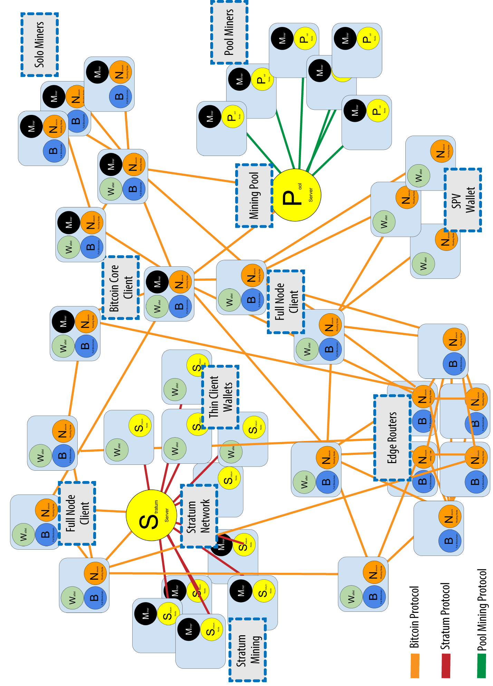
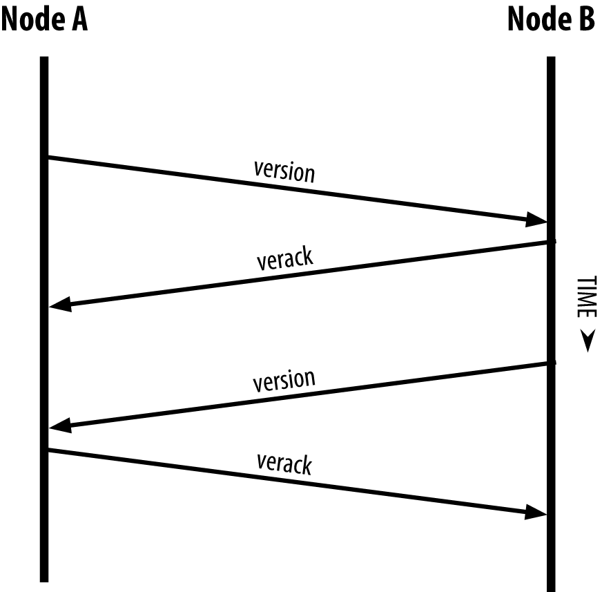
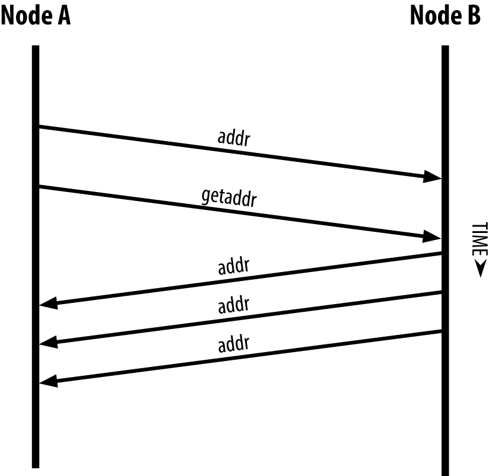
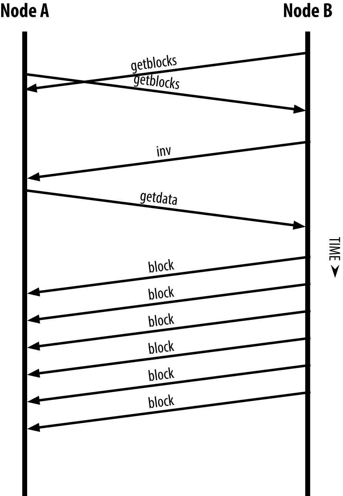
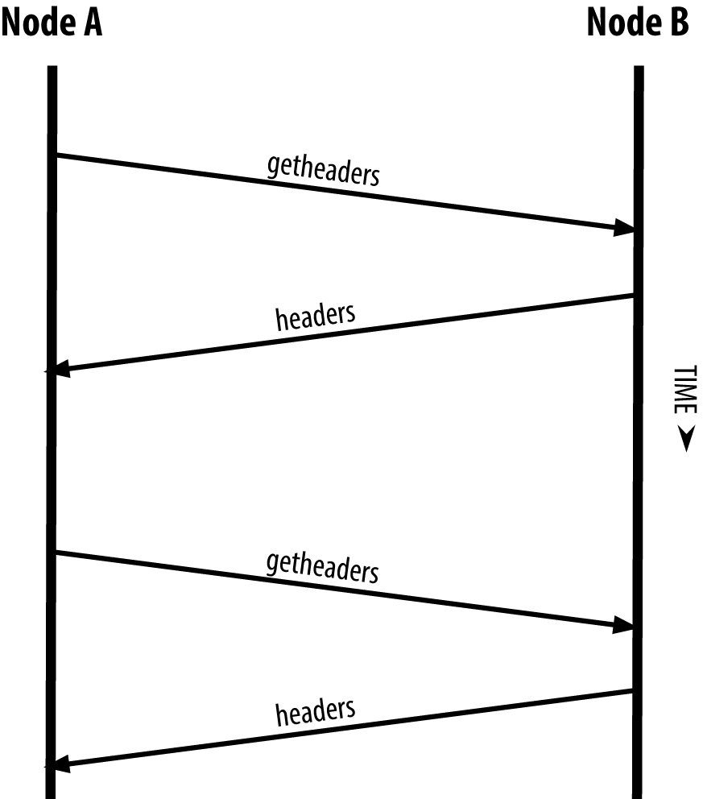
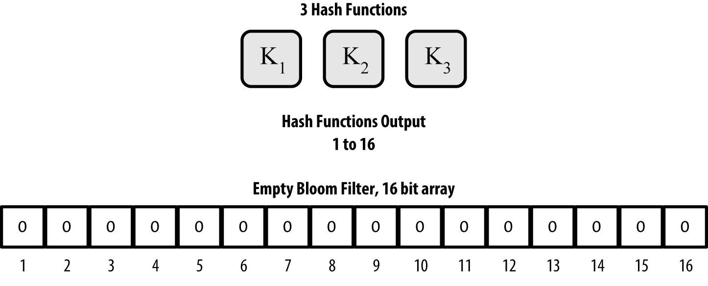
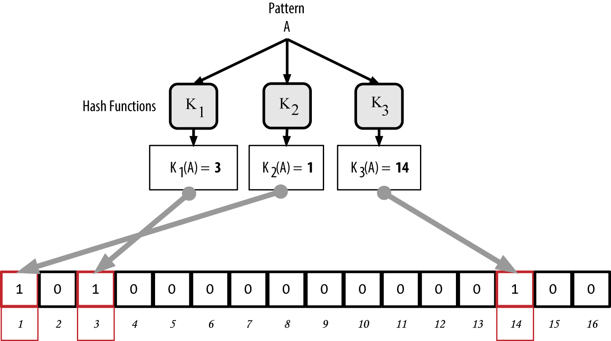
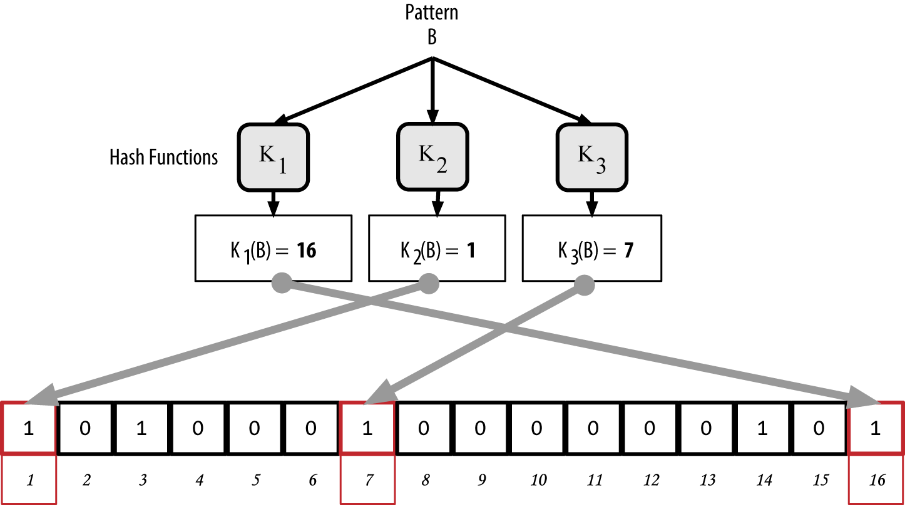
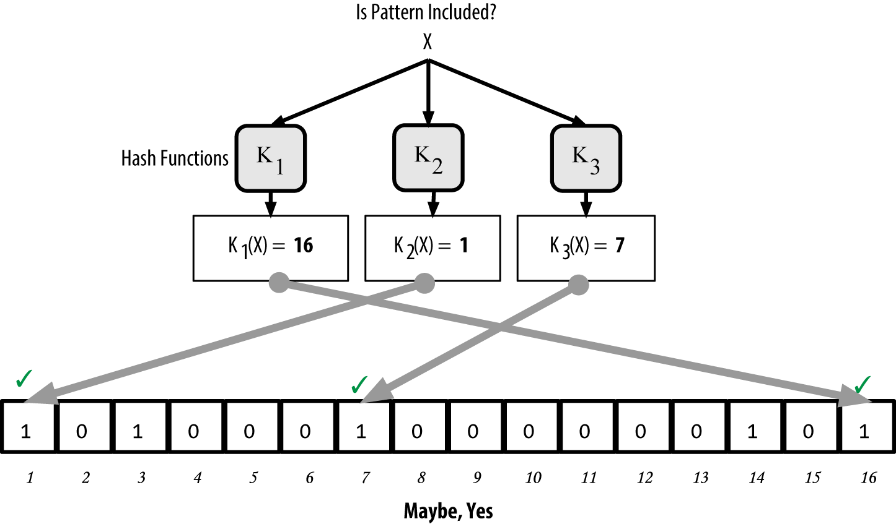

## 比特币网络


### 点对点网络架构

比特币是构建在互联网之上的点对点网络体系结构。术语点对点（P2P）意味着参与网络的计算机是彼此对等的，它们都是平等的，没有“特殊”节点，并且所有节点都分摊提供网络服务的负担。网络节点以“扁平”拓扑互连在网状网络中。网络中没有中央服务器，没有集中化服务，也没有层次结构。 P2P网络中的节点同时提供和消费服务，彼此互惠。P2P网络具有天然的弹性，去中心性和开放性。P2P网络架构的一个卓越例子就是早期的互联网本身，IP网络上的节点是平等的。如今，互联网结构更有层次，但互联网协议仍然保留了其扁平拓扑的本质。除比特币之外，P2P技术最大最成功的应用是文件共享，Napster为先锋，BitTorrent是该架构的最新演变。

比特币的P2P网络架构不只是一种拓扑选择。比特币是一种P2P设计的数字现金系统，网络架构既是该核心特征的反映，也是其基础。控制权的去中心化是一个核心设计原则，只能通过一个扁平的，去中心化的P2P共识网络来实现和维护。

术语“比特币网络”是指运行比特币P2P协议的节点的集合。除比特币P2P协议外，还有其他一些协议，如Stratum，用于采矿和轻量级或移动钱包。这些附加协议由网关路由服务器提供，网关路由服务器使用比特币P2P协议访问比特币网络，然后将该网络扩展到运行其他协议的节点。例如，Stratum服务器通过Stratum协议将Stratum挖矿节点连接到比特币主网，并将Stratum协议连接到比特币P2P协议。我们使用术语“扩展比特币网络”来指包括比特币P2P协议，矿池协议，Stratum协议以及连接比特币系统组件的任何其他相关协议的整体网络。

### 节点类型和角色

尽管比特币P2P网络中的节点是对等的，但根据其支持的功能不同，它们承担的角色可能不同。比特币节点是一组功能的集合：路由，区块链数据库，挖矿和钱包服务。具有全部四个功能的完整节点显示在 [A bitcoin network node with all four functions: wallet, miner, full blockchain database, and network routing](https://github.com/wjw465150/bitcoin_book_2nd/blob/master/第八章.asciidoc#full_node_reference) 中。


Figure 1. A bitcoin network node with all four functions: wallet, miner, full blockchain database, and network routing

所有节点都包含用于参与网络的路由功能，可能包含其他功能。所有节点都会验证并传播交易和区块，并发现和维护与其他节点的连接。在 [A bitcoin network node with all four functions: wallet, miner, full blockchain database, and network routing](https://github.com/wjw465150/bitcoin_book_2nd/blob/master/第八章.asciidoc#full_node_reference) 的完整节点示例中，路由功能由名为“Network Routing Node”的橙色圆圈或字母“N”表示。

一些称为完整节点的节点也保留区块链的完整和最新的副本。完整的节点可以自主和权威地验证任何交易，无需外部参考。 一些节点只维护区块链的一个子集，并使用称为 *simplified payment verification* 或SPV的方法验证交易，这些节点被称为SPV节点或轻量级节点。在图中的完整节点示例中，完整节点区块链数据库功能由称为“Full Blockchain”或字母“B”的圆圈表示。在 [The extended bitcoin network showing various node types, gateways, and protocols](https://github.com/wjw465150/bitcoin_book_2nd/blob/master/第八章.asciidoc#bitcoin_network) 中，SPV节点被绘制时没有“B”，表明它们没有完整的区块链副本。

挖矿节点通过运行专门的硬件解决Proof-of-Work算法来竞争创建新块。一些挖矿节点也是完整节点，维护区块链的完整副本，而另一些节点是加入矿池的轻量级节点，并且依赖于池服务器维护完整节点。挖矿功能在完整节点中显示为一个称为“Miner”或字母“M”的黑色圆圈。

用户钱包可能是完整节点的一部分，通常与桌面比特币客户端情况相同。越来越多的用户钱包，尤其是那些运行在资源受限设备（如智能手机）上的用户钱包是SPV节点。钱包功能在 [A bitcoin network node with all four functions: wallet, miner, full blockchain database, and network routing](https://github.com/wjw465150/bitcoin_book_2nd/blob/master/第八章.asciidoc#full_node_reference) 中显示为称为“Wallet”或字母“W”的绿色圆圈。

除了比特币P2P协议的主要节点类型外，还有运行其他协议的服务器和节点，例如专门的矿池协议和轻量级客户端访问协议。

[Different types of nodes on the extended bitcoin network](https://github.com/wjw465150/bitcoin_book_2nd/blob/master/第八章.asciidoc#node_type_ledgend) 展示了扩展比特币网络中的多数普通节点类型

### 扩展比特币网络

运行比特币P2P协议的主要比特币网络由5000到8000个运行各种版本比特币参考客户端（Bitcoin Core）的监听节点，和几百个运行比特币P2P协议的各种其他实现的节点组成，例如Bitcoin Classic ，Bitcoin Unlimited，BitcoinJ，Libbitcoin，btcd和bcoin。比特币P2P网络中的一小部分节点也是挖矿节点，在挖矿过程中竞争，验证交易并创建新区块。各种大公司通过运行基于比特币核心客户端的全节点客户端与比特币网络进行接口，具有完整的区块链副本和网络节点，但没有挖掘或钱包功能。这些节点充当网络边缘路由器，允许将各种其他服务（交易所，钱包，区块浏览器，商家支付处理）其上构建。

扩展比特币网络包括运行比特币P2P协议的网络，以及运行特殊协议的节点。连接到主比特币P2P网络的是许多矿池服务器和连接运行其他协议的节点的协议网关。这些其他协议节点主要是矿池节点（ 请参阅 [[mining\]](https://github.com/wjw465150/bitcoin_book_2nd/blob/master/第八章.asciidoc#mining) ）和轻量级钱包客户端，它们不包含区块链的完整副本。

[The extended bitcoin network showing various node types, gateways, and protocols](https://github.com/wjw465150/bitcoin_book_2nd/blob/master/第八章.asciidoc#bitcoin_network) 显示了扩展比特币网络，其中包括各种类型的节点，网关服务器，边缘路由器和钱包客户端以及它们用于彼此连接的各种协议。


Figure 2. Different types of nodes on the extended bitcoin network



Figure 3. The extended bitcoin network showing various node types, gateways, and protocols

### 比特币中继网络

虽然比特币P2P网络服务于各种节点类型的普遍需求，但它为比特币挖矿节点的特殊需求呈现出过高的网络延迟。

比特币矿工们进行时间敏感的竞争，解决工作量证明问题来扩展区块链（参见[[mining\]](https://github.com/wjw465150/bitcoin_book_2nd/blob/master/第八章.asciidoc#mining)）。参加这场比赛时，比特币矿工必须尽量缩短传播获胜区块和下一轮比赛开始之间的时间。在采矿中，网络延迟与利润空间直接相关。

比特币中继网络 *Bitcoin Relay Network* 是旨在尽量减少矿工之间区块传输延迟的网络。最初的 [Bitcoin Relay Network](http://www.bitcoinrelaynetwork.org/) 由核心开发者 Matt Corallo 在 2015 年创建，使矿工之间以极小的延迟快速同步区块。该网络由几个专门的节点组成，这些节点位于世界各地的亚马逊网络服务基础设施上，用于连接大多数矿工和矿池。

最初的比特币中继网络在2016年被 *Fast Internet Bitcoin Relay Engine*（[http://bitcoinfibre.org](http://bitcoinfibre.org/) [*FIBRE*]）替代，这也是由核心开发人员Matt Corallo创建的。FIBER是一个基于UDP的中继网络，用于中继节点网络中的块。FIBER实现了 *紧凑的区块* *compact block* 优化以进一步减少传输的数据量和网络延迟。

另一个中继网络（仍处于提案阶段）是http://www.falcon-net.org/about[*Falcon*]，是基于康奈尔大学的研究的。 Falcon使用“直通式路由”（cut-through-routing）而不是“存储转发”(store-and-forward)来减少等待时间，方法是传输部分数据块，而不是等待接收完整数据块。

中继网络并不是比特币P2P网络的替代品。相反，它们是覆盖网络，为具有特殊需求的节点之间提供附加连接。像高速公路不是农村公路的替代品，而是交通繁忙的两个点之间的捷径，你仍然需要小路连接到高速公路。

### 网络发现

当新节点启动时，它必须发现网络上的其他比特币节点才能加入。要启动此过程，新节点必须发现网络上至少一个现有节点并连接到该节点。地理位置不重要，比特币网络拓扑结构没有地理上的定义。因此，任何现有的比特币节点都可以被随机选择。

要连接到一个已知的节点，节点建立一个TCP连接，通常连接到端口8333（比特币通常使用的端口），或者提供一个替代端口。在建立连接后，节点将通过发送包含基本标识信息的 版本( version )消息开始“握手”（请参见 [The initial handshake between peers](https://github.com/wjw465150/bitcoin_book_2nd/blob/master/第八章.asciidoc#network_handshake)），其中包括：

- **nVersion**

  客户端使用的比特币P2P协议版本（例如, 70002）

- **nLocalServices**

  一个本节点支持的本地服务列表，现在只是 NODE_NETWORK

- **nTime**

  当前时间

- **addrYou**

  远程节点的IP地址

- **addrMe**

  本地节点的IP地址

- **subver**

  体现在此节点上运行的软件类型的子版本 (例如, `/Satoshi:0.9.2.1/`)

- **BestHeight**

  本节点的区块链的区块高度

(查看 [GitHub](http://bit.ly/1qlsC7w) 上的 version 网络消息示例。)

version 消息通常是节点发送给另一个对等节点的第一条消息。接收到 version 消息的本地节点将检查远程节点报告的 nVersion 然后决定是否兼容远程节点。如果是兼容的，本地节点将认可 version 消息并通过 verack 消息建立链接。

新节点如何查找对等节点？第一种方法是使用许多“DNS种子”来查询DNS，这些DNS服务器提供比特币节点的IP地址列表。其中一些DNS种子提供稳定的比特币侦听节点的IP地址的静态列表。一些DNS种子是BIND (Berkeley Internet Name守护进程)的自定义实现，它从一个爬虫或一个长时间运行的比特币节点收集的比特币节点地址列表中返回一个随机子集。比特币核心客户端包含五个不同DNS种子的名称。不同DNS种子的所有权和实现的多样性为初始引导过程提供了高度的可靠性。在Bitcoin Core客户端中，使用DNS种子的选项由选项开关 -dnsseed （默认设置为1，以使用DNS种子）控制。

或者，一个对网络一无所知的启动节点必须被给予至少一个比特币节点的IP地址，之后它可以通过进一步的介绍建立连接。命令行参数 -seednode 可以用于连接到一个节点，只是为了将其作为种子使用。在使用初始种子节点进行介绍之后，客户端将与其断开并使用新发现的对等节点。



Figure 4. The initial handshake between peers

一旦建立了一个或多个连接，新节点将向其邻居发送一个包含自己IP地址的 addr 消息。邻居将依次将 addr 消息转发给它们的邻居，以确保新连接的节点变得众所周知并且更好地连接。另外，新连接的节点可以向邻居发送 getaddr，要求他们返回其他对等节点的IP地址列表。这样，一个节点能找到可以连接的对等节点，并在网络上通告其存在以供其他节点找到它。 [Address propagation and discovery](https://github.com/wjw465150/bitcoin_book_2nd/blob/master/第八章.asciidoc#address_propagation) 展示了地址发现协议。



Figure 5. Address propagation and discovery

一个节点必须连接到几个不同的对等节点，以便建立到比特币网络的不同路径。路径不是可靠的 -节点随时可以加入或离开- 所以节点必须在丢失旧链接时持续发现新节点，并在启动时帮助（通知）其他节点。启动时只需要一个连接，因为第一个节点可以向他的对等节点介绍本节点，这些节点又可以提供进一步的介绍。连接到过多的节点也是不必要和浪费网络资源的。启动之后，节点将记住其最近成功的对等连接，如果重新启动，它可以快速重新建立与其以前的对等网络的连接。如果以前的对等节点都没有响应其连接请求，则该节点可以使用种子节点重新引导。

在运行Bitcoin Core客户端的节点上，你可以使用命令 getpeerinfo 列出对等连接：

```
$ bitcoin-cli getpeerinfo
```

```json
[
    {
        "addr" : "85.213.199.39:8333",
        "services" : "00000001",
        "lastsend" : 1405634126,
        "lastrecv" : 1405634127,
        "bytessent" : 23487651,
        "bytesrecv" : 138679099,
        "conntime" : 1405021768,
        "pingtime" : 0.00000000,
        "version" : 70002,
        "subver" : "/Satoshi:0.9.2.1/",
        "inbound" : false,
        "startingheight" : 310131,
        "banscore" : 0,
        "syncnode" : true
    },
    {
        "addr" : "58.23.244.20:8333",
        "services" : "00000001",
        "lastsend" : 1405634127,
        "lastrecv" : 1405634124,
        "bytessent" : 4460918,
        "bytesrecv" : 8903575,
        "conntime" : 1405559628,
        "pingtime" : 0.00000000,
        "version" : 70001,
        "subver" : "/Satoshi:0.8.6/",
        "inbound" : false,
        "startingheight" : 311074,
        "banscore" : 0,
        "syncnode" : false
    }
]
```

要覆盖对等节点的自动管理并指定IP地址列表，用户可以提供选项 -connect = <IPAddress> 指定一个或多个IP地址。如果使用此选项，节点将只连接到选定的IP地址，而不是自动发现和维护对等连接。

如果连接上没有流量，节点将定期发送消息来维护连接。如果一个节点在连接上超过90分钟没有进行通信，则认为它断开连接并寻找新的对等节点。因此，网络可以动态适应瞬态节点和网络问题，并且可以根据需要进行有机增长和收缩，而无需任何中央控制。

### 完整节点

完整的节点是维护所有交易完整区块链的节点。更准确地说，应该是“完整区块链节点”。在比特币早期，所有节点都是完整节点，目前Bitcoin Core客户端是完整区块链节点。然而，在过去的两年里，产生了不能维护完整区块链的新的比特币客户端，以轻量级客户端运行。我们将在下一节详细介绍这些内容。

完整区块链节点保存完整和最新的，包含所有交易的比特币区块链副本，它们独立构建和验证，从第一个区块（创世区块）开始，构建到网络中最新的已知区块。完整区块链节点可独立并权威地验证任何交易，无需依赖任何其他节点或信息来源。完整区块链节点依靠网络接收有关交易的新区块的更新，然后验证并将其合并到本地区块链副本中。

运行完整区块链节点为你提供纯粹的比特币体验：独立验证所有交易，无需依赖或信任任何其他系统。很容易判断你是否运行完整节点，因为它需要超过100 GB的磁盘空间来存储完整的区块链。如果你需要大量磁盘并且需要两到三天才能与网络同步，则你正在运行完整节点。这是完全独立和不依赖中央权威机构的代价。

完整区块链比特币客户端有几种可选的实现，它们使用不同的编程语言和软件体系结构构建。然而，最常见的实现方式是Bitcoin Core参考实现，也称为Satoshi客户端。比特币网络上超过75％的节点运行各种版本的比特币核心。它在 version 消息中发送的子版本字符串中被标识为“Satoshi”，如我们前面看到的那样，由命令 getpeerinfo 显示，例如，/Satoshi:0.8.6/。

### 交换“库存”

完整节点连接到对等节点之后的第一件事就是尝试构建一个完整的区块链。如果它是一个全新的节点，并且根本没有区块链，它只会知道一个区块，创世区块，这个区块是静态嵌入到客户端软件中的。从块＃0（创世区块）开始，新节点将下载数十万个区块来与网络同步并重新建立完整的区块链。

同步区块链的过程从 version 消息开始，因为它包含 BestHeight，节点当前的区块链高度（区块数）。一个节点会看到来自对等节点的 version 消息，知道它们各自拥有多少块，与它自己的区块链中的块数进行比较。对等节点将交换 getblocks 消息，其中包含本地区块链上顶部块的散列（指纹）。另一个对等节点会识别出接收到的散列不是顶部的块，而是较旧的块，由此推断其自身的本地区块链比其对等节点更长。

具有较长区块链的对等体比另一个节点具有更多的区块，并且可以识别出另一个节点需要“赶上”哪些区块。它将识别前500个块，使用 inv（库存）消息来共享和传输哈希。缺少这些块的节点将通过发出一系列 getdata 消息来请求完整块数据并使用 inv 消息中的散列标识请求的块。

例如，假设一个节点只有创世区块。然后它会收到来自对等节点的包含链中未来500个块的散列的 inv 消息。它将开始从所有连接的对等节点请求数据块，分散负载，确保它不会用请求淹没任何对等节点。该节点记录每个对等连接“正在传输”的区块数，即它已请求但未收到的块，并检查它未超过限制（ MAX_BLOCKS_IN_TRANSIT_PER_PEER ）。这样，如果需要很多块，它只会在先前的请求得到满足后才请求新块，从而使对等节点能够控制更新的速度并且不会压倒网络。每个块被接收后，将被添加到区块链中，我们将在 [[blockchain\]](https://github.com/wjw465150/bitcoin_book_2nd/blob/master/第八章.asciidoc#blockchain) 中看到。随着本地区块链逐渐建立，更多的区块被请求和接收，并且该过程继续，直到节点赶上网络的其余部分。

节点只要离线任意时间，就会将本地区块链与对等节点进行比较，并获取任何缺失的区块。无论节点离线几分钟，缺少几个块，或离线一个月，缺少几千个块，它都会首先发送 getblocks，获取 inv 响应，并开始下载缺失的块。 [Node synchronizing the blockchain by retrieving blocks from a peer](https://github.com/wjw465150/bitcoin_book_2nd/blob/master/第八章.asciidoc#inventory_synchronization) 展示了库存和区块传播协议。



Figure 6. Node synchronizing the blockchain by retrieving blocks from a peer

### 简单支付验证（SPV）

并非所有节点都有能力存储完整的区块链。许多比特币客户端被设计用于在空间和功耗受限的设备上运行，如智能手机，平板电脑或嵌入式系统。对于此类设备，使用 *simplified payment_verification*（SPV）方法可以在不存储完整区块链的情况下进行操作。这些类型的客户端称为SPV客户端或轻量级客户端。随着比特币的普及，SPV节点正成为比特币节点的最常见形式，特别是比特币钱包。

SPV节点仅下载区块头，而不下载每个块中包含的交易。由此产生的区块链，比完整区块链小1000倍。 SPV节点无法构建可用于支出的所有UTXO的完整画面，因为他们不知道网络上的所有交易。 SPV节点使用一种不同的方法验证交易，这种方法依赖对等节点按需提供区块链相关部分的部分视图。

作为一个比喻，一个完整节点就像一个配备了每条街道和每个地址的详细地图的陌生城市游客。相比之下，一个SPV节点就像是一个只知道一条主干道，随机向陌生人打听路线的陌生城市游客。尽管两位游客都可以通过访问来验证街道的存在，但没有地图的游客并不知道任何一条小街道的位置，也不知道其他街道是否存在。位于教堂街23号的前面，没有地图的旅游者无法知道该市是否有其他“教堂街23号”地址，以及这是否是正确的。没有地图的游客最好的机会是问足够多的人，并期望他们中的一些人不会殴打他。

SPV通过交易在区块链中的 *深度* 而不是 *高度* 来验证。而一个完整的区块链节点将构建一个完全验证的链，有成千上万的区块和交易，一直链接到创世区块。一个SPV节点将验证所有区块链（但不是所有交易）并将该链链接到感兴趣的交易。

例如，当检查第300,000区块中的交易时，一个将所有300,000个区块连接起来，并建立了一个完整UTXO数据库的完整节点，通过确认UTXO的未花费状态来确定交易的有效性。SPV节点无法验证UTXO是否已花费。相反，SPV节点将使用 *merkle path*（参见 [[merkle_trees\]](https://github.com/wjw465150/bitcoin_book_2nd/blob/master/第八章.asciidoc#merkle_trees) ）在交易和包含它的块之间建立链接。然后，SPV节点等待，直到它看到在包含该交易的块的顶部的六个块300,001至300,006，并通过在块300,006至300,001之下建立的深度来验证它。事实上，网络上的其他节点接受了300,000块，做了必要的工作，并在其上生成了六块以上的块，这代理地（间接地）证明交易不是双重花费的事实。

当交易实际上不存在时，不能说服SPV节点在区块中存在交易。 SPV节点通过请求merkle路径证明，并验证区块链中的工作量证明，来建立交易存在于区块中的证明。但是，交易的存在可以从SPV节点“隐藏”。 SPV节点可以明确证明交易存在，但无法验证交易（例如同一个UTXO的双重花费）不存在，因为它没有所有交易的记录。此漏洞可用于拒绝服务攻击或针对SPV节点的双重支出攻击。为了防止这种情况发生，SPV节点需要随机地连接到多个节点，以增加与至少一个诚实节点接触的概率。这种随机连接的需要意味着SPV节点也容易遭受网络分区攻击或Sybil攻击，即它们连接到了假节点或假网络，并且无法访问诚实节点或真正的比特币网络。

对于大多数实际的目的，连接良好的SPV节点足够安全，在资源需求、实用性和安全性之间取得平衡。然而，对于绝对可靠的安全性，没有什么比运行一个完整的区块链节点更好。

------
>   一个完整的区块链节点通过检查其下数千个区块来验证交易，以确保UTXO没有被消耗，而SPV节点则检查块在其上方的几个块中埋藏的深度。 
------

要获取区块头，SPV节点使用 getheaders 消息而不是 getblocks。响应端会使用一个 header 消息发送至多2000个区块头。该过程与完整节点用于检索完整块的过程相同。 SPV节点还在与对等节点的连接上设置过滤器，以过滤由对等节点发送的未来的区块和交易。任何感兴趣的交易都使用 getdata 请求来检索。对等节点生成一个包含交易的 tx 消息，作为响应。 [SPV node synchronizing the block headers](https://github.com/wjw465150/bitcoin_book_2nd/blob/master/第八章.asciidoc#spv_synchronization) 展示了区块头的同步。

由于SPV节点需要检索特定交易以选择性地验证它们，因此它们也会产生隐私风险。与收集每个区块内所有交易的完整区块链节点不同，SPV节点对特定数据的请求可能会无意中泄露其钱包中的地址。例如，监控网络的第三方可以跟踪SPV节点上的钱包所请求的所有交易，并使用它们将比特币地址与该钱包的用户相关联，从而破坏用户的隐私。



Figure 7. SPV node synchronizing the block headers

在引入SPV/轻量级节点后不久，比特币开发人员添加了一项名为 *布隆过滤器* *布隆_filters* 的功能，以解决SPV节点的隐私风险。布隆过滤器允许SPV节点通过使用概率而不是固定模式的过滤机制来接收交易子集，从而无需精确地揭示他们感兴趣的地址。

### 布隆过滤器 布隆 Filters

布隆过滤器是一种概率搜索过滤器，它是一种不必精确地描述所需模式的方法。布隆过滤器提供了一种有效的方式来表达搜索模式，同时保护隐私。它们被SPV节点用来向他们的对等节点询问符合特定模式的交易，而不会准确揭示他们正在搜索的地址，密钥或交易。

在我们以前的比喻中，一个没有地图的游客正在询问指向特定地址的路线，“23 Church St.”如果她向陌生人询问这条街的路线，她会无意中透露她的目的地。布隆过滤器就像是问：“这个街区有什么街道名称以R-C-H结尾？”像这样的问题揭露的目的地信息要少一些。使用这种技术，游客可以更详细地指定希望的地址，例如“以U-R-C-H结尾”或更少的细节，如“以H结尾”。通过改变搜索的精确度，游客可以显示或多或少的信息，代价是获得或多或少的具体结果。如果她提出一个不太具体的模式，她会得到更多可能的地址和更好的隐私，但是许多结果都是无关紧要的。如果她要求一个非常具体的模式，她会得到较少的结果，但会失去隐私。

布隆过滤器通过允许SPV节点指定精度或隐私程度可调整的交易搜索模式来支持此功能。更具体的布隆过滤器将产生准确的结果，但是以暴露SPV节点感兴趣的模式为代价，从而揭示用户钱包拥有的地址。一个不太具体的布隆过滤器将产生更多关于更多交易的数据，许多数据与节点无关，但将使节点保持更好的隐私。

#### 布隆过滤器如何工作

布隆过滤器被实现为具有N个二进制数字（比特位）的可变大小数组，和可变数量的M个哈希函数的。哈希函数被设计为始终产生1到N之间的输出，对应于二进制数字的数组。哈希函数是确定性地生成的，以便任何实现布隆过滤器的节点将总是使用相同的哈希函数，并且针对特定输入获得相同的结果。通过选择不同长度（N）布隆过滤器和不同数量（M）的散列函数，可以调整布隆过滤器，从而改变准确性水平和隐私。

在 [An example of a simplistic 布隆 filter, with a 16-bit field and three hash functions](https://github.com/wjw465150/bitcoin_book_2nd/blob/master/第八章.asciidoc#布隆1) 中, 我们使用非常小的16位数组和三个散列函数来演示布隆过滤器如何工作。



Figure 8. An example of a simplistic 布隆 filter, with a 16-bit field and three hash functions

布隆过滤器将位数组全部初始化为零。要将模式添加到布隆过滤器，依次由每个哈希函数散列。将第一个散列函数应用于输入会产生一个介于1和N之间的数字。找到数组中的相应位（从1到N编号）并设置为 1 ，从而记录散列函数的输出。然后，下一个哈希函数被用来设置另一个位等等。应用了所有M个散列函数之后，搜索模式将在布隆过滤器中被“记录”为从 0 变为 1 的M个位。

[Adding a pattern "A" to our simple 布隆 filter](https://github.com/wjw465150/bitcoin_book_2nd/blob/master/第八章.asciidoc#布隆2) 是向 [An example of a simplistic 布隆 filter, with a 16-bit field and three hash functions](https://github.com/wjw465150/bitcoin_book_2nd/blob/master/第八章.asciidoc#布隆1) 中所示的简单布隆过滤器添加模式“A”的示例。

添加第二个模式与重复此过程一样简单。该模式依次由每个散列函数进行散列，并通过对应的位设置为 1 来记录结果。请注意，由于布隆过滤器填充了更多模式，因此散列函数结果可能与已设置为 1 的位重合，在这种情况下该位不会更改。本质上，随着更多模式记录重叠位，布隆过滤器开始变得饱和，更多位设置为 1 ，滤波器的准确性降低。这就是为什么过滤器是一个概率数据结构 —— 随着更多模式的添加，它变得不太准确。精确度取决于所添加的模式的数量与位阵列（N）的大小和散列函数（M）的数量。更大的位阵列和更多的散列函数可以以更高的准确度记录更多的模式。较小的位阵列或更少的散列函数将记录较少的模式并产生较低的准确性。



Figure 9. Adding a pattern "A" to our simple 布隆 filter

[Adding a second pattern "B" to our simple 布隆 filter](https://github.com/wjw465150/bitcoin_book_2nd/blob/master/第八章.asciidoc#布隆3) 是向简单布隆过滤器添加第二个模式“B”的示例。



Figure 10. Adding a second pattern "B" to our simple 布隆 filter

为了测试一个模式是否是布隆过滤器的一部分，使用每个哈希函数对模式进行哈希处理，并根据比特数组测试最终的位模式。如果由散列函数索引的所有位被设置为 1，则该模式 *可能* 在布隆过滤器中记录。因为这些比特可能因为多重模式的重叠而被设置，所以答案不确定，而是相当可能的。简而言之，布隆 Filter正面匹配是“可能是”。

[Testing the existence of pattern "X" in the 布隆 filter. The result is a probabilistic positive match, meaning "Maybe."](https://github.com/wjw465150/bitcoin_book_2nd/blob/master/第八章.asciidoc#布隆4) 是在简单布隆过滤器中测试模式“X”的存在的示例。相应的位被设置为 1 ，所以模式可能是匹配的。



Figure 11. Testing the existence of pattern "X" in the 布隆 filter. The result is a probabilistic positive match, meaning "Maybe."

相反，如果模式针对布隆过滤器进行测试，并且任意一个比特设置为 0 ，则这证明该模式没有记录在布隆过滤器中。否定的结果不是概率，而是肯定的。简而言之，布隆过滤器上的负面匹配是“绝对不是！”

[Testing the existence of pattern "Y" in the 布隆 filter. The result is a definitive negative match, meaning "Definitely Not!"](https://github.com/wjw465150/bitcoin_book_2nd/blob/master/第八章.asciidoc#布隆5) 是在简单布隆过滤器中测试模式“Y”的存在的一个例子。其中一个相应的位设置为 0，因此该模式绝对不匹配。


Figure 12. Testing the existence of pattern "Y" in the 布隆 filter. The result is a definitive negative match, meaning "Definitely Not!"

### SPV节点如何使用布隆过滤器

布隆过滤器用于过滤SPV节点从其对等节点接收的交易（以及包含它们的块），仅选择SPV节点感兴趣的交易而不透露其感兴趣的地址或密钥。

SPV节点会将布隆过滤器初始化为“空”；在该状态下，布隆过滤器将不匹配任何模式。然后，SPV节点将列出它感兴趣的所有地址，密钥和散列。它将通过从其钱包控制的任何UTXO中提取公共密钥散列和脚本散列和交易ID来完成此操作。 然后，SPV节点将这些模式中的每一个添加到布隆过滤器，如果这些模式存在于交易中，布隆过滤器将“匹配”，而不显示模式本身。

SPV节点将向对等节点发送 filterload 消息，其中包含要在连接上使用的布隆过滤器。在对等节点中，布隆过滤器将针对每个传入交易进行检查。完整节点根据布隆过滤器检查交易的多个部分，查找包含以下内容的匹配项：

- 交易ID
- 交易的每个输出（脚本中的每个密钥和散列）的锁定脚本数据部分
- 每个交易输入
- 每个输入签名数据部分（或见证脚本）

通过检查所有这些组件，布隆过滤器可用于匹配公钥哈希，脚本，OP_RETURN 值，签名中的公钥或智能合约或复杂脚本的任何未来组件。

在建立过滤器后，对等节点将用布隆过滤器测试每个交易的输出。只有匹配过滤器的交易才会发送到节点。

为响应来自节点的 getdata 消息，对等节点将发送 merkleblock 消息，其中每个匹配交易仅包含与过滤器和merkle路径匹配的区块的头部（请参见 [[merkle_trees\]](https://github.com/wjw465150/bitcoin_book_2nd/blob/master/第八章.asciidoc#merkle_trees) ）。对等节点随后还会发送包含由过滤器匹配的交易的 tx 消息。

当完整节点向SPV节点发送交易时，SPV节点丢弃所有误报，并使用正确匹配的交易更新其UTXO集和钱包余额。当它更新自己的UTXO集合时，它也修改布隆过滤器以匹配任何引用它刚刚找到的UTXO的未来交易。完整的节点然后使用新的布隆过滤器来匹配新的交易并重复整个过程。

通过发送 filteradd 消息，设置布隆过滤器的节点可以交互式地向过滤器添加模式。要清空布隆过滤器，节点可以发送 filterclear 消息。由于无法从布隆过滤器中删除模式，因此如果不再需要模式，节点必须清空并重新发送新的布隆过滤器。

SPV节点的网络协议和布隆过滤器机制在 [BIP-37 (Peer Services)](http://bit.ly/1x6qCiO) 中定义。

### SPV节点和隐私

实现SPV的节点比完整节点的隐私性更弱。一个完整节点接收所有交易，因此不会显示它是否在钱包中使用某个地址。 SPV节点接收与其钱包中的地址相关的过滤列表。因此，它降低了所有者的隐私。

布隆过滤器是一种减少隐私损失的方法。没有它们，SPV节点将不得不明确列出它感兴趣的地址，从而严重暴露隐私。然而，即使使用布隆过滤器，监控SPV客户端的流量或直接作为P2P网络中的节点连接到它的对等节点，也可以收集足够的信息来学习SPV客户端的钱包中的地址。

### 加密和认证的连接

大多数比特币的新用户都假定比特币节点的网络通信是加密的。事实上，比特币的原始实施完全是不加密的。虽然这不是完整节点的主要隐私问题，但对于SPV节点来说是一个大问题。

作为增加比特币P2P网络隐私和安全性的一种方法，有两种解决方案可以提供通信加密：*Tor Transport*（BIP-150） 和 *P2P认证与加密* （BIP-151）。

#### Tor传输

Tor 代表 *洋葱路由网络* *The Onion Routing network*，是一个软件项目，也是一种网络，通过具有匿名性，不可追踪性和隐私性的随机网络路径，来提供数据加密和封装。

比特币核心提供了几个配置选项，允许你运行比特币节点，通过Tor网络传输流量。此外，Bitcoin Core还可以提供Tor隐藏服务，允许其他Tor节点直接通过Tor连接到你的节点。

从Bitcoin Core 0.12开始，如果节点能够连接到本地的Tor服务，它将自动提供Tor隐藏服务。如果你安装了Tor并且Bitcoin Core进程作为具有访问Tor认证cookie权限的用户运行，则它应该自动运行。使用 debug 标志打开比特币核心的Tor服务调试，如下所示：

```
$ bitcoind --daemon --debug=tor
```

你应该在日志中看到 "tor: ADD_ONION successful"，表明Bitcoin Core已经为Tor网络添加了隐藏服务。

你可以在Bitcoin Core文档（ *docs/tor.md* ）和各种在线教程中找到关于将Bitcoin Core作为Tor隐藏服务运行的更多说明。

#### 点对点认证和加密 Peer-to-Peer Authentication and Encryption

两项比特币改进建议，BIP-150和BIP-151，增加了对比特币P2P网络中P2P认证和加密的支持。这两个BIP定义了可能由兼容的比特币节点提供的可选服务。 BIP-151为两个支持BIP-151的节点之间的所有通信启用协商加密。BIP-150提供可选的对等身份验证，允许节点使用ECDSA和私钥对彼此的身份进行身份验证。 BIP-150要求在验证之前，两个节点按照BIP-151建立了加密通信。

截至2017年1月，BIP-150和BIP-151未在Bitcoin Core中实施。这两个提案已经至少由一个名为bcoin的替代比特币客户端实施。

BIP-150和BIP-151允许用户使用加密和身份验证来运行连接到可信完整节点的SPV客户端，以保护SPV客户端的隐私。

此外，身份验证可用于创建可信的比特币节点网络并防止中间人攻击（Man-in-the-Middle attacks）。最后，如果广泛部署P2P加密，将会加强比特币对流量分析和隐私侵蚀监控的阻力，特别是在互联网使用受到严格控制和监控的极权主义国家。

标准定义在 [BIP-150 (Peer Authentication)](https://github.com/bitcoin/bips/blob/master/bip-0150.mediawiki) 和 [BIP-151 (Peer-to-Peer Communication Encryption)](https://github.com/bitcoin/bips/blob/master/bip-0151.mediawiki) 中。

### 交易池

几乎比特币网络上的每个节点都维护一个名为 *memory pool*，*mempool_或_transaction pool* 的未确认交易的临时列表。节点使用该池来跟踪网络已知但尚未包含在区块链中的交易。例如，钱包节点将使用交易池来追踪已经在网络上接收但尚未确认的到用户钱包的传入支付。

交易被接收和验证后，会被添加到交易池并被中继到相邻节点以在网络上传播。

一些节点实现还维护一个单独的孤儿交易池。如果交易的投入引用尚未知晓的交易，好像遗失了父母，那么孤儿交易将临时存储在孤儿池中，直至父交易到达。

将交易添加到交易池时，将检查孤儿交易池是否有任何引用此交易输出的孤儿（后续交易）。然后验证任何匹配的孤儿。如果有效，它们将从孤儿交易池中删除并添加到交易池中，从而完成从父交易开始的链。鉴于不再是孤儿的新增交易，该过程重复递归地寻找更多后代，直到找不到更多的后代。通过这个过程，父交易的到来触发了整个链条相互依赖的交易的级联重建，将孤儿与他们的父母重新整合在一起。

交易池和孤儿交易池都存储在本地内存中，不会保存在持久性存储上；而且，它们是从传入的网络消息动态填充的。当一个节点启动时，这两个池都是空的，并且会逐渐使用网络上收到的新交易填充。

比特币客户端的一些实现还维护UTXO数据库或池，这是区块链上所有未使用输出的集合。尽管名称“UTXO池”听起来与交易池相似，但它代表了一组不同的数据。与交易和孤儿交易池不同，UTXO池并未初始化为空，而是包含了追溯到创世区块的，数百万未使用的交易输出条目。UTXO池可以放置在本地内存中，也可以作为持久存储上的索引数据库表。

交易池和孤儿交易池代表单个节点的本地视角，根据节点启动或重新启动的时间不同，节点之间可能会有很大差异；UTXO池表示网络的自发共识，因此节点之间的差异很小。此外，交易池和孤儿交易池只包含未确认的交易，而UTXO池只包含确认的输出。


