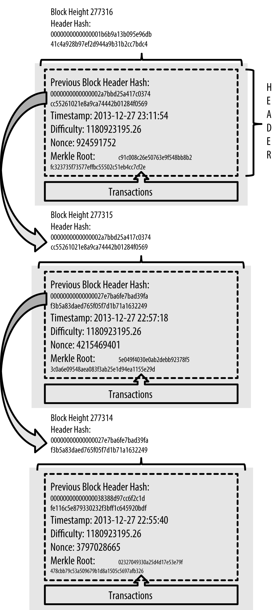
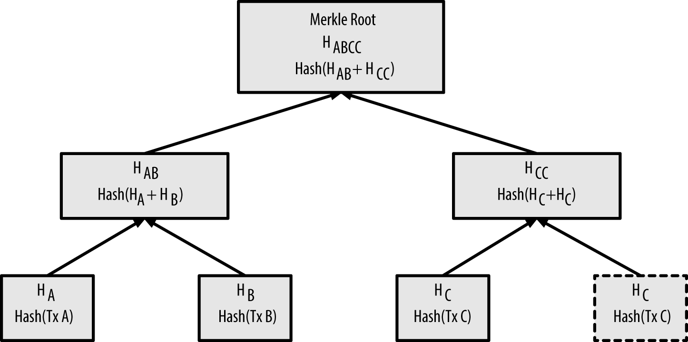
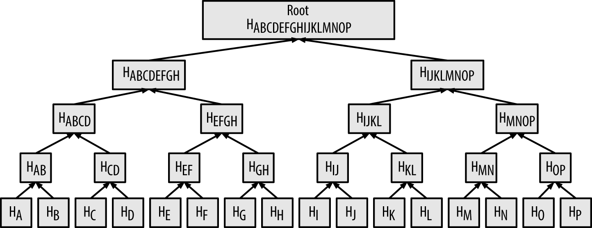
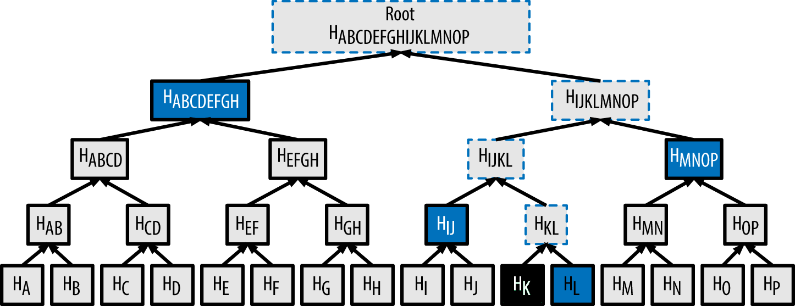

## 区块链

### 简介

区块链的数据结构是有序的，向前链接的区块和交易的列表。区块链可以存储为一个扁平的文件，或者简单的数据库。Bitcoin Core客户端使用Google的LevelDB数据库存储区块链的元数据。区块向前链接，每个区块都指向它的前一个区块。区块链经常被可视化为垂直的栈，第一个区块作为栈底，其他的依次向上堆叠。彼此堆叠的区块栈形式引出了 "height" 的术语，来代表区块与第一个区块的距离，"top" 和 "tip" 指代最新添加的区块。

区块链中的每个区块都由一个哈希值标识，在该区块头上使用SHA256加密散列算法生成。每个块还通过块头中的 "previous block hash"（上一个块的哈希值）字段引用先前的块，称为 *parent* 块。换句话说，每个块在其自己的头部中包含其父块的哈希值。哈希值序列创建了一个链，将每个块连接到其父项，一直链接到有第一个区块，称为 *创世区块* *genesis block*。

尽管一个块只有一个父块，但它可以暂时拥有多个子块。每个子块都指向相同的块作为它们的父块，并在 "previous block hash" 字段中包含相同的（父块的）散列。在区块链“分叉”期间会出现多个子块，这是一种临时情况，当不同的矿区几乎同时由不同的矿工发现时（参见 [[forks\]](https://github.com/wjw465150/bitcoin_book_2nd/blob/master/第九章.asciidoc#forks)）。最终，只有一个子块成为区块链的一部分，“fork”就解决了。一个块可能有多个子块，但每个块只有一个父块。这是因为一个块只有一个引用其单亲的 "previous block hash" 字段。

"previous block hash" 字段在区块的头部，并且影响当前区块的哈希值。如果父块的标识改变，子块的标识也会改变。当父块以某种方式改变，父块的哈希值就会改变。父块变化了的哈希值要求子块的 "previous block hash" 也必须改变，这又会引起孙子块的改变，以此类推。这种级联效应可以确保一旦一个块在其之后有许多后代，它就不能在不强制重新计算所有后续区块的情况下进行更改。由于重新计算需要大量的计算（耗费大量的能源），长链块的存在使得区块链的历史不可更改，这是比特币安全性的一个关键特征。

看待区块链的一种方式就像地质构造中的层或冰川岩芯样本。表层可能随着季节变化，甚至在沉淀之前被吹走。但是一旦深入几英寸，地质层就变得越来越稳定。当你向下看几百英尺时，你会看到几百万年来一直没有受到干扰的过去的快照。在区块链中，如果由于分叉导致链重新计算，可能会修改最近的几个区块。前六个区块就像是几英寸的表土。一旦你深入区块链超过六个区块，区块变化的可能性就越来越小。在100个区块之前，稳定性非常高，以至于可以花费coinbase交易 - 包含新开采的比特币的交易。几千个区块（一个月），对于所有实际目的来说，区块链都已成确定的历史。虽然协议总是允许一条链被一条较长的链消除，任何块被反转的可能性总是存在的，但是这种事件的可能性会随着时间流逝而减少，直到它变得无限小。

### 区块的结构

区块是一个容器数据结构，用于汇总包含在公共账本（区块链）中的交易。区块有一个包含元数据的头部，后面跟着一个长长的交易列表。区块头为80字节，平均交易至少为400字节，平均每块包含超过1900个交易。一个包含所有交易的完整块因此比块头大10,000倍。 [The structure of a block](https://github.com/wjw465150/bitcoin_book_2nd/blob/master/第九章.asciidoc#block_structure1) 描述了一个块的结构。

Table 1. The structure of a block

| Size                | Field               | Description                                           |
| ------------------- | ------------------- | ----------------------------------------------------- |
| 4 bytes             | Block Size          | The size of the block, in bytes, following this field |
| 80 bytes            | Block Header        | Several fields form the block header                  |
| 1——9 bytes (VarInt) | Transaction Counter | How many transactions follow                          |
| Variable            | Transactions        | The transactions recorded in this block               |

### 区块头

区块头由三组区块元数据组成。首先，有一个对前块哈希值的引用，它将这个区块连接到区块链中的前一个块。第二组元数据，分别为 *难度* *difficulty*，*时间戳* *timestamp* 和 *随机数* *nonce*，与挖矿竞赛有关，参见 [[mining\]](https://github.com/wjw465150/bitcoin_book_2nd/blob/master/第九章.asciidoc#mining)。第三个元数据是merkle树根，这是一种数据结构，用于有效地汇总块中的所有交易。[The structure of the block header](https://github.com/wjw465150/bitcoin_book_2nd/blob/master/第九章.asciidoc#block_header_structure_ch09) 描述了块头的结构。

Table 2. The structure of the block header

| Size     | Field               | Description                                                  |
| -------- | ------------------- | ------------------------------------------------------------ |
| 4 bytes  | Version             | A version number to track software/protocol upgrades         |
| 32 bytes | Previous Block Hash | A reference to the hash of the previous (parent) block in the chain |
| 32 bytes | Merkle Root         | A hash of the root of the merkle tree of this block’s transactions |
| 4 bytes  | Timestamp           | The approximate creation time of this block (seconds from Unix Epoch) |
| 4 bytes  | Difficulty Target   | The Proof-of-Work algorithm difficulty target for this block |
| 4 bytes  | Nonce               | A counter used for the Proof-of-Work algorithm               |

随机数，难度目标，和时间戳用于挖矿过程，在 [[mining\]](https://github.com/wjw465150/bitcoin_book_2nd/blob/master/第九章.asciidoc#mining) 中有详细介绍。

### 区块标识符：区块头的哈希值和区块高度

区块的主要标识符是它的加密哈希值，这是一种数字指纹，通过SHA256算法将块头两次散列获得。得到的32字节哈希被称为 *block hash* ，更准确地说是 *block header hash*，因为只有区块头用于计算。例如 000000000019d6689c085ae165831e934ff763ae46a2a6c172b3f1b60a8ce26f 是第一个区块的哈希值， 区块的哈希值唯一而明确地标识一个块，任何节点都可以通过简单地对块头进行散列来独立地派生它。

注意，区块的哈希值实际上并不包含在区块的数据结构中，无论是在网络上传输块时，还是作为区块链的一部分存储在节点的持久性存储时。相反，当从网络接收区块时，每个节点计算区块的哈希值。区块哈希值可以作为区块元数据的一部分存储在单独的数据库表中，以方便索引并从磁盘快速检索。

另一种识别区块的方法是它在区块链中的位置，称为 *区块高度* *block height*。第一个块位于块高度0处，与被哈希值 000000000019d6689c085ae165831e934ff763ae46a2a6c172b3f1b60a8ce26f 引用的块相同。块可以通过两种方式标识：通过引用块的哈希值或通过引用块高度。在第一个区块的“顶部”添加的每个后续区块在区块链中都在一个“更高”的位置，就像一个盒子叠在另一个上面一样。2017年1月1日的区块链高度约为44.6万，这意味着在2009年1月创建的第一个区块的顶部有446000个区块。

与区块哈希值不同，区块高度不是唯一标识符。尽管单个块总是具有特定且不变的块高度，但反过来并不正确 —— 区块高度并不总是标识一个块。两个或更多块可能具有相同的块高度，争夺区块链中的相同位置。这种情况将在 [[forks\]](https://github.com/wjw465150/bitcoin_book_2nd/blob/master/第九章.asciidoc#forks) 一节中详细讨论。块高度也不是区块的数据结构的一部分；它不存储在区块中。当从比特币网络收到区块时，每个节点都会动态识别区块在区块链中的位置（高度）。块高度也可以作为元数据存储在索引数据库表中以加快检索速度。

------
>   区块的_block hash_总是唯一标识一个块。区块也总是有一个特定的_block height_。但是，特定的区块高度并不总是能够标识单个块。相反，两块或更多块可能会在区块链中争夺一个位置。 
------

### 创世区块

区块链中的第一个区块被称为创世区块，于2009年创建。它是区块链中所有区块的共同祖先，这意味着如果你从任何区块开始，并随时间上向前追溯，最终将到达创世区块。

节点总是以至少一个区块的区块链开始，因为这个区块是在比特币客户端软件中静态编码的，因此它不能被改变。每个节点总是“知道”起始块的哈希和结构，它创建的固定时间，以及其中的单一交易。因此，每个节点都有区块链的起点，这是一个安全的“根”，从中可以构建受信任的区块链。

请参阅 [*chainparams.cpp*](http://bit.ly/1x6rcwP) 中 Bitcoin Core 客户端内的静态编码的genesis块。

以下哈希值标识符属于创世区块：

```
000000000019d6689c085ae165831e934ff763ae46a2a6c172b3f1b60a8ce26f
```

你可以在任何区块浏览器网站（例如 *blockchain.info* ）中搜索该区块哈希值，你将找到一个描述此块内容的页面，包含该哈希的URL：

https://blockchain.info/block/000000000019d6689c085ae165831e934ff763ae46a2a6c172b3f1b60a8ce26f

在命令行中使用 Bitcoin Core 客户端：

```
$ bitcoin-cli getblock
```

```json
000000000019d6689c085ae165831e934ff763ae46a2a6c172b3f1b60a8ce26f
{
    "hash" : "000000000019d6689c085ae165831e934ff763ae46a2a6c172b3f1b60a8ce26f",
    "confirmations" : 308321,
    "size" : 285,
    "height" : 0,
    "version" : 1,
    "merkleroot" : "4a5e1e4baab89f3a32518a88c31bc87f618f76673e2cc77ab2127b7afdeda33b",
    "tx" : [
        "4a5e1e4baab89f3a32518a88c31bc87f618f76673e2cc77ab2127b7afdeda33b"
    ],
    "time" : 1231006505,
    "nonce" : 2083236893,
    "bits" : "1d00ffff",
    "difficulty" : 1.00000000,
    "nextblockhash" : "00000000839a8e6886ab5951d76f411475428afc90947ee320161bbf18eb6048"
}
```

创世区块包含一个隐藏的消息。币基交易的输入包含的文字是 "The Times 03/Jan/2009 Chancellor on brink of second bailout for banks."。此消息旨在通过参考英国报纸 *The_Times* 的标题提供此区块创建的最早日期的证据。它还半开玩笑地提醒人们关注独立货币体系的重要性，比特币发行时正值前所未有的全球货币危机。比特币的创造者Satoshi Nakamoto将这个信息嵌入了第一块。

### 在区块链中链接区块

比特币完整节点保留了区块链从创世区块开始的本地副本。区块链的本地副本会随着新块被发现并用于扩展链而不断更新。当一个节点通过网络接收到区块时，它验证这些块，然后将它们链接到现有的区块链。为了建立链接，节点将检查传入的区块头并查找“previous block hash”。

例如，假设一个节点在区块链的本地副本中有277,314个区块。节点知道的最后一个块是块277,314，区块头的哈希值为：

```
00000000000000027e7ba6fe7bad39faf3b5a83daed765f05f7d1b71a1632249
```

然后，该节点从网络接收一个新的块，解析如下：

```json
{
    "size" : 43560,
    "version" : 2,
    "previousblockhash" :
        "00000000000000027e7ba6fe7bad39faf3b5a83daed765f05f7d1b71a1632249",
    "merkleroot" :
        "5e049f4030e0ab2debb92378f53c0a6e09548aea083f3ab25e1d94ea1155e29d",
    "time" : 1388185038,
    "difficulty" : 1180923195.25802612,
    "nonce" : 4215469401,
    "tx" : [
        "257e7497fb8bc68421eb2c7b699dbab234831600e7352f0d9e6522c7cf3f6c77",

 #[... many more transactions omitted ...]

        "05cfd38f6ae6aa83674cc99e4d75a1458c165b7ab84725eda41d018a09176634"
    ]
}
```

查看这个新块，找到 previousblockhash 字段，其中包含其父块的哈希值。它是节点所知道的哈希值，是位于链的277,314高度的最后一个块。因此，这个新块是链上最后一个块的孩子，并扩展了现有的区块链。该节点将此新块添加到链的末端，使区块链更长，新的高度为277,315。[Blocks linked in a chain by reference to the previous block header hash](https://github.com/wjw465150/bitcoin_book_2nd/blob/master/第九章.asciidoc#chain_of_blocks) 显示三个块的链，通过 previousblockhash 字段中的引用链接。

### 默克尔树 Merkle Trees

比特币区块链中的每个区块都包含一个 *merkle tree* ，作为所有交易的汇总。

*默克尔树* *merkle tree*, 也叫做 *二叉哈希树* *binary hash tree*, 是一种用于有效汇总和验证大型数据集的完整性的数据结构。 Merkle树是包含加密哈希的二叉树。术语“树”在计算机科学中被用来描述分支的数据结构，但是这些树通常是颠倒显示的，“根”在顶部，“叶子”在底部，你将在下面的例子中看到。



Figure 1. Blocks linked in a chain by reference to the previous block header hash

比特币中使用Merkle树来汇总区块中的所有交易，为整个交易集提供全面的数字指纹，提供了一个非常有效的流程来验证交易是否包含在区块中。 Merkle树是通过对节点对儿（pairs of nodes）进行递归散列构造的，直到只有一个散列，称为 *root* 或 *merkle root*。比特币的merkle树中使用的加密哈希算法是将SHA256应用两次，也称为double-SHA256。

当N个数据元素被散列并汇总到一个Merkle树中时，你可以检查树中是否包含任何一个数据元素，并且最多只需 2*log2~(N) 次计算，因此这是一个非常有效的数据结构。

Merkle树是自下而上构建的。在下面的例子中，我们从四个交易开始，A，B，C和D，它们构成了merkle树的 *叶子* *leaves*，如 [Calculating the nodes in a merkle tree](https://github.com/wjw465150/bitcoin_book_2nd/blob/master/第九章.asciidoc#simple_merkle) 所示。交易不存储在merkle树中；相反，它们的数据被散列并且所得到的哈希值被存储在每个叶节点中，如 HA，HB，HC 和 HD：

```
HA = SHA256(SHA256(Transaction A))
```

然后将连续的叶节点对汇总到父节点中，方法是连接两个哈希值并对它们进行散列。例如，要构造父节点 HAB，将子节点的两个32字节哈希值连接起来，以创建一个64字节的字符串。然后对该字符串进行双重散列来产生父节点的哈希值：

```
HAB = SHA256(SHA256(HA + HB))
```

继续该过程，直到顶部只有一个节点，该节点被称为merkle根。该32字节哈希值存储在区块头中，汇总了四个交易中的所有数据。[Calculating the nodes in a merkle tree](https://github.com/wjw465150/bitcoin_book_2nd/blob/master/第九章.asciidoc#simple_merkle) 展示了如何通过节点的成对散列来计算根。


Figure 2. Calculating the nodes in a merkle tree

由于merkle树是二叉树，它需要偶数个叶节点。如果要汇总的交易数量为奇数，则最后一个交易的哈希值将被复制以创建偶数个叶节点，这称为 *平衡的树* *balanced tree*。在 << merkle_tree_odd>> 中，交易C被复制。



Figure 3. Duplicating one data element achieves an even number of data elements

使用四个交易构造树的方法可以推广到构造任意大小的树。在比特币中，通常在一个块中有几百到几千个交易，这些交易的汇总方式完全相同，仅产生单个Merkle根的32个字节的数据。在 [A merkle tree summarizing many data elements](https://github.com/wjw465150/bitcoin_book_2nd/blob/master/第九章.asciidoc#merkle_tree_large) 中，你将看到一棵由16个交易构成的树。请注意，尽管根看起来比图中的叶节点大，但它的大小完全相同，只有32个字节。无论块中是否有一个交易或十万个交易，merkle根总是将它们总结为32个字节。

为了证明一个块中包含一个特定的交易，一个节点只需要产生 log2~(N) 个32个字节的哈希值，构成一个认证 *path* 或 *merkle_path*，将特定的交易连接到树的根。随着交易数量的增加，这一点尤为重要，因为交易数量的基数为2的对数增长速度要慢得多。这使得比特币节点能够高效地生成10或12个哈希值（320-384字节）的路径，这可以提供兆字节大小的块中超过一千个交易中的单个交易的验证。



Figure 4. A merkle tree summarizing many data elements

在 [A merkle path used to prove inclusion of a data element](https://github.com/wjw465150/bitcoin_book_2nd/blob/master/第九章.asciidoc#merkle_tree_path) 中，节点可以通过产生只有四个32字节哈希长（总共128字节）的merkle路径来证明交易K包含在该块中。该路径由四个哈希值组成（ 在 << merkle_tree_path>> 带蓝色背景的 ），HL，HIJ，HMNOP 和 HABCDEFGH。通过提供这四个哈希值作为验证路径，任何节点都可以通过计算四个额外的哈希值来证明 HK（底部黑色背景的）包含在Merkle根中：HKL，HIJKL，HIJKLMNOP 和merkle树根（在图中用虚线表示）。



Figure 5. A merkle path used to prove inclusion of a data element

[Building a merkle tree](https://github.com/wjw465150/bitcoin_book_2nd/blob/master/第九章.asciidoc#merkle_example) 中的代码演示了如何使用libbitcoin的一些辅助函数，创建从叶节点哈希值一直到根的Merkle树。

Example 1. Building a merkle tree

```
link:code/merkle.cpp[]
```

[Compiling and running the merkle example code](https://github.com/wjw465150/bitcoin_book_2nd/blob/master/第九章.asciidoc#merkle_example_run) 展示了编译和运行结果

Example 2. Compiling and running the merkle example code

```
$ # Compile the merkle.cpp code
$ g++ -o merkle merkle.cpp $(pkg-config --cflags --libs libbitcoin)
$ # Run the merkle executable
$ ./merkle
Current merkle hash list:
  32650049a0418e4380db0af81788635d8b65424d397170b8499cdc28c4d27006
  30861db96905c8dc8b99398ca1cd5bd5b84ac3264a4e1b3e65afa1bcee7540c4

Current merkle hash list:
  d47780c084bad3830bcdaf6eace035e4c6cbf646d103795d22104fb105014ba3

Result: d47780c084bad3830bcdaf6eace035e4c6cbf646d103795d22104fb105014ba3
```

随着规模的增加，梅克尔树的效率变得越来越明显。 [Merkle tree efficiency](https://github.com/wjw465150/bitcoin_book_2nd/blob/master/第九章.asciidoc#block_structure2) 展示了证明交易是区块的一部分锁需要的作为merkle路径交换的数据量。

Table 3. Merkle tree efficiency

| Number of transactions | Approx. size of block | Path size (hashes) | Path size (bytes) |
| ---------------------- | --------------------- | ------------------ | ----------------- |
| 16 transactions        | 4 kilobytes           | 4 hashes           | 128 bytes         |
| 512 transactions       | 128 kilobytes         | 9 hashes           | 288 bytes         |
| 2048 transactions      | 512 kilobytes         | 11 hashes          | 352 bytes         |
| 65,535 transactions    | 16 megabytes          | 16 hashes          | 512 bytes         |

从表中可以看出，区块大小从16个交易的4KB快速增加到65,535个交易的16MB，证明交易存在所需的Merkle路径则增加得很慢，从128字节到只有512字节。使用merkle树，节点可以只下载区块头（每块80个字节），并且仍然能够通过从完整节点检索小型merkle路径来证实交易包含在区块中，而不存储或传输绝大量的（可能几个GB）区块链数据。不维护完整区块链的节点称为简单支付验证（SPV）节点，它使用merkle路径验证交易而无需下载完整区块。

### Merkle 树和简单支付验证节点

Merkle树被SPV节点广泛使用。 SPV节点没有全部交易，并且不下载完整的块，只有区块头。为了验证块中包含交易，而不必下载块中的所有交易，它们使用验证路径（merkle路径）。

例如，考虑一个SPV节点，它对付款到它的钱包中地址的交易感兴趣。SPV节点将在其与对等节点的连接上建立一个布隆过滤器（参见 [[bloom_filters\]](https://github.com/wjw465150/bitcoin_book_2nd/blob/master/第九章.asciidoc#bloom_filters) ），将接收到的交易限制为那些只包含其感兴趣地址的交易。当对等节点看到与bloom过滤器匹配的交易时，它将使用 merkleblock 消息发送该块。merkleblock 消息包含区块的头，以及将感兴趣的交易链接到区块中的merkle根的merkle路径。SPV节点可以使用此Merkle路径将交易连接到区块并验证交易是否包含在块中。 SPV节点还使用区块头将区块链接到区块链的其余部分。交易和区块之间以及区块和区块链之间的这两个链接的组合证明交易记录在区块链中。总而言之，SPV节点将接收到少于一千字节的数据块头和merkle路径，其数据量比完整块（当前大约1兆字节）少一千倍以上。

### 比特币的测试区块链

你可能会惊讶地发现有多个比特币区块链。 2009年1月3日由中本聪创建的“主”比特币区块链，带有我们本章研究的创世区块，被称为 *主网* *mainnet*。还有其他用于测试的比特币区块链，现在有：*testnet*，*segnet* 和 *regtest*。让我们依次看下。

#### 测试网络 —— 比特币的测试场

Testnet是用于测试目的的测试区块链，网络和货币的名称。测试网是一个全功能的活跃P2P网络，包括钱包，测试比特币（testnet硬币），挖矿以及 mainnet 的所有其他功能。实际上只有两个区别：测试网点的硬币价值很低，挖矿难度应该足够低，以便任何人都可以相对容易地开采测试网硬币。

任何拟用于比特币主网生产的软件开发应首先使用测试币在测试网上进行测试。这可以保护开发人员免受由于错误导致的资金损失，并保护网络免受由于错误导致的意外行为。

然而，保持硬币毫无价值并且容易挖掘，并不容易。尽管开发者提出了要求，但有些人使用高级采矿设备（GPU和ASIC）在测试网上进行挖掘，增加了难度，使得不可能用CPU进行挖掘，最终使其难以获得，人们开始评估它们的价值，因此它们也不是毫无价值的。因此，现在或者之后，测试网必须被废弃并从新的创世区块重新启动，重新设置难度。

当前的测试网成为 *testnet3*，第三代 testnet，2011年2月重启，重置了前一代测试网的难度。

请记住，testnet3是一个大型的区块链，2017年初超过了20GB。耗尽计算机资源完全同步需要一天左右的时间。不如mainnet大，但也不是“轻量级”的。运行测试网络节点的一个好的方法是作为专用于此目的的虚拟机映像（例如，VirtualBox，Docker，云服务器等）。

##### 使用测试网

像几乎所有其他比特币软件一样，Bitcoin Core完全支持在testnet而不是mainnet上运行。比特币核心的所有功能都在测试网络上运行，包括钱包，开采测试网的币，以及同步完整的测试网节点。

要在测试网上启动 Bitcoin Core，使用 testnet 选项：

```
$ bitcoind -testnet
```

在日志中，你应该看到bitcoind正在默认bitcoind目录的 testnet3 子目录中构建新的区块链：

```
bitcoind: Using data directory /home/username/.bitcoin/testnet3
```

你可以使用 bitcoin-cli 命令行工具连接到bitcoind，但也必须将其切换到testnet模式：

```
$ bitcoin-cli -testnet getblockchaininfo
{
  "chain": "test",
  "blocks": 1088,
  "headers": 139999,
  "bestblockhash": "0000000063d29909d475a1c4ba26da64b368e56cce5d925097bf3a2084370128",
  "difficulty": 1,
  "mediantime": 1337966158,
  "verificationprogress": 0.001644065914099759,
  "chainwork": "0000000000000000000000000000000000000000000000000000044104410441",
  "pruned": false,
  "softforks": [

  [...]
```

你还可以使用其他完整节点实现（如 btcd（用Go编写）和 bcoin（用JavaScript编写））在testnet3上运行，以便在其他编程语言和框架中进行实验和学习。

2017年初，testnet3支持了mainnet的所有功能，包括隔离见证（参见 [[segwit\]](https://github.com/wjw465150/bitcoin_book_2nd/blob/master/第九章.asciidoc#segwit)）。因此，testnet3也可以用来测试隔离见证功能。

#### Segnet —— 隔离见证测试网

2016年启动了一个特殊用途的测试网，帮助开发和测试隔离见证（又名segwit；见 [[segwit\]](https://github.com/wjw465150/bitcoin_book_2nd/blob/master/第九章.asciidoc#segwit)）。该测试区块链被称为 segnet，可以通过运行比特币核心的特殊版本（分支）加入。

由于segwit已添加到testnet3，因此不再需要使用segnet来测试segwit功能。

未来，我们可能会看到其他像segnet一样，专门设计用于测试单个功能或主要架构更改的testnet区块链。

#### Regtest —— 本地区块链

Regtest代表“回归测试”，它是一种比特币核心功能，允许你为测试目的创建本地区块链。与公共测试区块链testnet3不同，regtest区块链旨在作为封闭系统运行以进行本地测试。你从零开始启动一个regtest区块链，创建一个本地创世区块。你可以将其他节点添加到网络，或者仅使用单个节点运行它来测试比特币核心软件。

要以 regtest 模式启动 Bitcoin Core，使用 regtest 选项：

```
$ bitcoind -regtest
```

与testnet一样，Bitcoin Core会在你的bitcoind默认目录的 *regtest* 子目录下初始化一个新的区块链：

```
bitcoind: Using data directory /home/username/.bitcoin/regtest
```

要使用命令行工具，你需要指定 regtest 标志：

```
$ bitcoin-cli -regtest getblockchaininfo
{
  "chain": "regtest",
  "blocks": 0,
  "headers": 0,
  "bestblockhash": "0f9188f13cb7b2c71f2a335e3a4fc328bf5beb436012afca590b1a11466e2206",
  "difficulty": 4.656542373906925e-10,
  "mediantime": 1296688602,
  "verificationprogress": 1,
  "chainwork": "0000000000000000000000000000000000000000000000000000000000000002",
  "pruned": false,
  [...]
```

如你所见，现在还没有区块。让我们挖掘一些（500块）并获得奖励：

```
$ bitcoin-cli -regtest generate 500
[
  "7afed70259f22c2bf11e406cb12ed5c0657b6e16a6477a9f8b28e2046b5ba1ca",
  "1aca2f154a80a9863a9aac4c72047a6d3f385c4eec5441a4aafa6acaa1dada14",
  "4334ecf6fb022f30fbd764c3ee778fabbd53b4a4d1950eae8a91f1f5158ed2d1",
  "5f951d34065efeaf64e54e91d00b260294fcdfc7f05dbb5599aec84b957a7766",
  "43744b5e77c1dfece9d05ab5f0e6796ebe627303163547e69e27f55d0f2b9353",
   [...]
  "6c31585a48d4fc2b3fd25521f4515b18aefb59d0def82bd9c2185c4ecb754327"
]
```

只需要几秒钟的时间来挖掘所有这些块，这使得测试很容易。如果你检查你的钱包余额，你会看到你获得了前400个区块的奖励（coinbase奖励必须达到在100个区块后才可以消费）：

```
$ bitcoin-cli -regtest getbalance
12462.50000000
```

### 使用测试区块链进行开发

比特币的各种区块链（ regtest，segnet，testnet3，mainnet）为比特币开发提供了一系列测试环境。无论你是为Bitcoin Core开发还是另一个完整节点共识客户端，都可以使用测试区块链。应用程序，如钱包，交换，电子商务网站；甚至开发新颖的智能合约和复杂的脚本。

你可以使用测试区块链建立开发管道。开发时，在 regtest 上本地测试你的代码。一旦准备好在公共网络上尝试它，切换到 testnet 以将代码暴露于有多种的代码和应用的，更具动态性的环境中。最后，一旦你确信自己的代码能够按预期工作，请切换到 mainnet 以在生产环境中进行部署。当你进行更改，改进，错误修复等时，请再次启动管道，首先是 regtest，然后是 testnet，最后部署到生产环境中。

