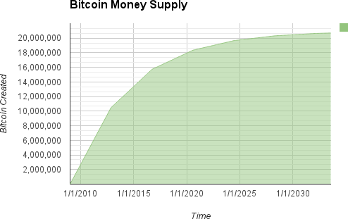
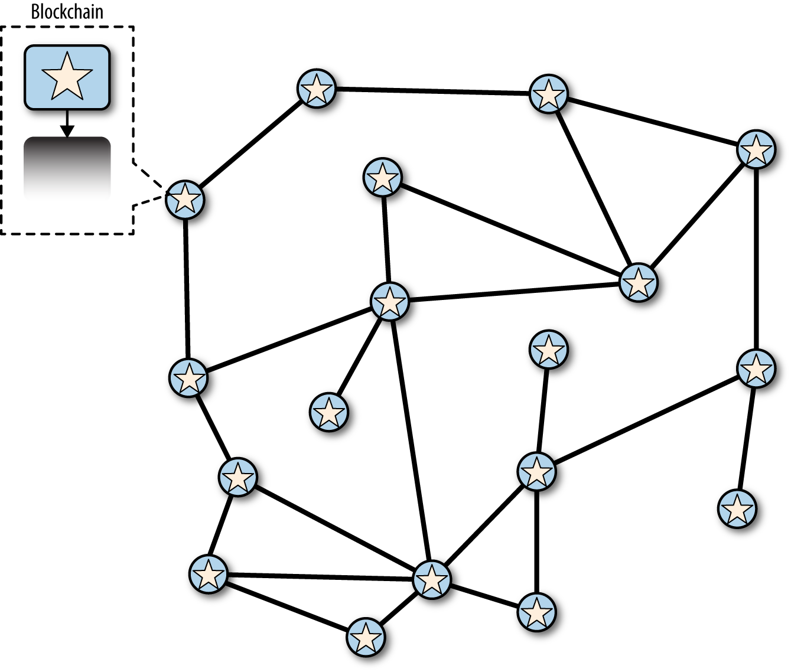
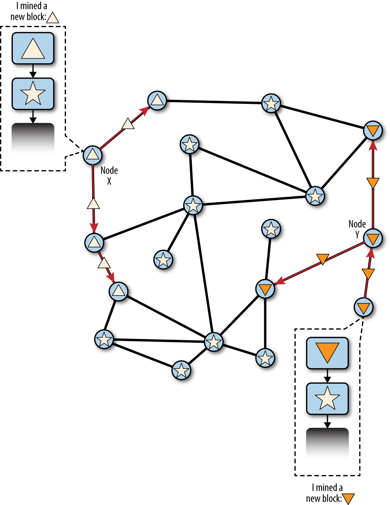
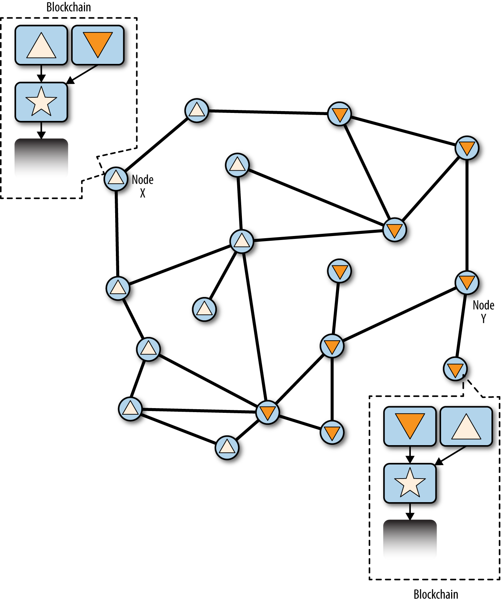
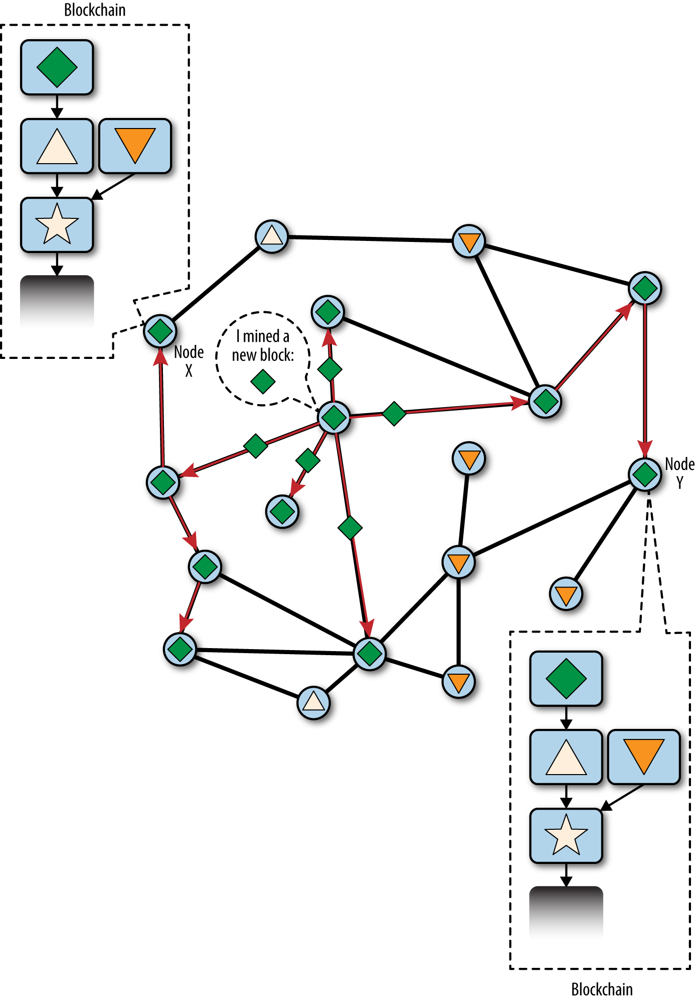
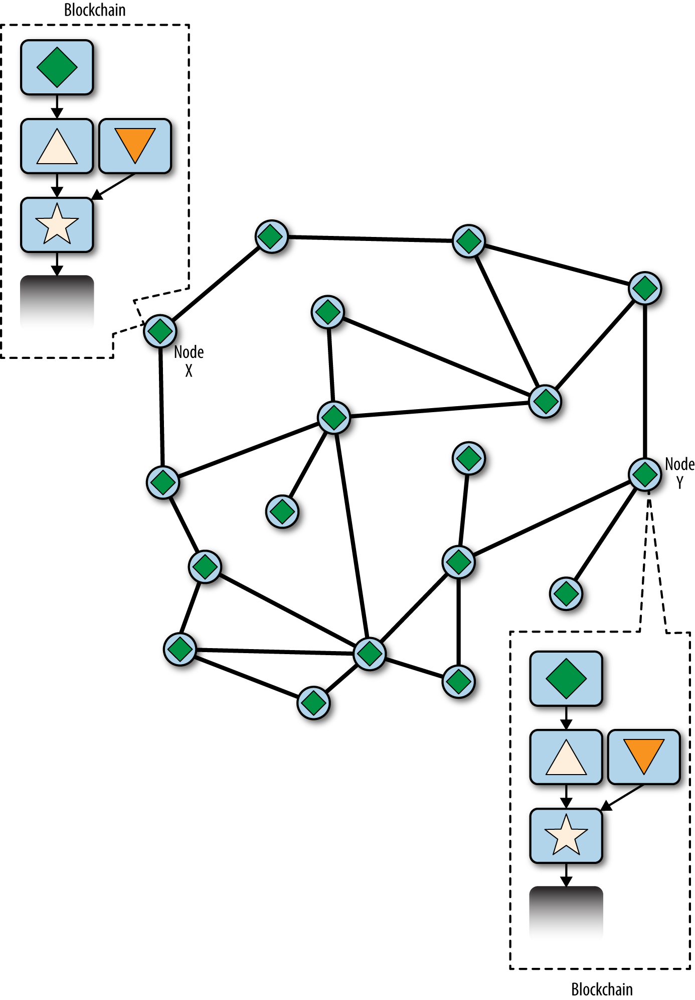
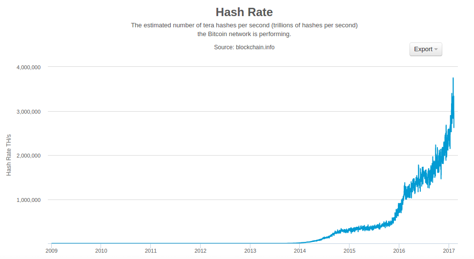
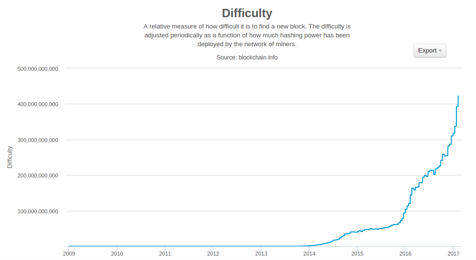
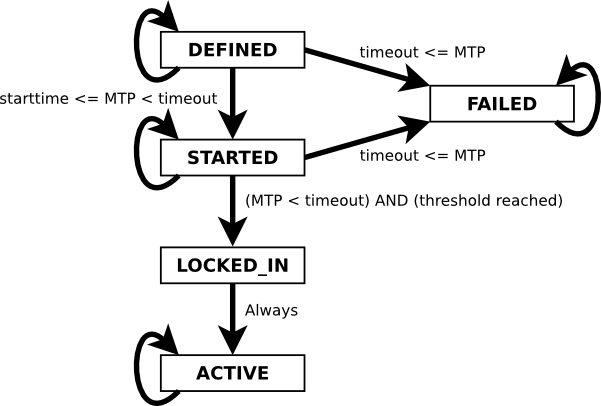

## 挖矿和共识


### 概述

"挖矿"一词是有一些误导性的。通过类比贵金属的提取，它将我们的注意力集中在挖矿的奖励上，这是每个区块创建的新比特币。尽管这种奖励激励了挖矿，但挖矿的主要目的不是奖励或生成新的硬币。如果你仅将挖矿看作是创建比特币的过程，那么你就错误地将手段（激励）当成了过程的目标。挖矿是支撑去中心化清算所的机制，使交易得到验证和清算。挖矿是使比特币特别的发明，是一种去中心化的安全机制，是P2P数字现金的基础。

新铸造的硬币和交易费用奖励是一种激励计划，它将矿工的行为与网络的安全保持一致，同时实施货币供应。

------
>   挖矿的目的不是创造新的比特币。这是激励机制。挖矿是使比特币的 *安全性* *security* *去中心化* _decentralized_的机制。 
------

矿工确认新的交易并将其记录在全球总账中。包含自上一个区块以来发生的交易的新区块，平均每10分钟被"挖掘"，从而将这些交易添加到区块链中。成为区块的一部分并添加到区块链中的交易被认为是“确认”的，这允许比特币的新的所有者花费他们在这些交易中收到的比特币。

为矿工获得两种类型的奖励以换取挖矿提供的安全性：每个新块创建的新币以及该块中包含的所有交易的交易费用。为了获得这种奖励，矿工们竞相解决基于密码散列算法的数学难题。这个难题的解决方案被称为工作证明（Proof-of-Work），它被包含在新的区块中，作为矿工大量计算工作的证据。解决PoW算法赢得奖励以及在区块链上记录交易的权利的竞争是比特币安全模型的基础。

这个过程称为采矿，因为奖励（新硬币的产生）旨在模拟像开采贵金属一样的收益递减。比特币的货币供应是通过采矿创造的，类似于央行通过打印钞票发行新货币的方式。大约每四年（或正好每210,000块），一个矿工可以添加到区块的最大新增比特币数量减少一半。2009年1月开始每个区块50比特币，2012年11月每个区块减半到25比特币，2016年7月再次减少到12.5比特币。基于这个公式，比特币挖矿奖励指数级下降，到2140年左右，所有的比特币（21千万）将发行完毕。2140年以后，不会有新的比特币发行。

比特币矿工也从交易中赚取费用。每笔交易都可能包含一笔交易费用，费用以交易的输入与输出之间的盈余形式体现。获胜的比特币矿工可以对包含在获奖块中的交易“零钱”。今天，这笔费用占比特币矿工收入的0.5％或更少，绝大多数来自新铸造的比特币。然而，奖励随着时间推移而减少，每个区块的交易数量逐渐增加，比特币开采收入的更大比例将来自费用。逐渐地，采矿奖励将由交易费取代，成为矿工的主要动机。2140年以后，每个区块的新比特币数量将降至零，比特币开采将仅通过交易费用获得激励。

在本章中，我们首先将挖矿视为货币供应机制进行研究，然后研究挖矿最重要的功能：支持比特币安全性的分散式共识机制。

要理解挖矿和共识，我们会跟踪Alice的交易，它被Jing的挖矿设备接收并添加到一个区块。然后我们将跟踪这个区块，它被挖掘并添加到区块链，然后通过自发共识（emergent consensus）的过程被比特币网络接受。

#### 比特币经济学和货币创造

比特币在创建每个区块时以固定和递减的速度被“铸造”。平均每10分钟产生一个包含全新的比特币的区块，凭空产生。每隔21万个区块，或大约每四年，货币发行速率就会下降50％。在网络运转的前四年，每个区块包含50个新的比特币。

2012年11月，比特币发行速率降至每块25比特币。2016年7月，再次下降到每块12.5比特币。它将在630,000块区块再次减半至6.25比特币，这将是2020年的某个时间。新硬币的比率将按照指数规律进行32次“减半”，直到6,720,000块（大约在2137年开采），达到最低货币单位，1 satoshi。大约2140年之后，将有690万个区块，发行近2,099,999,997,690,000个satoshis，即将近2100万比特币。此后，区块将不包含新的比特币，矿工将仅通过交易费获得奖励。 [Supply of bitcoin currency over time based on a geometrically decreasing issuance rate](https://github.com/wjw465150/bitcoin_book_2nd/blob/master/第十章.asciidoc#bitcoin_money_supply) 展示了随时间推移流通的比特币总量，货币发行量下降。



Figure 1. Supply of bitcoin currency over time based on a geometrically decreasing issuance rate

------
>   开采的最大硬币数量是比特币可能的挖矿奖励的上限。实际上，矿工可能会故意挖掘一个获得的奖励少于全部奖励的区块。已经有这样的区块，之后可能更多，这将导致货币供应量的减少。 
------

在 [A script for calculating how much total bitcoin will be issued](https://github.com/wjw465150/bitcoin_book_2nd/blob/master/第十章.asciidoc#max_money) 的示例代码中，我们计算比特币的发行总量。

Example 1. A script for calculating how much total bitcoin will be issued

```
link:code/max_money.py[]
```

[Running the max_money.py script](https://github.com/wjw465150/bitcoin_book_2nd/blob/master/第十章.asciidoc#max_money_run) 展示了运行脚本的结果

Example 2. Running the max_money.py script

```
$ python max_money.py
Total BTC to ever be created: 2099999997690000 Satoshis
```

有限和递减的发行，保证了固定的货币供应量，可以抵制通货膨胀。不同于法定货币中央银行的无限印钱，比特币永远不会因印钱而膨胀。

通货紧缩的货币

固定和递减的货币发行的最重要的和有争议的后果是，货币倾向于内在地 *通货紧缩*。通货紧缩是由于供求失衡导致货币价值（和汇率）升值的现象。与通货膨胀相反，价格通缩意味着这些资金随着时间的推移具有更多的购买力。

许多经济学家认为，通货紧缩的经济是一场应该不惜一切代价避免的灾难。这是因为在通货紧缩时期，人们倾向于囤积钱而不是花钱，希望价格会下跌。日本“失去的十年”期间，这种现象就显现出来了，当时需求的彻底崩溃将货币推向通缩螺旋。

比特币专家认为，通货紧缩本身并不糟糕。当然，通货紧缩与需求崩溃有关，因为这是我们必须研究的唯一的通缩的例子。在可以无限印刷的法定货币下，进入通货紧缩螺旋是非常困难的，除非需求完全崩溃并且政府不愿印钞。比特币的通货紧缩不是由需求崩溃引起的，而是由可预见的供应紧张造成的。

通货紧缩的积极方面当然与通货膨胀相反。通货膨胀导致货币缓慢但不可避免的贬值，导致一种隐藏的税收形式，为拯救债务人（包括最大的债务人，政府本身）而对储户进行惩罚。政府控制下的货币受到轻易发行债券的道德风险的影响，后者可以通过贬值而以牺牲储蓄者为代价来消除。

当通货紧缩不是经济快速收缩带来的问题时，通货紧缩是有问题的还是有优势的，还有待观察，因为防止通货膨胀和贬值的远比通货紧缩的风险重要。

### 去中心化共识（Decentralized Consensus）

在上一章中，我们考察了区块链，即所有交易的全球公共账本（列表），比特币网络中的每个人都认可它作为所有权的权威记录。

但是，网络中的每个人怎么能够就一个普遍的“真相”达成一致：谁拥有什么，而不必相信任何人呢？所有传统的支付系统都依赖于信托模式，该模式具有提供清算所服务的中央机构，验证和清算所有交易。比特币没有中央权威机构，但每个完整的节点都有一个可以信任的权威记录的公共账本的完整副本。区块链不是由中央机构创建的，而是由网络中的每个节点独立组装。而且，网络中的每个节点都会根据通过不安全的网络连接传输的信息，得出相同的结论，并与其他人一样收集相同的公共账本。本章将探讨比特币网络在没有中央权威机构的情况下达成全球共识的过程。

中本聪的主要发明是 *自发共识* 的去中心化机制。自发，是因为共识不是明确地达成的，达成共识时没有选举或固定的时刻。相反，共识是数千个遵循简单规则的独立节点，异步交互的自发性产物。 比特币的所有属性，包括货币，交易，支付，以及不依赖中央机构或信任的安全模型，都源自于这项发明。

比特币的去中心化共识来自四个独立于网络节点的过程的相互作用：

- 每笔交易由完整节点独立验证，基于一份全面的标准清单
- 通过挖矿节点将交易独立地聚合到新的区块中，并通过PoW算法证明计算。
- 每个节点独立验证新的区块，并组装到区块链中
- 通过工作流程证明，每个节点独立选择具有最多累积计算量证明的链

在接下来的几节中，我们将研究这些流程以及它们如何相互作用创建网络共识的自发性，以允许任何比特币节点组装自己的权威的、信任的、公共的全局账本的副本。

### 独立交易验证

在 [[transactions\]](https://github.com/wjw465150/bitcoin_book_2nd/blob/master/第十章.asciidoc#transactions) 中, 我们看到了钱包软件如何通过收集UTXO创建交易，提供适当的解锁脚本，然后构建分配给新所有者的新输出。然后将产生的交易发送到比特币网络中的相邻节点，以便它可以在整个比特币网络上传播。

但是，在向邻居转发交易之前，接收交易的每个比特币节点都将首先验证交易。确保只有有效的交易通过网络传播，无效的交易会被遇到它们的第一个节点丢弃。

每个节点根据一个很长的标准检查清单验证每笔交易：

- 交易的语法和数据结构必须正确
- 输入和输出列表都不为空
- 所有交易的字节大小小于 MAX_BLOCK_SIZE.
- 每个输出值，和总的输出值，都必须在允许的范围区间（小于2100万比特币，大于 *dust* 阈值）
- 任何输入的hash不等于0，N不等于-1 (币基交易不应该被传播）
- nLocktime 等于 INT_MAX, 或者 nLocktime 和 nSequence 的值满足 MedianTimePast 的要求
- 每笔交易的字节大小大于或等于 100
- 交易中包含的签名操作（SIGOPS) 小于签名操作限制
- 解锁脚本( scriptSig ）只能向栈中压入数值, 锁定脚本 (scriptPubkey) 必须匹配 IsStandard 格式 (拒绝非标准的交易).
- 交易池或主分支的一个区块中必须存在这笔交易
- 对于每个输入，如果引用的输出存在于池中的任意一笔其他交易中，则这笔交易被拒绝
- 对于每个输入，查找主分支和交易池以找到引用的输出的交易。如果任何输入的输出交易丢失，这将成为一笔孤儿交易。如果匹配的交易没在池中，添加它到孤儿交易池
- 对于每个输入，如果引用的交易是币基输出，它必须有至少 COINBASE_MATURITY (100) 次确认
- 对于每个输入，引用的输出必须存在且未被花费
- 使用引用的输出交易来获得输入值，检查每个输入值，以及总和，在允许的范围中（大于0，小于2100万).
- 如果输入值的总和小于输出值的总和，拒绝
- 如果交易费太低（ minRelayTxFee ），拒绝
- 每个输入的解锁脚本必须与对应的输出的锁定脚本匹配

这些条件的详情可以在 Bitcoin Core 中的 AcceptToMemoryPool, CheckTransaction, 和 CheckInputs 中看到。注意，条件是随时间改变的，以应对新的拒绝服务攻击类型，或者放松规则以包含更多类型的交易。

通过在交易到达后，向外传播前，独立验证，每个节点都简历了一个有效（但未确认）的交易池，称为 *transaction pool*，*memory pool* 或 *mempool*。

### 挖矿节点

Jing，上海的计算机工程学生，是一个比特币矿工。Jing通过运营一个“钻井平台”来获得比特币，这是针对比特币设计的专业计算机硬件系统。Jing的这套专业系统连接到一个完整比特币节点服务器。和 Jing 的做法不同，一些矿工在没有完整节点的情况下挖矿，我们将在 [矿池](https://github.com/wjw465150/bitcoin_book_2nd/blob/master/第十章.asciidoc#mining_pools) 中看到。和每个完整节点一样，Jing的节点在比特币网络上接收和传播未确认的交易，也将这些交易聚合到新的区块中。

Jing的节点和所有节点一样，监听在比特币网络上传播的新块。但是，新块的出现对挖矿节点有特殊的意义。矿工之间的竞争实际上以一个新的区块的传播而结束，这个区块的作用是宣布一个赢家。对矿工来说，得到一个有效的新区块意味着其他人赢得了竞争，而他们输了。然而，一轮比赛的结束也是下一轮比赛的开始。新的区块不只是一个方格旗，标志着比赛的结束；它也是下一个区块竞赛的发令枪。

### 将交易聚合到区块中

在验证交易之后，比特币节点将把它们添加到 *memory pool* 或 *transaction pool* 中，在那里等待交易被包含(挖掘)到一个块中。Jing的节点收集、验证和转发新的交易，就像其他节点一样。然而，与其他节点不同的是，Jing的节点将这些交易聚合到 *candidate block* 中。

我们来看看Alice在Bob’s Cafe买咖啡时创建的区块(见 [[cup_of_coffee\]](https://github.com/wjw465150/bitcoin_book_2nd/blob/master/第十章.asciidoc#cup_of_coffee) )。Alice的交易包含在277,316块中。为了演示本章的概念，让我们假设该区块是由Jing的采矿系统挖掘的，并跟踪Alice的交易，是如何成为这个新块的一部分的。

Jing的挖矿节点维护区块链的本地副本。当Alice买咖啡的时候，Jing的节点已经装配了一个链到277,314。Jing的节点监听交易，试图挖掘一个新块，也监听其他节点发现的块。当Jing的节点在挖掘时，它通过比特币网络接收到区块 277315。这个区块的到来标志着第277315区块竞赛的结束，以及第277316区块竞赛的开始。

在之前的10分钟里，Jing的节点搜索277,315块的解决方案时，它也在收集交易，并为下一个块做准备。到目前为止，它已经在内存池中收集了几百个交易。在接收到第277315块并进行验证之后，Jing的节点还将它与内存池中的所有交易进行比较，并删除第277315块中包含的任何交易。留在内存池中的交易都是未确认的，并等待在新的块中记录。

Jing的节点立即构造一个新的空块，作为277,316块的候选。这个块被称为 *candidate block* ，因为它还不是一个有效的块，不包含有效的工作证明。只有当矿机成功找到PoW的解决方案时，该块才有效。

当Jing的节点将内存池中的所有交易汇总时，新的候选块有418笔交易，总交易费用为0.09094928比特币。你可以使用Bitcoin Core客户端命令行接口在区块链中看到这个块，如 [Using the command line to retrieve block 277,316](https://github.com/wjw465150/bitcoin_book_2nd/blob/master/第十章.asciidoc#block277316) 所示。

Example 3. Using the command line to retrieve block 277,316

```
$ bitcoin-cli getblockhash 277316

0000000000000001b6b9a13b095e96db41c4a928b97ef2d944a9b31b2cc7bdc4

$ bitcoin-cli getblock 0000000000000001b6b9a13b095e96db41c4a928b97ef2d9\
44a9b31b2cc7bdc4
```

```json
{
    "hash" : "0000000000000001b6b9a13b095e96db41c4a928b97ef2d944a9b31b2cc7bdc4",
    "confirmations" : 35561,
    "size" : 218629,
    "height" : 277316,
    "version" : 2,
    "merkleroot" : "c91c008c26e50763e9f548bb8b2fc323735f73577effbc55502c51eb4cc7cf2e",
    "tx" : [
        "d5ada064c6417ca25c4308bd158c34b77e1c0eca2a73cda16c737e7424afba2f",
        "b268b45c59b39d759614757718b9918caf0ba9d97c56f3b91956ff877c503fbe",

        ... 417 more transactions ...

       ],
    "time" : 1388185914,
    "nonce" : 924591752,
    "bits" : "1903a30c",
    "difficulty" : 1180923195.25802612,
    "chainwork" : "000000000000000000000000000000000000000000000934695e92aaf53afa1a",
    "previousblockhash" : "0000000000000002a7bbd25a417c0374cc55261021e8a9ca74442b01284f0569"
}
```

#### 币基交易

区块中的第一笔交易是一笔特殊的交易，叫做 *币基交易* *coinbase transaction*。这笔交易是 Jing 的节点创建的，包含对他的挖矿努力的奖励。

------
>   当区块 277,316 被挖出时，奖励是每个区块25比特币。在其之后，一个“减半”周期已经过去。区块奖励在2016年7月变为12.5比特币。2020年，到达210000块时，将再次减半。 
------

Jing的节点创建了coinbase交易，对自己钱包的支付：“支付给Jing的地址25.09094928比特币”。Jing开采一个区块所收取的奖励总额是币基奖励(25个新比特币)和该区块所有交易的费用（0.09094928）之和，如 [Coinbase transaction](https://github.com/wjw465150/bitcoin_book_2nd/blob/master/第十章.asciidoc#generation_tx_example) 所示。

Example 4. Coinbase transaction

```
$ bitcoin-cli getrawtransaction d5ada064c6417ca25c4308bd158c34b77e1c0eca2a73cda16c737e7424afba2f 1
```

```json
{
    "hex" : "01000000010000000000000000000000000000000000000000000000000000000000000000ffffffff0f03443b0403858402062f503253482fffffffff0110c08d9500000000232102aa970c592640d19de03ff6f329d6fd2eecb023263b9ba5d1b81c29b523da8b21ac00000000",
    "txid" : "d5ada064c6417ca25c4308bd158c34b77e1c0eca2a73cda16c737e7424afba2f",
    "version" : 1,
    "locktime" : 0,
    "vin" : [
        {
            "coinbase" : "03443b0403858402062f503253482f",
            "sequence" : 4294967295
        }
    ],
    "vout" : [
        {
            "value" : 25.09094928,
            "n" : 0,
            "scriptPubKey" : {
                "asm" : "02aa970c592640d19de03ff6f329d6fd2eecb023263b9ba5d1b81c29b523da8b21OP_CHECKSIG",
                "hex" : "2102aa970c592640d19de03ff6f329d6fd2eecb023263b9ba5d1b81c29b523da8b21ac",
                "reqSigs" : 1,
                "type" : "pubkey",
                "addresses" : [
                    "1MxTkeEP2PmHSMze5tUZ1hAV3YTKu2Gh1N"
                ]
            }
        }
    ]
}
```

与一般交易不同，币基交易不消耗（花费）UTXO作为输入。它只有一个输入，叫做 *coinbase* 币基，从无创造比特币。币基交易有一笔输出，可支付给矿工自己的比特币地址。币基交易的输出将 25.09094928 比特币发送到矿工的比特币地址；在这个例子中，是：1MxTkeEP2PmHSMze5tUZ1hAV3YTKu2Gh1N.

#### 币基奖励和费用

为了创建币基交易，Jing的节点首先通过累计418笔交易的输入和输出计算所有交易费用。计算方式如下：

```
Total Fees = Sum(Inputs) - Sum(Outputs)
```

在区块 277,316 中，总的交易费用为 0.09094928 比特币。

接下来，Jing的节点计算新块的正确奖励。奖励是根据块的高度来计算的，从每块50比特币开始，每21万个块减少一半。因为这个方块的高度是277,316，正确的奖励是25比特币。

在 Bitcoin Core 客户端的 GetBlockSubsidy 方法中可以看到，如 [Calculating the block reward —— Function GetBlockSubsidy, Bitcoin Core Client, main.cpp](https://github.com/wjw465150/bitcoin_book_2nd/blob/master/第十章.asciidoc#getblocksubsidy_source) 所示：

Example 5. Calculating the block reward —— Function GetBlockSubsidy, Bitcoin Core Client, main.cpp

```c++
CAmount GetBlockSubsidy(int nHeight, const Consensus::Params& consensusParams)
{
    int halvings = nHeight / consensusParams.nSubsidyHalvingInterval;
    // Force block reward to zero when right shift is undefined.
    if (halvings >= 64)
        return 0;

    CAmount nSubsidy = 50 * COIN;
    // Subsidy is cut in half every 210,000 blocks which will occur approximately every 4 years.
    nSubsidy >>= halvings;
    return nSubsidy;
}
```

最初的奖励以 聪（satoshis）为单位，通过50乘以 COIN 常数（100,000,000聪）。这将初始奖励设置为 50亿 satoshis。

然后，方法计算 halvings （减半）的次数，当前块高度除减半区间（ SubsidyHalvingInterval ），在这个例子中，是 277,316 / 210,000，结果为1。

最大的减半次数为 64，所以如果超过 64 次减半，代码返回 0 （只奖励费用）奖励。

接下来，该函数使用二进制右移运算符将奖励（ nSubsidy ）分为两半。在277,316区块的情况下，对50亿 satoshis 的奖励进行二元右移（一次减半），结果为 25亿 satoshis 或25个比特币。使用二进制右移运算符是因为它比多次除法更有效率。为了避免潜在的错误，位移操作在63次减半后跳过，补贴设置为0。

最后，币基奖励 (nSubsidy) 被加到交易费上 (nFees), 返回总和。

------
>   如果Jing的挖矿节点写出了coinbase交易，那么Jing是不是可以“奖励”他自己的100或1000比特币？答案是，错误的奖励会导致该块被其他人认为是无效的，从而浪费了Jing用于工作证明的电力。只有该块被大家接受，Jing才能花费奖励。 
------

#### 币基交易的结构

通过这些计算，Jing的节点通过支付其自己 25.09094928 比特币构建币基交易。

如你在 [Coinbase transaction](https://github.com/wjw465150/bitcoin_book_2nd/blob/master/第十章.asciidoc#generation_tx_example) 中看到, 币基交易有特殊的格式。不同于指定一个要花费的之前的UTXO的交易输入，它有一个 "coinbase" 输入。我们在 [[tx_in_stracture\]](https://github.com/wjw465150/bitcoin_book_2nd/blob/master/第十章.asciidoc#tx_in_stracture) 中检查交易输入。让我们比较一下普通交易输入和币基交易输入。[The structure of a "normal" transaction input](https://github.com/wjw465150/bitcoin_book_2nd/blob/master/第十章.asciidoc#table_8-1) 展示了普通交易输入的结构，[The structure of a coinbase transaction input](https://github.com/wjw465150/bitcoin_book_2nd/blob/master/第十章.asciidoc#table_8-2) 展示了币基交易输入的结构。

Table 1. The structure of a "normal" transaction input

| Size               | Field        | Description                                       |
| ------------------ | ------------ | ------------------------------------------------- |
| 32 bytes           | 交易的Hash   | 指向包含要花费的UTXO的交易的指针                  |
| 4 bytes            | 输出的索引   | 要花费的UTXO的索引号，第一个从0开始               |
| 1-9 bytes (VarInt) | 解锁脚本大小 | 接下来的解锁脚本的长度（字节）                    |
| Variable           | 解锁脚本     | 满足UTXO锁定脚本条件的脚本                        |
| 4 bytes            | 序列号       | 目前禁用的 Tx-replacement 功能, 设置为 0xFFFFFFFF |

Table 2. The structure of a coinbase transaction input

| Size               | Field        | Description                                                  |
| ------------------ | ------------ | ------------------------------------------------------------ |
| 32 bytes           | 交易的Hash   | 所有位都是0：没有要引用的交易                                |
| 4 bytes            | 输出的索引   | 所有位都是1: 0xFFFFFFFF                                      |
| 1-9 bytes (VarInt) | 币基数据大小 | 币基数据的长度，2 到 100 字节                                |
| Variable           | 币基数据     | 用于额外随机数和采矿标签的任意数据。在v2块中，必须从块高开始 |
| 4 bytes            | 序列号       | 设为 0xFFFFFFFF                                              |

在币基交易中，前两个字段被设置为不引用UTXO的值。不同于“交易的Hash”，第一个字段填充32个字节，全部设置为零。 “输出索引” 填充4个字节，全部设置为0xFF（十进制255）。“解锁脚本”（ scriptSig ）被币基数据（Coinbase Data）取代，这是矿工使用的数据字段，我们将在下面看到。

#### 币基数据 Coinbase Data

币基交易没有解锁脚本（ scriptSig ）字段。这个字段被 coinbase data 替代，该字段必须包含 2-100 个字节。除了前几个字节，其他的可由矿工填充任意数据。

例如，中本聪在创世区块的 coinbase data 中加入了文本 "The Times 03/Jan/2009 Chancellor on brink of second bailout for banks", 将它作为日期的证明，并传达了一个信息. 现在，矿工使用 coinbase data 存放额外的随机值，和识别矿池的字符串。

币基的前几个字节以前是随机的，但现在不是了。根据BIP-34，version-2区块（版本号为2）必须在币基交易字段的开头包含区块高度作为脚本 push 操作。

在区块 211,316 中我们看到的币基（ 参见 [Coinbase transaction](https://github.com/wjw465150/bitcoin_book_2nd/blob/master/第十章.asciidoc#generation_tx_example) ），位于交易输入的解锁脚本或 scriptSig 字段，包含十六进制值 03443b0403858402062f503253482f。让我们解码它。

第一个字节 03 指示脚本执行引擎将接下来的三个字节压入脚本堆栈(参见 [[tx_script_ops_table_pushdata\]](https://github.com/wjw465150/bitcoin_book_2nd/blob/master/第十章.asciidoc#tx_script_ops_table_pushdata) )。接下来的三个字节，0x443b04，是用小端序编码的块高度(倒序，低位字节优先)。反转字节的顺序，结果是 0x043b44 ，十进制是277,316。

接下来的几个十六进制数据（0385840206），编码了额外的随机数（参见 [额外随机数解决方案](https://github.com/wjw465150/bitcoin_book_2nd/blob/master/第十章.asciidoc#extra_nonce)），用于找到PoW的解决方案。

币基数据的最后部分（ 2f503253482f ）是ASCII编码的字符串 /P2SH/，表明挖到这个区块的节点支持 BIP-16 中定义的 P2SH 交易。P2SH 能力的引入要求矿工认可BIP-16或BIP-17。支持BIP-16的人将在他们的coinbase数据中包含 /P2SH/。支持P2SH的BIP-17实现的人将字符串 p2sh/CHV 包含在他们的coinbase数据中。BIP-16胜出，许多矿工继续在他们的coinbase中包含字符串 /P2SH/ ，以表示对该特性的支持。

[Extract the coinbase data from the genesis block](https://github.com/wjw465150/bitcoin_book_2nd/blob/master/第十章.asciidoc#satoshi_words) 使用 [[alt_libraries\]](https://github.com/wjw465150/bitcoin_book_2nd/blob/master/第十章.asciidoc#alt_libraries) 中介绍的 libbitcoin 库从创世区块中提取币基数据，展示中本聪的信息。注意，libbitcoin 库包含一份创世区块的静态副本，所以示例代码可以直接从库中检索到创世区块。

Example 6. Extract the coinbase data from the genesis block

```
link:code/satoshi-words.cpp[]
```

我们使用 GNU C++ 编译器编译和运行：

Example 7. Compiling and running the satoshi-words example code

```
$ # Compile the code
$  g++ -o satoshi-words satoshi-words.cpp $(pkg-config --cflags --libs libbitcoin)
$ # Run the executable
$ ./satoshi-words
The Times 03/Jan/2009 Chancellor on brink of second bailout for banks
```

### 构建区块头

要构建区块头，挖矿节点需要填充6个字段，在 [The structure of the block header](https://github.com/wjw465150/bitcoin_book_2nd/blob/master/第十章.asciidoc#block_header_structure_ch10) 列出：

Table 3. The structure of the block header

| Size     | Field               | Description                                |
| -------- | ------------------- | ------------------------------------------ |
| 4 bytes  | Version             | 最终软件/协议更新的版本号                  |
| 32 bytes | Previous Block Hash | 引用链中上一个块（父块）的哈希值           |
| 32 bytes | Merkle Root         | 该区块中交易的merkle树的根Hash             |
| 4 bytes  | Timestamp           | 区块的大概创建时间（ Unix 纪元以来的秒数 ) |
| 4 bytes  | Target              | 该区块的 PoW 算法目标                      |
| 4 bytes  | Nonce               | PoW 算法使用的计数器                       |

在 277,316 区块被挖掘时，区块结构的版本号是2，以小端序编码为四字节是 0x02000000.

接下来，挖矿节点需要添加 "Previous Block Hash" ( 称为 prevHash )。这是 277,315 区块的哈希值，是 Jing 的节点从网络收到并接受的作为候选区块 277,316 的父区块。277,315 区块的哈希值是：

```
0000000000000002a7bbd25a417c0374cc55261021e8a9ca74442b01284f0569
```

------
>   通过选择特定的父块(由候选块头中的 Previous Block Hash 字段所指示)，Jing将其挖掘能力用于扩展以该特定块结束的链。从本质上说，这就是 Jing 使用他的挖矿力量为最长难度的有效链“投票”。 
------

下一步是使用merkle树汇总所有交易，以便将merkle根添加到块头中。coinbase交易被列为块中的第一个交易。然后，在它之后又添加了418个交易，总共在块中添加了419个交易。如我们在 [[merkle_trees\]](https://github.com/wjw465150/bitcoin_book_2nd/blob/master/第十章.asciidoc#merkle_trees) 中看到的，树中必须有偶数个“叶子”节点，因此最后一个交易被复制，创建420个节点，每个节点都包含一个交易的散列。然后将交易散列成对地组合在一起，创建树的每一级，直到将所有交易汇总为树的“根”节点。merkle树的根将所有交易汇总为单个32字节的值，你可以看到 [Using the command line to retrieve block 277,316](https://github.com/wjw465150/bitcoin_book_2nd/blob/master/第十章.asciidoc#block277316) 中列出的“merkle root”:

```
c91c008c26e50763e9f548bb8b2fc323735f73577effbc55502c51eb4cc7cf2e
```

Jing 的挖矿节点然后将添加 4字节的时间戳，编码为 Unix 纪元时间戳，表示从 UTC/GMT时间 1970年1月1日 零点 以来的秒数，1388185914 等于 Friday, 27 Dec 2013, 23:11:54 UTC/GMT。

然后 Jing 的节点填充 目标（target）字段，定义了使其成为一个有效区块所需的PoW。target 在区块中以 "target bits" 矩阵存储，这是目标的 尾数-指数（mantissa-exponent）编码。编码有1字节的指数，紧接3字节的尾数（系数）。例如，在区块 277,316 中，target bits 的值是 0x1903a30c。第一部分 0x19 是一个十六进制指数，后面的部分，0x03a30c，是系数。target 的概念和 target bits 的表示分别在 [重新设定目标调整难度](https://github.com/wjw465150/bitcoin_book_2nd/blob/master/第十章.asciidoc#target) 和 [目标（Target）的表示](https://github.com/wjw465150/bitcoin_book_2nd/blob/master/第十章.asciidoc#target_bits) 中说明。

最后一个字段是随机数（nonce），初始化为0。

随着所有其他字段被填充，区块头现在已经完成，挖矿过程开始。目标是找到一个随机数的值，使区块头的哈希值小于 target。在找到合适的随机值前，挖矿节点可能需要尝试数十亿，或数万亿次。

### 挖掘区块

用最简单的术语来说，挖矿是重复散列区块头的过程，不断更改参数，直到生成的哈希值与特定目标相匹配。散列函数的结果不能预先确定，也不能创建产生特定哈希值的模式。散列函数的这种特性意味着产生匹配特定目标的散列结果的唯一方法是反复尝试，随机修改输入，直到偶然出现所需的结果。

#### 工作量证明算法 Proof-of-Work Algorithm

密码散列算法的关键特征是，在计算上不可能找到产生相同指纹的两个不同输入（称为 *碰撞* *collision*）。作为推论，除了尝试随机输入之外，通过选择输入以产生期望的指纹的方式实际上也是不可能的。

使用SHA256，无论输入是什么，输出总是256位的。在 [SHA256 example](https://github.com/wjw465150/bitcoin_book_2nd/blob/master/第十章.asciidoc#sha256_example1) 中，我们使用Python解释器计算 "I am Satoshi Nakamoto." 的SHA256哈希值。

Example 8. SHA256 example

```
$ python
Python 2.7.1
>>> import hashlib
>>> print hashlib.sha256("I am Satoshi Nakamoto").hexdigest()
5d7c7ba21cbbcd75d14800b100252d5b428e5b1213d27c385bc141ca6b47989e
```

[SHA256 example](https://github.com/wjw465150/bitcoin_book_2nd/blob/master/第十章.asciidoc#sha256_example1) 展示了 "I am Satoshi Nakamoto" 的哈希结果：5d7c7ba21cbbcd75d14800b100252d5b428e5b1213d27c385bc141ca6b47989e. 这个 256位的数字是这句话的 *哈希* *hash* 或 *摘要* *digest*，基于这句话的每部分。添加一个字母、标点符号，或其他任何字符都将产生不一样的哈希值。

现在，如果我们改变语句，会会看到完全不同的哈希值。让我们使用 [SHA256 script for generating many hashes by iterating on a nonce](https://github.com/wjw465150/bitcoin_book_2nd/blob/master/第十章.asciidoc#sha256_example_generator) 中简单的Python脚本尝试在尾部添加数组。

Example 9. SHA256 script for generating many hashes by iterating on a nonce

```
link:code/hash_example.py[]
```

运行它将产生几个短语的散列，通过在文本末尾添加一个数字来使其不同。通过增加数字，我们可以得到不同的散列，如 [SHA256 output of a script for generating many hashes by iterating on a nonce](https://github.com/wjw465150/bitcoin_book_2nd/blob/master/第十章.asciidoc#sha256_example_generator_output) 所示。

Example 10. SHA256 output of a script for generating many hashes by iterating on a nonce

```
$ python hash_example.py
```

```
I am Satoshi Nakamoto0 => a80a81401765c8eddee25df36728d732...
I am Satoshi Nakamoto1 => f7bc9a6304a4647bb41241a677b5345f...
I am Satoshi Nakamoto2 => ea758a8134b115298a1583ffb80ae629...
I am Satoshi Nakamoto3 => bfa9779618ff072c903d773de30c99bd...
I am Satoshi Nakamoto4 => bce8564de9a83c18c31944a66bde992f...
I am Satoshi Nakamoto5 => eb362c3cf3479be0a97a20163589038e...
I am Satoshi Nakamoto6 => 4a2fd48e3be420d0d28e202360cfbaba...
I am Satoshi Nakamoto7 => 790b5a1349a5f2b909bf74d0d166b17a...
I am Satoshi Nakamoto8 => 702c45e5b15aa54b625d68dd947f1597...
I am Satoshi Nakamoto9 => 7007cf7dd40f5e933cd89fff5b791ff0...
I am Satoshi Nakamoto10 => c2f38c81992f4614206a21537bd634a...
I am Satoshi Nakamoto11 => 7045da6ed8a914690f087690e1e8d66...
I am Satoshi Nakamoto12 => 60f01db30c1a0d4cbce2b4b22e88b9b...
I am Satoshi Nakamoto13 => 0ebc56d59a34f5082aaef3d66b37a66...
I am Satoshi Nakamoto14 => 27ead1ca85da66981fd9da01a8c6816...
I am Satoshi Nakamoto15 => 394809fb809c5f83ce97ab554a2812c...
I am Satoshi Nakamoto16 => 8fa4992219df33f50834465d3047429...
I am Satoshi Nakamoto17 => dca9b8b4f8d8e1521fa4eaa46f4f0cd...
I am Satoshi Nakamoto18 => 9989a401b2a3a318b01e9ca9a22b0f3...
I am Satoshi Nakamoto19 => cda56022ecb5b67b2bc93a2d764e75f...
```

每个短语产生一个完全不同的散列结果。它们看起来完全是随机的，但是你可以在使用Python的任何计算机上再次生成这个示例中的结果，并看到相同的哈希。

在这种场景中用作变量的数字称为_nonce_。nonce用于改变加密函数的输出，在本例中，是为了改变短语的SHA256指纹。

要对这个算法提出挑战，我们来设置一个目标:找到一个短语，它生成一个以0开头的十六进制散列。幸运的是,这并不难! [[sha256_example_generator_generator_output \]](https://github.com/wjw465150/bitcoin_book_2nd/blob/master/第十章.asciidoc#sha256_example_generator_generator_output) 显示："I’m Satoshi Nakamoto13" 这个短语产生的是一个符合我们的标准的哈希值：0ebc56d59a34f5082aaef3d661696c2b618e6243272169531041a5。花了13次才找到它。在概率方面,如果哈希函数的输出是均匀分布的，我们可以期望每16次找到一个以0开头的结果（16个十六进制数字0到F中的一个）。在数值方面，这就意味着找到一个散列值,小于 0 x1000000000000000000000000000000000000000000000000000000000000000。我们将这个阈值称为_target_，目标是找到一个在数值上小于目标的哈希值。如果我们减少目标，查找小于目标的哈希值的任务将变得越来越困难。

打个简单的比方，想象这样一个游戏：玩家不断地掷一副骰子，试图掷得比指定的目标少。在第一轮，目标是12个。除非你掷双六，否则你就能赢。下一轮的目标是11。玩家必须投出10或更少的数值才能获胜。这同样是一项简单的任务，假设几轮之后，目标是5。现在，超过一半的结果将超过目标而无效。随着目标降低，要想赢得胜利，掷骰子的次数要成倍增加。最终，当目标是2（可能的最小值）时，每36次投掷中只有一次，或其中的2%，会产生一个胜利的结果。

从一个知道骰子游戏的目标是2的观察者的角度来看，如果有人成功地投出了一个成功的结果，那么可以假设他们平均尝试了36次。换句话说，一个人可以从目标设定的难度中估计成功所需要的工作量。当算法是基于确定性函数（如SHA256）时，输入本身就构成了 *证明* *proof*，证明做了一定量的 *工作* *work* 才产生低于目标的结果。所以称为, *Proof-of-Work*。

------
>   即使每次尝试都会产生随机结果，任何可能结果的概率都可以提前计算。因此，特定难度的结果构成特定工作量的证明。 
------

在 [SHA256 output of a script for generating many hashes by iterating on a nonce](https://github.com/wjw465150/bitcoin_book_2nd/blob/master/第十章.asciidoc#sha256_example_generator_output) 中, 获胜的“nonce”是13，这个结果可以被任何人独立的验证。任何人都可以在短语“我是中本聪”后面加上数字13，然后计算哈希，验证它是否小于目标。成功的结果也是工作的证明，因为它证明我们做了工作去发现那一次。虽然只需要一次哈希计算就可以验证，但我们需要13次哈希计算才能找到一个有效的nonce。如果我们有一个更低的目标(更高的难度)，那么需要更多的哈希计算才能找到一个合适的nonce，但是对于任何人来说，只有一个哈希计算需要验证。此外，通过了解目标，任何人都可以使用统计数据来估计困难程度，从而知道需要做多少工作才能找到这样一个nonce。

------
> PoW必须生成一个小于目标的哈希值。更高的目标意味着找到低于目标的哈希值要容易得多。较低的目标意味着更难在目标以下找到哈希值。目标和难度是反比的。 
------

比特币的PoW与 [SHA256 output of a script for generating many hashes by iterating on a nonce](https://github.com/wjw465150/bitcoin_book_2nd/blob/master/第十章.asciidoc#sha256_example_generator_output) 所展示的挑战非常相似。矿机构造一个充满交易的候选块。接下来，挖矿程序计算这个块头的散列，看看它是否小于当前的 *target*。如果哈希值不小于目标，那么矿机将修改nonce(通常只将其递增1次)，并再次尝试。在比特币网络目前的难度下，矿工必须尝试千万亿次，才能找到一个能产生足够低的区块头哈希的nonce。

一个非常简单的PoW在 [Simplified Proof-of-Work implementation](https://github.com/wjw465150/bitcoin_book_2nd/blob/master/第十章.asciidoc#pow_example1) 中以Python实现

Example 11. Simplified Proof-of-Work implementation

```
link:code/proof-of-work-example.py[]
```

运行这段代码，你可以设置所需的难度(以位为单位，有多少位前导位必须为零)，并查看计算机需要多长时间才能找到解决方案。在 [[pow_example_output\]](https://github.com/wjw465150/bitcoin_book_2nd/blob/master/第十章.asciidoc#pow_example_output) 中，你可以看到它在普通的笔记本上是如何工作的。

Example 12. Running the Proof-of-Work example for various difficulties

```
$ python proof-of-work-example.py*
```

```
Difficulty: 1 (0 bits)

[...]

Difficulty: 8 (3 bits)
Starting search...
Success with nonce 9
Hash is 1c1c105e65b47142f028a8f93ddf3dabb9260491bc64474738133ce5256cb3c1
Elapsed Time: 0.0004 seconds
Hashing Power: 25065 hashes per second
Difficulty: 16 (4 bits)
Starting search...
Success with nonce 25
Hash is 0f7becfd3bcd1a82e06663c97176add89e7cae0268de46f94e7e11bc3863e148
Elapsed Time: 0.0005 seconds
Hashing Power: 52507 hashes per second
Difficulty: 32 (5 bits)
Starting search...
Success with nonce 36
Hash is 029ae6e5004302a120630adcbb808452346ab1cf0b94c5189ba8bac1d47e7903
Elapsed Time: 0.0006 seconds
Hashing Power: 58164 hashes per second

[...]

Difficulty: 4194304 (22 bits)
Starting search...
Success with nonce 1759164
Hash is 0000008bb8f0e731f0496b8e530da984e85fb3cd2bd81882fe8ba3610b6cefc3
Elapsed Time: 13.3201 seconds
Hashing Power: 132068 hashes per second
Difficulty: 8388608 (23 bits)
Starting search...
Success with nonce 14214729
Hash is 000001408cf12dbd20fcba6372a223e098d58786c6ff93488a9f74f5df4df0a3
Elapsed Time: 110.1507 seconds
Hashing Power: 129048 hashes per second
Difficulty: 16777216 (24 bits)
Starting search...
Success with nonce 24586379
Hash is 0000002c3d6b370fccd699708d1b7cb4a94388595171366b944d68b2acce8b95
Elapsed Time: 195.2991 seconds
Hashing Power: 125890 hashes per second

[...]

Difficulty: 67108864 (26 bits)
Starting search...
Success with nonce 84561291
Hash is 0000001f0ea21e676b6dde5ad429b9d131a9f2b000802ab2f169cbca22b1e21a
Elapsed Time: 665.0949 seconds
Hashing Power: 127141 hashes per second
```

如你所见，将难度增加1位会使找到解决方案所需的时间增加一倍。如果考虑整个256位的数字空间，每次将多一个位限制为0，搜索空间就减少了一半。在 [[pow_example_output \]](https://github.com/wjw465150/bitcoin_book_2nd/blob/master/第十章.asciidoc#pow_example_output) 中，需要8400万次哈希才能找到一个nonce，它产生的哈希有26个前导位为零。即使以每秒超过12万次哈希的速度，在笔记本上也需要10分钟才能找到这个解决方案。

在编写本文时，网络正在尝试查找一个小于以下值的区块头哈希：

```
0000000000000000029AB9000000000000000000000000000000000000000000
```

如你所见，目标的开头有很多0，这意味着可以接受的散列范围要小得多，很难找到一个有效的哈希值。网络要发现下一个区块，平均每秒需要超过1.8 zeta-hashes(thousand billion billion hashes)。这似乎是一项不可能完成的任务，但幸运的是，网络有每秒产生3个exa-hashes(EH/sec)的处理能力，平均10分钟就能找到一个block。

#### 目标（Target）的表示

在 [Using the command line to retrieve block 277,316](https://github.com/wjw465150/bitcoin_book_2nd/blob/master/第十章.asciidoc#block277316) 中，我们看到这个块包含了目标，以一个称为“target bits”或只是“bits”，在块277,316中的值为 0x1903a30c。该表示法将工作量证明的验证目标表示为系数/指数格式，前两个十六进制数字是指数，后六个十六进制数字是系数。因此，在这个区块中，指数为 0x19，系数为 0x03a30c。

这种表达方式下计算难度目标的公式是：

- target = coefficient * 2(8*(exponent–3))

使用这个公式，和难度bits值 0x1903a30c，可以得到：

- target = 0x03a30c * 20x08*(0x19-0x03)
- => target = 0x03a30c * 2(0x08*0x16)
- => target = 0x03a30c * 20xB0

十进制就是：

- => target = 238,348 * 2176
- => target =
  22,829,202,948,393,929,850,749,706,076,701,368,331,072,452,018,388,575,715,328

转换为十六进制：

- => target =
  0x0000000000000003A30C00000000000000000000000000000000000000000000

这意味着高度为277,316的有效块是区块头的哈希值小于目标的块。在二进制中，该数字必须有超过60个前导位设置为零。有了这样的难度，一个矿工每秒处理1万亿次哈希，平均只能每8,496个块或每59天寻找到一次解决方案。

#### 重新设定目标调整难度

正如我们所看到的，目标确定了难度，因此影响了找到工作证明算法的解决方案所需的时间。这就引出了一个明显的问题：为什么困难是可以调整的，由谁来调整，以及如何调整?

比特币的区块平均每10分钟生成一次。这是比特币的心跳，支撑着货币发行的频率和交易结算的速度。它必须保持不变，不仅是短期的，而是持续几十年。在这段时间里，预计计算机的能力将继续快速增长。此外，参与挖矿的人和计算机的数目也不断变化。为了保持10分钟的生成时间，必须考虑这些变化调整挖掘的难度。事实上，工作证明的目标是一个动态参数，它定期调整以满足10分钟的区块间隔目标。简单地说，可以设置目标值，使当前的挖矿能力导致10分钟的区块间隔。

那么，这种调整是如何在一个完全分散的网络中进行的呢？重新设定目标是独立地在每个节点上自动进行的。每产生2016个区块，所有节点都重新设定PoW目标。重新设定目标的公式衡量了找到最后2016个区块所需的时间，并与预期的20160分钟(2016个区块乘以期望的10分钟区块间隔)进行了比较。计算实际时间间隔和期望时间间隔的比例，并对目标按比例进行调整(向上或向下)。简单地说：如果网络发现区块的速度比每10分钟快，难度就会增加(目标范围缩小)。如果区块发现速度比预期的要慢，那么难度就会降低(目标范围增加)。

公式如下：

```
New Target = Old Target * (Actual Time of Last 2016 Blocks / 20160 minutes)
```

[Retargeting the Proof-of-Work —— CalculateNextWorkRequired() in pow.cpp](https://github.com/wjw465150/bitcoin_book_2nd/blob/master/第十章.asciidoc#retarget_code) 展示了 Bitcoin Core 客户端使用的代码。

Example 13. Retargeting the Proof-of-Work —— CalculateNextWorkRequired() in pow.cpp

```c++
   // Limit adjustment step
    int64_t nActualTimespan = pindexLast->GetBlockTime() - nFirstBlockTime;
    LogPrintf("  nActualTimespan = %d  before bounds\n", nActualTimespan);
    if (nActualTimespan < params.nPowTargetTimespan/4)
        nActualTimespan = params.nPowTargetTimespan/4;
    if (nActualTimespan > params.nPowTargetTimespan*4)
        nActualTimespan = params.nPowTargetTimespan*4;

    // Retarget
    const arith_uint256 bnPowLimit = UintToArith256(params.powLimit);
    arith_uint256 bnNew;
    arith_uint256 bnOld;
    bnNew.SetCompact(pindexLast->nBits);
    bnOld = bnNew;
    bnNew *= nActualTimespan;
    bnNew /= params.nPowTargetTimespan;

    if (bnNew > bnPowLimit)
        bnNew = bnPowLimit;
```

------
>   目标值的校准每2,016个区块发生一次，由于原始的比特币核心客户端中出现了一个差一的错误，它是基于之前的2,015个块（而不是应该的2,016块）的总时间，导致重新设定的目标倾向于难度增加0.05%。 
------

Interval (2,016 个区块) 和 TargetTimespan (两周时间，1,209,600 seconds) 两个参数在 *chainparams.cpp* 中定义.

为了避免难度的极端波动，重新设定目标的调整必须小于每个周期4倍。如果所需的目标调整大于4倍，则调整为4倍而不是更多。任何进一步的调整都将在下一个重新设定目标期间完成，因为这种不平衡将持续到下一个2016个区块。因此，哈希算力和难度之间的巨大差异可能需要几个2,016区块周期来平衡。

------
>   挖掘比特币区块的难度大约需要整个网络“处理10分钟”，根据挖掘前2,016个区块所花费的时间，每2,016个区块进行一次调整。通过降低或提高目标来实现。 

请注意，目标与交易的数量或价值无关。这意味着哈希的算力以及用于保障比特币安全锁消耗的电量也完全独立于交易数量。比特币可以扩大规模，实现更广泛的应用，并保持安全，而不需要增加目前的哈希算力水平。随着新矿工进入市场竞争奖励，哈希算力的增加代表市场的力量。只要足够的哈希算力在矿工诚实追求奖励的控制下进行，就足以防止“接管”攻击，因此足以保证比特币的安全。

挖矿的难度与电力成本相关，以及比特币与用于支付电力的货币的汇率。高性能的挖矿系统在当前硅片制造方面尽可能地高效，将电力尽可能高地转化为哈希算力。对挖矿市场的主要影响是1千瓦小时的比特币电价，因为这决定了挖矿的盈利能力，因此影响了进入或退出挖矿市场的选择。

### 成功挖到区块

如我们之前看到的，Jing的节点构建了一个候选区块，并准备挖掘它。Jing有几台硬件挖掘设备和特定于应用的集成电路，其中几十万个集成电路以惊人的速度并行运行SHA256算法。这些定制的机器通过USB或局域网连接到他的挖矿节点。接下来，在Jing的桌面上运行的挖矿节点将区块头发送到他的挖矿硬件，开始每秒尝试数万亿随机数。因为随机数只有32位，当遍历完所有可能时（大概40亿），挖矿硬件改变区块头（调整币基的随机数或时间戳）并重新测试随机数，和新的组合。

开始挖掘区块277,316后的大概11分钟，一个硬件社保发现了结果，并将其发送回挖矿节点。

当插入到区块头后，随机数 924,591,752 产生了以下区块哈希值：

```
0000000000000001b6b9a13b095e96db41c4a928b97ef2d944a9b31b2cc7bdc4
```

小于目标值：

```
0000000000000003A30C00000000000000000000000000000000000000000000
```

Jing的挖矿节点立即将这个区块发送到它的对等节点。它们接收，验证，并传播这个新的区块。随着这个区块在网络上涟漪般传播，每个节点都将其添加到自己的区块链上，将区块链的高度扩展到 277,316 个区块。挖矿节点接收并验证区块，放弃自己尝试挖掘相同区块的努力，并立即开始计算链上的下一个区块，将Jing的区块作为“父块”。通过在Jing新发现的区块之上构建，其他的矿工实质上使用它们的算力“投票”，认可Jing的区块和它扩展的区块。

在下一节，我们将看下每个节点验证和选择最长链的过程，从而创建了形成去中心化区块链的共识。

### 验证新的区块

比特币共识机制的第三步是网络中每个节点对每个新块进行独立验证。随着新解决的块在整个网络中移动，每个节点在传播给对等节点之前执行一系列测试来验证它。这确保了只有有效的块在网络上传播。独立验证还可以确保那些诚实行动的矿工将自己的区块整合到区块链中，从而获得回报。那些不诚实行事的矿工被拒绝，不仅失去了奖励，而且浪费了寻找工作证明解决方案的努力，导致电力成本没有补偿。

当一个节点收到一个新的区块时，它将通过一长串检查清单验证它必须符合的条件；否则，拒绝该区块。这些条件可以在 Bitcoin Core 客户端的方法 CheckBlock 和 CheckBlockHeader 中看到：

- 区块的数据结构语法正确
- 区块头的哈希值小于目标值
- 区块的时间戳小于未来2小时（允许时间错误）
- 区块的大小在可接受的限制范围内
- 第一笔（且只有第一笔）交易是币基交易
- 区块中的所有交易是有效的，可以通过 [独立交易验证](https://github.com/wjw465150/bitcoin_book_2nd/blob/master/第十章.asciidoc#tx_verification) 中的验证

网络上每个节点对每个新块的独立验证确保矿工不会作弊。在之前的章节中，我们看到矿工如何写出一笔交易，在该区块内创建新的比特币并获得交易费用。为什么矿工不会自己写一千个比特币的交易，而不是正确的奖励呢？因为每个节点都根据相同的规则验证块。无效的币基交易会使整个块无效，导致该块被拒绝，因此该交易永远不会成为分类账的一部分。矿工必须根据所有节点遵循的共同规则构建一个完美的区块，并通过正确的PoW解决方案来挖掘它。为此，他们在挖矿中耗费大量的电力，如果他们作弊，所有的电力和精力都被浪费掉了。这就是为什么独立验证是去中心化共识的一个关键组成部分。

### 组装和选择区块的链

区块链去中心化共识机制的最后一个步骤是将区块组装到链中，并选择最多Proof-of-Work的链。当一个节点验证了一个新的区块后，它将尝试通过将区块链接到现有的区块链，来组装链。

节点维护三组区块：连接到主区块链的区块，形成主区块链分支的（次级区块链），最后，在已知的链中没有父块的区块（孤块）。无效的区块一旦不满足验证条件即被拒绝，因此它们不包含在任何链中。

任何时候，“主链”都是无效链块中与其相关的最多累积工作量证明。在大多数情况下，这也是其中最多块的链条，除非有两条等长链和一条有更多的工作量证明。主链也将有分支，这些分支是与主链上的块“兄弟姐妹”。这些块是有效的，但不是主链的一部分。他们被保留以供将来参考，以防其中一个连锁店的业务延伸超过主链。在下一部分（ [区块链分叉](https://github.com/wjw465150/bitcoin_book_2nd/blob/master/第十章.asciidoc#forks) ）中，我们将看到由于在同一高度上几乎同时开采块体而出现次级链。

“主链”在任何时候都是有着最多的累计Proof-of-Work的区块组成的 *有效* 链。大多数情况下，这也是拥有最多区块的链，除非有两个高度相同的链，其中一个有更多的Proof-of-Work。主链会有分支，分支上的区块时主链上区块的“兄弟姐妹”。这些区块是有效的但不是主链的一部分。它们留作将来引用，以防这些链被扩展而超过主链。在下一节 [区块链分叉](https://github.com/wjw465150/bitcoin_book_2nd/blob/master/第十章.asciidoc#forks) 中，我们将看到相同高度的区块同时被挖掘而形成的次链。

当接收到一个新块时，节点将尝试将其插入到现有的区块链中。节点将查看块的“previous block hash”字段，该字段是对父块的引用。然后，节点将尝试在现有的区块链中找到父节点。大多数时候，父类将是主链的“顶部”，意味着这个新块扩展了主链。例如，新块277,316具有对其父块277,315的哈希值的引用。大多数接收277,316的节点都已经有了277,315块作为主链的顶部，因此将连接新的块并扩展该链。

有时，正如我们在 [[fork\]](https://github.com/wjw465150/bitcoin_book_2nd/blob/master/第十章.asciidoc#fork) 中看到的，新的块扩展了非主链的链。在这种情况下，节点将把新区块附加到它所扩展的次级链上，然后将次级链的 *工作量* 与主链进行比较。如果次级链的累积工作量大于主链，则节点将在次级链上 *重新聚合*，意味着它将选择次级链作为其新的主链，使旧主链成为次级链。如果节点是一个矿工，那么它现在将构造一个块来扩展这个新的、更长的链。

如果一个有效的区块到达了，但没有在已有的链中找到其父块，则这个区块被认为是“孤儿”。孤块保存在孤块池中，直到父块到达。一旦父块到达并连接到已有的链上，孤块就会被取出，并连接到父块上，成为链的一部分。孤块通常在两个区块在一段很短的时间内被挖掘，但反序到达时发生（子块在父块之前到达）。

通过选择最大累积工作量的有效链，所有节点最终都能实现网络范围内的一致。随着工作量的增加，链之间的暂时差异最终得到解决，从而扩展可能链中的一条。挖矿节点通过挖掘下一个块来选择扩展哪个链，使用它们的挖矿能力“投票”。当他们挖掘一个新的块并扩展链时，新的块本身就代表了他们的选票。

在下一节中，我们将讨论竞争链(分叉)之间的差异是如何通过 *最大累积工作量* 的链的独立选择来解决的。

#### 区块链分叉

因为区块链是一个去中心化的数据结构，所以它的不同副本并不总是一致的。块可能在不同的时间到达不同的节点，导致节点具有不同的区块链的视图。为了解决这个问题，每个节点总是选择并尝试扩展表示最大工作量证明的块的链，也称为最长链或最大累计工作量链。通过将记录在链中的每个块中的工作量相加，节点可以计算创建链所花费的总工作量。只要所有节点都选择最大累积工作量的链，全球比特币网络最终就会收敛到一致的状态。分叉作为区块链版本之间的临时不一致而出现，随着其中一个分叉添加更多块时，将最终重新聚合并解决。

------
>   本节中描述的区块链分叉由于全局网络中的传输延迟而自然发生。我们还将在本章后面讨论故意诱导的分叉。 
------

下面的几张图，我们跟踪网络一个“分叉”事件。这些图是简化的比特币网络表示。为方便说明，不同的区块以不同的形状表示。网络中的每个节点表示为圆圈。

每个节点都有自己的全局区块链视角。每个节点从邻居节点接收区块，更新自己的区块链副本，选择最大累计工作量的链。为方便说明，每个节点包含一个代表当前主链的顶部的形状。所以，你在节点中看到的星形，表示它是主链的顶部。

在第一张图 [Before the fork —— all nodes have the same perspective](https://github.com/wjw465150/bitcoin_book_2nd/blob/master/第十章.asciidoc#fork1) 中，网络对区块链有统一的视角，星形（star）区块代表主链的顶部。



Figure 2. Before the fork —— all nodes have the same perspective

当有两个候选区块争夺形成最长链时，发生“分叉”。这通常在两个矿工在相近的时间段内同时解决了Proof-of-Work算法。两个区块发现它们的候选区块的解决方案后，立即广播它们的“获胜的”区块给邻居节点，以使它们在网络上传播。每个收到有效区块的节点都将其整合进区块链，将其扩展一个区块。如果节点之后收到扩展相同父块的区块，则将其视为次级链上的候选区块。结果是，一些节点先看到第一个候选区块，另一些则先看到第二个，这就形成了区块链的两个竞争版本。

在 [Visualization of a blockchain fork event: two blocks found simultaneously](https://github.com/wjw465150/bitcoin_book_2nd/blob/master/第十章.asciidoc#fork2) 中，我们看到两个矿工（ 节点X 和 节点Y ）几乎同时挖掘了两个不同的区块。这两个区块都是星形区块的子块，在其之上扩展区块链。为了便于我们追踪，节点X 产生的标记为三角形（triangle），节点Y产生的标记为倒三角（upside-down triangle）。



Figure 3. Visualization of a blockchain fork event: two blocks found simultaneously

例如，我们假设节点X为一个扩展区块链的块 “triangle” 找到了一个PoW解决方案，构建在父块 “star” 之上。几乎与此同时，同样从“star”扩展链的节点Y找到了块 “upside-down triangle” 的解决方案，这是它的候选块。两个块都是有效的，两个块都包含一个有效的工作证明解决方案，并且两个块都扩展了相同的父块(块“star”)。这两个块可能包含大部分相同的交易，交易的顺序可能只有很少的差异。

当两个块传播时，一些节点首先接收块到“triangle”，一些节点首先接收块“upside-down triangle”。如 [Visualization of a blockchain fork event: two blocks propagate, splitting the network](https://github.com/wjw465150/bitcoin_book_2nd/blob/master/第十章.asciidoc#fork3) ，网络分割为区块链的两种不同视角：一边是 triangle，另一边是 upside-down triangle 。



Figure 4. Visualization of a blockchain fork event: two blocks propagate, splitting the network

在图中，一个随机选择的“节点X”首先接收到triangle块，并用它扩展star链。节点X选择有“triangle”块的链作为主链。之后，节点X也接收到“upside-down triangle”块。由于它是第二名，被认为已经“输掉”了比赛。然而，“upside-down triangle” 块并没有被丢弃。它与“star”块父链相连，形成一个次级链。虽然节点X假设它已经正确地选择了获胜链，但它保留了“失败的”链，这样它就有必要的信息，如果“失败的”链最终“获胜”，则需要重新聚合。

在网络的另一端，节点Y基于自己对事件序列的看法构建区块链。它首先接受了“upside-down triangle”，并选择了那个链条作为“赢家”。当它后来接收到 “triangle” 块时，它将它作为一个次级链连接到“star”父块。

哪一边都不是“正确的”，或者“错误的”。两个都是有效的区块链视角。之后只有一个会胜出，这取决于这两个相互竞争的链如何被后续的工作量扩展。

挖矿视角类似于节点X的节点将立即开始挖掘一个候选块，该块以“triangle”作为其顶端扩展链。通过将“triangle”链接为候选块的父元素，它们使用哈希算力投票。他们的投票支持了他们选出来的主链。

挖矿视角类似于节点Y的节点都将开始以“upside-down triangle”为父节点构建候选节点，扩展他们认为是主链的链。所以，比赛又开始了。

分叉几乎总是在一个块中解决。虽然网络哈希算力的一部分在“triangle”的顶部构建，而另一部分在“upside-down triangle”的顶部构建。即使哈希算力几乎是平均分配的，也很有可能在一组矿工找到任何解决方案之前，另一组矿工可能已经找到解决方案并传播它。例如，假设在 “triangle” 顶部建造的矿工找到了一个新的块“rhombus”（菱形），它扩展了链（例如，star-triangle-rhombus）。它们立即传播这个新块，整个网络将其视为有效的解决方案，如 [Visualization of a blockchain fork event: a new block extends one fork, reconverging the network](https://github.com/wjw465150/bitcoin_book_2nd/blob/master/第十章.asciidoc#fork4) 所示。

所有在前一轮中选择“triangle”作为获胜者的节点，只需将链再延长一个block。然而，选择“upside-down triangle”作为获胜者的节点现在将看到两条链：star-triangle-rhombus 和 star-upside-down-triangle。star-triangle-rhombus 链现在比其他链长(累积工作量更多)。因此，这些节点将 star-triangle-rhombus 链作为主链，将 star-upside-down-triangle 链转化为二级链，如 [Visualization of a blockchain fork event: the network reconverges on a new longest chain](https://github.com/wjw465150/bitcoin_book_2nd/blob/master/第十章.asciidoc#fork5) 所示。这是一个链的重新收敛，因为这些节点被迫修改他们对区块链的看法，以纳入更长的链的新证据。任何致力于将链基于 upside-down triangle 进行扩展的矿工现在都会停止工作，因为他们的候选块是一个“孤儿”，因为它的父块“upside-down triangle”不再是最长的链。不属于“triangle”的“upside-down triangle”内的交易被重新插入到mempool中，以便在下一个块中包含，从而成为主链的一部分。整个网络在一个区块链 star-triangle-rhombus 上重新收敛，“rhombus”是链中的最后一个块。所有的矿工立即开始在以 “rhombus” 作为父块的候选块上工作，以扩展 star-triangle-rhombus。



Figure 5. Visualization of a blockchain fork event: a new block extends one fork, reconverging the network



Figure 6. Visualization of a blockchain fork event: the network reconverges on a new longest chain

理论上，如果矿工在前一个分叉的相对面上几乎同时发现了两个区块，那么这个分叉可能延伸到两个块。然而，发生这种情况的可能性很小。而一个块的fork可能每天都出现，而两个块的fork则最多每隔几周出现一次。

比特币区块的10分钟间隔是快速确认时间（交易结算）和分叉概率之间的设计折中。更快的区块时间会使交易清除更快，但会导致更频繁的区块链分叉，而较慢的区块时间会减少分叉数量，但会降低交易速度。

### 挖矿和哈希竞赛 Mining and the Hashing Race

比特币开采是一个极具竞争力的行业，比特币存在以来哈希算力每年都会成倍地增加。有些年份的增长反映了技术的完全变化，例如2010年和2011年，当时许多矿工从使用CPU采矿转向GPU和现场可编程门阵列（FPGA）。 2013年，通过将SHA256功能直接应用于专门用于采矿的硅芯片，ASIC采矿的引入带来了采矿能力的又一次巨大飞跃。首批这样的芯片可以提供比2010年整个比特币网络更多的采矿能力。

以下列表显示了比特币网络在前8年的运行总哈希算力：

- **2009**

  0.5 MH/sec–8 MH/sec (16× growth)

- **2010**

  8 MH/sec–116 GH/sec (14,500× growth)

- **2011**

  116 GH/sec–9 TH/sec (78× growth)

- **2012**

  9 TH/sec–23 TH/sec (2.5× growth)

- **2013**

  23 TH/sec–10 PH/sec (450× growth)

- **2014**

  10 PH/sec–300 PH/sec (30× growth)

- **2015**

  300 PH/sec-800 PH/sec (2.66× growth)

- **2016**

  800 PH/sec-2.5 EH/sec (3.12× growth)

在 [Total hashing power, terahashes per second (TH/sec)](https://github.com/wjw465150/bitcoin_book_2nd/blob/master/第十章.asciidoc#network_hashing_power) 的图表中，我们可以看到比特币网络的哈希算力在过去两年中有所增加。如你所见，矿工之间的竞争和比特币的增长导致哈希算力（网络中每秒的总哈希计算数量）呈指数级增长。



Figure 7. Total hashing power, terahashes per second (TH/sec)

随着比特币挖矿的哈希算力大幅增加，难度也随之增加。在 [Bitcoin’s mining difficulty metric](https://github.com/wjw465150/bitcoin_book_2nd/blob/master/第十章.asciidoc#bitcoin_difficulty) 显示的图表中的难度以当前难度相对于最小难度（第一块的难度）的比率来衡量。



Figure 8. Bitcoin’s mining difficulty metric

在过去的两年中，ASIC采矿芯片变得越来越密集，接近硅片制造的极限，功能尺寸（分辨率）为16纳米（nm）。目前，ASIC制造商的目标是超越通用CPU芯片制造商，设计14纳米功能尺寸的芯片，因为挖矿的盈利能力比通用计算更快地推动这个行业的发展。比特币矿业没有更大的飞跃了，因为该行业已经达到摩尔定律的边缘，该定律指出计算密度大约每18个月翻一番。尽管如此，随着高密度芯片的竞赛与可以部署数千个芯片的高密度数据中心的竞赛相匹配，网络的挖掘能力仍然以指数级的速度增长。现在不再关心一块芯片可以挖多少矿，而是可以将多少芯片装入一个设备中，依然可以散热并提供足够的算力。

#### 额外随机数解决方案

自2012年以来，比特币挖掘已经发展到解决块头结构的根本性限制。在比特币的早期，矿工可以通过遍历nonce来找到一个块，直到产生的散列值低于目标值。随着困难的增加，矿工经常循环遍历所有40亿个临时值，而没有发现块。但是，通过更新块时间戳以考虑已用时间，这很容易解决。由于时间戳是标题的一部分，所以更改将允许矿工重新遍历随机数的值，并获得不同的结果。但是，一旦采矿硬件超过 4GH/秒，这种方法变得越来越困难，因为nonce值在不到一秒钟内就被耗尽了。随着ASIC采矿设备开始推进并超过TH /秒哈希算力，挖掘软件需要更多的空间来存储nonce值，以便找到有效的块。时间戳可能会稍微延长，但将其变为将来的值会导致该块无效。块头中需要新的“更改”来源。解决方案是使用币基交易作为额外的随机值的来源。因为币基脚本可以存储2到100个字节的数据，所以矿工开始使用这个空间作为额外的nonce空间，允许他们探索更大范围的块标题值以找到有效的块。币基交易包含在merkle树中，这意味着币基脚本中的任何更改都会导致merkle根发生更改。八个字节的额外随机数加上4个字节的“标准”随机数允许矿工在不必修改时间戳的情况下总共探索 296（一个8，后接28个0）个可能性。如果将来，矿工可以运行所有这些可能性，他们可以修改时间戳。 币基脚本中还有更多空间用于将来扩展额外的随机数空间。

#### 矿池

在这个竞争激烈的环境中，独自工作的矿工（也被称为独立矿工）没有机会。他们发现一个区块来抵消他们的电力和硬件成本的可能性非常低，所以它代表着赌博，就像玩彩票一样。即使是最快的ASIC采矿系统也无法跟上在水力发电附近的巨型仓库中堆叠数以万计这些芯片的商业系统。矿工们现在合作形成采矿池，汇集他们的算力，在数千名参与者中分享奖励。通过参与矿池，矿工获得的整体奖励份额较小，但通常每天都会得到奖励，从而减少不确定性。

我们来看一个具体的例子。假定矿工已经购买了具有 14,000千兆位/秒（GH/s）或 14TH/s 的哈希算力的采矿硬件。 2017年，这台设备的成本约为2,500美元。硬件在运行时耗电 1375瓦（1.3千瓦），每天耗电33千瓦时，电费非常低，每天花费1美元到2美元。在目前的比特币难度下，矿工大概每隔4年可以独自开矿1次。我们如何计算出这个概率？它基于 3EH/sec（2017年）的网络哈希算力和这个矿工的 14TH/sec 算力：

- P = (14 * 1012 / 3 * 1018) * 210240 = 0.98

…其中 21240 是每4年的区块数量。矿工每4年找到一个区块的概率为98%，基于当时的全球哈希算力。

如果矿工在该时间段内确实找到一个区块，则可获得12.5比特币（每比特币约1,000美元），一次性收入12,500美元，约7,000美元的净利润。但是，在4年内发现区块的概率取决于矿工的运气。他可能会在4年内找到两个区块并赚取巨额利润。或者他可能在5年内找不到一个区块并遭受更大的经济损失。更糟糕的是，在当前哈希算力增长率下，比特币工作量证明算法的难度可能会显着增加，这意味着矿工在硬件过时，必须被更强大的采矿硬件取代之前最多只有一年的时间。如果这位矿工参加矿池，而不是等待四年一度的12,500美元的暴利，他将能够每周赚取大约50美元至60美元。来自矿池的定期收入将帮助他分摊硬件和电力的成本，而不会承担巨大的风险。硬件在一两年后仍会过时，风险仍然很高，但在这段时间内收入至少是稳定可靠的。在经济上，这只有在非常低的电力成本（每千瓦小时不到1美分）和非常大的规模时才有意义。

矿池通过专门的矿池采矿协议协调成百上千的矿工。在创建了池中的帐户后，各个矿工将他们的采矿设备配置为连接到池服务器。他们的采矿硬件在采矿时仍与池服务器连接，与其他矿工同步工作。因此，矿池矿工共同努力挖掘一块，然后分享奖励。

成功的区块支付到矿池的比特币地址，而不是单独的矿工。池服务器将定期向矿工的比特币地址付款，当他们的奖励份额达到一定的阈值时。通常，池服务器为提供池采矿服务收取奖励的百分比的费用。

加入矿池的矿工将寻找候选区块解决方案的工作拆分，根据他们的挖矿贡献赢得“分成”。矿池为获得股份设定了更广的目标（较低的难度），通常比比特币网络的目标要容易1000倍以上。当矿池中的某人成功地开采了一个区块时，奖励将由矿池赚取，然后与所有参与努力的矿工按比例分成。

矿池开放给任何矿工，无论大小，专业或业余。因此，一个矿池将有一些参与者拥有一台小型采矿机，而其他人则拥有一个装满高端采矿硬件的车库。一些将采用几十千瓦的电力进行采矿，另一些将运行耗用兆瓦级电力的数据中心。矿池如何衡量个人的贡献，以公平分配奖励，而不会有作弊的可能性？答案是使用比特币的Proof-of-Work算法来衡量每个矿池矿工的贡献，但设置的难度较小，因此即使是最小的矿池矿工也能够频繁赢得一些份额，以便为矿池做出贡献。通过设定较低的赚取份额的难度，该池衡量每个矿工完成的工作量。每当一名矿池矿工发现一个区块头哈希值小于池目标时，她就证明她已完成散列工作找到了结果。更重要的是，寻求份额的工作以统计上可测量的方式贡献于总体努力，以找到比比特币网络的目标更低的哈希值。成千上万试图寻找小哈希值的矿工最终会找到一个足以满足比特币网络目标的矿工。

让我们回到骰子游戏的比喻。如果骰子玩家投掷骰子的目标是投掷出少于4（整体网络难度）的值，则游戏池将设定更容易的目标，计算游戏池玩家投掷结果小于8的次数。当选手掷出少于8（池目标）的值时，他们将获得份额，但是他们没有赢得比赛，因为他们没有达到比赛目标（少于4）。池玩家可以更频繁地获得更容易的池目标，即使他们没有实现赢得比赛的更难的目标，也可以非常经常地赢得他们的份额。无论何时，其中一名球员将掷出少于4的值，并且赢得比赛。然后，收入可以根据他们获得的份额分配给池玩家。尽管8或更少的目标没有获胜，但这是测量玩家掷骰子的公平方法，偶尔会产生少于4的投掷。

类似地，矿池将设置（更高和更容易）的池目标，以确保个体池矿工能够找到经常低于池目标的区块头哈希值，从而获得份额。每隔一段时间，这些尝试中的一个会产生一个比比特币网络目标小的区块头哈希值，使其成为一个有效的块，并且整个池都会赢。

##### 管理型矿池

大多数矿池都是“被管理”的，这意味着有一个公司或个人运行池服务器。池服务器的所有者称为 *矿池运营者* *pool operator* ，他向池中矿工收取收入的一定比例费用。

池服务器运行专门的软件和池采矿协议来协调池内矿工的活动。池服务器还连接到一个或多个完整的比特币节点，并可直接访问区块链数据库的完整副本。这允许池服务器代表池矿工验证块和交易，从而减轻他们运行完整节点的负担。对于池矿工而言，这是一个重要的考虑因素，因为完整节点需要具有至少100至150 GB持久性存储（磁盘）和至少2至4GB内存（RAM）的专用计算机。此外，运行在完整节点上的比特币软件需要经常进行监控，维护和升级。由于缺乏维护或缺乏资源而导致的任何停机都会损害矿工的盈利能力。对于许多矿工而言，可以在不运行完整节点的情况下进行挖掘是加入托管池的另一大好处。

池矿工使用采矿协议（如Stratum（STM）或GetBlockTemplate（GBT））连接到池服务器。自2012年年底以来，名为GetWork（GWK）的较旧标准大多已经过时，因为它不能轻易支持以 4GH/s 以上的散列速率进行挖掘。STM和GBT协议都创建了包含候选区块头模板的区块 *模板*。池服务器通过聚合交易构建候选块，添加币基交易（带有额外的nonce空间），计算merkle根，并链接到前一个块的哈希值。然后将候选区块的头作为模板发送给每个泳池矿工。然后每个矿池矿工使用区块模板进行开采，目标比比特币网络的目标更广，并将任何成功的结果发送回池服务器以赚取份额。

##### 对等矿池 (P2Pool)

被管理的池可能会导致池运营者作弊，他可能会指使矿池努力进行双重支付交易或使区块无效（请参阅 [共识攻击](https://github.com/wjw465150/bitcoin_book_2nd/blob/master/第十章.asciidoc#consensus_attacks) ）。此外，集中池服务器代表单点故障。如果池服务器关闭或由于拒绝服务攻击而放慢速度，池中的矿工将无法开采。 2011年，为解决这些集中化问题，提出并实施了一种新的池式挖掘方法：P2Pool，一个没有中央运营商的对等矿池。

P2Pool通过分散池服务器的功能工作，实现了称为 *股份链* *share_chain* 的并行的类似区块链的系统。股份链是比比特币区块链难度更低的区块链。股份链允许矿池矿工通过以每30秒一个块的速度挖掘链上的份额，在去中心化的池中进行合作。股份链上的每个区块都会为参与工作的池矿工记录相应的股份回报，并将股份从前一个股份块中向前移动。当其中一个股份区块也实现比特币网络目标时，它会被传播并包含在比特币区块链中，奖励所有为获胜股份区块之前的所有股份作出贡献的矿池矿工。本质上，与池服务器跟踪池矿工的股份和奖励不同，股份链允许所有池矿工使用类似比特币的区块链共识机制的去中心化共识机制来跟踪所有股份。

P2Pool挖掘比池挖掘更复杂，因为它要求池矿工运行具有足够磁盘空间，内存和互联网带宽的专用计算机，以支持完整的比特币节点和P2Pool节点软件。 P2Pool矿工将他们的采矿硬件连接到他们的本地P2Pool节点，该节点通过向采矿硬件发送区块来模拟池服务器的功能。在P2Pool上，个人池矿工构建他们自己的候选区块，像独立矿工一样聚集交易，然后在股份链上进行协作。 P2Pool是一种混合型方法，与单独挖矿相比，具有更精细的支出优势，也不会像管理型矿池那样给池操作员太多控制权。

尽管P2Pool降低了矿池运营商的权力集中度，但可以想象，股份链本身有51％攻击的可能性。 P2Pool的广泛采用并不能解决比特币本身的51％攻击问题。相反，P2Pool使比特币整体更加强大，作为多元化挖矿生态系统的一部分。

### 共识攻击

至少从理论上讲，比特币的共识机制很容易受到矿工(或矿池)的攻击，因为他们试图利用他们的“哈希”算力，来实施不诚实或破坏性的目的。如我们所看到的，共识机制取决于大多数矿工出于自身利益诚实行事。然而，如果一名矿工或一群矿工能够获得相当大的哈希算力份额，他们就可以攻击共识机制，从而破坏比特币网络的安全性和可用性。

重要的是要注意到，共识攻击只能影响未来的共识，或者至多影响最近的过去(几十个块)。随着时间的流逝，比特币的账本变得越来越不可改变。虽然在理论上，分叉可以在任何深度上实现，但在实践中，强制执行一个非常深的分叉所需的计算能力是巨大的，这使得旧的块实际上是不可变的。共识攻击也不影响私钥和签名算法(ECDSA)的安全性。共识攻击不能窃取比特币，不能在没有签名的情况下使用比特币，不能改变比特币的方向，也不能改变过去的交易或所有权记录。共识攻击只能影响最近的块，并在创建未来块时导致拒绝服务中断。

针对共识机制的攻击场景称为“51%攻击”。在这种情况下，一群控制着整个网络的哈希算力(51%)的矿工勾结起来攻击比特币。有了挖掘大部分块的能力，攻击的挖矿人员可以在区块链和双重支付交易中引起有意的“分叉”，或者对特定的交易或地址执行拒绝服务攻击。fork/double-spend攻击是指攻击者通过在其下方分叉并在另一个链上重新聚合而导致先前确认的块无效的攻击。有了足够的能力，攻击者可以使一行中的六个或多个块失效，从而导致被认为不可变的交易(六个确认)失效。注意，双重支付只能在攻击者自己的交易上执行，攻击者可以为此生成有效的签名。如果通过使交易无效，攻击者可以获得不可逆的兑换付款或产品，而无需为此付费，那么重复使用自己的交易就是有利可图的。

让我们来看一个51%攻击的实际例子。在第一章中，我们看了Alice和Bob之间的一笔交易，即一杯咖啡。咖啡馆老板Bob愿意接受咖啡的付款，而不需要等待确认(在一个区块内开采)，因为与快速客户服务的便利性相比，两次消费一杯咖啡的风险较低。这类似于咖啡店的做法，即接受低于25美元的信用卡支付而无需签名，因为信用卡退款的风险较低，而延迟交易获得签名的成本相对较大。相比之下，以比特币卖出一件更昂贵的商品，就会有双重支付攻击的风险，即买家广播一项相互竞争的交易，该交易使用相同的输入(UTXO)，并取消支付给商家的款项。双重支付攻击可以以两种方式发生：要么在确认交易之前，要么在攻击者利用区块链fork撤消多个块之前。51%攻击允许攻击者在新链中重复使用自己的交易，从而取消旧链中的相应交易。

在我们的例子中，恶意攻击者Mallory来到Carol的画廊，购买了一幅美丽的三联画，将中本聪描绘为普罗米修斯。Carol以25万美元的价格将《The Great Fire》的画作卖给了Mallory。Carol没有在交易中等待6个或更多的确认，而是在只有一次确认后将画作交给了Mallory。Mallory与一个共犯Paul一起工作，Paul经营着一个大的矿池。一旦Mallory的交易被包含在一个区块内，共犯就会发起51%攻击。Paul指导矿池重新挖掘与包含Mallory交易的块高度相同的块，将Mallory对Carol的付款替换为使用相同输入的双重支付交易。这种双重支付交易消耗了相同的UTXO，并将其归还给Mallory的钱包，而不是支付给Carol，实质上是让Mallory保留比特币。然后，Paul引导矿池挖掘一个额外的块，从而使包含双重支付交易的链比原来的链长(在包含Mallory交易的块下产生一个fork)。当区块链分叉被解决为支持新的(更长的)链时，重复使用的交易将替换为Carol的原始付款。Carol现在丢失了画作，也没有收到比特币付款。在所有这些活动中，Paul的矿池参与者可能不知道重复支付的尝试，因为他们使用自动的矿工进行挖掘，不能监视每个交易或区块。

为了防止这种攻击，出售大价值商品的商人必须至少等待6次确认才能将产品交给买方。或者，商户应该使用托管多签名帐户，在托管帐户得到资金后再等待几个确认。确认越长，就越难以执行51%攻击使交易无效。对于高价值的物品，即使买家需要等待24小时才能交货，用比特币付款仍然是方便和有效的，这相当于大约144个确认。

除了双重支付攻击之外，共识攻击的另一个场景是拒绝向特定的比特币参与者(具体的比特币地址)提供服务。拥有大部分挖矿能力的攻击者可以简单地忽略特定的交易。如果它们包含在由另一个矿机挖掘的块中，攻击者可以故意对该块进行fork和重新挖掘，再次排除特定的交易。这种类型的攻击可以导致对特定地址或地址集的持续拒绝服务，只要攻击者控制了大部分挖掘能力即可。

尽管名字为51%攻击，实际上并不需要51%的哈希算力。事实上，这样的攻击可以尝试使用较小比例的哈希算力。51%仅仅是这种攻击几乎可以保证成功的水平。达成共识的攻击本质上是挖掘下一个区块的集团间的拔河，“更强大”的集团更有可能获胜。使用较少的哈希算力，成功的可能性就会降低，因为其他矿工用他们“诚实”的采矿力量控制某些区块的生成。可以这样看，攻击者的哈希算力越强，他故意创建的分叉越长，他在最近的一段时间内可以使更多的块失效，或者在未来可以控制更多的块。安全研究小组使用统计建模来宣称，只要30%的哈希算力，各种类型的共识攻击都是可能的。

可以说，比特币的哈希算力大幅增加，使得它不会受到任何一个矿工的攻击。对于一个单独的矿工来说，不可能控制超过总开采能力的一小部分。然而，由矿池引起的集中控制带来了矿池运营商进行盈利性攻击的风险。托管池中的池运营商控制候选块的构造，并控制包含哪些交易。这使池运营商能够排除交易或引入双重支付交易。如果这种滥用权力的行为是以一种有限而微妙的方式进行的，那么池运营商可以在不被注意的情况下从共识攻击中获利。

然而，并非所有的攻击者都是受利润驱动的。一个潜在的攻击场景是，攻击者打算破坏比特币网络，而不可能从这种破坏中获利。破坏比特币的恶意攻击将需要巨额投资和秘密计划，可以想象，攻击者可能是资金充裕、最有可能是政府支持的攻击者。另外，资金充裕的攻击者可以通过同时收集挖掘硬件、勾结池运营商、以及拒绝服务攻击其他池来攻击比特币的共识。所有这些设想在理论上都是可能的，但随着比特币网络的总体哈希能力继续呈指数级增长，它们越来越不切实际。

毫无疑问，一场严重的共识攻击将在短期内削弱人们对比特币的信心，可能导致比特币价格大幅下跌。然而，比特币网络和软件一直在不断发展，因此，比特币社区会立即应对舆论攻击，使比特币更加稳健。

### 共识规则的改变

共识规则决定了交易和区块的有效性。这些规则是所有比特币节点之间协作的基础，并负责将所有本地视图汇聚到整个网络的一个一致的区块链中。

虽然共识规则在短期内是不变的，并且必须在所有节点之间保持一致，但是从长期来看，它们并不是不变的。为了进化和发展比特币系统，规则必须不时变化，以适应新的特性、改进或bug修复。然而，与传统的软件开发不同，对共识系统的升级要困难得多，需要所有参与者之间的协调。

#### 硬分叉

在 [[fork\]](https://github.com/wjw465150/bitcoin_book_2nd/blob/master/第十章.asciidoc#fork) 中，我们研究了比特币网络可能会有短暂的分歧，在短时间内，在区块链的两个不同分支的网络中有两个部分。我们看到这个过程是如何自然地发生的，作为网络正常运行的一部分，以及在挖掘一个或多个块之后，网络如何在公共区块链上重新收敛。

在另一种情况下，网络可能会分化成以下两个链：共识规则的改变。这种类型的分叉称为 *硬分叉* *hard fork*，因为在分叉之后，网络不会重新聚合到单个链上。相反，这两条链是独立进化的。当网络的一部分在一组不同于网络其他部分的共识规则下运行时，就会出现硬分叉。这可能是由于错误或共识规则执行过程中故意更改而导致的。

硬分叉可以用来改变共识规则，但是它们需要系统中所有参与者之间的协作。任何不升级到新的共识规则的节点都不能参与共识机制，并在硬分叉时被迫进入一个单独的链。因此，硬分叉引入的更改可以被认为是“向前兼容”的，因为在非升级的系统中不能再处理新的共识规则。

让我们通过一个例子来查看硬分叉的结构。

[[blockchainwithfork\]](https://github.com/wjw465150/bitcoin_book_2nd/blob/master/第十章.asciidoc#blockchainwithfork) 展示了区块链和两个分叉，在块高度为4的地方，出现一个单块分叉。这是我们在 [[fork\]](https://github.com/wjw465150/bitcoin_book_2nd/blob/master/第十章.asciidoc#fork) 中看到的自发性分叉类型。在第5块的挖掘中，网络在一个链上重新聚合，分叉被解决。


Figure 9. A blockchain with forks

然而，稍后，在块高6处，出现硬分叉。让我们假设客户端的新实现随共识规则的更改而释放。从块高度7开始，运行这个新实现的矿工将接受一种新的数字签名类型，我们称之为“Smores”签名，它不是基于ECDSA的。紧接着，运行新实现的节点将创建一个包含Smores签名的交易，并运行最新软件的矿工，挖掘包含该交易的区块7b。

任何没有升级软件以验证Smores签名的节点或矿工现在都无法处理第7b块。从他们的角度来看，包含Smores签名的交易和包含该交易的block 7b都是无效的，因为它们是基于旧的共识规则进行评估的。这些节点将拒绝交易和块，不会传播它们。任何使用旧规则的挖掘人员都不会接受第7b块，并将继续挖掘父块为第6块的候选块。事实上，如果使用旧规则的矿工连接到的所有节点都遵守旧规则，因此不传播该块，那么他们甚至可能不会接收到block 7b。最终，他们将能够挖掘第7a块，该块在旧规则下是有效的，不包含任何带有Smores签名的交易。

这两条链从这一点开始继续偏离。“b”链上的矿工将继续接受和挖掘包含Smores签名的交易，而“a”链上的矿工将继续忽略这些交易。即使block 8b不包含任何经过Smores签名的交易，“a”链上的矿工也不能处理它。对他们来说，它似乎是一个孤立的块，因为它的父“7b”不被认为是一个有效的块。

#### 硬分叉：软件，网络，挖矿，和链

对于软件开发人员来说，“fork” 这个词还有另外一个含义，给 “hard fork” 这个词增加了混淆。在开放源码软件中，当一组开发人员选择遵循不同的软件路线图并启动一个开放源码项目的竞争性实现时，就会出现一个fork。我们已经讨论了导致硬分叉的两种情况:共识规则中的错误和共识规则的故意修改。在故意改变共识规则的情况下，软分叉优先于硬分叉。然而，对于这种类型的硬分叉，必须开发、采用和启动共识规则的新软件实现。

试图改变共识规则的软件分叉的例子包括Bitcoin XT、Bitcoin Classic，以及最近的Bitcoin Unlimited。然而，这些软件的分叉都没有带来一个硬的叉。虽然软件fork是一个必要的先决条件，但它本身并不足以出现硬fork。要实现一个硬的fork，必须采用竞争的实现，以及由矿商、钱包和中间节点激活的新规则。相反，有许多Bitcoin Core的替代实现，甚至是软件分支，它们不会改变共识规则，也不会排除bug，它们可以在网络上共存并互操作，而不会造成硬分叉。

共识规则在交易或块的验证中可能以明显和明确的方式存在差异。这些规则还可能在更微妙的方面有所不同，比如在适用于比特币脚本或数字签名等密码基元的共识规则的实现上。最后，由于系统限制或实现细节所造成的隐式共识约束，共识规则可能会因未预期的方式而有所不同。在将比特币核心0.7升级到0.8的过程中，在意料之外的硬分叉中可以看到后者的一个例子，这是由于用于存储块的Berkley DB实现的限制造成的。

从概念上讲，我们可以把硬分叉看作是分四个阶段发展的：软件分叉、网络分叉、挖矿分叉和链分叉。

当开发人员创建修改了共识规则的客户端替代实现时，流程就开始了。

当这个分叉实现部署到网络中时，一定比例的矿工、钱包用户和中间节点可以采用并运行这个实现。产生的分叉将取决于新的共识规则是否适用于块、交易或系统的其他方面。如果新的共识规则与交易相关，那么在新规则下创建交易的钱包可能会生成一个网络分叉，然后当交易被挖掘到一个块时，会出现一个硬分叉。如果新规则涉及到块，那么当在新规则下挖掘块时，硬分叉过程将开始。

首先，网络将会分叉。基于共识规则的原始实现的节点将拒绝在新规则下创建的任何交易和块。此外，遵循原始共识规则的节点将临时禁止并断开与发送这些无效交易和块的任何节点的连接。因此，网络将被划分为两个部分：旧节点只会继续连接旧节点，新节点只会连接到新节点。基于新规则的单个交易或块将在网络中产生连锁反应，并导致分成两个网络。

一旦一名矿工使用新规则开采一个区块，开采算力和链也将分叉。新矿工将在新区块的顶部采矿，而老矿工将在旧规则的基础上开采一个单独的链条。分割后的网络将使在独立的共识规则下操作的矿工不可能接收到彼此的区块，因为他们连接到两个独立的网络。

#### 分叉的矿工和难度

当矿工们分别开采两个不同的链条时，它们的哈希算力就会被分割开来。在这两个链之间，可以按任何比例分割采矿算力。新规则可能只会被少数人遵守，或者被绝大多数算力的矿工遵守。

例如，我们假设 80% —— 20% 分割，大多数挖矿算力使用新的共识规则。假设分叉在重新设定目标的阶段后立即开始。

这两个链将从重新设定目标阶段继承难度。新的共识规则将有80%的先前的算力委托给他们。从这条链的角度来看，与前一时期相比，挖矿算力突然下降了20%。平均每12.5分钟就会发现一些区块，这代表了延伸这条链的挖矿算力下降了20%。这种区块发行速度将持续下去（除非哈希功率发生变化），直到2016年区块被开采，这将需要大约25,200分钟（每区块12.5分钟），或17.5天。17.5天后，重新设定目标，难度调整（减少20%），基于该链中哈希算力的减少，再次生成10分钟的块。

在旧规则下，只有20%的哈希算力，将面临更加困难的任务。在这条链条上，现在平均每50分钟开采一块。接下来2016块矿的难度将不会调整，这将需要100,800分钟，或者大约10周。假设每个块有固定的容量，这也将导致交易容量减少5倍，因为每小时记录交易的块更少。

#### 有争议的硬分叉

这是共识软件开发的曙光。正如开源开发改变了软件的方法和产品，并随之创造了新的方法、新的工具和新的社区，共识软件开发也代表了计算机科学的一个新的前沿。从比特币发展路线图的辩论、实验和磨难中，我们将看到新的开发工具、实践、方法和社区出现。

硬分叉被认为是有风险的，因为它们迫使少数人要么升级，要么留在少数人的链条上。许多人认为，将整个系统分割成两个相互竞争的系统的风险是不可接受的。因此，许多开发人员不愿意使用硬分叉机制来实现对共识规则的升级，除非整个网络几乎一致支持。任何没有得到一致支持的硬分叉提议都被认为太“有争议”，不可能在不危及系统分割的情况下尝试。

硬分叉的问题在比特币开发界引起了极大的争议，尤其是当它涉及对控制最大块大小限制的共识规则的任何拟议更改时。一些开发人员反对任何形式的硬分叉，认为这样做风险太大。另一些人认为，硬分叉机制是升级共识规则的重要工具，以避免“技术债务”，并与过去彻底决裂。最后，一些开发人员认为硬分叉是一种应该很少使用的机制，需要进行大量的预先规划，而且只有在达成几乎一致的意见下才能使用。

我们已经看到了解决“硬分叉”风险的新方法的出现。在下一节中，我们将讨论软分叉，以及BIP-34和BIP-9方法，用于通知和激活共识的修改。

#### 软分叉

并非所有共识规则的改变都会导致硬分叉。只有共识的变更是向前不兼容的，才会产生一个分叉。如果更改的实现方式使得未修改的客户端仍然认为交易或块在以前的规则下是有效的，那么更改可以在没有分叉的情况下发生。

引入_soft fork_这一术语，将这种升级方法与“硬分叉”区分开来。实际上，软分叉根本不是分叉。软分是对共识规则的向前兼容更改，允许未升级的客户端继续与新规则一致地运行。

软分叉的一个方面并不明显，即软分叉升级只能用于约束共识，而不能扩展它们。为了向前兼容，在新规则下创建的交易和块也必须在旧规则下有效，反之亦然。新规则只能限制什么是有效的；否则，在旧规则下被拒绝时，它们将触发硬分叉。

软分叉可以通过多种方式实现 —— 这个术语不指定特定的方法，而是一组方法，它们都有一个共同点：不需要所有节点进行升级，也不需要强制不升级的节点退出共识。

##### 软分叉重定义的 NOP 操作码

基于对NOP操作码的重新解释，比特币已经实现了许多软分叉。比特币脚本中有10个操作码，从NOP1到NOP10。根据共识规则，在脚本中存在这些操作码被解释为无效的操作符，这意味着它们没有效果。执行在NOP操作码之后继续，就好像它不在那里一样。

因此，软fork可以修改NOP代码的语义，从而赋予它新的含义。例如，BIP-65 ( CHECKLOCKTIMEVERIFY ) 重新解释了NOP2操作码。实现BIP-65的客户端将NOP2解释为 OP_CHECKLOCKTIMEVERIFY，并对UTXO强加一个绝对锁时间共识规则，在他们的锁定脚本中包含这个操作码。这种更改是一个软分叉，因为在BIP-65下有效的交易对于任何不实现(不知道)BIP-65的客户端也是有效的。对于旧的客户端，该脚本包含一个NOP代码，该代码将被忽略。

##### 软分叉升级的其他方法

对NOP操作码的重新解释是有计划的，也是共识升级的明显机制。然而，最近又引入了另一种软分叉机制，它不依赖于NOP操作码进行非常特定的共识更改。这在 [[segwit\]](https://github.com/wjw465150/bitcoin_book_2nd/blob/master/第十章.asciidoc#segwit) 中有更详细的讨论。Segwit是对交易结构的架构更改，它将解锁脚本（见证）从交易内部移动到外部数据结构（隔离它）。Segwit最初被设想为硬分叉升级，因为它修改了基本结构（交易）。2015年11月，一位致力于Bitcoin Core的开发人员提出了一种机制，可以将segwit作为一种软分叉引入。用于此的机制是对在segwit规则下创建的UTXO的锁定脚本的修改，这样未修改的客户端就可以通过任何解锁脚本赎回锁定脚本。因此，可以引入segwit，而不需要每个节点升级或从链上拆分：这是一个软分叉。

很有可能还有其他的，但有待发现的机制，通过这些机制，升级可以以一种向前兼容的方式作为软分叉。

#### 针对软分叉的批评

基于NOP操作码的软分叉相对来说是没有争议的。NOP操作码放在比特币脚本中，明确的目标是允许非破坏性升级。

然而，许多开发人员担心其他的软分叉升级方法会导致不可接受的折衷。对软分叉变化的常见批评包括：

- 技术债务 Technical debt

  因为软分叉比硬分叉升级更复杂，他们引入了 *technical debt* ，这个术语指的是由于过去的设计权衡而增加了未来的代码维护成本。代码的复杂性反过来又增加了错误和安全漏洞的可能性。

- 验证放松 Validation relaxation

  未修改的客户端认为交易是有效的，而不评估修改后的共识规则。实际上，未修改的客户端不使用所有共识规则进行验证，因为它们对新规则视而不见。这适用于基于NOP的升级，以及其他软分叉升级。

- 不可逆的更新 Irreversible upgrades

  因为软分叉创建具有附加共识约束的交易，它们在实践中成为不可逆转的升级。如果一个软分叉升级在激活后被撤销，根据新规则创建的任何交易都可能导致旧规则下的资金损失。例如，如果CLTV交易是在旧规则下计算的，则没有timelock约束，可以在任何时候使用它。因此，批评人士认为，由于错误而不得不取消的失败软分叉几乎肯定会导致资金损失。

### 使用区块版本的软分叉信号

由于软分叉允许未修改的客户端继续在共识范围内运行，因此“激活”软分叉的机制是通过矿工发出准备就绪的信号：大多数矿商必须同意他们已经准备好并愿意执行新的共识规则。为了协调他们的行动，有一个信号机制允许他们表示对共识规则变更的支持。该机制于2013年3月引入BIP-34激活，2016年7月被BIP-9激活取代。

#### BIP-34 信号和激活

在BIP-34中，第一个使用了区块版本号字段的实现，允许矿工发出信号，表示已经准备好进行特定的共识规则更改。在BIP-34之前，区块版本号根据约定设置为“1”，不以共识执行。

BIP-34定义了一个共识规则变更，要求币基交易的coinbase字段（输入）包含块高度。在BIP-34之前，这个字段可以包含任意数据。激活BIP-34之后，有效的块必须在coinbase的起始处包含特定的块高度，并用大于或等于“2”的版本号进行标识。

为了表明BIP-34的变化和激活，矿工将块版本设置为“2”而不是“1”。这并没有立即使版本“1”块无效。一旦激活，版本“1”块将变得无效，并且所有版本“2”块将被要求在coinbase字段中包含块高度才有效。

BIP-34基于1000区块的滚动窗口定义了两步激活的机制。矿工将通过构建具有“2”作为版本号的块来表示他或她对BIP-34的个人准备状态。严格地说，这些区块并不需要遵守在币基交易中包含区块高度的新共识规则，因为共识规则尚未激活。共识规则分两步启动：

- 如果75％（最近1000个区块中的750个）标有版本“2”，则版本“2”区块必须在币基交易中包含区块高度，否则它们将被视为无效。版本“1”块仍然被网络接受，并且不需要包含块高度。新旧共识规则在此期间共存。
- 当95％（最近1000个块中的950个）为版本“2”时，版本“1”块不再被视为有效。版本“2”块只有在币基中包含块高时（按照之前的阈值）才有效。此后，所有块必须符合新的共识规则，并且所有有效块必须包含在币基交易中的块高度。

在BIP-34规则下成功发送信号和激活后，该机制被再次使用两次以激活软分叉：

- [BIP-66](https://github.com/bitcoin/bips/blob/master/bip-0066.mediawiki) 严格的签名DER编码通过BIP-34类型的发信号以块版本“3”激活并且使版本“2”的区块无效。
- [BIP-65](https://github.com/bitcoin/bips/blob/master/bip-0065.mediawiki) CHECKLOCKTIMEVERIFY +被BIP-34风格的信号激活，区块版本为“4”，并使版本“3”的区块失效。

在激活BIP-65后，BIP-34的信号传导和激活机制退役并被接下来描述的BIP-9信号传导机制取代。

标准定义在 [BIP-34 (Block v2, Height in Coinbase)](https://github.com/bitcoin/bips/blob/master/bip-0034.mediawiki) 中。

#### BIP-9 信号和激活

BIP-34，BIP-66和BIP-65使用的机制成功地激活了三个软分叉。但是，它被替换了，因为它有几个限制：

- 通过使用块版本的整数值，一次只能激活一个软分叉，因此需要软分叉建议之间的协调，并就其优先级和排序达成一致。
- 此外，由于块版本增加，该机制没有提供直接的方式来拒绝更改，然后提出不同的更改。如果老客户端仍在运行，他们可能会错误地将信号发送给新的更改，作为先前拒绝的更改的信号。
- 每次新的更改不可避免地减少了未来更改的可用块版本。

BIP-9 被提出以克服这些挑战，提高实施未来变革的速度和容易度。

BIP-9 将块版本解释为位域而不是整数。由于块版本最初被用作整数使用，版本号1至4，因此有29位可用的位，可用于独立同时发出29个不同提案的准备就绪信号。

BIP-9 还设置信号和激活的最长时间。这样，矿工不需要永远发出信号。如果提案在 TIMEOUT 期限内（在提案中定义）未激活，则提议被视为被拒。该建议可能会重新提交以用不同的位进行信号传输，从而更新激活期。

此外，在超过 TIMEOUT 并且某个功能被激活或拒绝之后，信号位可以被重新用于其他功能而不会造成混淆。因此，多达29个变化可以并行发送，TIMEOUT 之后可以“循环”以提出新的更改。

------
>   虽然信号位可以重复使用或循环使用，但只要投票期不重叠，BIP-9的作者建议只有在必要时才能重新使用位；由于旧软件中的错误而可能发生意外行为。总之，我们不应该期望看到重用，直到所有29位被使用过一次。 
------

建议的更改由包含以下字段的数据结构标识：

- **name**

  用于区分提案的简短说明。大多数情况下，描述该建议的BIP为“bipN”，其中N是BIP编号。

- **bit**

  0 到 28, 矿工用来表示批准该提案的区块版本中的位。

- **starttime**

  信号开始的时间（基于过去中值时间，MTP），在此之后，该位的值被解释为该提议的信号准备就绪。

- **endtime**

  如果更改未达到激活阈值，则认为拒绝的时间点（基于MTP）。

与BIP-34不同，BIP-9基于2016个区块的难度重新设定目标阶段计算整个区间的激活信号。对于每个重新定位周期，如果支持提案的信号的块的总数超过95％（2016块中1916块），则该提议将在下一个重新设定目标阶段内激活。

BIP-9 提供了一个提案状态图，以说明提案的各个阶段和状态转换，如 [BIP-9 state transition diagram](https://github.com/wjw465150/bitcoin_book_2nd/blob/master/第十章.asciidoc#bip9states) 中所示。

一旦参数在比特币软件中已知（定义），提案就以 DEFINED 状态开始。对于MTP在开始时间之后的块，提案状态将转换为 STARTED。如果在重新设定目标周期内超过投票阈值并且没有超时，则提案状态转换为 LOCKED_IN。一个重新设定目标周期后，提案变为 ACTIVE 。一旦它们达到该状态，建议一直保持 ACTIVE 状态。如果在达到投票阈值之前超时，提案状态更改为 FAILED，表示被拒绝的提案。 FAILED 提案永远处于该状态。



Figure 10. BIP-9 state transition diagram

BIP-9 首先用于激活 CHECKSEQUENCEVERIFY 和相关的 BIP（68,112,113）。名为“csv”的提案已于2016年7月成功启用。

标准定义在 [BIP-9 (Version bits with timeout and delay)](https://github.com/bitcoin/bips/blob/master/bip-0009.mediawiki) 中.

### 共识软件开发

共识软件不断发展，关于改变共识规则的各种机制的讨论很多。就其本质而言，比特币在协调和共识变化方面设置了非常高的标准。作为一个分散的系统，它没有“权威”，可以将其意志强加给网络的参与者。权力分散在矿工，核心开发人员，钱包开发人员，交易所，商户和最终用户等多个选区之间。任何这些选区都不能单方面做出决定。例如，尽管矿工理论上可以通过简单的大多数（51％）改变规则，但他们受到其他选区同意的限制。如果他们单方面行事，其他参与者可能会拒绝跟随他们，从而使经济活动停留在少数链中。如果没有经济活动（交易，商人，钱包，交易所），矿工们将会挖到毫无价值的硬币。权力的分散意味着所有的参与者必须协调，否则就不能做出改变。现状是这个系统的稳定状态，如果大多数人达成共识，则系统处于只有很少变化的稳定状态。软分叉的95％阈值反映了这一现实。

认识到共识的发展没有完美的解决方案是很重要的。硬分叉和软分叉都涉及权衡。对于某些类型的变化，软分叉可能是更好的选择；对于其他人来说，硬分叉可能是更好的选择。没有完美的选择；都有风险。共识软件开发的一个不变特征是变革难度大，共识强制妥协。

一些人认为这是共识体系的弱点。随着时间的推移，你可能会像我一样，认为它是这个系统最强大的力量。

