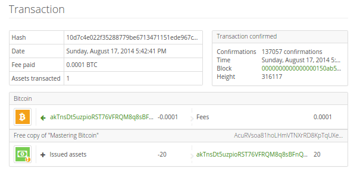
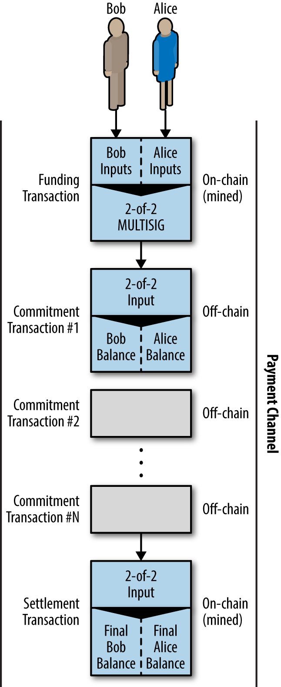
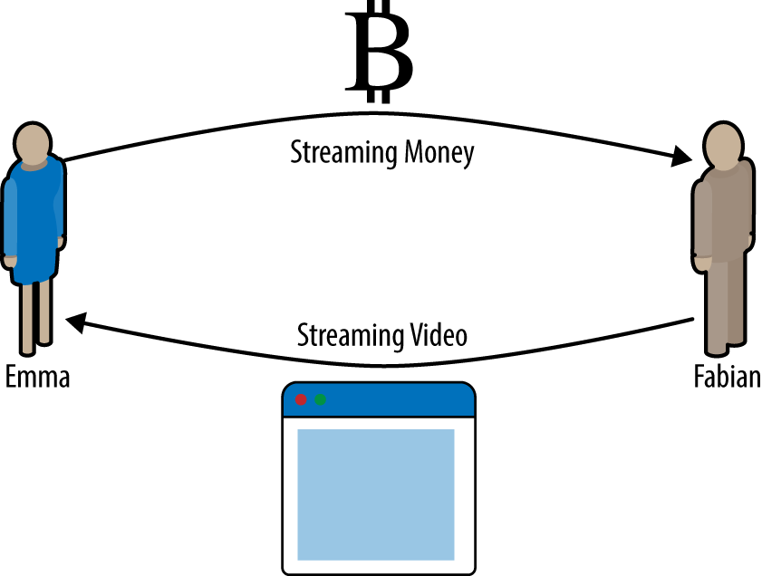
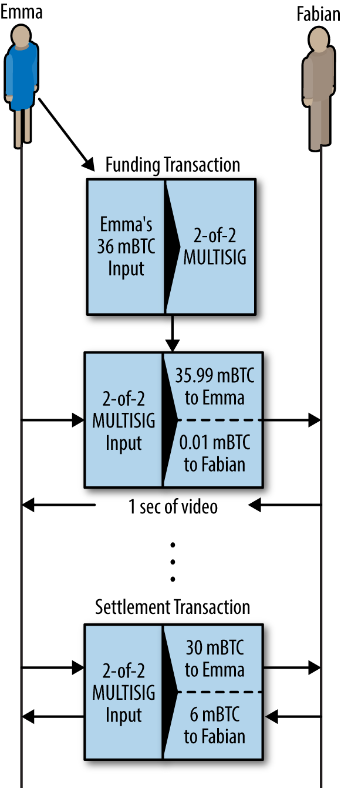
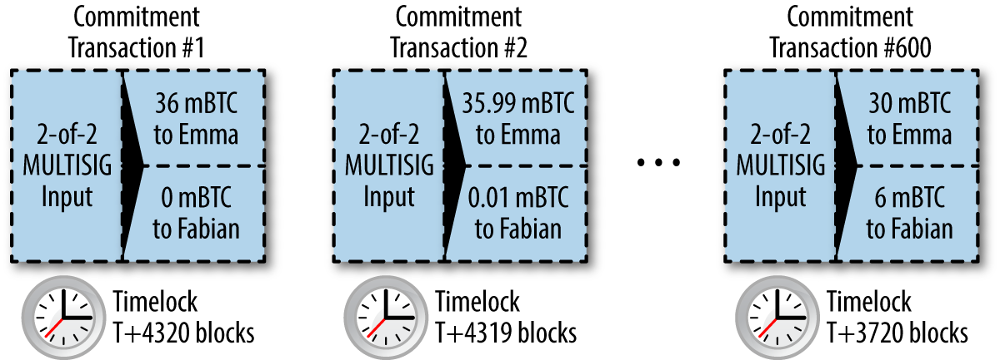
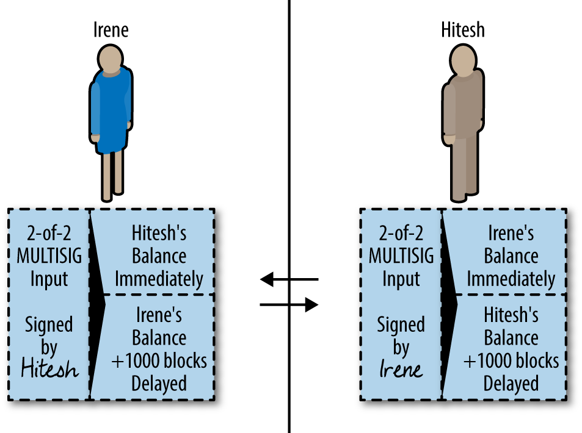
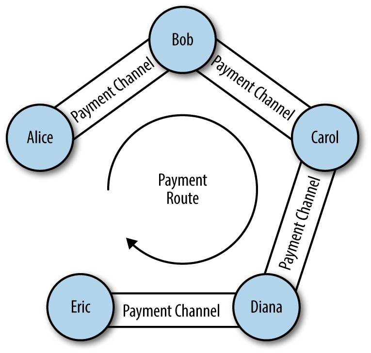

## 区块链应用

现在让我们通过将其视为 *应用平台* *application platform* 来构建我们对比特币的理解。如今，许多人使用术语“区块链”来指任何共享比特币设计原则的应用平台。这个术语经常被滥用，并且被应用于许多未能交付比特币区块链提供的主要功能的东西。

在本章中，我们将看看比特币区块链作为应用程序平台提供的功能。我们将考虑应用程序构建 *原语* *primitives*，构成了区块链应用程序的构建模块。我们将看看使用这些原语的几个重要应用程序，例如彩色币（Colored coins），支付（状态）通道和路由支付通道（闪电网络 Lightning Network）。

### 简介

比特币系统被设计成一个去中心化的货币和支付系统。然而，它的大部分功能都来源于更低层次的构造，可用于更广泛的应用程序。比特币不是由诸如账户，用户，余额和支付等组件构建的。相反，它使用具有低级加密函数的交易脚本语言，就像我们在 [[transactions\]](https://github.com/wjw465150/bitcoin_book_2nd/blob/master/第十二章.asciidoc#transactions) 中看到的那样。正如帐户，余额和支付的更高级概念可以从这些基本原语中派生出来一样，许多其他复杂的应用程序也是如此。因此，比特币区块链可以成为一个应用平台，为智能合约等应用提供信托服务，远超数字货币和支付的原始目的。

### 构建模块（原语）

长期正确运行时，比特币系统提供了一定的保证，可用作构建模块来创建应用程序。这些包括：

- **无双重支付 No Double-Spend**

  比特币去中心化共识算法的最基本的保证，确保UTXO不会花费两次。

- **不变性 Immutability**

  一旦交易记录在区块链中，并且后续的区块已经添加了足够的工作量，交易的数据就变得不可变。不变性由能源保证，因为重写区块链需要耗费能源来生产工作量证明。所需的能量以及不变程度随着包含交易的区块顶部的工作量而增加。

- **中立性 Neutrality**

  去中心化比特币网络传播有效交易，无论这些交易的来源或内容如何。这意味着任何人都可以创建一个有足够费用和信任的有效交易，他们可以随时传输该交易并将其包含在区块链中。

- **安全时间戳 Secure Timestamping**

  共识规则拒绝任何有离得太远的过去或未来的时间戳的块。这确保块上的时间戳可以被信任。块上的时间戳意味着对所有包含的交易的输入的未使用保证。

- **授权 Authorization**

  数字签名经过去中心化网络验证，可提供授权保证。包含数字签名要求的脚本不能在脚本中隐含的私钥持有者未经授权的情况下执行。

- **可审计性 Auditability**

  所有交易都是公开的，可以进行审计。所有的交易和区块都可以链接到创世区块。

- **会计 Accounting**

  在任何交易中（除了coinbase交易），输入的价值等于输出加上费用的价值。在交易中创建或销毁比特币值是不可能的。输出不能超过输入。

- **不过期 Nonexpiration**

  有效的交易不会过期。如果它今天有效，只要输入没有被消耗并且共识规则没有改变，它将在不久的将来也有效。

- **完整性 Integrity**

  使用 SIGHASH_ALL 签署的比特币交易或由另一种 SIGHASH 类型签署的交易的部分不能在未使签名无效的情况下进行修改，修改将导致交易本身无效。

交易原子性 Transaction Atomicity:: 比特币交易是原子的。它们要么是有效并被确认的（挖掘），要么不是。不完整的交易不能开采，交易没有临时状态。在任何时候，交易都是开采或不开采。

- **离散（不可分）单位的价值 Discrete (Indivisible) Units of Value**

  交易的输出是离散的和不可分割的价值单位。它们可以全部用完或不使用，不能分开或部分使用。

- **控制法定人数 Quorum of Control**

  脚本中的多重签名限制了多重签名方法中预定义的法定权限。 M-N要求由共识规则强制执行。

- **时间锁/老化 Timelock/Aging**

  包含相对或绝对时间锁的任何脚本语句只能在其年龄超过指定时间后才能执行。

- **复制 Replication**

  区块链的分散存储确保了在交易开始时，经过充分的确认后，它可以在整个网络中进行复制，是持久化的，并且对断电，数据丢失等具有恢复能力。

- **防伪 Forgery Protection**

  交易只能花费现有的已验证输出。不可能创造或伪造价值。

- **一致性 Consistency**

  在没有矿工分区的情况下，记录在区块链中的区块会根据它们被记录的深度而受到重组或不一致的可能性呈指数下降。一旦深刻记录，改变所需的计算和能量使得改变几乎不可行。

- **记录外部状态 Recording External State**

  交易可以通过 OP_RETURN 提交一个数据值，表示一个外部状态机器中的状态转换。

- **可预见的发行 Predictable Issuance**

  不到2100万比特币将以可预测的速度发行。

构建模块的列表并不完整，会随每一项引入到比特币的新功能而增加。

### 构建模块的应用

比特币提供的构建模块是可用于构成应用程序的信任平台的组成部分。以下是当前存在的应用程序示例以及它们使用的构建块：

- **存在性证明（数字公证） Proof-of-Existence (Digital Notary)**

  不变性+时间戳+持久化。数字指纹可以通过交易提交给区块链，证明文件在记录时存在（时间戳）。指纹不能在事后修改（不可变性），并且证明将被永久保存（持久化）。

- **众筹平台（闪电网络） Kickstarter (Lighthouse)**

  一致性+原子性+完整性。如果你签署一项输入和一项众筹交易的输出（完整性），其他人可以为筹款捐款，但直到目标（输出价值）达到（一致性）后才能支付（原子性）。

- **支付通道 Payment Channels**

  控制法定人数+时间锁定+无双重支付+不过期+审查阻力+授权。具有时间锁定（时间锁定）作为支付通道的“结算”交易的多重签名2-of-2（控制法定人数）可以由任何一方（授权）在任何时间（审查阻力）持有（不过期）。然后，双方可以创建承诺交易，在较短的时间间隔（Timelock）上双重支付花费（无双重支付，双重支付可使之前的交易无效）"结算"。

### 彩色币

我们将要讨论的第一个区块链应用是 *彩色币* *colored coins*。

彩色币是指使用比特币交易记录比特币以外的资产的创建，所有权和转让的一组类似技术。所谓“外部”，我们指的不是直接存储在比特币区块链中的资产，不是比特币本身，这是区块链固有的资产。

彩色币用于追踪数字资产以及第三方持有的有形资产，并通过彩色币进行所有权交易。数字资产彩色币可以代表无形资产，如股票证书，许可证，虚拟财产（游戏物品）或大多数任何形式的许可知识产权（商标，版权等）。有形资产的彩色币可以代表商品（金，银，油），土地所有权，汽车，船只，飞机等的所有权证书。

这个术语来源于“着色”或标记比特币的名义数量的想法，例如单一的satoshi，代表比特币价值本身以外的其他东西。作为一个类比，考虑在1美元钞票上加上一个信息，说明“这是ACME的股票证书” 或 “这张钞票可以兑换1盎司白银”，然后交易1美元钞票作为其他资产所有者的证书。第一个彩色币的实现，名为 *Enhanced Padded-Order-Based Coloring* 或 *EPOBC*，将外部资产分配到1-satoshi输出。通过这种方式，这是一个真正的“彩色币”，因为每个资产都被添加为一个单独的属性（颜色）。

最近的彩色币实现使用 OP_RETURN 脚本操作码在交易中存储元数据，与将元数据关联到特定资产的外部数据存储一起使用。

如今两个最出色的彩色币实现是 [*Open Assets*](http://www.openassets.org/) 和 [*Colored Coins by Colu*](http://coloredcoins.org/). 这两个系统使用不同的方法来处理彩色币，且不兼容。在一个系统中创建的彩色币不能在另一个系统中看到或使用。

#### 使用彩色币

彩色币通常在特殊钱包中创建，转移和查看，这些币可以解释附加到比特币交易的彩色币协议元数据。必须特别注意避免在常规比特币钱包中使用与彩色币相关的密钥，因为常规钱包可能会破坏元数据。同样，不应将彩色币发送到由常规钱包管理的地址，只能发送给由可识别彩色币的钱包管理的地址。Colu和Open Assets系统都使用特殊的彩色币地址来降低这种风险，并确保彩色硬币不会发送给未知的钱包。

对于大多数通用区块链浏览器来说，彩色币也是不可见的。相反，你必须使用彩色币资源管理器来解析彩色币交易的元数据。

可以在 [coinprism](https://www.coinprism.info/) 找到与 Open Assets 兼容的钱包应用程序和区块链浏览器。

Colu彩色币兼容的钱包应用程序和区块链浏览器可以在这里找到： [Blockchain Explorer](http://coloredcoins.org/explorer/).

[Colored Coins Copay Addon](http://coloredcoins.org/colored-coins-copay-addon/) 是一个 Copay 钱包插件。

#### 发行彩色币

每个彩色币的实现都有不同的创建彩色币的方式，但它们都提供了类似的功能。创建彩色币资产的过程称为 *发行* *issuance*。初始交易，*issuance transaction* 将资产注册在比特币区块链中，并创建一个用于引用资产的 *asset ID*。一旦发布，可以使用 *transfer transactions* 在地址之间转移资产。

作为彩色币发行的资产可以有多个属性。它们可以是 *divisible* 或 *indivisible*，意味着传输中资产的数量可以是整数（例如5）或小数（例如4.321）。资产也可以有 *fixed issuance*，也就是说一定金额只发行一次，或者 *reissued*，意味着资产的新单位可以在初始发行后由原发行人发行。

最后，一些彩色币支持_dividends_，允许将比特币付款按所有权比例分配给着色货币资产的所有者。

#### 彩色币交易

给彩色币交易赋予意义的元数据通常使用 OP_RETURN 操作码存储在其中一个输出中。不同的彩色币协议对 OP_RETURN 数据的内容使用不同的编码。包含 OP_RETURN 的输出称为 *标记输出* *marker output*。

输出的顺序和标记输出的位置在彩色硬币协议中可能有特殊含义。例如，在 Open Assets 中，标记输出之前的任何输出均表示资产发放，之后的任何输出都代表资产转移。标记输出通过引用交易中的顺序来为其他输出分配特定的值和颜色。

作为对比，在 Colu 中, 标记输出对决定元数据解释方式的操作码进行编码。操作码0x01至0x0F指示发行交易。发行操作码通常后面跟着一个资产ID或其他标识符，可用于从外部来源（例如，bittorrent）检索资产信息。操作码0x10到0x1F表示转移交易。转移交易元数据包含简单的脚本，通过参考其索引，将特定数量的资产从输入转移到输出。输入和输出的排序对于脚本的解释非常重要。

如果元数据太长以至于无法放入 OP_RETURN，彩色币协议可能会使用其他“技巧”在交易中存储元数据。示例包括将元数据放入赎回脚本中，然后加上 OP_DROP 操作码以确保脚本忽略元数据。另一种使用的机制是1-of-N 多重签名脚本，其中只有第一个公钥是真正的公钥，可以花费输出，随后的“密钥”被编码的元数据替代。

为了正确解释彩色硬币交易中的元数据，你必须使用兼容的钱包或区块浏览器。否则，交易看起来像是一个带有 OP_RETURN 输出的“普通”比特币交易。

作为一个例子，我使用彩色币创建并发布了MasterBTC资产。 MasterBTC资产代表本书免费副本的代金券。这些优惠券可以使用彩色币兼容的钱包进行转让，交易和兑换。

对于这个特定的例子，我使用了 [*https://coinprism.info*](http://coinprism.info/) 上的钱包和浏览器，它使用Open Assets彩色币协议。

[The issuance transaction as viewed on coinprism.info](https://github.com/wjw465150/bitcoin_book_2nd/blob/master/第十二章.asciidoc#the_issuance_transaction_as_viewed_on_coinprismio) 使用Coinprism区块浏览器展示了发行交易：

https://www.coinprism.info/tx/10d7c4e022f35288779be6713471151ede967caaa39eecd35296aa36d9c109ec)



Figure 1. The issuance transaction as viewed on coinprism.info

如你所见，coinprism展示了20个“Mastering Bitcoin比特币的免费副本”MasterBTC资产发布到一个特殊的彩色币地址：

```
akTnsDt5uzpioRST76VFRQM8q8sBFnQiwcx
```

------
>   发送到此地址的任何资金或有色资产将永远丢失。不要将价值发送到这个示例地址！ 
------

发行交易的交易ID是“正常”的比特币交易ID。[The issuance transaction on a block explorer that doesn’t decode colored coins](https://github.com/wjw465150/bitcoin_book_2nd/blob/master/第十二章.asciidoc#the_issuance_transaction_on_a_block) 在不能解析彩色币的区块浏览器中显示相同的交易。我们将使用_blockchain.info_：

https://blockchain.info/tx/10d7c4e022f35288779be6713471151ede967caaa39eecd35296aa36d9c109ec


Figure 2. The issuance transaction on a block explorer that doesn’t decode colored coins

如你所见，_blockchain.info_不会将其识别为彩色币交易。实际上，它用红色字母标记第二个输出为“无法解码输出地址”。

如果你选择 "Show scripts & coinbase" , 你会看到交易的更多信息 ([The scripts in the issuance transaction](https://github.com/wjw465150/bitcoin_book_2nd/blob/master/第十二章.asciidoc#the_scripts_in_the_issuance_transaction)).


Figure 3. The scripts in the issuance transaction

*blockchain.info* 还是不理解第二个输出。它用红色字母中的“Strange”标记。但是，我们可以看到标记输出中的一些元数据是人类可读的

```
OP_RETURN 4f41010001141b753d68747470733a2f2f6370722e736d2f466f796b777248365559
(decoded) "OA____u=https://cpr.sm/FoykwrH6UY
```

让我们使用 bitcoin-cli 检索交易：

```bash
$ bitcoin-cli decoderawtransaction `bitcoin-cli getrawtransaction 10d7c4e022f35288779be6713471151ede967caaa39eecd35296aa36d9c109ec`
```

剔除交易的其他部分，第二个输出如下所示：

```json
{
  "value": 0.00000000,
  "n": 1,
  "scriptPubKey": "OP_RETURN 4f41010001141b753d68747470733a2f2f6370722e736d2f466f796b777248365559"

}
```

前缀 4F41 表示字母 "OA"，表示 "Open Assets"，帮我们通过Open Assets协议识别接下来的元数据。下面的ASCII编码字符串是资产定义的链接：

```
u=https://cpr.sm/FoykwrH6UY
```

如果我们检索这个URL，我们得到一个JSON编码的资产定义，如下所示：

```json
{
  "asset_ids": [
    "AcuRVsoa81hoLHmVTNXrRD8KpTqUXeqwgH"
  ],
  "contract_url": null,
  "name_short": "MasterBTC",
  "name": "Free copy of \"Mastering Bitcoin\"",
  "issuer": "Andreas M. Antonopoulos",
  "description": "This token is redeemable for a free copy of the book \"Mastering Bitcoin\"",
  "description_mime": "text/x-markdown; charset=UTF-8",
  "type": "Other",
  "divisibility": 0,
  "link_to_website": false,
  "icon_url": null,
  "image_url": null,
  "version": "1.0"
}
```

### 合约币 Counterparty

合约币（Counterparty）是一个建立在比特币之上的协议层。合约币协议类似于彩色币，可以创建和交易虚拟资产和代币。另外，合约币提供资产的去中心化交易所。合约币也正在实施基于以太坊虚拟机（EVM）的智能合约。

像彩色硬币协议一样，Counterparty在比特币交易中嵌入元数据，使用 OP_RETURN 操作码或1-of-N多重签名地址在公钥的位置对元数据进行编码。使用这些机制，Counterparty实现了一个以比特币交易编码的协议层。附加协议层可以被支持合约币的应用程序解释，例如钱包和区块链浏览器，或者使用Counterparty库构建的任何应用程序。

合约币可以用作其他应用程序和服务的平台。例如，Tokenly是一个基于Counterparty构建的平台，它允许内容创作者，艺术家和公司发布表示数字所有权的标记，并可用于租用，访问，交易或购买内容，产品和服务。利用合约币的其他应用包括游戏（创世纪法术）和网格计算项目（折叠硬币）。

Counterparty 的更多信息可以在 [https://counterparty.io](https://counterparty.io/) 找到，开源项目位于 https://github.com/CounterpartyXCP.

### 支付通道和状态通道 Payment Channels and State Channels

*支付通道* *Payment channels* 是在比特币区块链之外，双方交换比特币交易的去信任机制。这些交易如果在比特币区块链上结算，将变为有效的，而不是作为最终批量结算的普通票据。由于交易没有结算，因此可以在没有通常的结算等待时间的情况下进行交换，从而实现极高的交易吞吐量，低（亚毫秒级）的延迟以及精细的（satoshi水平）粒度。

其实，_channel_这个词是一个比喻。状态通道是虚拟结构，由区块链之外的两方之间的状态交换来表示。本身没有“通道”，底层的数据传输机制不是通道。我们使用术语"通道"来代表区块链之外的双方之间的关系和共享状态。

为了进一步解释这个概念，考虑一个TCP流。从更高级协议的角度来看，它是连接互联网上的两个应用程序的“套接字”。但是如果你查看网络流量，TCP流只是IP数据包上的虚拟通道。 TCP流的每个端点序列化并组装IP包以创建字节流的幻觉。在下面，它是所有断开的数据包。同样，支付通道只是一系列交易。如果排序正确并且连接良好，即使你不信任通道的另一端，他们也会创建可信任的可兑换义务。

在本节中，我们将看看各种支付通道。首先，我们将研究用于构建计量微支付服务（例如视频流）的单向（单向）支付通道的机制。然后，我们将扩大这种机制，并引入双向支付通道。最后，我们将研究如何在路由网络中点对点连接双向通道以形成多跳通道，首先以 *Lightning Network* 的名字提出。

支付通道是状态通道更广泛概念的一部分，代表了状态的脱链改变，并通过区块链中的最终结算来保证。支付通道是一种状态通道，其中被更改的状态是虚拟货币的余额。

#### 状态通道 —— 基本概念和术语

通过在区块链上锁定共享状态的交易，双方建立状态通道。这被称为 *存款交易* *funding transaction* 或 *锚点交易* *anchor transaction*。这笔交易必须传输到网络并开采以建立通道。在支付通道的示例中，锁定状态是通道的初始余额（以货币计）。

然后双方交换签名的交易，称为 *承诺交易* *commitment transactions*，它改变了初始状态。这些交易是有效的交易，因为它们可以提交给任何一方进行结算，但是在通道关闭之前，它们会被各方关闭。状态更新可以创建得尽可能快，因为每个参与方都可以创建，签署和传输交易给另一方。实际上，这意味着每秒可以交换数千笔交易。

在交换承诺交易时，双方也会使以前的状态无效，以便最新的承诺交易永远是唯一可以兑换的承诺交易。这样可以防止任何一方通过单方面关闭通道并以过期的先前状态作为对当前状态更有利的通道进行作弊。我们将研究在本章其余部分中可用于使先前状态无效的各种机制。

在通道的整个生命周期内，只有两笔交易需要提交区块链进行挖矿：存款和结算交易。在这两个状态之间，双方可以交换任何其他人从未见过的承诺交易，也不会提交区块链。

[A payment channel between Bob and Alice, showing the funding, commitment, and settlement transactions](https://github.com/wjw465150/bitcoin_book_2nd/blob/master/第十二章.asciidoc#payment_channel) 说明了Bob和Alice之间的支付通道，显示了存款，承诺和结算交易。



Figure 4. A payment channel between Bob and Alice, showing the funding, commitment, and settlement transactions

#### 简单支付通道示例

为了解释状态通道，我们从一个非常简单的例子开始。我们展示了一个单向通道，意味着价值只在一个方向流动。我们也将从天真的假设开始，即没有人试图欺骗，保持简单。一旦我们解释了基本的通道想法，我们就会看看如何让它变得去信任的，使得任何一方都不会作弊，即使他们想要作弊。

对于这个例子，我们将假设两个参与者：Emma和Fabian。 Fabian提供了一个视频流媒体服务，使用微型支付通道按秒收费。 Fabian每秒视频收费0.01毫比特币（0.00001 BTC），相当于每小时视频36毫比特币（0.036 BTC）。 Emma是从Fabian购买此流视频服务的用户。 [Emma purchases streaming video from Fabian with a payment channel, paying for each second of video](https://github.com/wjw465150/bitcoin_book_2nd/blob/master/第十二章.asciidoc#emma_fabian_streaming_video) 显示了Emma使用支付通道从Fabian购买视频流媒体服务。



Figure 5. Emma purchases streaming video from Fabian with a payment channel, paying for each second of video

在这个例子中，Fabian和Emma正在使用特殊的软件来处理支付通道和视频流。 Emma在浏览器中运行该软件，Fabian在服务器上运行该软件。该软件包括基本的比特币钱包功能，并可以创建和签署比特币交易。这个概念和术语“支付通道”对用户来说都是完全隐藏的。他们看到的是按秒付费的视频。

为了建立支付通道，Emma和Fabian建立了一个2-of-2多重签名地址，每个地址都有一个密钥。从Emma的角度来看，她浏览器中的软件提供了一个带有P2SH地址的QR码（以“3”开头），并要求她提交长达1小时视频的“存款”，地址由Emma进行存款。支付给多重签名地址的Emma的交易是支付通道的存款或锚定交易。

对于这个例子，假设Emma建立了36毫比特币（0.036 BTC）的通道。这将允许Emma使用流式视频1小时以上。在这种情况下，存款交易可通过_channel capacity_ 设置在此通道中传输的最大金额。

资金交易消耗Emma钱包的一个或多个输入，来创建存款。它为Emma和Fabian之间联合控制的多重签名2地址创建了一个36毫比特币的输出。可能会有找零的输出返回Emma的钱包。

一旦存款交易得到确认，Emma可以开始观看流式视频了。Emma的软件创建并签署了一项承诺交易，该交易将通道余额改为给Fabian地址0.01mBTC，并退还给Emma 35.99mBTC。 Emma签署的交易消耗了资金交易产生的36mBTC输出，并产生两个输出：一个用于她的退款，另一个用于Fabian的付款。交易只是部分签署 - 它需要两个签名（2个2），但只有艾玛的签名。当Fabian的服务器接收到这个交易时，它会添加第二个签名（用于2的2输入）并将其返回给Emma以及1秒的视频。现在双方都有完全签署的承诺交易，可以兑换，代表通道正确的最新余额。任何一方都不会将此交易广播到网络。

在下一轮中，Emma的软件创建并签署了另一个承诺交易（承诺＃2），该交易消耗了资金交易中的2-of-2输出。第二个承诺交易为Fabian的地址分配一个0.02毫比的输出和一个35.98毫比的输出返回Emma的地址。这项新的交易是视频累计秒数的付款。Fabian的软件签署并返回第二个承诺交易，再加上另一秒视频。

通过这种方式，Emma的软件继续将承诺交易发送给Fabian的服务器以换取流式视频。随着Emma消费更多的视频，通道的余额逐渐积累，以支付Fabian。假设Emma观看视频600秒（10分钟），创建和签署了600个承诺交易。最后一次承诺交易（＃600）将有两个输出，将通道的余额，6 mBTC分给Fabian，30 mBTC 给Emma。

最后，Emma点击“Stop”停止视频流。 Fabian或Emma现在可以传输最终状态交易以进行结算。最后一笔交易是结算交易，并向Fabian支付所有Emma消费的视频费用，将剩余的资金交易退还给Emma。

[Emma’s payment channel with Fabian, showing the commitment transactions that update the balance of the channel](https://github.com/wjw465150/bitcoin_book_2nd/blob/master/第十二章.asciidoc#video_payment_channel) 显示Emma和Fabian之间的通道以及更新通道余额的承诺交易。

最终，在区块链上只记录两笔交易：建立通道的存款交易和在两个参与者之间正确分配最终余额的结算交易。



Figure 6. Emma’s payment channel with Fabian, showing the commitment transactions that update the balance of the channel

#### 建立无需信任的通道

我们刚才描述的通道是有效的，但只有双方合作，没有任何失败或欺骗企图。我们来看看一些破坏这个通道的情景，看看需要什么来解决这些问题：

- 一旦存款交易发生，Emma需要Fabian的签名才能获得任何退款。如果Fabian消失，艾玛的资金被锁定在2-of-2交易中，并且实际上已经丢失了。如果其中一方在至少有一个由双方签署的承诺交易之前断开连接，则此通道的存款会丢失。
- 在通道运行的同时，Emma可以接受Fabian已经签署的任何承诺交易，并将其中一个交易给区块链。为什么要支付600秒的视频，如果她可以传输承诺交易＃1并且只支付1秒的视频费用？该通道失败，因为Emma可以通过播出对她有利的事先承诺而作弊。

这两个问题都可以通过timelocks来解决，我们来看看如何使用交易级时间锁（nLocktime）。

除非有退款保障，否则Emma不能冒险支付2-of-2的多重签名交易。为了解决这个问题，Emma同时构建存款和退款交易。她签署了存款交易，但并未将其转交给任何人。 Emma只将退款交易转交给Fabian并获得他的签名。

退款交易作为第一笔承诺交易，其时间锁确定了通道的生命上限。在这种情况下，Emma可以将 nLocktime 设置为未来30天或4320个块。所有后续承诺交易的时间锁必须更短，以便在退款交易前兑换。

现在Emma已经完全签署了退款交易，她可以自信地传输已签署的资金交易，因为她知道她可以最终在时限到期后即使Fabian消失也可以赎回退款交易。

在通道生命周期中，各方交换的每一笔承诺交易将被锁定在未来。但是对于每个承诺来说，延迟时间会略短，所以最近的承诺可以在其无效的先前承诺前赎回。由于 nLockTime，双方都无法成功传播任何承诺交易，直到其时间锁到期。如果一切顺利，他们将通过结算交易优雅地合作和关闭通道，从而不必传输中间承诺交易。否则，可以传播最近的承诺交易以结算账户并使所有之前的承诺交易无效。

例如，如果承诺交易＃1被时间锁定到将来的第4320个块，承诺交易＃2时间锁定到将来的4319个块。在承诺交易＃1有效之前的600个块时，承诺交易＃600可以花费。

[Each commitment sets a shorter timelock, allowing it to be spent before the previous commitments become valid](https://github.com/wjw465150/bitcoin_book_2nd/blob/master/第十二章.asciidoc#timelocked_commitments) 展示了每个承诺交易设置一个更短的时间段，允许它在先前的承诺变得有效之前花费。



Figure 7. Each commitment sets a shorter timelock, allowing it to be spent before the previous commitments become valid

每个后续承诺交易都必须具有较短的时间锁，以便可以在其前任和退款交易之前进行广播。先前广播承诺的能力确保它能够花费资金输出并阻止任何其他承诺交易通过花费输出。比特币区块链提供的担保，防止双重支付和强制执行时间锁，有效地允许每笔承诺交易使其前任者失效。

状态通道使用时间锁来实施跨时间维度的智能合约。在这个例子中，我们看到时间维度如何保证最近的承诺交易在任何先前的承诺之前变得有效。因此，可以传输最近的承诺交易，花费输入并使先前的承诺交易无效。具有绝对时间锁保护的智能合约的执行可防止一方当事人作弊。这个实现只需要绝对的交易级时间锁（ nLocktime）。接下来，我们将看到如何使用脚本级时间锁 CHECKLOCKTIMEVERIFY 和 CHECKSEQUENCEVERIFY 来构建更灵活，更实用，更复杂的状态通道。

单向支付通道的第一种形式在2015年由阿根廷开发团队演示为视频流应用原型。你可以在 [*streamium.io*](https://streamium.io/). 看到。

时间锁不是使先前承诺交易无效的唯一方法。在接下来的部分中，我们将看到如何使用撤销密钥来实现相同的结果。时间锁是有效的，但它们有两个明显的缺点。通过首次打开通道时建立最大时间锁，它们会限制通道的使用寿命。更糟糕的是，他们强迫通道的实现在允许长期通道和迫使其中一个参与者在过早关闭的情况下等待很长的退款时间之间取得余额。例如，如果你允许通道保持开放30天，通过将退款时间锁定为30天，如果其中一方立即消失，另一方必须等待30天才能退款。终点越远，退款越远。

第二个问题是，由于每个后续承诺交易都必须减少时间间隔，因此对双方之间可以交换的承诺交易数量有明确的限制。例如，一个30天的通道，在未来设置一个4320块的时间段，在它必须关闭之前，只能容纳4320个中间承诺交易。将时间锁承诺交易的间隔设置为1个块存在危险。通过将承诺交易之间的时间间隔设置为1个块，开发人员为通道参与者创造了非常高的负担，这些参与者必须保持警惕，保持在线和观看，并随时准备好传输正确的承诺交易。

现在我们理解了如何使用时间锁定来使先前的承诺失效，我们可以看到通过合作关闭通道和通过广播承诺交易单方面关闭通道的区别。所有承诺交易都是时间锁定的，因此广播承诺交易总是需要等待，直到时间锁已过。但是，如果双方就最终余额达成一致并知道它们都持有承诺交易并最终实现这一余额，那么它们可以在没有时间锁表示同样余额的情况下构建结算交易。在合作关系中，任何一方都采取最近的承诺交易，并建立一个结算交易，除了省略时间锁之外，交易在每个方面都是相同的。双方都可以签署这笔结算交易，因为他们知道没有办法作弊并获得更有利的余额。通过合作签署和转交结算交易，他们可以关闭通道并立即赎回余额。最差的情况下，其中一方可能会小心谨慎，拒绝合作，并强迫对方单方面使用最近的承诺交易关闭。但如果他们这样做，他们也必须等待他们的资金。

#### 不对称可撤销承诺 Asymmetric Revocable Commitments

处理先前承诺状态的更好方法是明确撤销它们。但这并不容易实现。比特币的一个关键特征是，一旦交易有效，它保持有效状态且不会过期。取消交易的唯一方法是在开采之前将其输入与其他交易双重支付。这就是为什么我们在上面的简单支付通道示例中使用时间锁的原因，确保在较早的承诺有效之前可以花费最近的承诺。但是，按时间排列承诺产生了一些限制，使支付通道难以使用。

即使交易无法取消，也能以不希望使用它的方式构建交易。方法是给每一方一个 *撤销密钥* *revocation key* ，如果他们试图欺骗，可以用来惩罚对方。这种撤销先前承诺交易的机制最初是作为闪电网络（Lightning Network）的一部分提出的。

为了解释撤销钥匙，我们将在Hitesh和Irene运营的两个交易所之间构建一个更复杂的支付通道。Hitesh和Irene分别在印度和美国经营比特币交易所。 Hitesh印度交易所的客户经常向Irene的美国交易所的客户支付款项，反之亦然。目前，这些交易发生在比特币区块链上，但这意味着要支付费用并等待几个区块进行确认。在交易所之间建立支付通道将显著降低成本并加快交易流程。

Hitesh和Irene通过合作构建存款交易来启动通道，每一方都向通道支付5比特币资金。 最初的余额是Hitesh的5比特币和Irene的5比特币。资金交易将通道状态锁定为2-of-2的多重签名，就像简单通道的例子一样。

存款交易可能有来自Hitesh的一个或多个输入（加起来5比特币或更多），以及来自Irene的一个或多个输入（加起来5比特币或更多）。输入必须略高于通道容量才能支付交易费用。该交易有一个输出，将10比特币锁定为由Hitesh和Irene控制的2-of-2多重签名地址。交易也可能有一个或多个产出，如果他们的输入超过了他们预期的通道贡献，则会向Hitesh和Irene返回零钱。这是由双方提供并签署输入的单一交易。它必须由各方合作建立并由各方签字，然后才能传送。

现在，Hitesh和Irene不创建双方签署的单一承诺交易，而是创建两个 *不对等* *asymmetric* 的承诺交易

Hitesh有两项输出的承诺交易。第一个输出 *立即* 支付Irene她5比特币。第二个输出向Hitesh支付5比特币，但是在1000块的时间锁之后。交易输出如下所示：

```
Input: 2-of-2 funding output, signed by Irene

Output 0 <5 bitcoin>:
    <Irene's Public Key> CHECKSIG

Output 1 <5 bitcoin>:
    <1000 blocks>
    CHECKSEQUENCEVERIFY
    DROP
    <Hitesh's Public Key> CHECKSIG
```

Irene有两个输出的不同承诺交易。第一个输出立即向Hitesh支付他5比特币。第二个输出支付Irene她5比特币，但是在1000块的时间段之后。 Irene持有的承诺交易（由Hitesh签名）如下所示：

```
Input: 2-of-2 funding output, signed by Hitesh

Output 0 <5 bitcoin>:
    <Hitesh's Public Key> CHECKSIG

Output 1 <5 bitcoin>:
    <1000 blocks>
    CHECKSEQUENCEVERIFY
    DROP
    <Irene's Public Key> CHECKSIG
```

通过这种方式，每一方都有承诺交易，花费2-of-2的存款交易的输出。该输入由 *另一方* 签名。在任何时候拥有交易的一方也可以签署（完成2-of-2）和广播。但是，如果他们广播承诺交易，会立即付款给对方，而他们不得不等待一个短的时间锁。通过延迟其中一项输出的赎回，我们使各方在选择单方面广播承诺交易时处于轻微劣势。但仅有延时的话就不足以鼓励公平行为。

[Two asymmetric commitment transactions with delayed payment for the party holding the transaction](https://github.com/wjw465150/bitcoin_book_2nd/blob/master/第十二章.asciidoc#asymmetric_commitments) 展示了两个不对称承诺交易，其中支付给承诺持有人的输出被延迟。



Figure 8. Two asymmetric commitment transactions with delayed payment for the party holding the transaction

现在我们介绍这个方案的最后一个元素：一个可以防止作弊者广播过期承诺的撤销密钥。撤销密钥允许受骗方通过占用整个通道的余额来惩罚作弊者。

撤销密钥由两个密钥组成，每个密钥由每个通道参与者独立生成。它类似于一个2-of-2多重签名，但是使用椭圆曲线算法构造，双方都知道撤销公钥，但是每一方只知道撤销私钥的一半。

在每一轮中，双方向对方公开其一半的撤销密钥，从而如果此次撤销的交易被广播，可以给予另一方（现在拥有两半）用于要求罚款输出的手段。

每个承诺交易都有一个“延迟的”输出。该输出的兑换脚本允许一方在1000个区块之后兑换它，或者如果拥有撤销密钥，另一方可以赎回它，从而惩罚已撤销承诺的传输。

因此，当Hitesh创建一笔让Irene签署的承诺交易时，他将第二个输出在第1000个区块之后支付给自己，或者支付给撤销公钥（其中他只知道一半的密钥）。 Hitesh构造了这个交易。只有当他准备转移到新的通道状态并想要撤销这一承诺时，他才会向Irene展示他这一半的撤销密钥。

第二个支出的脚本如下:

```
Output 0 <5 bitcoin>:
    <Irene's Public Key> CHECKSIG

Output 1 <5 bitcoin>:
IF
    # Revocation penalty output
    <Revocation Public Key>
ELSE
    <1000 blocks>
    CHECKSEQUENCEVERIFY
    DROP
    <Hitesh's Public Key>
ENDIF
CHECKSIG
```

Irene可以自信地签署这笔交易，因为如果这笔交易被传送，它会立即向她支付她应得的东西。 Hitesh持有该交易，但如果他通过单方面通道关闭传输，他将不得不等待1000个区块才能获得报酬。

当通道进入下一个状态时，Hitesh必须在Irene同意签署下一个承诺交易前撤销此承诺交易。要做到这一点，他所要做的就是将他的一半 *revocation key* 发给Irene。一旦Irene拥有将这项承诺的两半密钥，她就可以自信地签署下一个承诺。因为她知道如果Hitesh试图通过公布先前的承诺来作弊，她可以使用撤销钥匙来赎回Hitesh的延迟输出。*如果Hitesh作弊，Irene会得到两个输出*。同时，Hitesh只有该撤销公钥的一半撤销密钥，在后续1000块之前无法赎回输出。 Irene将能够在1000个区块到达之前赎回输出惩罚Hitesh。

撤销协议是双边的，这意味着在每一轮中，随着通道状态的前进，双方交换新的承诺，为以前的承诺交换撤销密钥，并签署对方的新的承诺交易。当他们接受一个新的状态时，他们通过给予对方必要的撤销密钥来惩罚任何作弊行为，使先前的状态无法使用。

我们来看一个它如何工作的例子。Irene的一位客户希望将2比特币发送给Hitesh的客户之一。为了在通道中传输2比特币，Hitesh和Irene必须推进通道状态以反映新的余额。他们将承诺一个新的状态（状态2号），其中10个比特币被分割，7个比特币给Hitesh，3个比特币给Irene。为了推进通道状况，他们将各自创建新的承诺交易，体现新的通道余额。

和以前一样，这些承诺交易是不对称的，因此每一方的承诺交易都会迫使他们在兑换时等待。至关重要的是，在签署新的承诺交易之前，他们必须首先交换撤销密钥以使先前的承诺失效。在这种特殊情况下，Hitesh的兴趣与通道的真实状态保持一致，因此他没有理由广播先前的状态。然而，对于Irene来说，状态1给她的余额高于状态2.当Irene将她的先前承诺交易（状态1）的撤销密钥给Hitesh时，她也撤销了她通过倒退通道获利的能力。因为有了撤销钥匙，Hitesh可以毫不拖延地赎回先前承诺交易的两个输出。这意味着，如果Irene广播先前的状态，Hitesh可以行使他的权利拿走所有输出。

重要的是，撤销不会自动发生。虽然Hitesh有能力惩罚Irene的作弊行为，但他必须认真观察区块链是否存在作弊迹象。如果他看到先前的承诺交易被广播，他有1000个区块时间采取行动，使用撤销密钥来阻止Irene的作弊行为，并通过取得全部10个比特币来惩罚她。

具有相对时间锁的不对称可撤销承诺（ CSV ） 是实施支付通道的更好方式，也是该技术非常重要的一项创新。通过这种构造，通道可以无限期地保持开放，并且可以拥有数十亿的中间承诺交易。在Lightning Network的原型实现中，承诺状态由48位索引标识，允许任何单个通道有超过281万亿次（2.8×1014）状态转换！

#### 哈希时间锁合约 Hash Time Lock Contracts (HTLC)

支付通道可以通过特殊类型的智能合约进一步扩展，允许参与者将资金发送到可赎回的密钥上，并有过期时间。此功能称为 *Hash Time Lock Contract* 或 *HTLC* ，并用于双向支付通道和路由支付通道。

我们先来解释HTLC的“哈希”部分。要创建HTLC，付款的预期接收人将首先创建一个密钥 R。然后他们计算这个密钥的的哈希值 H：

```
H = Hash(R)
```

产生的哈希值 H 可以包含在输出的锁定脚本中。知道这个密钥的人可以用它来赎回输出。密钥 R 也被称为散列函数的 *原象* *preimage* 。原象只是用作散列函数输入的数据。

HTLC的第二部分是“时间锁定”。如果密钥未透露，HTLC的付款人可以在一段时间后获得“退款”。这是通过使用 CHECKLOCKTIMEVERIFY 进行绝对时间锁定实现的。

实现了 HTLC 的脚本看起来是这样的：

```
IF
    # Payment if you have the secret R
    HASH160 <H> EQUALVERIFY
ELSE
    # Refund after timeout.
    <locktime> CHECKLOCKTIMEVERIFY DROP
    <Payer Public Key> CHECKSIG
ENDIF
```

任何知道密钥 R 的人，当哈希值等于 H 时，可以通过行使 IF 流的第一个子句来赎回该输出。

如果密钥未透露，HTLC声称，在一定数量的区块之后，付款人可以使用 IF 流程中的第二个条款要求退款。

这是HTLC的基本实现。这种类型的HTLC可以由具有密钥 R 的 *任何人* 兑换。对脚本稍作修改，HTLC可以采取许多不同的形式。例如，在第一个子句中添加一个 CHECKSIG 运算符和一个公钥，将哈希的兑换限制为一个指定的收款人，该收款人还必须知道密钥 R。

### 路由支付通道（闪电网络）

闪电网络是一个提议端到端连接的双向支付通道路由网络。像这样的网络可以允许任何参与者在无需信任任何中间人的情况下将支付从通道发送到通道。闪电网络 https://lightning.network/lightning-network-paper.pdf [由Joseph Poon和Thadeus Dryja于2015年2月首先描述]，建立在许多其他人提出和阐述的支付通道的概念上。

“闪电网络”是指用于路由支付通道网络的特定设计，现在已经由至少五个不同的开源团队实现。独立实现由一组互操作性标准进行协调：http://bit.ly/2rBHeoL[*Basics of Lightning Technology (BOLT)* paper]。

闪电网络的原型实现已由多个团队发布。目前，这些实现只能在testnet上运行，因为它们使用segwit，而没有在主比特币区块链（mainnet）上激活。

闪电网络是实施路由支付通道的一种可能方式。还有其他几个旨在实现类似目标的设计，例如Teechan和Tumblebit。

#### 基本闪电网络示例

让我们看下它如何工作。

在这个例子中，有五个参与者：Alice，Bob，Carol，Diana和Eric。这五位参与者相互开设了支付通道，两两相连。 Alice 与 Bob，Bob 与 Carol，Carol 与 Diana，Diana 与 Eric。为了简单起见，我们假设每个参与者为每个通道提供2比特币，每个通道的总容量为4比特币。

[A series of bidirectional payment channels linked to form a Lightning Network that can route a payment from Alice to Eric](https://github.com/wjw465150/bitcoin_book_2nd/blob/master/第十二章.asciidoc#lightning_network_fig) 展示了闪电网络中的五位参与者，通过双向支付通道进行关联，这些通道可以连接起来以支持 Alice 支付到 Eric ([路由支付通道（闪电网络）](https://github.com/wjw465150/bitcoin_book_2nd/blob/master/第十二章.asciidoc#lightning_network)).



Figure 9. A series of bidirectional payment channels linked to form a Lightning Network that can route a payment from Alice to Eric

Alice 想要支付 Eric 1比特币。但是，Alice 没有通过支付通道与 Eric 连接。创建一个支付通道需要一笔资金交易，这笔交易必须交给比特币区块链。Alice 不想开设新的支付通道并承诺更多的资金。有没有间接支付Eric的方法？

[Step-by-step payment routing through a Lightning Network](https://github.com/wjw465150/bitcoin_book_2nd/blob/master/第十二章.asciidoc#ln_payment_process) 展示了通过连接参与者的支付通道上的一系列 HTLC 承诺，从 Alice 支付到 Eric 的分步过程。


Figure 10. Step-by-step payment routing through a Lightning Network

Alice 正在运行一个闪电网络（LN）节点，该节点跟踪她和Bob的支付通道，并且能够发现支付通道之间的路线。Alice 的 LN 节点还可以通过互联网连接到 Eric 的 LN 节点。 Eric 的 LN 节点使用随机数生成器创建一个密钥 R。Eric 的节点并没有向任何人透露这个密钥。Eric 的节点计算密钥 R 的散列 H 并将该散列传送给 Alice 的节点（参见 [Step-by-step payment routing through a Lightning Network](https://github.com/wjw465150/bitcoin_book_2nd/blob/master/第十二章.asciidoc#ln_payment_process) 步骤1）。

现在，Alice 的 LN 节点构造了 Alice 的 LN 节点和 Eric 的 LN 节点之间的路线。所使用的路由算法将在后面更详细地讨论，但现在让我们假设 Alice 的节点可以找到有效的路由。

然后，Alice 的节点构建一个HTLC，支付给哈希值 H，并有10个区块的超时退款（当前块 + 10），金额为1.003比特币（参见 [Step-by-step payment routing through a Lightning Network](https://github.com/wjw465150/bitcoin_book_2nd/blob/master/第十二章.asciidoc#ln_payment_process) 步骤2）。额外的0.003将用于补偿参与此支付路线的中间节点。Alice 向 Bob 提供这个 HTLC ，从 Bob 的通道余额中扣除 1.003 比特币并将其交给 HTLC。 HTLC具有以下含义：*“如果鲍勃知道密钥，则 Alice 将1.003的通道余额付给Bob，或者如果经过10个块，则退还到 Alice 的余额。”* Alice 和 Bob 之间的通道余额现在是由三项输出的承诺交易表示：Bob的2比特币，Alice的0.997比特币，Alice的HTLC的1.003比特币。Alice向HTLC承诺的金额减少了Alice的余额。

Bob现在有一个承诺，如果他能够在接下来的10个区块内获得密钥 R，他可以获得被Alice锁定的1.003。有了这个承诺，Bob的节点在Carol的支付通道上构建了一个HTLC。 Bob的HTLC承诺了9个区块超时的1.002比特币给 H，如果有密钥 R，Carol可以赎回（参见 [Step-by-step payment routing through a Lightning Network](https://github.com/wjw465150/bitcoin_book_2nd/blob/master/第十二章.asciidoc#ln_payment_process) 步骤3）。Bob知道，如果Carol可以获得他的HTLC，她必须有 R。如果Bob在9个区块时间内得到 R，他可以用它来向Alice索要Alice的HTLC。他还通过在9个区块时间内贡献他的通道余额获得了0.001比特币。如果Carol不能索要他的HTLC，他不能索要Alice的HTLC，那么一切都会恢复到之前的通道余额，没有人会不知所措。Bob和Carol之间的通道余额现在是：Carol的2，Bob的0.998，Bob到HTLC的1.002。

Carol现在有一个承诺，如果她在接下来的9个区块时间内获得 R，她可以索要由Bob锁定的1.002比特币。现在，她可以在她与Diana的通道上做HTLC承诺。她将一个1.001比特币的HTLC提交给哈希 H，8个区块过期时间，如果有密钥 R，Diana可以赎回（参见 [Step-by-step payment routing through a Lightning Network](https://github.com/wjw465150/bitcoin_book_2nd/blob/master/第十二章.asciidoc#ln_payment_process) 步骤4）。从Carol的角度来看，如果这样做的话，她能获得0.001比特币更好，如果没有，她什么都不会丢失。她到Diana的HTLC只有在 R 被揭示时才是可行的，在这一点上，她可以向Bob索取HTLC。Carol和Diana之间的通道余额现在是：Diana的2，Carol的0.99，Carol对HTLC承诺的1.001。

最后，Diana可以向Eric提供一个HTLC，将7个区块超时时间内支付1比特币给哈希 H（参见 [Step-by-step payment routing through a Lightning Network](https://github.com/wjw465150/bitcoin_book_2nd/blob/master/第十二章.asciidoc#ln_payment_process) 步骤5）。Diana和Eric之间的通道余额现在是：Eric的2，Diana的1，Diana到HTLC的1。

但是，在这条路线上，Eric *拥有* 密钥 R。因此，他可以索要Diana提供的HTLC。他将 R 发送给 Diana 并索要1比特币，将其添加到他的通道余额中（参见 [Step-by-step payment routing through a Lightning Network](https://github.com/wjw465150/bitcoin_book_2nd/blob/master/第十二章.asciidoc#ln_payment_process) 步骤6）。通道余额现在是：Diana的1，Eric的3。

现在，Diana有密钥 R。因此，她现在可以从Carol那获得HTLC。 Diana将 R 发送给Carol，并将1.001比特币添加到她的通道余额中（参见 [Step-by-step payment routing through a Lightning Network](https://github.com/wjw465150/bitcoin_book_2nd/blob/master/第十二章.asciidoc#ln_payment_process) 步骤7）。现在，Carol和Diana之间的通道余额是：Carol的0.999，Diana的3.001。Diana参与这条支付路线“赢得”了0.001。

沿着路线返回，密钥 R 允许每个参与者索要HTLC。 Carol向Bob索要1.002，将他们的通道中的余额设置为：Bob的0.998，Carol的3.002（参见 [Step-by-step payment routing through a Lightning Network](https://github.com/wjw465150/bitcoin_book_2nd/blob/master/第十二章.asciidoc#ln_payment_process) 步骤8）。最后，Bob索要来自Alice的HTLC（参见 [Step-by-step payment routing through a Lightning Network](https://github.com/wjw465150/bitcoin_book_2nd/blob/master/第十二章.asciidoc#ln_payment_process) 步骤9）。他们的通道余额更新为：Alice的0.997，Bob的3.003。

Alice在没有与Eric开通通道的情况下就向Eric支付了1比特币。支付路径中的任何中间人都不需要互相信任。将他们的资金在通道中用于短期承诺，他们可以赚取一小笔费用，唯一的风险是如果通道关闭或路由支付失败，退款会有小幅延迟。

#### 闪电网络传输和路由

LN节点之间的所有通信都是点对点加密的。另外，节点有一个长期的公钥，http://bit.ly/2r5TACm[用来向彼此授权].

每当一个节点希望将支付发送给另一个节点时，它必须首先通过连接具有足够容量的支付通道来通过网络构建 *路径* *path*。节点公布路由信息，包括他们已经打开了哪些通道，每个通道有多少容量，以及他们收取的路由支付费用。路由信息可以以各种方式共享，随着闪电网络技术的发展，可能会出现不同的路由协议。一些闪电网络实现使用IRC协议作为节点公布路由信息的便利机制。路由发现的另一个实现使用P2P模型，其中节点将通道公告传播给他们的同伴，采用“泛洪”模式，类似于比特币传播交易的机制。未来的计划包括名为 [Flare](http://bit.ly/2r5TACm) 的提案，这是一种具有本地节点“邻居”和更远距离信标节点的混合路由模型。

在我们前面的例子中，Alice的节点使用这些路由发现机制之一来查找将她的节点连接到Eric节点的一条或多条路径。一旦Alice的节点构建了一条路径，她将通过网络传播一系列加密和嵌套指令，连接每个相邻的支付通道，初始化该路径。

重要的是，这条路只有Alice的节点才知道。支付路线中的所有其他参与者只能看到相邻的节点。从Carol的角度来看，这看起来像是Bob到Diana的付款。Carol并不知道Bob实际上是在转发Alice支付的一笔款项。她也不知道Diana会向Eric转账。

这是闪电网络的一个重要特征，因为它确保了付款隐私，并且使得应用监视，审查或黑名单非常困难。但是，Alice如何建立这种支付路径，而不向中间节点透露任何东西？

闪电网络根据称为 [Sphinx](http://bit.ly/2q6ZDrP) 的方案实施洋葱路由（onion-routed）协议。此路由协议可确保付款发起人可以通过 Lightning Network 构建和传递路径，以便：

- 中间节点可以验证和解密路由信息中属于他们的部分并找到下一跳。
- 除了上一跳和下一跳之外，他们无法了解路径中的任何其他节点。
- 他们无法识别付款路径的长度，或他们在该路径中的位置。
- 路径的每个部分都被加密，使得网络层的攻击者无法将来自路径不同部分的数据包相互关联。
- 与Tor（互联网上的洋葱路由匿名协议）不同，没有可以置于监控之下的“出口节点”。付款不需要传送到比特币区块链；节点只是更新通道余额。

使用这种洋葱路由协议，Alice将路径中的每个元素都封装在一个加密层中，从结尾开始并向后工作。她用Eric的公钥将一条消息加密给Eric。此消息包裹在一封加密给Diana的消息中，将Eric标识为下一个收件人。发给Diana的信息包裹在一封加密给Carol公钥的信息中，并将Diana确定为下一个收件人。给Carol的消息被加密到Bob的密钥。因此，Alice已经构建了这种加密的多层“洋葱”消息。她将此发送给Bob，他只能解密和解包外层。在里面，Bob发现一封给Carol的信，他可以转发给Carol，但不能自己破译。沿着路径，消息被转发，解密，转发等，一直到Eric。每个参与者只知道每跳中的前一个和下一个节点。

路径的每个元素都包含有关必须扩展到下一跳的HTLC信息，正在发送的金额，要包含的费用以及使HTLC过期的CLTV锁定时间（以区块为单位）。随着路由信息的传播，这些节点将HTLC承诺转发到下一跳。

此时，你可能想知道节点为何不知道路径的长度及其在该路径中的位置？毕竟，他们收到一条消息并将其转发到下一跳。根据它是否变短了，他们能够推断出路径大小和位置？为了防止这种情况，路径总是固定为20跳，并填充随机数据。每个节点都会看到下一跳和一个固定长度的加密消息来转发。只有最终收件人看到没有下一跳。对于其他人来说，总是还有20跳。

#### 闪电网络的好处

闪电网络是次层路由技术。它可以应用于任何支持一些基本功能的区块链，例如多重签名交易，时间锁定和基本智能合约。

如果闪电网络位于比特币网络之上，那么比特币网络可以在不牺牲无中介无信任运转原则的情况下，大幅提升容量，隐私，粒度和速度：

- **隐私 Privacy**

  闪电网络支付比比特币区块链上的支付私有得多，因为它们不公开。虽然路线中的参与者可以看到通过其通道传播的付款，但他们不知道发件人或收件人。

- **可互换性 Fungibility**

  闪电网络使得在比特币上应用监视和黑名单变得更加困难，从而增加了货币的可互换性。

- **速度 Speed**

  使用Lightning Network的比特币交易以毫秒为单位进行结算，而不是以分钟为单位，因为在不提交交易给区块的情况下清算HTLC。

- **粒度 Granularity**

  闪电网络可以使支付至少与比特币“灰尘”限制一样小，可能甚至更小。一些提案允许subsatoshi（次聪）增量。

- **容量 Capacity**

  闪电网络将比特币系统的容量提高了几个数量级。闪电网络路由的每秒支付数量没有实际的上限，因为它仅取决于每个节点的容量和速度。

- **无信任运作 Trustless Operation**

  闪电网络在节点之间使用比特币交易，节点之间作为对等运作而无需信任。因此，闪电网络保留了比特币系统的原理，同时显着扩大了其运行参数。

当然，如前所述，闪电网络协议并不是实现路由支付通道的唯一方式。其他提议的系统包括Tumblebit和Teechan。但是，目前闪电网络已经部署在测试网络上。几个不同的团队开发了竞争性的LN实现，并正在朝着一个通用的互操作性标准（称为BOLT）努力。 Lightning Network很可能将成为第一个在生产环境中部署的路由式支付通道网络。

### 总结

我们只研究了一些可以使用比特币区块链作为信任平台构建的新兴应用。这些应用将比特币的范围扩展到支付范围和金融工具之外，涵盖了信任至关重要的许多其他应用。通过分散信任的基础，比特币区块链成为了一个平台，将在各行各业产生许多革命性的应用。

